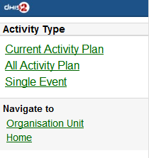
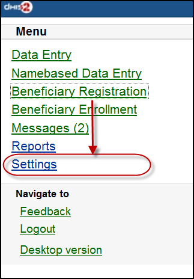
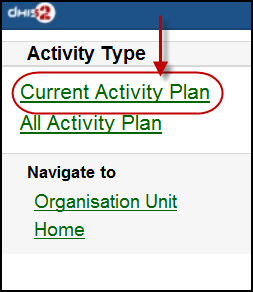
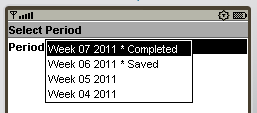
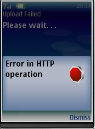
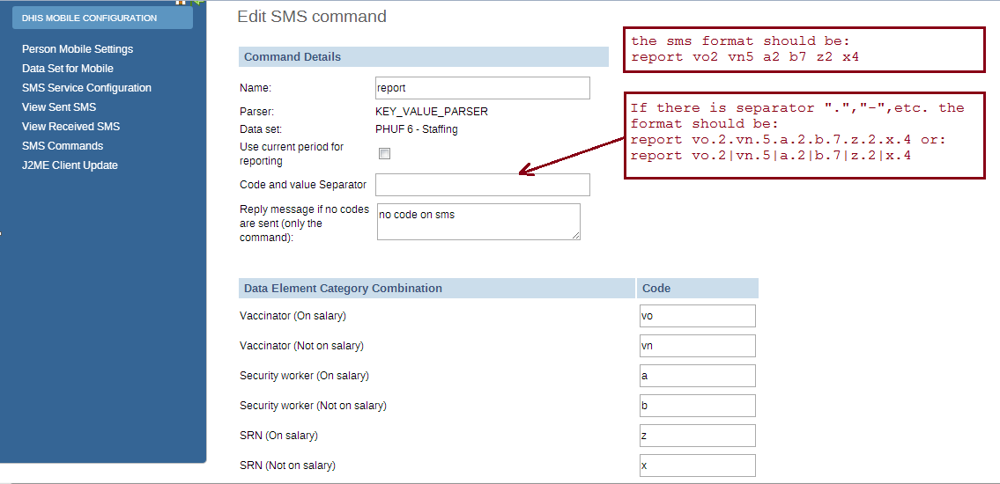
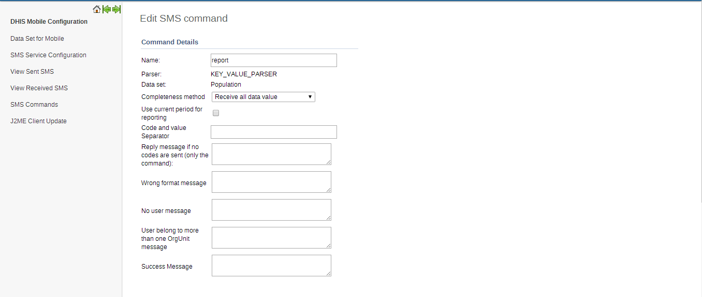

# Mobile

> **Note**
>
> The Mobile configuration module was removed in 2.36 and is now replaced by the SMS configuration app which provides a modern and more user-friendly user interface and additional options > for configuring SMS in DHIS2.

This chapter covers various mobile technologies including Web, J2ME, SMS
Service and SMS Command.

## DHIS2 Mobile Introduction { #mobile_intro } 

DHIS2 provides a range of options to allow data entry from mobile
devices, including a dedicated GPRS/3G J2ME client and two versions of
DHIS2 which have been optimized specifically for mobile browsers. Each
of these solutions will be described in detail in the following
sections. DHIS2 offers several Android clients, which are described in
detail in other sections of this guide.

Collection of data in the field can be technically challenging and
expensive. Mobile phone solutions have the potential to significantly
reduce the complexity of deploying a distributed data collection system.
Using a simple Java client installed on a mobile phone or a web browser
which works on the mobile phone, field workers can report directly to
the DHIS2 database through their mobile device.

While mobile phone solutions have a great potential, there are
complexities with such deployments. Phones lack processing power and
have a small display, they need to be charged, and often such
deployments make the most sense in areas with poor or intermittent
network coverage.

Each of the mobile solutions are introduced briefly below, and the
discussed in separate sections in detail:

  - DHIS2 Light: A mobile browser optimized data entry module for all
    devices

    This module allows for data entry directly with the browser of the
    mobile device. A wide range of devices and mobile browsers are
    supported including: Opera mini 3 & 4 (basic and advanced) - Opera
    mini 4, Nokia S40 mobiles ,Windows Phone 7, Window Mobile 6, Palm
    Pre, Blackberry (v5 and v6), Firefox mobile, iOS devices (iPhone)
    and Android devices. This client does not have offline-support, and
    an active GPRS/3G connection is required. It does not require a new
    application installation on the phone to support new features, but
    does require a stable data connection for use. This solution is
    described in [Mobile browser based data entry](#mobile_web_based)

  - DHIS2 Smartphone client: A mobile browser optimized data entry
    module for Smartphone devices

    This module allows for data entry directly with the browser of a
    Smartphone. Offline data entry is supported and it does not require
    any installation of a special client on the phone itself.

  - J2ME GPRS/3G client

    DHIS-mobile includes two separate J2ME clients supporting
    GPRS/EDGE/3G as a transport mechanism. One clients supports facility
    aggregate reporting and the second client supports name-based
    program tracking. These clients are split into separate applications
    to make deployment easier. Some health workers may have both
    applications installed on their phone. Both of these clients support
    offline-storage of data and work on J2ME enabled devices (feature
    phones). .?\>

    An active GPRS/3G connection is required in order to send data to
    the DHIS2 database, but data can be entered offline and transmitted
    when a connection is present. This client is intended primarily for
    low-end devices which support J2ME applications, although the
    offline-supports adds some memory requirements which limits the
    handset selection. While the solution is primarily tested on Nokia
    phones, it also works on several other J2ME capable handsets.

    The facility reporting J2ME client is described in the chapter "J2ME
    GPRS/3G Client"

## Mobile browser based data entry { #mobile_web_based } 

### Getting started with mobile browser data entry

This approach is for data-entry on a smart phone with a mobile browser
by navigating to the URL of the DHIS2 instance, for example: the full
URL link for demo on [dhis2.org](dhis2.org)
<http://apps.dhis2.org/dev/mobile/index.action> . And your mobile
browser will automatically detect the DHIS2 application where the server
URL is given (e.g.: <http://apps.dhis2.org/dev>). Here is the login form
to access the application with user-name and password. Click on "Login"
to continue or "Reset" to reset:

After logging in, there are the list of functions:

**- Aggregate Reporting:** Entries for aggregate data with
defined/assigned dataset by organisation-units

\- **Tracking:**

  - Find Person: find person based on Name, Phone Number or ID, and
    Organization unit.

  - Activity Plan: Entries data for the persons by organisation-units,
    persons and programs/program-stages

  - Person Registration: Registry a new person

  - Anonymous: Entries for anonymous person based on programs

**- Messages:** Manage the messages and discussions from the server.
Message reply is available. User can send feedback message in Messages.

**- Reports:** The output reports from the server.

\- **Settings:** User-information (e.g.: First-name, Surname, Phone
number, E-mail) and the Interface language.

**- Logout:** to log out the application.

**- Desktop version**: navigate to the desktop version of DHIS2 for
administration. This require a lot of resources from the client mobile,
for example: the sufficient memory to load the pages. Not recommended
for the normal GPRS/3G/... phones.

The list above will be explained in details:

1.  **Aggregate Reporting:** Entries for aggregate data with
    defined/assigned dataset by
    organisation-units.

    

    Click on the "Aggregate Reporting", then choose an Organisation Unit
    from the list and the list of the datasets will be appeared for
    entering aggregate data. See the below example:

    **Step 1: Select an Organisation Unit from the
    list**

    

    **Step 2: Select a Dataset (entry form) from the
    list**

    

    **Step 3: Select a period (based on the period type of the chosen
    dataset) from the
    list**

    

    **Step 4: Entering the
    data**

    

    **Step 5: Save the data entered after completing the data, choose
    the option for data completeness if
    having.**

    

2.  **Tracking:** **Find/Add Person, Visit Schedule, Person
    Registration,
    Anonymous**

    

    2.1 ***Find/Add Person***: find person based on Name, Phone Number
    or ID, and Organization unit.

      - Step 1: insert Name, Phone Number or ID and select the
        Organization Unit, then click
        Search.

        

      - Step 2: select a
        person

        

        Then all the information of that person will be displayed

      - Step 3: choose the next program stage for entering the
        data

        

        To view all the program stages, click on the name of that
        program (Child Heath Program as the screen
        shot)

        

    2.2: ***Visit Schedule***: Choose An Organization Unit

    

    

      - Current Activity Plan: the list of the beneficiaries registered,
        enrolled, not yet finish/complete a/many program and there is at
        least a program-stage open for data-entry.

        \+ *Step 1: Choose a Person for
        entry*

        

        \+ *Step 2: Choose a current and active program-stage for
        entering the
        data*

        

        You can also see the person's information (ID, gender, Date of
        Birth, and Blood Group) by clicking on the Details (on top of
        the list
        appeared)

        

        The details information of the chosen
        person:

        

      - All Activity Plan: the list of all beneficiaries registered,
        enrolled, not yet finish/complete a/many program.

      - Single
        Event:

        

    2.3: **Person Registration:** Registry a new Person

      - Step 1: Entry personal
        information

        

      - Step 2: Enrol program for the person just been registered, then
        click
        "Enroll".

        

      - Step 3: Entry required information for the chosen program, then
        click
        "Enroll"

        

        Here is the
        result:

        

    2.4: **Anonymous:** Entries for anonymous person based on specific
    programs

    

3.  **Messages:** Manage the messages and discussions from the
    server. Message reply is
    available.

    

    The number showed is the unread messages. Click on that to view the
    list of the messages (the unread messages are in bold and dark blue
    color):

    

    Then you can pick up the message/topic for the discussions by
    leaving the reply message, see this
    example:

    

    User can create and send a feedback to server in messages section.
    After sending out the new feedback, the message (feedback) will be
    listed under "Messages" for further following up.

4.  **Reports:** The output reports from the
    server

    

    (will be updated)

5.  **Settings:** User-information (e.g.: First-name, Surname, Phone
    number, E-mail) and the Interface
    language.

    

    Here is the form for setting the user account/access and the
    interface language. Click on "SAVE" for completing the settings, see
    the example
    below:

    

6.  **Logout:** to log out the
    application

    

7.  **Desktop version**: navigate to the desktop version of DHIS2 for
    administration.

    

    Here is the GUI of the desktop version (which require much memory
    for loading), not recommended for normal mobile. The example with
    DHIS2 Demo (from
    [dhis2.org](dhis2.org))

    

<!-- end list -->

1.  

    After clicking on the "Namebased Data Entry", the next will guiding
    to the selections in the following steps:

    **Step 1: Choose an Organisation
    Unit**

    

    **Step 2: Choose the Activity
    Type**

    

    (the screen-shot with an example with "Current Activity Plan"
    option)

    There will be normally these two type of Activity:

    \+ "Current Activity Plan": the list of the beneficiaries
    registered, enrolled, not yet finish/complete a/many program and
    there is at least a program-stage open for data-entry.

    \+ "All Activity Plan": the list of all beneficiaries registered,
    enrolled, not yet finish/complete a/many program.

    **Step 3: Choose a Beneficiary for
    entry**

    

    (the screen-shot with an example with "Hybia Welde" option)

    **Step 4: Choose a current and active program-stage for entering the
    data**

    

    (the screen-shot with an example with "16-24 months after birth"
    option)

    You can also see the beneficiary's information (ID, gender, Date of
    Birth, and Blood Group) by clicking on the Details (on top of the
    list
    appeared)

    

    The details information of the chosen
    beneficiary:

    

2.  **Beneficiary Registration:** Registry a new
    beneficiary

    

    **Step 1: Choose an
    OrganisationUnit**

    

    **Step 2: Fill in the Beneficiary Registration
    form**

    

    There necessary information: Full Name, Gender, Date of Birth (and
    Blood Group).

    Click on "SAVE" to register a new beneficiary.

    A message "Successfully Saved" will appear when the beneficiary is
    created/registered
    successfully.

    

3.  **Beneficiary Enrollment:** Enrol a beneficiary to one or many
    programs

    

    Before enrolling a beneficiary to a program, the search function for
    a beneficiary is provided:

    If the beneficiary is found, the result will be listed. The simply
    click on the beneficiary name for navigating to the programs in
    which the beneficiary enrolled:

    The below screen-shot example describes the beneficiary named
    "Nguyen Van A":

    \- Has not enrolled any programs before

    \- There is one program: "Child Health Program" available for
    enrolment

    The list of the available programs for enrolment will be listed.
    Just click on the program for enrolment by specifying the date of
    enrolment and the date of incident. See the example:

    After clicking on the "ENROLL" button, if successful, the program
    enrolled will be listed under "Enrolled Programs for" + \<Name of
    the beneficiary\>, see the example:

4.  **Messages:** Manage the messages and discussions from the
    server. Message reply is
    available.

    

    The number showed is the unread messages. Click on that to view the
    list of the messages (the unread messages are in bold and dark blue
    color):

    

    Then you can pick up the message/topic for the discussions by
    leaving the reply message, see this
    example:

    

5.  **Reports:** The output reports from the
    server

    

    (will be updated)

6.  **Settings:** User-information (e.g.: First-name, Surname, Phone
    number, E-mail) and the Interface
    language.

    

    Here is the form for setting the user account/access and the
    interface language. Click on "SAVE" for completing the settings, see
    the example
    below:

    

7.  **Feedback:** the extra function for creating a new message to
    send to the server. The new created feedback from this will be
    listed under
    "**Messages**"

    

    After clicking on the "Feedback", there will be a form for
    editing/sending out a new message/discussion. See the example
    below:

    

    After sending out the new feedback, the message (feedback) will be
    listed under "Messages" for further following
    up.

    

8.  **Logout:** to log out the
    application

    

9.  **Desktop version**: navigate to the desktop version of DHIS2 for
    administration.

    

    Here is the GUI of the desktop version (which require much memory
    for loading), not recommended for normal mobile. The example with
    DHIS2 Demo (from
    [dhis2.org](dhis2.org))

    

## J2ME GPRS/3G Client { #mobile_j2me_gprs_3g } 

The DHIS2 GPRS/3G mobile module provides a mechanism for remote clients
using mobile phones to enter data directly into the DHIS2 system. There
are two functions of the client, namely:

The solution relies on the mobile phone having a data connection
available (i.e. GPRS, Edge, 3G), over which it communicates with a DHIS2
instance which must be publicly available on the internet, as any other
web server. The client application on the phone downloads the data entry
forms to the phone from the server, and the forms can therefore be
updated without installing a new application. This is also a crucial
feature for community reporting, which relies on regularly downloading
activity plans from the server.

  - Facility reporting, for data entry and reporting of regular DHIS2
    aggregate data,

  - Activity reporting, for supporting individual activity reporting
    with the Community module.

### Data connection availability

Data connection availability can be a problem in many of the contexts
where DHIS2 mobile reporting would otherwise be a good solution for
getting data directly into DHIS2. If that is the case for you, you might
want to consider trying the SMS based solution described in a separate
document. Keep in mind that even though a data connection is currently
required for communication between the server and the mobile phone, it
is only required when initializing or updating the mobile application
and when sending reports to the server. The phone stores all entered
data locally, so it can work fine with only temporary access to a data
connection on a regular basis.

### J2ME GPRS 3G facility reporting client { #mobile_j2me_gprs_3g_facility_reporting } 

The server side component of the web based solution is included in the
general build of DHIS2.

In order to configure the DHIS2 web-based mobile reporting, you should
follow the following steps.

  - Set the "Available for Mobile Reporting" flag for the data sets you
    want reported: Under *Maintenance-\>DataSet*-\>*Edit* mark the
    “Available for Mobile Reporting” check box and save.

  - Create a user role for the mobile user. Select
    *Maintenance-\>Users-\>User Role-\>Add new*. Add a user role name
    and description. Add the desired data sets for the role. The mobile
    user role will need to have at least privileges for DHIS2 Web API.
    Save the user role by clicking "Save".

  - Create a user which will be used by the client to login from
    *Maintenance-\>Users-\>User -\>Add new*. Fill in all of the required
    details, keeping in mind that the password must be at least 8 digits
    long, contain one capital letter,and one digit. Assign the desired
    user role to the user which was created in the previous step.

    > **Important**
    >
    > Assign the user to exactly **one** organisation unit. Each mobile
    > reporting client will need their own user name and password.

### Detailed configuration of data sets and reporting forms

Though the previous steps is all that should be needed for testing the
solution more detail configuration of the datasets may be required and
are described in the following sections.

#### The mapping of data sets to form layout on the phone

By default, a data set is mapped to a single form on the phone. If the
data set is divided into sections, each section is displayed as a
separate page on the phone. If a data element has more than one category
option combo it will be displayed as a heading with the category
combination options following.

||||
|---|---|---|
| **Form design element** | **DHIS2 Metadata** | **Metadata element** |
| Form title | Data set | Short Name if it exists, otherwise Name |
| Page tile | Section | Section name (or form name if no sections) |
| Question | Data element | Alternative name if it exists, otherwise Name |
| Question name if combos | Category option combo | name |

#### Sorting of forms

By default, data elements will be sorted according to the global sorting
assigned in DHIS2. If sections are used, their section specific sorting
order will be used. In some cases, when sections are not used, a data
element might be used in multiple data sets, and conflict in the way it
should be sorted in individual data sets. A work around for this
situation is to wrap the whole dataset in one section (note that this
will only work if the data elements have the same category option combo)

#### Versioning of data sets

To make it possible to compare and update the data sets on the mobile
phone with the version on the server, data sets are automatically
versioned when you edit the data set structure. Some changes which occur
on the DHIS2 server, will cause the mobile client to update its forms
with a new version.

  - Create DataSet

  - Edit DataSet

  - Create/edit/delete Section in DataSet

  - Sort Section Order

  - Update DataElement (affect many related DataSets)

  - Delete DataElement (affect many related DataSets)

  - Edit DataElement Category

  - Edit DataElement Category Combo

#### Language support

Multi-language support is available.

DataSet and DataElement are translated through web-based function.
Default language on server is used on mobile in cases requested language
from mobile is not available.

### Mobile application setup

#### Installation and initialization

##### Installation

Download the jar packages from the DHIS2 homepage:
[https://www.dhis2.org/downloads](www.dhis2.org/downloads)

##### Initialization

Initialization should be performed before the phones are delivered
end-users. Given the large variation in possible phone configurations,
it is impossible to describe the exact steps which are required in order
to enable the client on the phone. However, for most phones, simply
copying the DHIS2 Web Mobile client "JAR" file to the phone with a USB
cable or via Bluetooth is sufficient. Of course, GPRS/3G connectivity
must be enabled. Contact your mobile service provider for exact details
on the configuration of the phones and networks.

Once the client has been installed on the phone, an initialization
process must occur by providing a user name, password and server URL.

1.  Logging into the server for the first time.

    The first time the client logins to the server, or if the client is
    reinitialized, the username, password and server URL must be
    entered.

    If the client is unable to login, there could be several possible
    error messages which you see.

      - Connection Not Found: The specified server URL is not correct.
        Check the server address, ensure that the server is actually
        reachable, and try again.

      - Invalid User Name Or Password: the username or password is
        incorrect

      - Application not authorized to access restricted APIs : The
        server can be contacted, but the user does not have the
        necessary permissions to access the mobile reporting module

2.  Setting the PIN number: After the initial login process, a PIN
    number can be entered by the user. This will make the login process
    much easier, as the user only has to remember the four digit pin
    number, as opposed to typing in the user name and password each
    time. The PIN number can be preset if the phone is initialized prior
    to delivery, or it can be set by the users themselves if they have
    been provided with usernames and passwords.

    

    After entering the PIN, press (Menu)-\>Next.

3.  Download all forms: After the PIN has been specified, all forms will
    be downloaded from the server and stored locally on the phone..

    If the user has been configured to report on aggregate datasets, a
    list of appropriate datasets will be displayed. If the user is
    responsible for community based reporting, the list of assigned
    activities is displayed.

    *Notes*: If the Health Worker is responsible for both Facility
    Reporting and Community Reporting, DHIS2 server will send all forms
    of both Facility Reporting and Community Reporting to mobile and on
    mobile, there will be a screen to choose whether displaying Facility
    Reporting or Community Reporting.

    *Errors*:

#### Logging in (for regular use)

After starting the application, the PIN form is displayed.

  - PIN: Enter the four digit number PIN.

  - Reinitialize Command: this function will clear all data on mobile
    and we start from the login screen with username and password.

  - Errors: Invalid PIN: If the user has entered an invalid PIN, they
    will need to enter the correct PIN, or reinitialize the application
    with the correct username and password.

#### Facility Reporting Module

##### Entering data

After selecting an aggregate dataset from the "Select report form"
window, the user will need to select an appropriate time period. A list
of available time periods is automatically generated.

1.  After the user has entered their PIN, they can select from a list of
    available datasets. Select the appropriate dataset and press "Next".

    

2.  Choosing periods: A list of available periods will be automatically
    displayed to the user. They can select the appropriate period from
    the list.

    

3.  Fill in values: After choosing the period, the form can be displayed
    in two modes, depending on the

      - Form with sections

        Each form section is displayed in a single screen with the name
        of the section in the title window.

        To navigate from screen to screen, push "Next".

      - Forms without section (Datasets without sections)

        All fields are displayed on one screen with the title that is
        the name of DataSet

    The user simply fills in each data element with the appropriate
    value.

    

4.  Save and Complete:

    After finishing data entry, the user can choose to save the data
    locally on the phone or to upload the data directly to the DHIS2
    server.

    

    If the user saves the data form, they can edit the form at a later
    point in time if they need to. When selecting a period once again,
    the period will be marked as "Saved' as seen in the next screen
    shot.

    

    If the user selects "Complete", and the data entry form is not
    complete, the user will be asked if they are certain they wish to
    submit the form as incomplete. Once the form has been submitted, a
    message should be displayed informing the user that the transmission
    was successful.

    

##### Notes

1.  Period list:

    Periods marked with an asterisk (\*) is the period that is completed
    or saved, depending on the status of the data
    entry.

    

    All periods that are not in period list are considered old and will
    be deleted automatically.

2.  Storing values duration

    The number of saved forms on mobile are limited only by the
    effective amount of storage of the mobile device.

    Forms are saved for limited period only, depending on the frequency
    of collection of the particular dataset.

      - Daily Forms: 2 months (current and previous month)

      - Weekly Forms: 4 weeks (current and 3 previous week)

      - Monthly Forms: 2 months (current and previous month)

      - Quarterly Forms: 2 quarters (current and previous quarter)

      - Yearly Forms: 2 years (current and previous year)

3.  Completed forms - Uneditable forms

    If the form has been completed, the user can view the form on their
    phone, but they cannot make any subsequent edits to the form. Each
    field is greyed out and inactive for editing.

4.  Re-Edit completed forms

    If the user wishes to edit data which has already been submitted to
    the server, they can do so by pressing the "Edit" button. They are
    allowed to do this assuming that the dataset has not been locked for
    the period in question. If they attempt to upload the data, the user
    will be informed that the dataset has been locked, and it is not
    possible to upload the data.

    

5.  Update Forms:

    This function is used to synchronize the forms on mobile and on
    server. The process is automatically triggered after entering PIN
    number.

    Note: Checking and downloading updated forms process run in
    background. After finished, prompt is displayed to ask user whether
    refresh form list or stay where they are.

6.  Multi-Language Support:

    This function help user to choose language of mobile's GUI
    (graphical user interface) and content's language (Forms).

    The forms must be translated on server, otherwise, default language
    is used.

    Default language of first login is English. Change language in
    Setting menu will affect both interface and content.

    

    

    

    Multi-Language Interface: In Setting menu, there are list of
    supported language (downloaded from server). Language of GUI is only
    changed after restart application.

    Multi-Language Content (forms): Form's language is change after
    click "Save". In case there are many forms, it take several minutes
    to save setting.

##### Troubleshooting

  - Data has been entered on the phone but does not appear on the server

    This usually occurs when users enter data on the phone, but cannot
    send it to the server. This may be because of the configuration of
    the phone, lack of credit on the phone, or lack of coverage. Usually
    an error message is displayed as shown below.

    

    Users should be informed that if they see this error, then it means
    that their data has not been transmitted.

## SMS Command  { #mobile_sms_command } <!-- @TODO: DHIS2-10850 -->

SMS command feature helps DHIS2 system receiving SMS from users,
patients, or even anonymous. A SMS command is an object containing the
configurations for each SMS form: reporting data from phones or j2me
apps, alerting users, registering patient or user, etc.

### Set up SMS command

This is where you can create a new SMS
command

Usually each SMS command has it own property, then the setting up
process may be different from each other. Currently, we have 4 types of
SMS
command:

With KEY\_VALUE\_PARSER and J2ME\_PARSER, the SMS command will have
dataset because those are used for reporting data. If data is reported
for a Period which is already approved then SMS response will be sent
back containing information about approval status of the
period.

With ALERT\_PARSER and UNREGISTERED\_PARSER, the SMS command will have
user group because those are used for sending message such as SMS, DHIS2
conversation,
email.

There are certain parameters which are common to all SMS Command types.
These parameters have default values configured in the system, if user
does provide any value to these parameters then those default ones will
be used. Here is the list of those parameters

Table: Common Parameters

| Parameter | Type | Description |
|---|---|---|
| Code Value Separator | String | To provide custom code value separator. Default is "=" |
| Field Separator | String | To provide custom field separator. Default is "&#124;" |
| Reply message if no codes are sent (only the command) | String | To provide message if no code is found in SMS text input. Default is "Parameter missing" |
| Wrong format message | String | To provide message if command is not formatted correctly. Command should be formatted as per code value separator. This message will also be sent back if any mandatory parameter is missing. |
| No user message | String | To provide message if sending phone number is not registered in DHIS2. |
| User belong to more than one OrgUnit message | String | Certain SMS command types require user ( retrieved from sending phone number ) to be associated with only one organization unit. This message can be configured to be sent back in case that requirement is not fullfilled. |
| Success Message | String | To provide message that will be sent upon successful completion of the process. |

### SMS Command Type

The SMS command is basically defined by its parser type. In other word,
each SMS command has one unique parser to parse the plain text SMS, then
the result will be used for the purpose of that SMS command.

#### SMS Command for Reporting Data

In order to report data for example data set (aggregation), we use SMS
commands which have KEY\_VALUE\_PARSER (for phone's plain text), or
J2ME\_PARSER (for j2me
apps)

If the command has name "report", and a list of data element with code
like above. The format should be: \[command's name\] \[code\]\[value\]
\[code\]\[value\] \[code\]\[value\]....,the \[value\] of course might be
changed depends on real data, so you have to prepare an SMS text like
this example: **report vo2 vn5 a2 b6 z3 x1**

In case the command has a separator for instance ".", the SMS text
should be:

**report vo.2.vn.5.a.2.b.6.z.3.x.1**

or **report vo.2|vn.5|a.2|b.6|z.3|x.1**

Moreover in SMS text input, orgUnit can be specified like this **org
orgUnitCode** If no orgUnit is specified in SMS then user is retrieved
first from the sending phoneNumber and then orgUnit from that user. As
far as PeriodType is concerned it should be specified in this format
"ddMM" for example 3108, but in case its not specified then PeriodType
will be retrieved from DataSet attached to SMSCommand

With the J2ME\_PARSER, you don't need to prepare those SMS text, because
the J2ME will do this job

User can set the custom response message for "Wrong format message", "No
User Message", "User belong to more than one OrgUnit message" and
"Success message". If no custom message is being set, system will use
the default message.

#### SMS Command for Entity Enrollment

TRACKED\_ENTITY\_REGISTRATION\_PARSER can be used to enrol tracked
entity into the system.

Command name will be followed by tracked entity attributes pertaining to
specific program which this command is associated with. Program
selection will be done while creating this command.

Default text pattern ( if field separator and codevalue separator is not
provided ) for this parser would look like this. **childProgram
fn=xmen|ln=xmen2|age=4**

In case field separator is for example "," then text would look like
this.**childProgram fn=xmen,ln=xmen2,age=4**

Rest of the behavior is same as for other commands. If user does not
provide those parameters then default ones will be used.

#### SMS Command for Program Stage Data Entry

PROGRAM\_STAGE\_DATAENTRY\_PARSER can be used to enter program stage
related data for a specific tracked entity instance.

Command name will be followed by data elements pertaining to specific
program stage which this command is associated with. Program and program
stage selection will be done while creating this command.

Default text pattern ( if field separator and codevalue separator is not
provided ) for this parser would look like this. **programstage
bcgd=1|opvd=2|wght=34**

In case field separator is for example "," then text would look like
this.**programstage bcgd=1,opvd=2,wght=34**

Rest of the behavior is same as for other commands. If user does not
provide those parameters then default ones will be used.

#### SMS Command for Alerting, Registering

In order to alert users, we use SMS commands which have ALERT\_PARSER
(for phone's plain text), or UNREGISTERED\_PARSER (for j2me apps).
UNREGISTERED\_PARSER can also be used for registering IDSR
rumour.

The format of those command will be: \[command's name\] \[text\], for
example:

**alert one emergency case in A town**

Commands which has ALERT\_PARSER will be received from users only

#### SMS Command for Event Registration

Event Registration can be used to register anonymous event into the
system based on the data collected through SMS. This command type is
associated with Programs of type WITHOUT\_REGISTRATION. For example
Birth events can be tracked using this parser.

The format of those command will be: \[command's name\]
\[code\]\[separator\]\[value\], for example:

**birth A=1,B=2,G=Male**

Code/Value separator is configurable. Pipe "|" is by default taken as
field separator. Commands which has EVENT\_REGISTRATION\_PARSER will be
received from DHIS2 users only. Once command is successfully received
then data received in SMS will be parsed and event will be registered in
DHIS2.

## SMS Service { #mobile_sms_service } 

SMS Service is a generic service used for sending/receiving SMS. Any
other DHIS2 module can include this service and utilize it to send and
receive SMS from users or workers in the field.

### Setting up SMS service

There are few pre-requisites in order to make this service functional.
There are two ways to complete these steps. One way is to configure
gateway from the GUI in Mobile Configuration Module. The other way is to
use SMS Web Api.

  - Configure SMS Gateway

#### Configure SMS Gateway

There are five different types of Gateways supported by SMS Service. SMS
can be sent if any one of the gateway is configured. If more than one
gateways are present, then they will be used in round-robin fashion for
load balancing. There are different parameters for different type of
gateway. The Gateway can be configured in GUI in Mobile Configuration
Module as shown in the figure. More information about parameters needed
to configure gateway can be found in [Gateway
Configurations] section of new SMS app.(#gateway.configuration)

#### Configure GenericHttp Gateway

Many DHIS2 instances are using GenericHttpGateway to connect to their
local gateways. These local gateways provides HTTP APIs for sending SMS.
In new GenericHttpGateway it is now possible to configure generic configuration
template for gateway configuration. This template is converted into request payload by replacing
place holders with actual values taken from gateway key value parameters.

### Gateway Configurations { #gateway.configuration } 

Below table shows the parameters required for configuring gateway.

Table: Gateway Configuration Parameters

| Parameter | BulkSMS Gateway | Clickatell Gateway | Generic HTTP Gateway | SMPP Gateway | Description |
|---|---|---|---|---|---|
| Gateway Name | Optional | Optional | Optional | Optional | Used as gateway identity. Default name will be stored in case this parameter is not configured. Its use is recommended |
| User Name | Required | Optional (if token is used) | Required | Required | Used for API authentication |
| Password | Required | Optional (if token is used) | Required | Required | Used for API authentication |
| Auth-Token | N/A | Optional (if password is used) | N/A | N/A | Used for API authentication |
| URL Template | N/A | N/A | Required | Required | Url Tempalte is only required in case of GenericHttpGateway . For example "http://smsgatewa1.com" |
| Headers | N/A | N/A | Optional | N/A | Header option can be checked to send selected parameter as http header. For example username/password/token can be sent in http header. |
| useGet | N/A | N/A | Optional | N/A | HTTP POST method is used by default for posting data toward gateway. But in certain cases if HTTP GET method is required for doing so then useGet parameter can be set to true. Default value for useGet is false. |
| systemType | N/A | N/A | N/A | Required | SystemType parameter is required for SMPP gateway. Default value is 'cp' |
| typeOfNumber | N/A | N/A | N/A | Required | TypeOfNumber parameter is required for SMPP gateway. Default value is 'UNKNOWN'. Other possible values are UNKNOWN, INTERNATIONAL, NATIONAL, NETWORK_SPECIFIC, SUBSCRIBER_NUMBER, ALPHANUMERIC and ABBREVIATED |
| numberPlanIndicator | N/A | N/A | N/A | Required | NumberPlanIndicator parameter is required for SMPP gateway. Default value is UNKNOWN. Other possible values are UNKNOWN, ISDN, DATA, TELEX, LAND_MOBILE, NATIONAL, PRIVATE, ERMES, INTERNET and WAP |
| bindType | N/A | N/A | N/A | Required | BindType parameter is required for SMPP gateway. Default value is TX. Other possible values are BIND_TX, BIND_RX and BIND_TRX |
| compressed | N/A | N/A | N/A | Optional | Compressed parameter is optional for SMPP gateway. Default value is false |
| sendUrlParameters | N/A | N/A | Optional | N/A | Gateway parameters will be appended with url for example `https://samplegateway.com/messages?apiKey={apiKey}&to={recipients},content={text},deliveryreport={dp}` |
| contentType | N/A | N/A | Optional | N/A | The type in which data will be sent to sms gateway. Default is application/x-www-form-urlencoded. Other supported types are application/json, application/xml and text/plain |
| configurationTemplate | N/A | N/A | Optional | N/A | Generic configuration template can be used to provide the data in the form acceptable to external gateway. For example `username=${username}&password=${password}&to=${recipients}&countrycode=880&message=${text$}&messageid=0`. Json/xml template can also be provided. |
