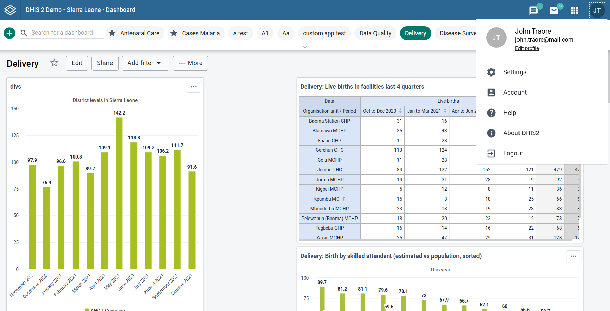
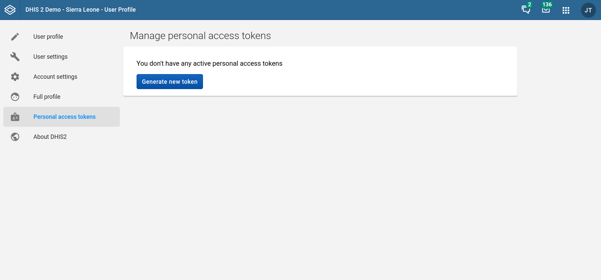
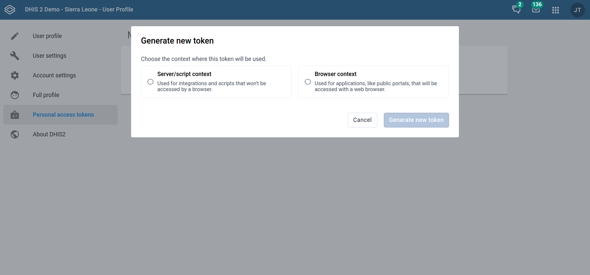
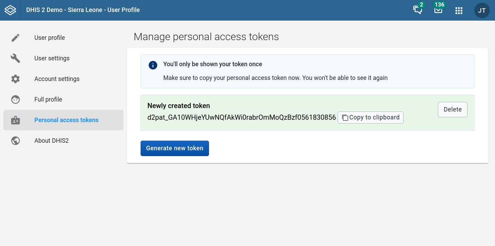

# Personal access tokens { #personal_access_tokens }

## About personal access tokens

Personal access tokens (PATs) are an alternative to using passwords for
authentication to DHIS2 when using the API.

PATs can be a more secure alternative to HTTP Basic Authentication,
and should be your preferred choice when creating a new app/script etc.

HTTP Basic Authentication is considered insecure because, among other things,
it sends your username and password in clear text. It may be deprecated in
future DHIS2 versions or made opt-in, meaning that basic authentication would
need to be explicitly enabled in the configuration.

#### Version support

To utilize the benefits of PATs, you will need to be on dhis2 2.37.X or later version.

#### Important security concerns!

Your PATs will automatically inherit all the permissions and authorizations your
user has. It is therefore extremely important that you limit the access granted to
your token depending on how you intend to use it, see **Configuring your token**.

> **Caution**
>
> If you only want the token to have access to a narrow and specific part of the
> server, it is advised to rather create a new special user that you assign only
> the roles/authorities you want it to have access to

## Server/script and browser contexts

When creating a PAT using the User Profile app, you will be prompted to select
the context in which the token will be used.

While both contexts allow you to specify your token's expiration date and allowed HTTP
methods, they differ in the additional restrictions that they provide.

### Server/script context

The server/script context applies to use cases where your DHIS2 instance will
not be accessed by a browser, such as integrations and scripts.

As well as allowing you to set token expiration and allowed HTTP methods, in
this context you are able to restrict the set of IP addresses from which this
token may be used. For example, if you restrict your token to the IP address
`91.242.200.159` and a malicious party obtains your token and attempts to use it
from IP address `142.250.187.206`, your DHIS2 instance will reject these
malicious requests.

> **Important**
>
> IP address validation relies on the `X-Forwarded-For` header, which can be spoofed.
> For security, make sure a load balancer or reverse proxy overwrites this header.

### Browser context

The browser context applies to use cases where your DHIS2 instance will be
accessed by a web browser, such as public portals and other public access
applications.

As well as allowing you to set token expiration and allowed HTTP methods, in
this context you are able to restrict the websites in which your token is
embedded. This restriction is achieved using the [HTTP referer
header](https://en.wikipedia.org/wiki/HTTP_referer).

> **Important**
>
> This is not a security feature. The `referer` header can easily be spoofed.
> This setting is intended to discourage unauthorized third-party developers from connecting
> to public access instances.

## Use cases

PATs are useful in cases where external services and integrations must
communicate securely with your DHIS2 instance. As tokens inherit the authorities
of their associated account, you can ensure that your integrations are only able
to read and modify relevant data.

PATs are also a more secure alternative to HTTP Basic Authentication, and should
be your preferred choice when creating a new app/script etc.

## Security considerations

### Treat your PATs like passwords

Treat your tokens like passwords and keep them secret. If you believe a token
has been leaked or stolen, revoke it immediately.

If possible, pass tokens to your scripts and apps as an environmental variable
instead of hardcoding them.

### IP address validation can be bypassed in some cases

IP address restrictions for server context tokens rely on the
`X-Forwarded-For` header, which can be spoofed. To prevent spoofing, configure
your load balancer or reverse proxy to overwrite this header.

### The `referer` header is not a security feature

While the referer restrictions for browser context tokens are useful in limiting
abuse, the `referer` header can be spoofed. Do not rely on referer restrictions
as the `referer` header is not a security feature.

## Creating PATs

Personal access tokens are created using the User Profile app.

1. Log in with your username and password and go to your profile page. The User
   Profile app can be accessed by clicking on your user avatar in top right
   corner, and choosing "Edit profile" from the dropdown

   

2. Choose "Personal access tokens" from the left-hand navigation sidebar

   

3. Click the "Generate new token" button to show the new token pop-up

   

4. Choose the appropriate context for your new token
5. Enter an appropriate expiration date for your token
6. Optionally, configure your token's context-specific restrictions (IP
   addresses for server contexts or Referers for browser contexts)
7. Optionally, choose which HTTP methods your token should have access to when using your
   instance's REST API
8. Click the "Generate new token" button
9. Your token will be generated and shown to you only once, so it is important
   that you copy the token key now and save it in a secure place for use later.

   

> **Important**
>
> This generated secret token key will only be shown once, so it is important
> that you copy the token key now and save it in a secure place for use later.
> The secret token key will be securely hashed on the server, and only the hash of this secret token
> key will be saved to the database. This is done to minimize the security impact if someone gets
> unauthorized access to the database, similar to the way passwords are handled.

### Server context

Tokens for server contexts can limit the IP addresses from which they can be used.

These IP addresses can be provided in the "Allowed IP addresses" input area,
with one address per line.

### Browser context

Tokens for browsers contexts can limit the web pages from which they can be used.

These URLs can be provided in the "Allowed referrers" input area, with one URL
per line.

## Using PATs

To issue a request with your newly created token, use the Authorization header
accordingly.

The Authorization header format is:

```
Authorization: ApiToken [YOUR_SECRET_API_TOKEN_KEY]
```

Example using the JavaScript `fetch` API:

```js
fetch(url, {
  headers: {
    Authorization: 'ApiToken d2pat_5xVA12xyUbWNedQxy4ohH77WlxRGVvZZ1151814092',
  },
});
```
