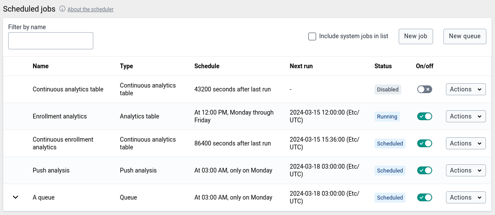
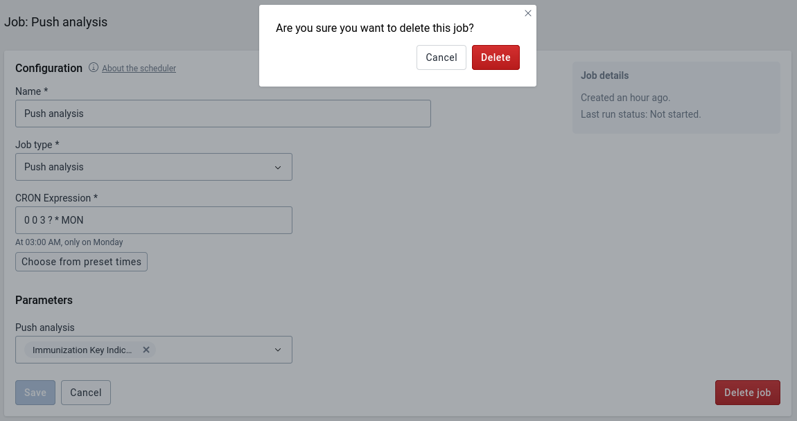

# Scheduling { #scheduling }

The Scheduler is an application for managing background jobs in DHIS2.
Background jobs can do a number of tasks, such as running analytics,
synchronizing data and meta data, or sending a push analysis report. The
application provides the ability to create, modify and delete such jobs.

Jobs can be scheduled to run in a specific order with a job queue. A job queue
consists of two or more jobs and can be scheduled according to a cron schedule.
At the specified time the queue will start the first job and wait for it to
finish before it starts the second job. It will continue running jobs in
sequence until they have all been executed.

The Scheduler comes bundled with DHIS2 and is accessed through the App Menu.

The start page of the Scheduler app shows an overview of existing jobs and
queues. By default, pre-defined system jobs are hidden. To view these, click
_Include system jobs in list_ in the top right corner.

When you create or modify a job or queue, it will be scheduled according to the
selected schedule. To run a job or queue on demand, go to the overview, click
the "Actions" button of the job or queue you want to run and click "Run
manually". This action is only available for enabled jobs and queues.

## Creating a job { #scheduling_create_job }

1.  Open the **Scheduler** app and click the "New job" button in the top right
    corner.

1.  Choose a suitable **Name** for the new job.

1.  Select the **Job type** you want to schedule using the drop-down menu.

1.  Select a schedule for the job. Each job type has its own scheduling type,
    either **Cron** scheduling or **Delay** scheduling.

    1.  For **Cron** scheduled job types you can set a schedule using the
        [Spring scheduling](https://docs.spring.io/spring/docs/current/javadoc-api/org/springframework/scheduling/support/CronSequenceGenerator.html)
        syntax. You can also select a predefined **Cron expression** by clicking
        "Choose from preset times". This schedule will only start a new job run
        if the previous job run has finished, to prevent the system from
        spawning too many jobs.

    1.  For **Delay** scheduled jobs you can set a delay in seconds. Unlike the
        **Cron** scheduled jobs, these jobs aren't executed according to a set
        schedule, but with a specific delay in between job runs. The delay timer
        starts when a job ends, starting a new job run when the delay timer
        reaches zero. This will continue as long as the job is enabled.

1.  If the job type is customizable, a **Parameters** section will appear below
    the scheduling settings. These additional options specify the details of the
    scheduled job, and will vary depending on the job type.

1.  Press the **Save** button to confirm the job creation. On successful job
    creation you will be redirected to the job overview, where the newly created
    job will now be listed.

Newly created jobs are enabled by default.

## Editing a job { #scheduling_configure_job }

With the proper permissions, you can modify the details of user-created jobs. To
quickly enable or disable a user created job from running, use the switches in
the **On/off** column on the landing page of the Scheduler app. Note that system
jobs are always enabled and cannot be disabled.

Further editing of user jobs:

1.  Click the "Actions" button of the job you want to edit and click "Edit"
    (only user jobs can be edited).

1.  When done editing, press the **Save** button to persist the changes.

## Deleting a job { #dataAdmin_scheduler_delete }

1.  Click the "Actions" button of the job you want to delete and click "Delete"
    (only user jobs can be deleted).

1.  Confirm by pressing **Delete** again in the pop-up window.

User jobs can also be deleted from the editing screen.

## Job types

The following section describes the various job types.

### Disable Inactive Users { #scheduling_disable_inactive_users }

Users that have not been active - not logged in - for a number of months can
automatically be disabled. Select the number of inactive months as the job
parameter. All users that have not logged in for that number of months or longer
will be disabled by the job. Disabled users will no longer be able to log into
the system.

The _Reminder days before_ parameter can be set to send a reminder email to
those users the specified number of days before their account is due to expire.
If users do not log in further reminder emails are sent each halving the
previous number of days. For example if the number of days is set to 7 the first
email is sent 7 days in advance, the second 3 days and the third and last 1 day
in advance. If the value is not set (blank) no reminder is sent.

### Resource table { #scheduling_resource_table }

The resource table job is responsible for generating and updating the resource
database tables. These tables are used by various components in DHIS 2 and is
meant to simplify queries against the database.

Note that when specifying any of the analytics table jobs, resource tables can
be part of the process and it is not necessary to also specify a resource table
job.

### Analytics table { #scheduling_analytics_table }

The analytics tables job is responsible for generating and updating the
analytics tables. The analytics tables are used as basis for data analytics
queries in DHIS2. Apps such as dashboard, visualizer and maps retrieve data from
these tables through the DHIS2 analytics API, and they must be updated in order
for analytics data to become available. You can schedule this process to run
regularly through an analytics table job type.

The analytics table job will by default populate data for all years and data
elements. The following parameters are available:

- **Last years:** The number of last years to populate analytics tables for. As
  an example, if you specify 2 years, the process will update the two last years
  worth of data, but not update older data. This parameter is useful to reduce
  the time the process takes to complete, and is appropriate if older data has
  not changed, and when updating the latest data is desired.
- **Skip resource tables:** Skip resource tables during the analytics table
  update process. This reduces the time the process takes to complete, but leads
  to changes in metadata not being reflected in the analytics data.
- **Skip table types:** Skip one or more analytics table types. This reduces the
  time the process takes to complete, but leads to those data types not being
  updated in analytics data.

### Continuous analytics table { #scheduling_continuous_analytics_table }

The analytics tables job is responsible for generating and updating the
analytics tables. The analytics tables are used as basis for data analytics
queries in DHIS2. Apps such as dashboard, visualizer and maps retrieve data from
these tables through the DHIS2 analytics API, and they must be updated in order
for analytics data to become available. You can schedule this process to run
regularly through an analytics table job type.

The continuous analytics table job is based on two phases:

- _Latest update:_ Update of the latest data, where latest refers to the data
  which has been added, updated or removed since the last time the latest data
  or the full data was updated. This process will happen frequently.
- _Full update:_ Update of all data across all years. This process will happen
  once per day.

The continuous analytics table job will frequently update the latest data. The
latest data process utilizes a special database partition which is used to hold
the latest data only. This partition can be quickly refreshed due to the
relatively small amount of data. The partition will grow in size until a full
update is performed. Once per day, all data for all years will be updated. This
will clear out the latest partition.

The analytics table job will by default populate data for all years and data
elements. The following parameters are available:

- **Full update hour of day:** The hour of the day at which the full update will
  be done. As an example, if you specify 1, the full update will be performed at
  1 AM.
- **Last years:** The number of last years to populate analytics tables for. As
  an example, if you specify 2 years, the process will update the two last years
  worth of data, but not update older data. This parameter is useful to reduce
  the time the process takes to complete, and is appropriate if older data has
  not changed, and when updating the latest data is desired.
- **Skip resource tables:** Skip resource tables during the analytics table
  update process. This reduces the time the process takes to complete, but leads
  to changes in metadata not being reflected in the analytics data.

### Tracker search optimization { #scheduling_tracker_search_optimization }

The tracker search optimization job is responsible for generating and updating
the trigram indexes for relevant tracked entity attributes. Trigram indexes
improve the performance of searching tracked entity instances based on specific
tracked entity attribute values. The usefulness of trigram indexes depends on
whether the tracked entity attribute is configured as unique or if they are
configured as searchable (when connected to program/tracked entity type). You
can configure the job to choose which tracked entity attributes should be
trigram indexed. The job also takes care of deleting any obsolete indexes that
have been created earlier but are no more required due to change in metadata
configuration.

The following parameters are available:

- **Attributes:** The list of attributes that needs a trigram index created. For
  each attribute, a partial trigram index will be created. As an example, if you
  specify "firstname" and "lastname" attribute, the process will create two
  separate trigram indexes for the corresponding attributes "firstname" and
  "lastname". Note that, if the attribute provided in this parameter is not
  indexable (either because they are not unique or not searchable), such
  attributes are simply ignored by the process and no trigram index will be
  created for them.
- **Skip index deletion:** Skip obsolete index deletion during the trigram index
  process. If set to true, indexes that are deemed obsolete will not be deleted.

### Data synchronization { #scheduling_data_sync }

DHIS2 provides synchronisation of data between remotely distributed instances
and a central instance of DHIS2. This can be useful e.g. when you have deployed
multiple stand-alone instances of DHIS2 which are required to submit data values
to a central DHIS2 instance. Both tracker data and aggregate data
synchronization is supported.

These are the steps to enable data synchronization:

- Go to Synchronization Settings, enter the remote server URL, username and
  password. Press the TAB button to automatically save the new password. Refresh
  the page and check that the filled values are still present. Note that the
  password field will be empty after the refresh, since this value is encrypted,
  so you can consider it saved.

- Using the Scheduler app, create a new job using the "Event Programs Data Sync"
  and/or "Tracker Programs Data Sync" job type. Make sure it is enabled when you
  finish. (Note: If the "Program Data Synchronization" job, available in
  previous versions, was set up in Scheduler app before, it was automatically
  replaced by the two new jobs "Event Programs Data Sync" and "Tracker Programs
  Data Sync" with the identical settings. )

Some aspects of the data synchronization feature to be aware of:

- The local DHIS2 instance will store the password of the user account on the
  remote instance encrypted in the local database. The remote account is used
  for authentication when transferring data. For security purposes make sure you
  set the _encryption.password_ configuration parameter in
  _hibernate.properties_ to a strong password.

- Deploying the remote server on SSL/HTTPS is strongly recommended as the
  username and password are sent in clear text using basic authentication and
  could be intercepted by an attacker.

- The data synchronization uses the UID property of data elements, category
  option combos and organisation units to match the meta-data. Hence the
  synchronization is dependent on these three meta-data objects being harmonized
  on the local and remote instance in order to work appropriately.

- The first time DHIS2 runs the synchronization job, it will include any data
  available. The subsequent synchronization jobs will only include data added
  and changed since the last successful job. A synchronization job is considered
  successful only if all the data was saved successfully on the remote server
  (Any data successfully synced will remain on the receiving instance,
  regardless if the job eventually fails). Whether the job was successful or not
  can be decided from the import summary returned from the central server.

- The initial synchronization job may take a significant amount of time,
  possibly slowing down your instance, depending on how much data is being
  synchronized. It could be a good idea to configure the job to run when there
  are few online users, then later change this to your own preference. If you do
  not want or need to synchronize all the data, there is a possibility to
  <a href="#skip_changed_before">skip some of the data being synchronised</a>.

  When DHIS2 synchronizes tracker data, it determines the set of data to
  synchronize based on the last time it was synchronized. Each of the tracked
  entity instances and events have their own records of when they where last
  successfully synchronized.

- The system will start a synchronization job based on the rules set in the
  configuration of the job. If the synchronization job starts while there is no
  connection to the remote server, it will retry up to three times before it
  aborts. The job will run again at a scheduled time.

- The server handles each set of programs separately, which means one set of
  programs can be synchronized successfully, while the other fails. The failure
  or success of one doesn't influence the other, as the last successful
  synchronization time is tracked individually for each item as previously
  mentioned.

- The attributes of TrackedEntityInstances (TrackedEntityAttribute) and the data
  elements of ProgramStages (ProgramStageDataElement) which have an option "Skip
  synchronization" turned on will not be synchronized. This feature allows you
  to decide to not synchronize some sensitive or not relevant data and to keep
  them only locally.

- The authority
  `Ignore validation of required fields in Tracker and Event Capture`
  (`F_IGNORE_TRACKER_REQUIRED_VALUE_VALIDATION`) should be used when there
  is a requirement that some mandatory attribute / data element has at the same
  time a "Skip synchronization" property turned on. Such a setting will lead to
  validation failure on the central server as the given attribute / data element
  will not be present in the payload.

  The validation won't fail for the user with this authority. The authority
  should be assigned to the user, on the central server, that will be used for
  synchronization job.

- In specific cases, **the initial synchronization of all the data can be
  undesirable**; for example, when a database on the local instance is a fresh
  copy of the database present on the central instance, or when it is preferred
  to not synchronize old data in favor of initial synchronization taking less
  time.

  The _syncSkipSyncForDataChangedBefore_ SettingKey can be used to skip the
  synchronisation of all the data (data values, Event and Tracker program data,
  complete data set registrations) that were _last changed before the specified
  date_. The `SettingKey` is used in the synchronization job all the time.
  Therefore, if you need to synchronize the old data, you should change the
  `SettingKey`.

- Both Tracker Programs and Event Programs synchronization job supports paging
  in order to avoid timeouts and to deal with unstable network. Default page
  size for "Event Programs Data Sync" job is set to 60. Default page size for
  "Tracker Programs Data Sync" job is set to 20.

  If default values do not fit your purpose, own page size can be specified via
  parameter in particular sync job in Scheduler app.

### Metadata Synchronization Scheduling { #scheduling_metadata_sync }

DHIS2 provides a feature for synchronizing meta data from a remote instance to a
local instance of DHIS2. This can be useful when you have deployed multiple
stand-alone instances of DHIS2 and you need to create meta data in all the local
instances similar to the central DHIS2 instance.

These are the steps to enable meta data synchronization:

- Go to Settings \> Synchronization, enter the remote server URL, username and
  password and click Save.

- Using the Scheduler app, create a new job using the "Metadata synchronization" job type. 

Some aspects of the meta data synchronization feature to be aware of:

- The local DHIS2 instance will store the password of the user account of the
  remote instance in its database. The remote user account is used for
  authentication when transferring/downloading data. For security purposes make
  sure you set the _encryption.password_ configuration parameter in
  _hibernate.properties_ to a strong password.

- Deploying the remote server on SSL/HTTPS is strongly recommended as the
  username and password are sent in clear text using basic authentication and
  could be intercepted by an attacker.

- Also ensure that the remote user is not having ALL authority, instead simply
  create a user with F_METADATA_MANAGE authority so that even if these details
  are intercepted by a hacker, one cannot have full control of the remote
  system.

- The meta data synchronization relies on the underlying import layer. Each meta
  data version is an export of meta data between two given timestamps. Each sync
  of meta data version is an attempt to import that meta data snapshot into the
  local instance. The sync of versions is incremental. The local instance will
  try to download the meta data versions from the central instance one after the
  other. Failure to sync a specific meta data version will not let the sync
  proceed to further versions. In case of failures, appropriate changes must be
  made to meta data at central to ensure that the error gets resolved. Metadata
  configuration is critical and the user should be careful while rolling out the
  updates to the production. It's always recommended to have staging
  environments in place to ensure the sanity of the meta data versions and their
  impact thereafter. The local instance will sync the meta data from first
  version so that harmony is maintained and local and central instance will work
  appropriately.

- The system will attempt a synchronization at the scheduled time. If the local
  or remote server does not have a working Internet connection at the time, the
  synchronization will be aborted and re-attempted after as per the retry count
  as mentioned in the _dhis.conf_ file.

- You can see the time of last successful synchronization with remote server in
  the scheduling screen next to the "Last success" label.

### Predictor { #scheduling_predictor }

This runs selected predictors and/or predictor groups.

The relative start and end parameters determine the periods in which data will
be predicted, corresponding to the date on which the predictor job is run:

- **Relative start** counts the days from the job date to the earliest date on
  which a predicted period may start. It can be positive or negative. For
  example, a value of 3 means predict into periods that start at least 3 days
  after the predictor run. A value of -3 means predict into periods that start
  at least 3 days before the predictor run.

- **Relative end** counts the days from the job date to the latest date on which
  a predicted period may end. It can be positive or negative. For example, a
  value of 9 means predict into periods that end at least 9 days after the
  predictor run. A value of -9 means predict into periods that end at least 9
  days before the predictor run.

Setting these values can give you very flexible control over when predictions
will be made, especially if your predictor job is set to run daily or more
frequently. Before you set these values, you should think carefully about when
you want predictions for a period to start being made, and when you want them to
stop being made. Then you need to compute the appropriate relative start and end
dates.

Examples:

1.  **Requirement**: A predictor uses data from the same week as the predicted
    value. (No past sampled data are used.) After the week ends on Sunday, you
    expect the data to be entered in the following two days (Monday and
    Tuesday). You don't want to start predicting data until Wednesday after the
    week ends because you don't want partial results to be shown. However, data
    may still be adjusted on Wednesday, so you want to update the predictions
    also on Thursday. After that, the data are frozen and you don't want to
    predict for that period anymore.

        **Solution:** For a job running daily or more frequently, define the
        relative start as -10 and the relative end as -2 (for periods
        within 10 to 2 days before the job runs).

        - Before Wednesday of the following week, the period end is
        greater than 2 days before, so no predictions are made.

        - On Wednesday of the following week, the period started 9 days
        before and ended 2 days before. Predictions are made because -9 to -2
        are within the range -10 to -2.

        - On Thursday of the following week, the period started 10 days
        before and ended 3 days before. Predictions are made because -10 to -3
        are within the range -10 to -2.

        - After Thursday, the previous week started more than
        10 days before, so no predictions are made.

        - Predictions are made only on Wednesday and Thursday. On Friday through
        Tuesday, no predictions are made (and the job finishes very quickly).

2.  **Requirement**: A predictor is used to forecast a limit (average plus twice
    the standard deviation) for expected non-seasonally varying disease cases
    based on data from the previous five weeks. Weeks are Monday through Sunday.
    Predictions should start being made from the previous Tuesday, using
    available data at that time, and continue being made through Tuesday of the
    week that the predictions are being made for (by which time it is assumed
    that the previous week's data are final).

        **Solution:** For a job running daily or more frequently,
        define the relative start as -1 and the relative end as 12.

        - Before Tuesday, predictions will not be made for the following week because it
        ends more than 12 days later.

        - On Tuesday, predictions will be made for the following week which starts
        in 6 days and ends in 12 days.

        - On Wednesday through the following Tuesday, predictions will be made for
        the week whose start-to-end dates are Wed: 5 to 11, Thu: 4 to 10,
        Fri: 3 to 9, Sat: 2 to 8, Sun: 1 to 7, Mon: 0 to 6, and Tue: -1 to 5.

        - Note that on Tuesday, predictions are made for the current week with
        start-to-end dates -1 to 5, and also for the following week
        with start-to-end dates 6 to 12. On all other days of the week
        predictions are made for one week.

You can select which predictors and predictor groups will run during the job:

- **Predictors** runs individual predictors. They run in the order added.

- **Predictor groups** runs predictor groups. They run in the order added. The
  predictors within each group run in the order of their names (comparing
  Unicode character values).

If both individual predictors and predictor groups are selected in the same job,
the individual predictors run first, followed by the predictor groups.

### Data integrity { #scheduling_data_integrity }

The Data Integrity job type is responsible for scheduling data integrity checks. DHIS2 can perform a wide range of data integrity checks on the data contained in the database. Identifying and correcting data integrity issues is extremely important for ensuring that the data used for analysis purposes is valid. Each of the data integrity checks that are performed by the system will be described, along with general procedures that can be performed to resolve these issues.

The result of the data integrity checks can be viewed in the Data Administration app. As of 2.41 the result of the data integrity checks are only available for up to *one hour* after the job has completed.

Some data integrity checks are marked as *slow*. Users should be cautious about running these checks on production systems as they could lead to decreased performance. It's generally not recommended to run more than one of these at the same time.

The following parameters are available:

- **Report type** the level of specificity of the result. The available options are:
  - **Summary** - a summary of the number of issues will be available.
  - **Details** - a list of issues pointing to individual data integrity violations will be available for each integrity check.
- **Checks to run** specify the data integrity checks to run. If *only run selected checks* is selected, a list of checks where you will be able to select only the checks to run will be displayed. If *run all standard checks* is selected, all *standard* checks will be executed. Note that this will not run checks that are marked as *slow* - these checks must be selected manually using *only run selected checks*.

See [Data Administration](#data_admin_data_integrity) for more information about the available data integrity checks.

## Schedule Queues { #schedule_queues }

### Creating a queue { #scheduling_create_queue }

1.  Open the **Scheduler** app and click the "New queue" button in the top right
    corner.

1.  Choose a suitable **Name** for the new queue.

1.  Select a cron schedule for the queue. Queues can be scheduled using the
    [Spring scheduling](https://docs.spring.io/spring/docs/current/javadoc-api/org/springframework/scheduling/support/CronSequenceGenerator.html)
    syntax, just like jobs. You can also select a predefined **Cron expression**
    by clicking "Choose from preset times".

1.  Select the jobs that should be part of the queue. The available jobs can be
    added to the queue with the arrow buttons. The queue will run the jobs in
    the order specified here.

1.  Press the **Save** button to confirm the queue creation. On successful queue
    creation you will be redirected to the jobs and queue overview, where the
    newly created queue will now be listed. The queue will have a dropdown arrow
    that can be clicked to show the jobs that are part of the queue.

Newly created queues are enabled by default.

### Editing a queue { #scheduling_configure_queue }

With the proper permissions, you can modify the details of queues. To quickly
enable or disable a queue from running, use the switches in the **On/off**
column on the landing page of the Scheduler app.

Further editing of queues:

1.  Click the "Actions" button of the queue you want to edit and click "Edit".

1.  When done editing, press the **Save** button to persist the changes.

1.  If jobs were removed from the queue, they will be displayed again in the
    overview. But since they were part of a queue, they will be disabled and
    without a schedule.

### Deleting a queue { #scheduling_delete_queue }

1.  Click the "Actions" button of the queue you want to delete and click
    "Delete".

1.  Confirm by pressing **Delete** again in the pop-up window.

1.  All jobs that were part of the queue will be displayed again in the
    overview. But since they were part of a queue, they will be disabled and
    without a schedule.

Queues can also be deleted from the editing screen.

