# Using the Data Entry app (beta) { #aggregate_data_entry_app } 

## About the Data Entry app { #aggregate_data_entry_app.about } 

The **Data Entry** app (beta) is where you manually enter aggregated data in
DHIS2. You register data for an organisation unit, a period, and a set
of data elements (data set) at a time. A data set often corresponds to a
paper-based data collection tool. You configure the data sets in the
**Maintenance** app.

> **Note**
> 
> If a data set has both a section form and a custom form, the system
> displays the custom form during data entry. Users who enter data cannot
> select which form they want to use. In web-based data entry the order
> of display preference is:
> 
> 1.  Custom form (if it exists)
> 
> 2.  Section form (if it exists)
> 
> 3.  Default form
> 
> Mobile devices do not support custom forms. In mobile-based data entry
> the order of display preference is:
> 
> 1.  Section form (if it exists)
> 
> 2.  Default form

When you close an organisation unit, you can no longer register or edit data to
this organisation unit in the **Data Entry** app (beta).

## Selecting a form { #aggregate_data_entry_app.selecting_a_form }

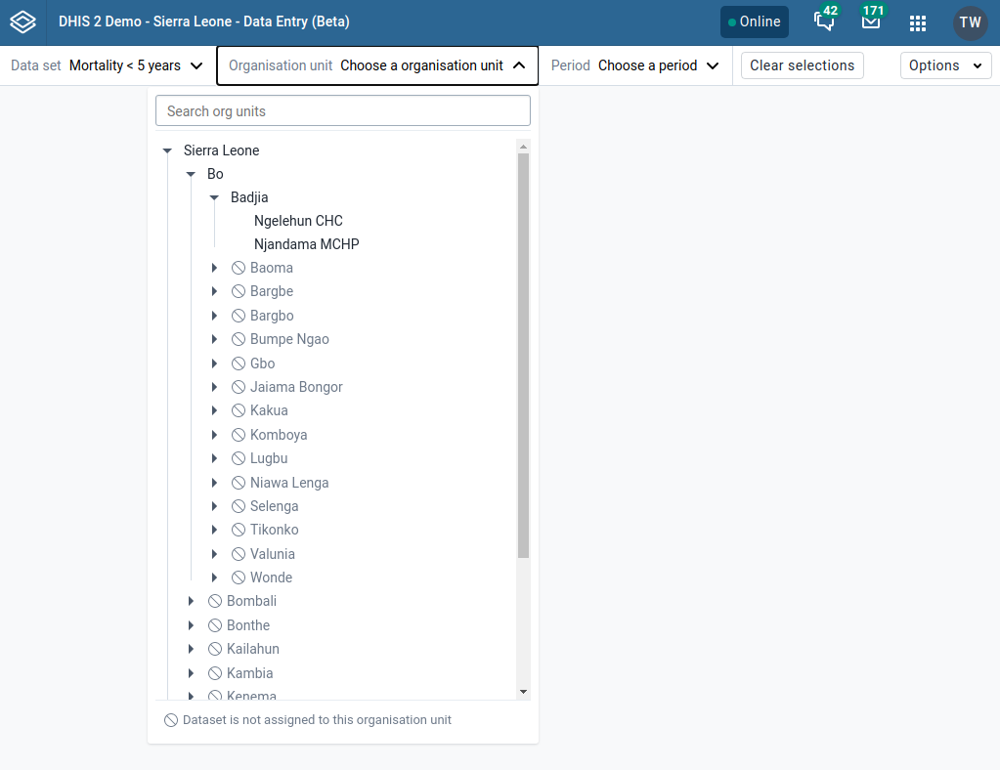

In order to show a form, the following information is required:

1.  Open the **Data Entry** app (beta).

1.  A data set

    As the organisation unit and period depend on the data set, the
    data set has to be chosen first.

1.  An organisation unit

1.  A period
    
    The available periods are controlled by the period type of the data
    set (reporting frequency). You can jump a year back or forward by
    clicking **Prev year** or **Next year**.

1.  Additional selections (dependent on previous choices)

    If there are any other selections available, they’ll be shown as the last
    controls in the top bar. Additional selections depend on the chosen data
    set, organisation unit, and period, so they won’t be shown until those
    first three selections are made. If there aren’t any additional selections,
    the control won’t be shown.

## Enter data in a data entry form { #aggregate_data_entry_app.enter_data_in_data_entry_form } 

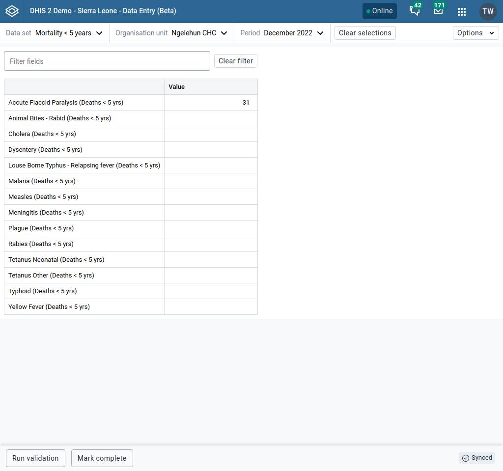

1.  Open the **Data Entry** app (beta).

1.  Select a form (see [Selecting a form](#aggregate_data_entry_app.selecting_a_form))

1.  Enter data in the data entry form.
    
      - A green field with a green triangle in the top right corner means that
        the system has saved the value.
    
      - A grey field with a "not allowed" mouse cursor means that the field is
        disabled and you cannot enter a value. The keyboard cursor will
        automatically jump to the next open field.
    
      - To move to the next field, press the Tab key or the Down Arrow
        key.
    
      - To move back to the previous field, press Shift+Tab or the Up
        Arrow key.
    
      - If you type in an invalid value, for example a character in a field
        that only accepts numeric values, you will get a tooltip that explains
        the problem and the field will be coloured red until you have corrected
        the value.
    
      - If you have defined a minimum maximum value range for the field and you
        enter a value that is outside this range, you will get a pop-up message
        that says the value is out of range. The field will be coloured red
        until you have corrected the value.

      - When clicking on "Options" and then on "Help", you will see the cell
        reference which contains a legend of the different cell states.

6.  When you have filled in the form, click **Run validation** in the bottom
    left corner in the bottom bar.
    
    All validation rules related to data elements in the current
    data entry form (data set) are then run against the new data. A sidebar
    will open on the right side and display all violations (or none).
    
    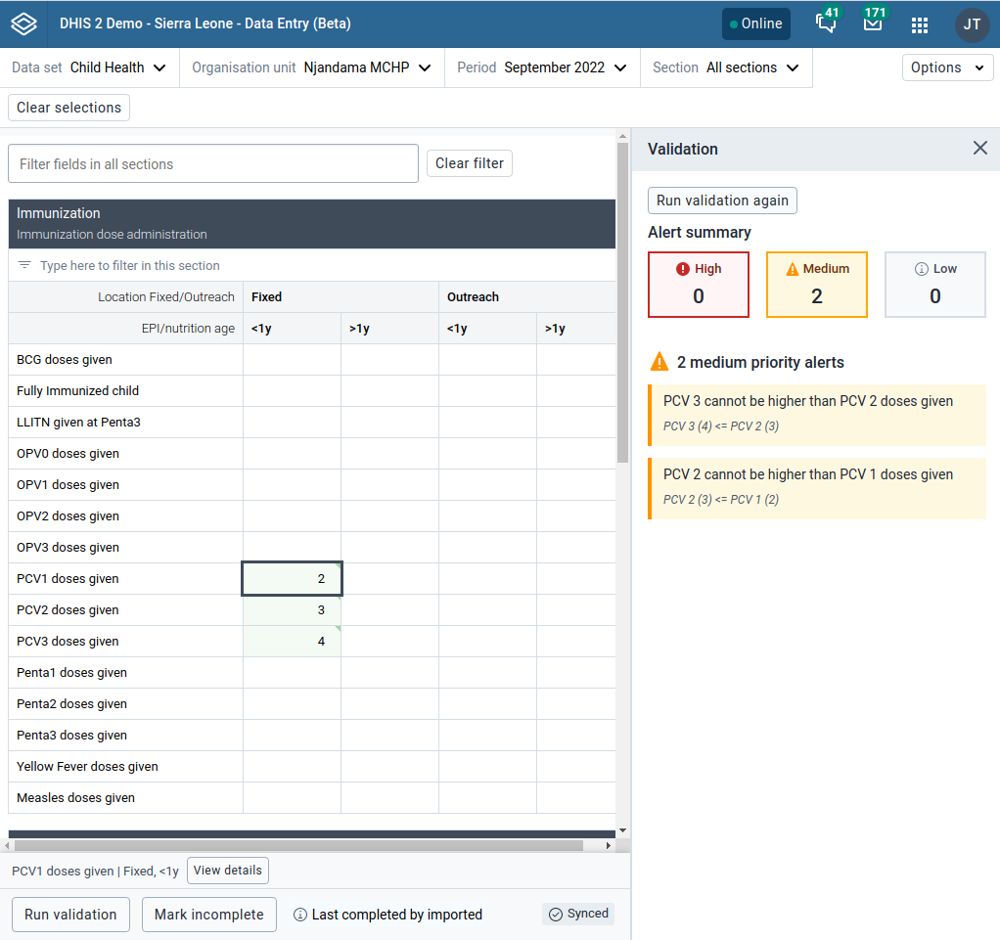

7.  (Optional) Correct validation violations.
    
    > **Note**
    > 
    > Zero (0) will delete the value if the data element has been
    > configured to not store zeros.

8.  When you have corrected errors and you have finished entering data for the entire form, click
    **Complete**.

    Passing validation is not required when completing a form unless the data
    set has the following checkbox checked: "Complete allowed only if
    validation passes"
    
    The system uses this information when generating completeness
    reports for district, county, province or the national level.

## Edit data values in a completed data entry form { #aggregate_data_entry_app.edit_data_value_in_completed_form } 

A completed form is not locked and can therefore be edited like a non-completed
form.

## View a data value's details { #aggregate_data_entry_app.view_a_data_values_details }

Each field in a form (a particular data value) can have additional information:

*   Basic information (description, code, data element ID, category option
    combo ID & last time changed, whether the data value has been marked for
    follow-up or not)

*   A comment

*   Min (minimum) and max (maximum) limits

*   History

*   Audit log

This information can be viewed by opening the details for a particular field.

1.  Open the **Data Entry** app (beta).

1.  Open an existing data entry form.

1.  Focus on a field.

1.  Open the details sidebar (by clicking Ctrl+Enter, Cmd+Enter, double
    clicking the field or clicking the "Show details" button in the bottom bar)

## Mark and unmark a data value for follow-up { #aggregate_data_entry_app.mark_and_unmark_data_for_followup_in_data_entry_form } 

If you for example have a suspicious value that you need to investigate
further, you can keep it the system, but mark it for follow-up. In the
**Data Quality** app you can then run a follow-up analysis to view and
correct all marked values.

1.  Open the **Data Entry** app (beta).

1.  Open an existing data entry form.

1.  Open the data value's details

1.  Click on the "Mark for follow-up" (or "Unmark for follow-up") button

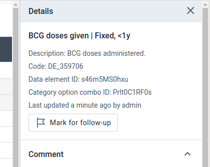

## Edit a data value's comment { #aggregate_data_entry_app.edit_a_data_values_comment } 

1.  In the **Data Entry** app (beta), open a data entry form.

1.  Open the data value's details for which you want to set the minimum maximum
    value range.

1.  Click on "Add comment"

    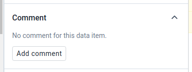

3.  Enter the comment

4.  Click **Save**.

    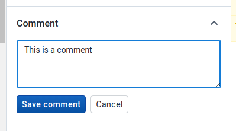

## Create minimum maximum value range manually { #aggregate_data_entry_app.change_min_max_range_manually } 

1.  In the **Data Entry** app (beta), open a data entry form.

1.  Open the data value's details for which you want to set the minimum maximum
    value range.

1.  Click on "Add limits"

    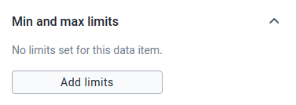

3.  Enter **Min limit** and **Max limit**.

4.  Click **Save**.

    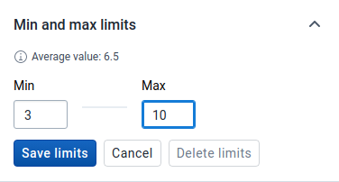
    
    If values don't fall within the new value range the next time you enter
    data, the data entry cell will appear with a red background.

    > **Note**
    >
    > Only users with the relevant privileges are able to edit the value ranges.
    
## Display a data value's history { #aggregate_data_entry_app.display_data_value_history } 

You can display the last 12 values registered for a field.

1.  Open the **Data Entry** app (beta).

1.  Open an existing data entry form.

1.  Open the data value's details

4.  Click **History**.

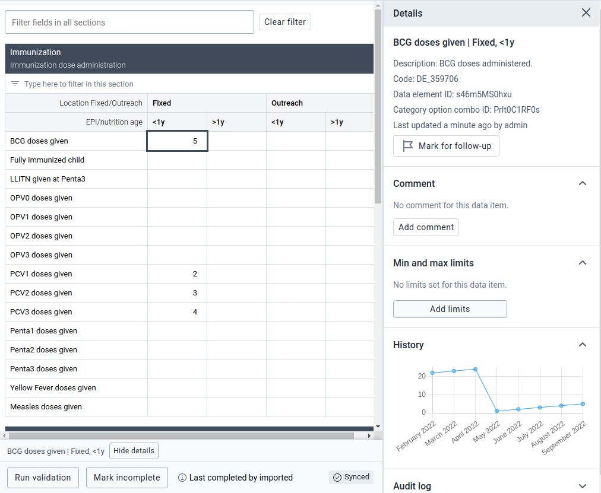

## Display a data value's audit log { #aggregate_data_entry_app.display_data_value_audit_log } 

The audit log allows you to view other data values which have been entered
prior to the current value. The audit trail also shows when the data value was
altered and which user made the changes.

1.  Open the **Data Entry** app (beta).

1.  Open an existing data entry form.

1.  Open the data value's details

4.  Click **Audit log**.

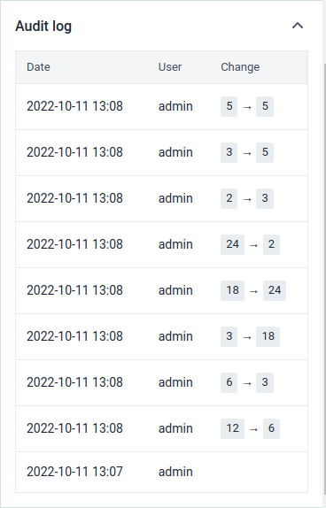

## Enter data offline { #aggregate_data_entry_app.enter_data_offline } 

The **Data Entry** app (beta) works even if you don't have a stable Internet
connection during data entry. When you don't have an internet
connection, the data you enter is saved to your local computer. When the
Internet connection is back, the app will push the data to the server.

> **Note**
> 
> To use this functionality, you must login to the server while you have
> an Internet connection.

-   When you're connected to the Internet, the app displays this message
    at the top of the data entry form:
    
    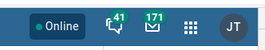

-   If your Internet connection breaks during data entry, the app
    detects it and displays this message:
    
    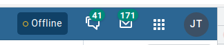
    
    Now your data will be stored locally. You can continue to enter data
    as normal.

-   Once you have entered data and the app detects that the Internet connection
    is back, the data will be sent automatically:

## Multi-organisation unit data entry { #aggregate_data_entry_app.data_entry_multiple_organisation_units } 

The **Data Entry** app (beta) currently does not support multi-organisation
units!

## See also { #aggregate_data_entry_app.data_entry_app_see_also } 

  - [Manage data sets and data entry
    forms](#manage_data_set)
    
  - [Control data
    quality](#control_data_quality)

