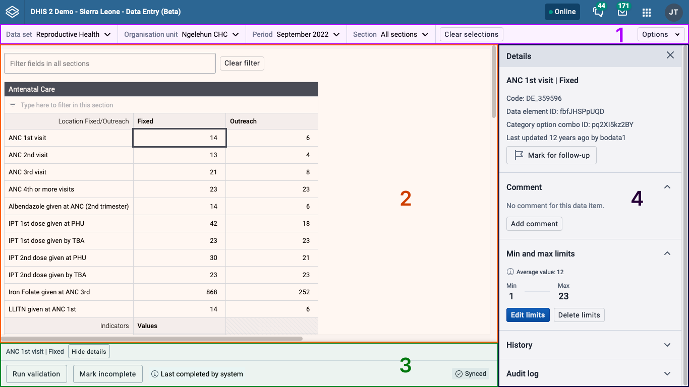

# Data Entry app

## About the Data Entry app { #aggregate_data_entry_app.about }

The Data Entry app is used to enter aggregate data in DHIS2. Aggregate data is collected at a group level and doesn't belong to any one individual. Looking to enter individual-level data? Check out the [Tracker Capture app](#tracker_capture_app).   

## What makes a data entry form? { #aggregate_data_entry_app.what_makes_a_form }

Data entry forms are filled in for a specific context, which is made up of the following choices:
1. **Data set** is a collection of data elements that represent the data you want to collect.
2. **Organisation unit** is where the data is being registered, which is often a location like a clinic, hospital, or classroom.
3. **Period** is when the data is from.
4. **Additional selections** are shown for some data entry forms and help to collect data into meaningful groups.

## Get to know the app { #aggregate_data_entry_app.get_to_know }

The Data Entry app is made up of a few different sections:

1. **Top bar:** the top bar is where you choose from the different options to open a data entry form. You can always use the top bar to change or reset your choices.
2. **Data workspace**: the data workspace is where you work with a data entry form.
3. **Bottom bar**: the bottom bar offers actions and more information about the form you're working on.
4. **Details sidebar**: the details sidebar is where you can see more information about data values and see validation results. The details sidebar can be opened and closed as you work and is closed by default.

## Working with a data entry form { #aggregate_data_entry_app.working_with_a_form }

### Opening a form { #aggregate_data_entry_app.opening_a_form }

To get started with data entry, you need to open a form. Choose  the form you want to open using the top bar:
1. **Choose a data set** from the first control in the top bar. The dropdown menu shows the data sets that you have access to. The data set determines what other choices are available, so you have to choose a data set first.
2. **Choose an organisation unit** from the second control in the top bar. You can search for an organisation unit or browse the tree hierarchy.
3. **Choose a period** from the third control in the top bar. The dropdown menu shows the periods set up for the chosen data set. Choose from different years by clicking the left and right arrow buttons.
4. **Make additional selections**, if applicable. If there are any other selections available, they will be shown as the last controls in the top bar. Additional selections depend on the chosen data set, organisation unit, and period, so they won't be shown until those first three choices are made. If there aren't any additional selections then extra controls won't be shown.

After you've made the selections in the top bar, the data entry form will open in the data workspace. If there's a problem opening a form, the data workspace will show an error that explains the problem.

### Entering data { #aggregate_data_entry_app.entering_data }

Once you've opened a form, you can start entering data into the form cells. The active cell, the cell that you're entering data into, is always highlighted with a blue border. To work quickly, you can move around using your keyboard:
- to move on to the next cell, press ++tab++ or ++arrow-down++.
- to go back to the previous cell, press ++shift+tab++ or ++arrow-up++.

#### Cell status { #aggregate_data_entry_app.cell_status }
Cells look different depending on what their status is:

| Cell    | Status                                                                                                                                           |
| ------- | ------------------------------------------------------------------------------------------------------------------------------------------------ |
|   | Showing a value that's already saved or a cell that's empty.                                                                                            |
|    | The cell value is saved on the server.                                                                                                                |
|  | The cell value is saved locally and is syncing, or waiting to sync, to the server.                                                                                              |
|      | There's a problem with the cell value. Click or hover over the cell to learn more about the problem. These invalid values are not saved to the server or locally. |
|  | The value has a comment.                                                                                                                         |
|   | The cell is locked and the value can't be edited.                                                                                                                                                 |

### Filtering a form { #aggregate_data_entry_app.filtering }
Filtering is useful if you're looking for a certain cell in a form. You can filter the whole form, filter single sections, or both. Any cells that don't match the filter will be hidden.

#### Filtering the whole form form { #aggregate_data_entry_app.filtering_whole_form }

{ width=60% }

To filter the whole data entry form, enter a value into the input at the top of the form.

#### Filtering a section { #aggregate_data_entry_app.filtering_section }

{ width=60% }

For section forms you can also filter inside a single section. Enter a value into the input at the top of a section.

### Validation { #aggregate_data_entry_app.validation }
When you're done entering data you can run validation on the data values. Validation checks the values against rules set up by your DHIS2 instance. 

To run validation, click the *Run validation* button in the bottom bar. 

{ width=60% }

The validation results are shown in the details sidebar, grouped into high, medium, and low priority results. Once you've fixed validation issues, click the *Run validation again* button to recheck data values.

 

### Completing a form { #aggregate_data_entry_app.completing }

After entering data and running validation, the last step is completing a form. Completing a form means that all the intended data has been entered and empty cells are intentionally left empty. Mark a form as complete by clicking the *Mark complete* button in the bottom bar.

{ width=60% }

If a form is complete but shouldn't be, you can mark it as incomplete by clicking the *Mark incomplete* button in the bottom bar.

### Doing more with data values { #aggregate_data_entry_app.doing_more_with_data_values }

The basic data entry functionality is covered above, but the Data Entry app offers more actions and information. These actions and information are found in the data details sidebar that's shown on the right of the data workspace.

 

#### Opening the data details sidebar { #aggregate_data_entry_app.opening_data_details_sidebar }

There are different ways to open the data details sidebar:
- **Click the *View details* button**. With a data entry cell selected, you can click the *View details* button in the bottom bar.
- **Use the ++ctrl+enter++ or ++cmd+enter++ keyboard shortcut**. With a data entry cell selected, use one of these keyboard shortcuts.

The data details sidebar will stay open until you close it so that you can keep it open for reference as you work through a data entry form.

#### Mark data values for follow-up { #aggregate_data_entry_app.mark_followup }

Marking data values for follow-up can be a useful way of highlighting suspicious or odd values that need to be investigated. Data values marked for follow-up will still be saved, but they will be highlighted in the **Data Quality** app for further investigation or analysis.

To mark a data value for follow-up, [make sure the data details sidebar is open](#aggregate_data_entry_app.opening_data_details_sidebar), then click the *Mark for follow-up* button in the top section.

{ width=60% }

To unmark a data value, click the *Unmark for follow-up* button.

{ width=60% }

#### Comment on a data value { #aggregate_data_entry_app.comments }

You can add a comment to any data value. Comments can be useful to add more information about a value, like noting reasons why a value is unusually high or out of the normal range.

To add a comment to a data value, [make sure the data details sidebar is open](#aggregate_data_entry_app.opening_data_details_sidebar), then click the *Add comment* button in the *Comment* section.

{ width=50% }

Once you've written a comment, click the *Save comment* button.

If a data value already has a comment, you can edit it by clicking the *Edit comment* button below the comment.

{ width=50% }

#### Minimum and maximum limits { #aggregate_data_entry_app.limits}

A data value can have a minimum and maximum limit. These limits won't allow someone to enter values outside of the minimum or maximum. 

To add limits to a data value, [make sure the data details sidebar is open](#aggregate_data_entry_app.opening_data_details_sidebar), then click the *Add limits* button in the *Min and max limits* section. If possible, an average value will be shown to help you create reasonable limits.

{ width=50% }

Once you've added a minimum and maximum limit, click the *Save limits* button.

If a data value already has limits set up, you can change them or remove them. To change the limits, click the *Edit limits* button. To remove the limits, click the *Delete limits* button.

{ width=50% }

> **Caution**
>
> Adding, changing, or removing limits requires the correct user privileges. When limits are applied to a data value, the same limits apply for everyone using same data set.

#### Historical data { #aggregate_data_entry_app.history }

To learn more about a data value, you can see the last twelve values in the *History* section of the data details sidebar. [Make sure the data details sidebar is open](#aggregate_data_entry_app.opening_data_details_sidebar), then open the *History* section

{ width=60% }

When working through a data entry form, the *History* section is closed by default to prevent too much network data from being sent for every value.

#### Audit log { #aggregate_data_entry_app.audit_log}

Every data entry cell has an audit log that shows when values were changed and who changed them. To see the audit log, [make sure the data details sidebar is open](#aggregate_data_entry_app.opening_data_details_sidebar), then open the *Audit log* section.

<!-- todo: add image when bug fixes merged -->

When working through a data entry form, the *Audit log* section is closed by default to prevent too much network data from being sent for every value.

### Printing { #aggregate_data_entry_app.printing }

To print a data entry form, click the *Options* button in the top bar. From the dropdown menu, you can choose to print the form including cell data values, or an empty form.

{ width=80% }

## Working offline { #aggregate_data_entry_app.working_offline }

You don't need to be connected to the internet or DHIS2 server to enter data. Data entered into forms while you are offline is saved to your local computer. When you reconnect to the internet/server your locally saved data automatically syncs with your DHIS2 server.

To work offline, you need to open the Data Entry app while you are connected to the internet so the data entry forms can be downloaded and stored on your local computer. Downloading of forms happens automatically in the background.

The badge in the header bar at the top of the screen shows your connection status. If you are not connected to the internet or DHIS2 server, the badge shows *offline*. As well as the offline badge, forms cells you enter data will show the *waiting to sync* status.

{ width=60% }

> **Note**
>
> Some features aren't available when offline because they need contact with a DHIS2 server to work.  
> Validation, data value history, and data value audit logs aren't available offline.

## Features not supported in the beta version { #aggregate_data_entry_app.unsupported_features }

The **Data Entry app** is constantly evolving and new features are being added. There are some features that the previous Data Entry app offered that are supported yet:
- **Custom forms** don't support CSS/JS yet. We are currently examining the different ways custom forms are used in order to build a more sustainable, flexible solution.
- **Multi-organisation unit entry** isn't supported.

## Related information { #aggregate_data_entry_app.related_info }

- [Control data quality](#control_data_quality)
- [Manage data sets and data entry forms](#manage_data_set)
- [Using the Maintenance app](#maintenance_app)
