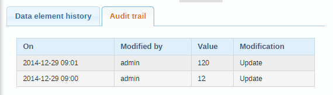

# Using the Data Entry app { #data_entry_app } 

## About the Data Entry app { #about_data_entry_app } 

The **Data Entry** app is where you manually enter aggregated data in
DHIS2. You register data for an organisation unit, a period, and a set
of data elements (data set) at a time. A data set often corresponds to a
paper-based data collection tool. You configure the data sets in the
**Maintenance** app.

> **Note**
> 
> If a data set has both a section form and a custom form, the system
> displays the custom form during data entry. Users who enter data can't
> select which form they want to use. In web-based data entry the order
> of display preference is:
> 
> 1.  Custom form (if it exists)
> 
> 2.  Section form (if it exists)
> 
> 3.  Default form
> 
> Mobile devices do not support custom forms. In mobile-based data entry
> the order of display preference is:
> 
> 1.  Section form (if it exists)
> 
> 2.  Default form

When you close an organisation unit, you can't register or edit data to
this organisation unit in the **Data Entry** app.

## Enter data in a data entry form { #enter_data_in_data_entry_form } 

1.  Open the **Data Entry** app.

2.  In the organisation unit tree to the left, select an organisation
    unit.

3.  Select a **Data set**.

4.  Select a **Period**.
    
    The available periods are controlled by the period type of the data
    set (reporting frequency). You can jump a year back or forward by
    clicking **Prev year** or **Next year**.
    
    > **Note**
    > 
    > Depending on how you've configured the data entry form, you might
    > have to enter additional information before you can open the date
    > entry form. This can for example be a project derived from a
    > category combination.

5.  Enter data in the data entry form.
    
      - A green field means that the system has saved the value.
    
      - A grey field means that the field is disabled and you can't
        enter a value. The cursor will automatically jump to the next
        open field.
    
      - To move to the next field, press the Tab key or the Down Arrow
        key.
    
      - To move back to the previous field, press Shift+Tab or the Up
        Arrow key.
    
      - If you type in an invalid value, for example a character in a
        field that only accepts numeric values, you'll get a pop-up that
        explains the problem and the field will be coloured yellow (not
        saved) until you have corrected the value.
    
      - If you have defined a minimum maximum value range for the field
        and you enter a value that is outside this range, you'll get a
        pop-up message that says the value is out of range. The value
        remains unsaved until you've changed the value or updated the
        value range and then re-entered the value.

6.  When you've filled in the form, click **Run validation** in the top
    right corner or below the data entry form.
    
    All validation rules which involves data elements in the current
    data entry form (data set) are then run against the new data. If
    there are no violations of the validation rules, you'll see a
    message saying *The data entry screen successfully passed
    validation*. If there are validation violations, they will be
    presented in a list.
    
    

7.  (Optional) Correct validation violations.
    
    > **Note**
    > 
    > Zero (0) will delete the value if the data element has been
    > configured to not store zeros.

8.  When you've corrected errors and you're done with data entry, click
    **Complete**.
    
    The system uses this information when generating completeness
    reports for district, county, province or the national level.

## Mark a data value for follow-up { #mark_data_for_followup_in_data_entry_form } 

If you for example have a suspicious value that you need to investigate
further, you can keep it the system, but mark it for follow-up. In the
**Data Quality** app you can then run a follow-up analysis to view and
correct all marked values.

1.  Open the **Data Entry** app.

2.  Open an existing data entry form.

3.  Double-click the field with the value you want to mark for
    follow-up.

4.  Click the star icon.

## Edit data values in a completed data entry form { #edit_data_value_in_completed_form } 

1.  Open the **Data Entry** app.

2.  Open an existing data entry form.

3.  Click **Incomplete**.

4.  Change the relevant data values.
    
    > **Note**
    > 
    > Zero (0) will delete the value if the data element has been
    > configured to not store zeros,

5.  Click **Complete**.

## Display a data value's history { #display_data_value_history } 

You can display the last 12 values registered for a field.

1.  Open the **Data Entry** app.

2.  Open an existing data entry form.

3.  Double-click the field with the value you want to view the history
    for.

4.  Click **Data element history**.

## Display a data value's audit trail { #display_data_value_audit_trail } 

The audit trail allows you to view other data values which have been
entered prior to the current value. The audit trail also shows when the
data value was altered and which user who made the changes.

1.  Open the **Data Entry** app.

2.  Open an existing data entry form.

3.  Double-click the field with the value you want to view the audit
    trail for.

4.  Click **Audit trail**.

## Create minimum maximum value range manually { #change_min_max_range_manually } 

1.  In the **Data Entry** app, open a data entry form.

2.  Double-click the field for which you want to set the minimum maximum
    value range.

3.  Enter **Min limit** and **Max limit**.

4.  Click **Save**.
    
    If values don't fall within the new value range the next time you
    enter data, the data entry cell will appear with an orange
    background.

5.  (Optional) Type a comment to explain the reason for the discrepancy,
    for example an event at a facility which may have generated a large
    number of clients.

6.  (Optional) Click **Save comment**.

> **Tip**
> 
> Click the star icon to mark the value for further follow-up.

## Enter data offline { #enter_data_offline } 

The **Data Entry** app works even if you don't have a stable Internet
connection during data entry. When you don't have an internet
connection, the data you enter is saved to your local computer. When the
Internet connection is back, the app will push the data to the server.
The total bandwidth usage is reduced since data entry forms no longer
are retrieved from the server for each rendering.

> **Note**
> 
> To use this functionality, you must login to the server while you've
> an Internet connection.

  - When you're connected to the Internet, the app displays this message
    at the top of the data entry form:
    
    

  - If your Internet connection breaks during data entry, the app
    detects it and displays this message:
    
    
    
    Now your data will be stored locally. You can continue to enter data
    as normal.

  - Once you have entered all necessary data and the app detects that
    the Internet connection is back, you'll see this message:
    
    
    
    Click **Upload** to synchronize data with the server.

  - When the data has successfully synchronized with the server, you'll
    see this confirmation
    message:
    
    

## Enable multi-organisation unit data entry { #data_entry_multiple_organisation_units } 

It can be useful to enter data for multiple organisation units in the
same data entry form, for instance if there are few data elements in the
form and a huge number of organisation units in the hierarchy. In that
case, you can enable multi-organisation unit data entry.

> **Note**
> 
> Multi-organisation unit data entry only works for section forms.

1.  Open the **System Settings** app.

2.  Select **Enable multi-organisation unit forms**.

3.  In the **Data Entry** app, select the organisation unit immediately
    above the organisation unit you want to enter data for in the
    organisation unit hierarchy.
    
    Data elements will appear as columns and organisation units as rows
    in the form.
    
    > **Note**
    > 
    > The data entry forms should still be assigned to the facilities
    > that you actually enter data for, that is the organisation units
    > now appearing in the form.

## See also { #data_entry_app_see_also } 

  - [Control data quality](#control_data_quality)

  - [Manage data sets and data entry forms](#manage_data_set)

  - [Using the Maintenance app](#maintenance_app)

