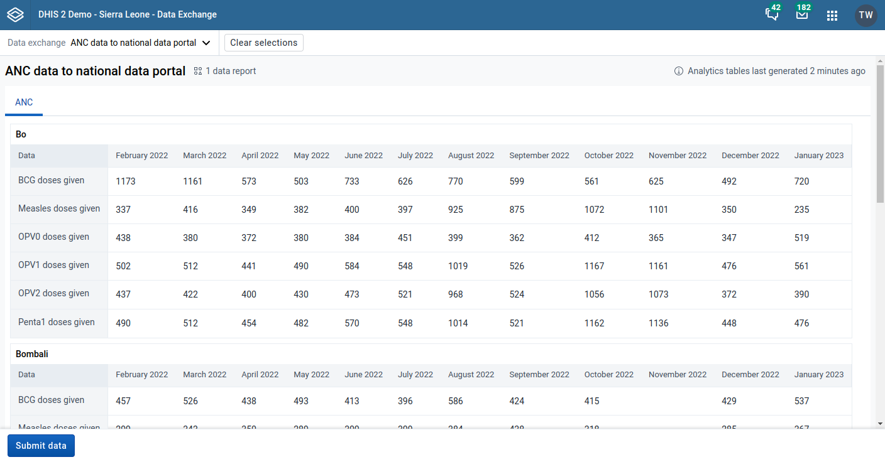
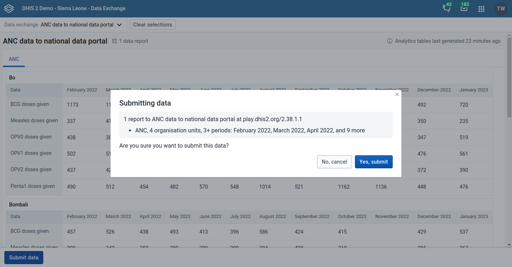
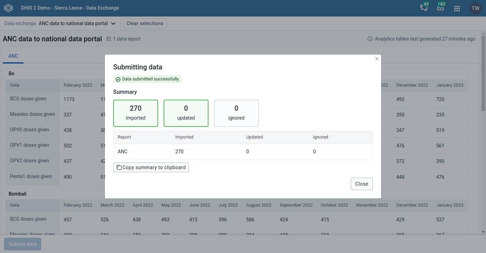

# Using the Data Exchange app { #using_data_exchange }

## About the Data Exchange app { #about_data_exchange }

The data exchange app allows for exchanging data between the DHIS 2 instance where the app is installed and a target instance of DHIS 2, or other software that are capable of importing the DHIS 2 data value set format. Data can also be exchanged within a DHIS 2 instance, for instance for aggregation of tracker data and saving the result as aggregate data.

To exchange data, one or many _aggregate data exchanges_ must be configured in the system. A data exchange defines the data elements, indicators, periods and organisation units to exchange data with the target instance. Please consult the _Aggregate data exchange_ section in the _Data exchange_ chapter in the Developer guide for a detailed explanation.

## Overview

The Data Exchange app offers different sections:

1. **Data exchange selection:** The data exchange drop-down menu in the top bar allows for selecting the data exchange.
2. **Data preview:** The data preview section will display the data to be exchanged with the target instance.
3. **Submit data:** Clicking the **Submit data** button will exchange data defined by the currently selected data exchange.

## Exchanging data

To get started with data exchange:

1. Select a data exchange from the data exchange drop-down.
2. Preview the data to ensure accuracy and quality.
3. Click **Submit data**. This will bring up the confirmation dialog.
4. Inspect the parameters for which to submit data and click **Yes, submit**. This will bring up a submission summary.
5. Inspect the submission summary, and click **Close**.

The submission summary indicates the outcome, i.e. whether the operation was a success or failure, and how many data values were imported, updated and ignored as part of the data exchange.

