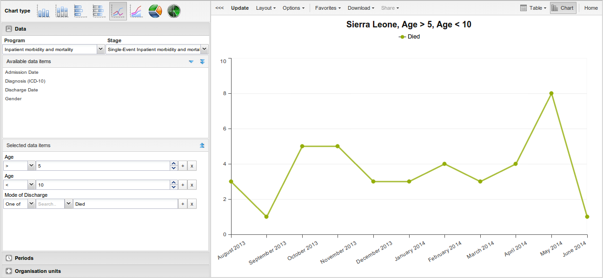

# Using the Event Visualizer app { #event_visualizer_app } 

## About the Event Visualizer app

With the **Event Visualizer** app, you can create charts based on event
data.

## Create a chart

1.  Open the **Event Visualizer** app and select a chart type.

2.  In the menu to the left, select the meta data you want to analyse.

3.  Click **Layout** and arrange the dimensions.
    
    You can keep the default selection if you want.

4.  Click **Update**.

## Select a chart type

The **Event Visualizer** app has eight different chart types, each with
different characteristics. To select a chart type:

1.  In **Chart type**, click the chart type you need.
    
    

    Table: Chart types

    | Chart type | Description |
    |---|---|
    | Column chart | Displays information as vertical rectangular columns with lengths proportional to the values they represent.       Useful when you want to, for example, compare performance of different districts. |
    | Stacked column chart | Displays information as vertical rectangular columns, where bars representing multiple categories are stacked on top of each other.       Useful when you want to, for example, display trends or sums of related data elements. |
    | Bar chart | Same as column chart, only with horizontal bars. |
    | Stacked bar chart | Same as stacked column chart, only with horizontal bars. |
    | Line chart | Displays information as a series of points connected by straight lines. Also referred to as time series.       Useful when you want to, for example, visualize trends in indicator data over multiple time periods. |
    | Area chart | Is based on line chart, with the space between the axis and the line filled with colors and the lines stacked on top of each other.       Useful when you want to compare the trends of related indicators. |
    | Pie chart | Circular chart divided into sectors (or slices).       Useful when you want to, for example, visualize the proportion of data for individual data elements compared to the total sum of all data elements in the chart. |
    | Radar chart | Displays data on axes starting from the same point. Also known as spider chart. |

2.  Click **Update**.

## Select dimension items { #event_visualizer_select_dimensions } 

An event chart is always based on a program and you can do analysis
based on a range of dimensions. For programs with category combinations,
you can use program categories and category option group sets as
dimensions for tables and charts. Each dimension item can have a
corresponding filter. You select dimension items from the left-side
menu.

1.  Select data elements:
    
    1.  Click **Data**.
    
    2.  Select a program and a program stage.
        
        The data elements associated with the selected program are
        listed under **Available**. Each data element acts as a
        dimension.
    
    3.  Select the data elements you need by double-clicking their
        names.
        
        Data elements can be filtered by type (Data elements, Program
        attributes, Program indicators) and are prefixed to make them
        easily recognizable.
        
        After selecting a data element, it is visible under **Selected
        data items**.
    
    4.  (Optional) For each data element, specify a filter with
        operators such as "greater than", "in" or "equal" together with
        a filter value.

2.  Select periods.
    
    1.  Click **Periods**.
    
    2.  Select one or several periods.
        
        You have three period options: relative periods, fixed periods
        and start/end dates. You can combine fixed periods and relative
        periods in the same chart. You cannot combine fixed periods and
        relative periods with start/end dates in the same chart.
        Overlapping periods are filtered so that they only appear once.
        
          - Fixed periods: In the **Select period type** box, select a
            period type. You can select any number of fixed periods from
            any period type. Fixed periods can for example be "January
            2014".
        
          - Relative periods: In the lower part of the **Periods**
            section, select as many relative periods as you like. The
            names are relative to the current date. This means that if
            the current month is March and you select **Last month**,
            the month of February is included in the chart. Relative
            periods has the advantage that it keeps the data in the
            report up to date as time goes.
        
          - Start/end dates: In the list under the **Periods** tab,
            select **Start/end dates**. This period type lets you
            specify flexible dates for the time span in the report.

3.  Select organisation units.
    
    1.  Click **Organisation units**.
    
    2.  Click the gearbox icon.
    
    3.  Select a **Selection mode** and an organisation unit.
        
        There are three different selection modes:
        
        

        Table: Selection modes

        | Selection mode | Description |
        |---|---|
        | **Select organisation units** | Lets you select the organisation units you want to appear in the chart from the organization tree.           Select **User org unit** to disable the organisation unit tree and only select the organisation unit that is related to your profile.           Select **User sub-units** to disable the organisation unit tree and only select the sub-units of the organisation unit that is related to your profile.           Select **User sub-x2-units** to disable the organisation unit tree and only select organisation units two levels down from the organisation unit that is related to your profile.           This functionality is useful for administrators to create a meaningful "system" favorite. With this option checked all users find their respective organisation unit when they open the favorite. |
        | **Select levels** | Lets you select all organisation units at one or more levels, for example national or district level.           You can also select the parent organisation unit in the tree, which makes it easy to select for example, all facilities inside one or more districts. |
        | **Select groups** | Lets you select all organisation units inside one or several groups and parent organisation units at the same time, for example hospitals or chiefdoms. |

4.  Click **Update**.

## Select series, category and filter

You can define which data dimension you want to appear as series,
category and filter. Each data element appears as individual dimensions
and can be placed on any of the axes. Series and category panels can
only have one dimension at the time.

> **Note**
> 
> Data elements of continuous value types (real numbers/decimal numbers)
> can only be used as filters, and will automatically be positioned as
> filters in the layout dialog. The reason for this is that continuous
> number cannot be grouped into sensible ranges and used on columns and
> rows.

1.  Click **Layout**.

2.  Drag and drop the dimensions to the appropriate space. Only one
    dimension can be in each section.

3.  Click **Update**.

## Change the display of your chart { #event_visualizer_change_display } 

You can customize the display of an event report.

1.  Click **Options**.

2.  Set the options as required.
    
    

    Table: Chart options

    | Option | Description ||
    |---|---|---|
    | **Data** | **Show values** | Displays values as numbers on top of each series. |
    || **Use 100% stacked values** | Displays 100 % stacked values in column charts. |
    || **Use cumulative values** | Displays cumulative values in line charts. |
    || **Hide n/a data** | Hides data tagged as N/A from the chart. |
    || **Include only completed events** | Includes only completed events in the aggregation process. This is useful when you want for example to exclude partial events in indicator calculations. |
    || **Hide empty categories** | Hides the category items with no data from the chart.       **None**: doesn't hide any of the empty categories       **Before first**: hides missing values only before the first value       **After last**: hides missing values only after the last value       **Before first and after last**: hides missing values only before the first value and after the last value       **All**: hides all missing values       This is useful for example when you create column and bar charts. |
    || **Trend line** | Displays the trend line which visualizes how your data evolves over time. For example if performance is improving or deteriorating. Useful when periods are selected as category. |
    || **Target line value/title** | Displays a horizontal line and title (optional) at the given domain value. Useful for example when you want to compare your performance to the current target. |
    || **Base line value/title** | Displays a horizontal line and title (optional) at the given domain value. Useful for example when you want to visualize how your performance has evolved since the beginning of a process. |
    || **Sort order** | Allows you to sort the values on your chart from either low to high or high to low. |
    || **Output type** | Defines the output type. The output types are **Event**, **Enrollment** and**Tracked entity instance**. |
    || **Program status** | Filters data based on the program status: **All**, **Active**, **Completed** or **Cancelled**. |
    || **Event status** | Filters data based on the event status: **All**, **Active**, **Completed**, **Scheduled**, **Overdue** or **Skipped**. |
    | **Axes** | **Range axis min/max** | Defines the maximum and minimum value which will be visible on the range axis. |
    || **Range axis tick steps** | Defines the number of ticks which will be visible on the range axis. |
    || **Range axis decimals** | Defines the number of decimals which will be used for range axis values. |
    || **Range axis title** | Type a title here to display a label next to the range axis (also referred to as the Y axis). Useful when you want to give context information to the chart, for example about the unit of measure. |
    || **Domain axis title** | Type a title here to display a label below the domain axis (also referred to as the X axis). Useful when you want to give context information to the chart, for example about the period type. |
    | **General** | **Hide chart legend** | Hides the legend and leaves more room for the chart itself. |
    || **Hide chart title** | Hides the title (default or custom) of your chart. |
    || **Chart title** | Type a title here to display a custom title above the chart. If you don't enter a title, the default title is displayed. |
    || **Hide chart subtitle** | Hides the subtitle of your chart. |
    || **Chart subtitle** | Type a subtitle here to display a custom subtitle above the chart but below the title. If you don't enter a subtitle, no subtitle is displayed in the chart. |

3.  Click **Update**.

## Download a chart as an image or a PDF

After you have created a chart you can download it to your local
computer as an image or PDF file.

1.  Click **Download**.

2.  Under **Graphics**, click **PNG (.png)** or **PDF (.pdf)**.
    
    The file is automatically downloaded to your computer. Now you can
    for example embed the image file into a text document as part of a
    report.

## Download chart data source

You can download the data source behind a chart in HTML, JSON, XML,
Microsoft Excel or CSV formats. The data document uses identifiers of
the dimension items and opens in a new browser window to display the URL
of the request to the Web API in the address bar. This is useful for
developers of apps and other client modules based on the DHIS2 Web API
or for those who require a plan data source, for instance for import
into statistical packages.

To download plain data source formats:

1.  Click **Download**.

2.  Under **Plain data source**, click the format you want to download.
    
    

    Table: Available formats

    | Format | Description |
    |---|---|
    | HTML | Creates HTML table based on selected meta data |
    | JSON | Downloads data values in JSON format based on selected meta data |
    | XML | Downloads data values in XML format based on selected meta data |
    | Microsoft Excel | Downloads data values in Microsoft Excel format based on selected meta data |
    | CSV | Downloads data values in CSV format based on selected meta data |

## Manage favorites

Saving your charts or pivot tables as favorites makes it easy to find
them later. You can also choose to share them with other users as an
interpretation or display them on the dashboard.

You view the details and interpretations of your favorites in the
**Pivot Table**, **Data Visualizer**, **Event Visualizer**, **Event
Reports** apps. Use the **Favorites** menu to manage your favorites.

### Open a favorite

1.  Click **Favorites** \> **Open**.

2.  Enter the name of a favorite in the search field, or click **Prev**
    and **Next** to display favorites.

3.  Click the name of the favorite you want to open.

### Save a favorite

1.  Click **Favorites** \> **Save as**.

2.  Enter a **Name** and a **Description** for your favorite. The description field supports a rich text format, see the interpretations section for more details.

3.  Click **Save**.

### Rename a favorite

1.  Click **Favorites** \> **Rename**.

2.  Enter the new name for your favorite.

3.  Click **Update**.

### Write an interpretation for a favorite

An interpretation is a link to a resource with a description of the data
at a given period. This information is visible in the **Dashboard** app.
To create an interpretation, you first need to create a favorite. If
you've shared your favorite with other people, the interpretation you
write is visible to those people.

1.  Click **Favorites** \> **Write interpretation**.

2.  In the text field, type a comment, question or interpretation. You
    can also mention other users with '@username'. Start by typing '@'
    plus the first letters of the username or real name and a mentioning
    bar will display the available users. Mentioned users will receive
    an internal DHIS2 message with the interpretation or comment. You
    can see the interpretation in the **Dashboard** app.

    It is possible to format the text with **bold**, *italic* by using the
    Markdown style markers \* and \_ for **bold** and *italic* respectively.
    Keyboard shortcuts are also available: Ctrl/Cmd + B and Ctrl/Cmd + I. A
    limited set of smilies is supported and can be used by typing one of the
    following character combinations: :) :-) :( :-( :+1 :-1. URLs are
    automatically detected and converted into a clickable link.

3.  Search for a user group that you want to share your favorite with,
    then click the **+** icon.

4.  Change sharing settings for the user groups you want to modify.
    
      - **Can edit and view**: Everyone can view and edit the object.
    
      - **Can view only**: Everyone can view the object.
    
      - **None**: The public won't have access to the object. This
        setting is only applicable to **Public access**.

5.  Click **Share**.

### Subscribe to a favorite

When you are subscribed to a favorite, you receive internal messages
whenever another user likes/creates/updates an interpretation or
creates/update an interpretation comment of this favorite.

1.  Open a favorite.

2.  Click **\>\>\>** in the top right of the workspace.

3.  Click on the upper-right bell icon to subscribe to this favorite.

### Create a link to a favorite

1.  Click **Favorites** \> **Get link**.

2.  Select one of the following:
    
      - **Open in this app**: You get a URL for the favorite which you
        can share with other users by email or chat.
    
      - **Open in web api**: You get a URL of the API resource. By
        default this is an HTML resource, but you can change the file
        extension to ".json" or ".csv".

### Delete a favorite

1.  Click **Favorites** \> **Delete**.

2.  Click **OK**.

### View interpretations based on relative periods

To view interpretations for relative periods, such as a year ago:

1.  Open a favorite with interpretations.

2.  Click **\>\>\>** in the top right of the workspace.

3.  Click an interpretation. Your chart displays the data and the date
    based on when the interpretation was created.To view other
    interpretations, click them.

## Visualize a chart as a pivot table

When you have made a chart you can open it as a pivot table:

Click **Chart** \> **Open this chart as table**.

