# Using the GIS app { #using_gis } 

## About the GIS app { #about_gis } 

With the GIS app you can overlay multiple layers and choose among
different base maps. You can create thematic maps of areas and points,
view facilities based on classifications, and visualize catchment areas
for each facility. You can add labels to areas and points, and search
and filter using various criteria. You can move points and set locations
on the fly. Maps can be saved as favorites and shared with other people.

> **Note**
>
> To use predefined legends in the **GIS** app, you need to create them
> first in the **Maintenance** app.

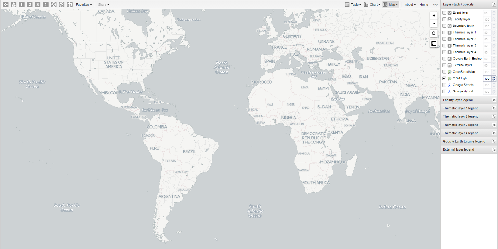

  - The icons in the top left of the workspace represent the map layers.
    They are the starting point of the **GIS** app.

  - The panel on the right side of the workspace shows an overview of
    the layers:

      - The default base map is OSM Light. It's selected by default. If
        you're online you'll also see OpenStreetMap, Google Streets and
        Google Hybrid. You can use these maps as background maps and
        layers. Switch between them by selecting or clearing the
        checkbox.

      - If you want to increase or reduce the opacity of a layer, use
        the up and down arrows for the selected layer.

      - Use the map legends when you create a thematic map. A legend
        explains the link between values and colors on your map.

<!-- end list -->

  - **Zoom to content** automatically adjusts the zoom level and map
    center position to put the data on your map in focus.

  - To view information for an event, simply click the event.

  - Right-click to display the longitude and latitude of the map.

## Create a new thematic map { #using_gis_create_map } 

You use four vector layers to create a thematic map. The workflow for
creating a new thematic map is:

1.  In the **Apps** menu, click **GIS**.

    The **DHIS2 GIS** window opens.

2.  In the top menu, click a layer you want to add to the map.

      - Event layer

      - Facility layer

      - Boundary layer

      - Thematic layer 1 - 4

3.  Click **Edit layer** and select the parameters you need..

4.  Click **Update**.

## Manage event layers { #using_gis_event_layer } 

The event layer displays the geographical location of events registered
in the DHIS2 tracker. Provided that events have associated GPS
coordinates, you can use this layer to drill down from the aggregated
data displayed in the thematic layers to the underlying individual
events or cases.

You can also display aggregated events at the facility or at the
boundary level. You do this through a thematic layer using event data
items. This is useful when you only have the coordinates for the Org
Unit under which the events are recorded.

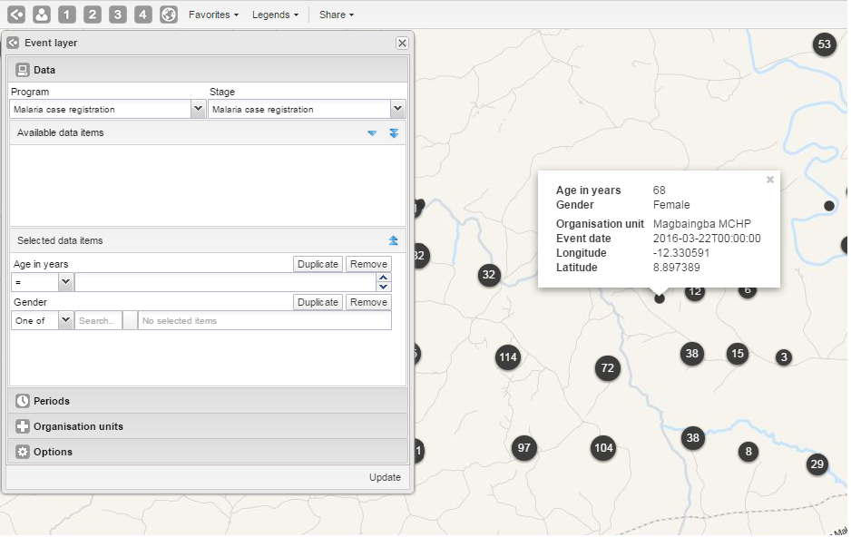

### Create or modify event layer { #gis_create_event_layer } 

1.  In the top menu, click the event layer icon.

2.  Click **Edit layer**.

3.  Select a program and then select a program stage.

    If there is only one stage available for the selected program, the
    stage is automatically selected. A list of data elements and
    attributes will appear in the **Available data items** panel.

4.  Select any data element or attribute from this list as part of your
    query.

      - To select you can either double-click a data element or (multi)
        select and use the single-arrow downward button. The
        double-arrow button will select all data elements in the list.
        All selected data elements will get their own row in the
        **Selected data items**.

      - For data elements of type text you will get two choices:
        **Contains** implies that the query will match all values which
        contains your search value, and **Is exact** implies that only
        values which is completely identical to your search query will
        be returned.

      - For data elements of type option set, you can select any of the
        options from the drop down box by using the down-wards arrow or
        by start typing directly in the box to filter for options.

5.  In the **Periods** section, select the time span for when the events
    took place. You can select either a fixed period or a relative
    period.

      - Fixed period: In the **Period** field, select **Start/end
        dates** and fill in a start date and an end date.

      - Relative period: In the **Period** field, select one of the
        relative periods, for example **This month** or **Last year**.

6.  In the **Organisation units** section, select the organisation units
    you want to include in the query.

7.  In the **Options** section, you can:

      - Select a value from the **Coordinate field** for the positions
        shown on the map. By default, "Event location" is selected.
        Depending on the data elements or attributes that belong to a
        program, other coordinates such as "Household position" are
        available.

        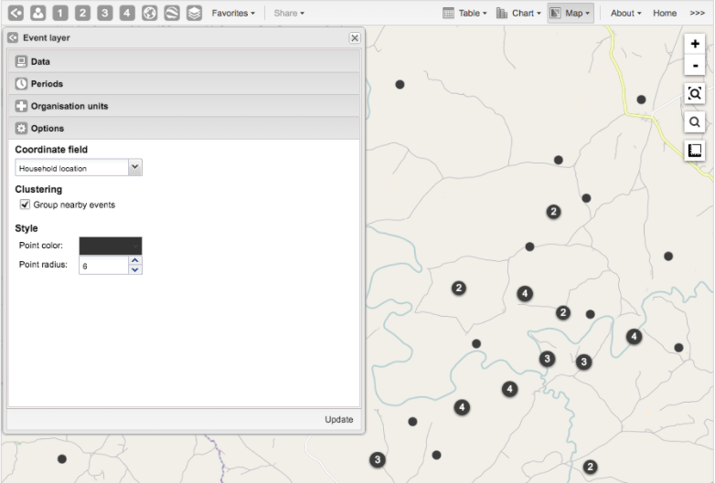

      - Select or clear **Clustering** to group nearby events.

      - Go to **Style** to select a color for the cluster points or
        change the radius of clusters (between 1 and 20).

    **Clustering** if you want to group nearby events and change the
    style of the cluster points.

8.  Click **Update**.

### Turn off cluster

By default events are clustered in a map. You can turn off this function
to display all events separately.

1.  In the top menu, click the event layer icon.

2.  Click **Edit layer**.

3.  Click **Options**.

4.  Clear **Group nearby events** check box.

5.  Click **Update**.

### Modify cluster style

1.  In the top menu, click the event layer icon.

2.  Click **Edit layer**.

3.  In the **Options** section, change the **Point color** and **Point
    radius**.

4.  Click **Update**.

### Modify information in event pop-up windows

For events in a cluster map, you can modify the information displayed in
the event pop-up window.

1.  Open the **Programs / Attributes** app.

2.  Click **Program**.

3.  Click the program you want to modify and select **View program
    stages**.

4.  Click the program stage name and select **Edit**.

5.  Scroll down to the **Selected data elements** section.

6.  For every data element you want to display in the pop-up window,
    select corresponding **Display in reports**.

7.  Click **Update**.

## Clear event layer

To clear all data in a map:

1.  In the top menu, click the event layer icon.

2.  Click **Clear**.

## Manage facility layers { #using_gis_facility_layer } 

The facility layer displays icons that represent types of facilities.
Polygons do not show up on the map, so make sure that you select an
organisation unit level that has facilities.

A polygon is an enclosed area on a map representing a country, a
district or a park. In GIS, a polygon is a shape defined by one or more
rings, where a ring is a path that starts and ends at the same point.

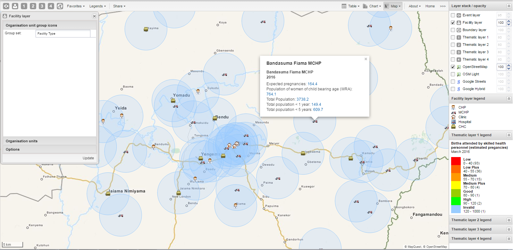

### Create or modify a facility layer

1.  In the top menu, click the facility layer icon.

2.  Click **Edit layer**.

3.  In the **Organisation unit group icons** section, select a **Group
    set**.

4.  In the **Organisation units** section, select one or several
    organisation units.

5.  In the **Options** section, select if you want to show labels and if
    so, how they look.

6.  In the **Options** section, select if you want to display a circle
    with a certain radius around each facility.

7.  Click **Update**.

### Search for an organisation unit

To locate an organisation unit in the map:

1.  In the top menu, click the facility layer icon.

2.  Click **Search**.

    The **Organisation unit search** dialog box opens.

3.  In the text field, type the name of the organisation unit you are
    looking for or click a name in the list.

    The organisation unit is highlighted in the map.

### Clear facility layer

To clear all data in a facility layer:

1.  In the top menu, click the facility layer icon.

2.  Click **Clear**.

## Manage facilities in a layer

You can have facilities in **Facility**, **Boundary** and **Thematic**
layers.

### Relocate a facility

1.  Right-click a facility and click **Relocate**.

2.  Put the cursor in the new location.

    The new coordinate is stored permanently. This cannot be undone.

### Swap longitude and latitude of a facility

1.  Right-click a facility and click **Swap long/lat**.

    This is useful if a user inverted latitude and longitude coordinates
    when creating the organisation unit.

### Display facility information

You can view organisation unit information set by the administrator as
follows:

Table: View organisation unit information

| Function | Action |
|---|---|
| View information for the current period | 1. Click a facility. |
| View information for a selected period | 1. Right-click a facility and click **Show information**.  2. In the **Infrastructural data** section, select a period.            **Note**           You configure the displayed infrastructural data in the **System Settings** app. |

## Manage thematic layers 1- 4 { #using_gis_thematic_layer } 

There are four thematic layers in the GIS app. With these layers panels
you can use your data for thematic mapping. Select your desired
combination of indicator/data element, and period. then the organisation
unit level. If your database has coordinates and aggregated data values
for these organisation units, they will appear on the map.

> **Note**
>
> You must refresh the DHIS2 analytics tables to have aggregated data
> values available.

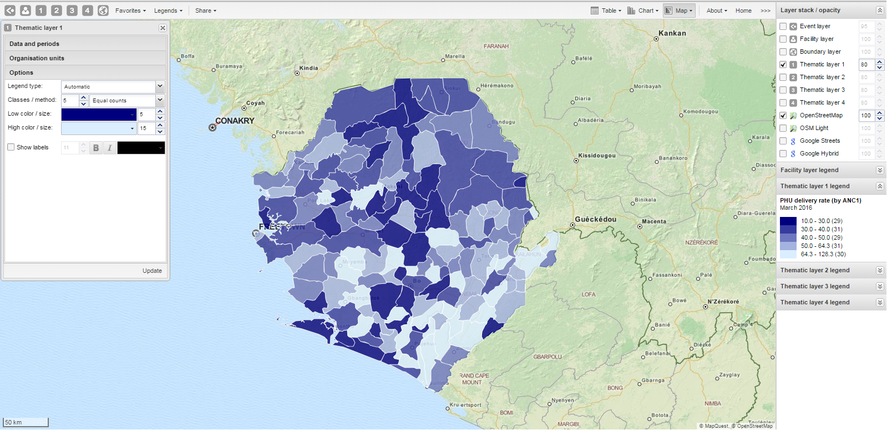

### Create or modify a thematic layer

1.  In the top menu, click the icon of the thematic layer you want to
    create or modify.

2.  Click **Edit layer**.

3.  In the **Data and periods** section, select the data and periods you
    want to display.

4.  In the **Organisation units** section, select one or several
    organisation units.

5.  In the **Options** section, go to **Legend type** and select
    Automatic or Predefined.

      - Automatic legend types means that the application will create a
        legend set for you based on your what method, number of classes,
        low color and high color you select. Method alludes to the size
        of the legend classes.

        Set to Equal intervals they will be “highest map value – lowest
        map value / number of classes”.

        Set to Equal counts the legend creator will try to distribute
        the organisation units evenly.

        The legend appears as an even gradation from the start color to
        the end color.

      - If you have facilities in your thematic layer, you can set the
        radius for maximum and minimum values by changing the values in
        the **Low color / size** and **High color size** boxes.

6.  In the **Options** section, select if you want to show labels and if
    so, how they look.

7.  In the Options panel, select an aggregation type. See also
    [Aggregation
    operators](https://dhis2.github.io/dhis2-docs/master/en/user/html/ch10s05.html#d0e8082).

8.  Click **Update**.

### Filter values in a thematic layer

Thematic layer 1-4 menu have a **Filter** option in addition to the
boundary layer menu options. It lets you apply value filters to the
organisation units on the map. The filter is removed when you close the
filter window.

To filter values in a thematic layer:

1.  In the top menu, click the icon of thematic layer you want to create
    or modify.

2.  Click **Filter...**.

3.  Modify the **Greater than** and **And/or lower than** values.

4.  Click **Update**.

### Search for an organisation unit

To locate an organisation unit in a thematic layer:

1.  In the top menu, click the relevant thematic layer icon.

2.  Click **Search**.

    The **Organisation unit search** dialog box opens.

3.  In the text field, type the name of the organisation unit you are
    looking for or click a name in the list.

    The organisation unit is highlighted in the map.

### Navigate between organisation hierarchies

When there are visible organisation units on the map, you can easily
navigate up and down in the hierarchy without using the level/parent
user interface.

1.  Right-click one of the organisation units.

2.  Select **Drill up** or **Drill down**.

    The drill down option is disabled if you are on the lowest level or
    if there are no coordinates available on the level below. Vice versa
    goes for drilling up.

### Clear thematic layer

To clear all data in a thematic layer:

1.  In the top menu, click the relevant thematic layer icon.

2.  Click **Clear**.

## Manage boundary layers

The boundary layer displays the borders and locations of your
organisation units. This layer is useful if you are offline and don't
have access to background maps.

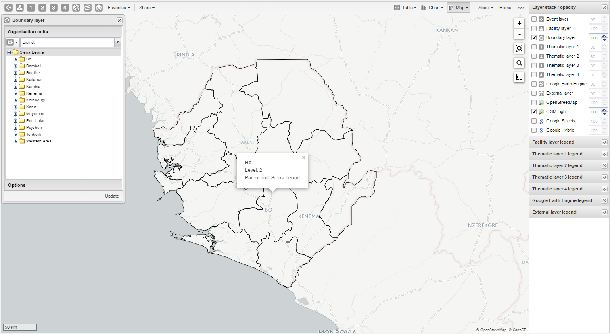

### Create or modify boundary layers

1.  In the top left menu, click the boundary layer icon.

2.  Click **Edit layer**.

3.  In the **Organisation units** section, select one or several
    organisation units.

    You can select the organisation units you want to show on the map by
    selecting a level and a parent. That means "show all organisations
    units at this level that are children of this parent".

4.  In the **Options** section, select if you want to show labels and if
    so, how they look.

5.  Click **Update**.

### Search for organisation units

To locate an organisation unit on the map:

1.  In the top menu, click the boundary layer icon.

2.  Click **Search**.

    The **Organisation unit search** dialog box opens.

3.  In the text field, type the name of the organisation unit you are
    looking for or click a name in the list.

    The organisation unit is highlighted in the map.

### Navigate between organisation hierarchies

When there are visible organisation units on the map, you can easily
navigate up and down in the hierarchy without using the level/parent
user interface.

1.  Right-click one of the organisation units.

2.  Select **Drill up** or **Drill down**.

    The drill down option is disabled if you are on the lowest level or
    if there are no coordinates available on the level below. The same
    applies when you are drilling up.

### Clear boundary layer

To clear data in a boundary layer:

1.  In the top menu, click the boundary layer icon.

2.  Click **Clear**.

## Manage Earth Engine layer { #using_gis_gee } 

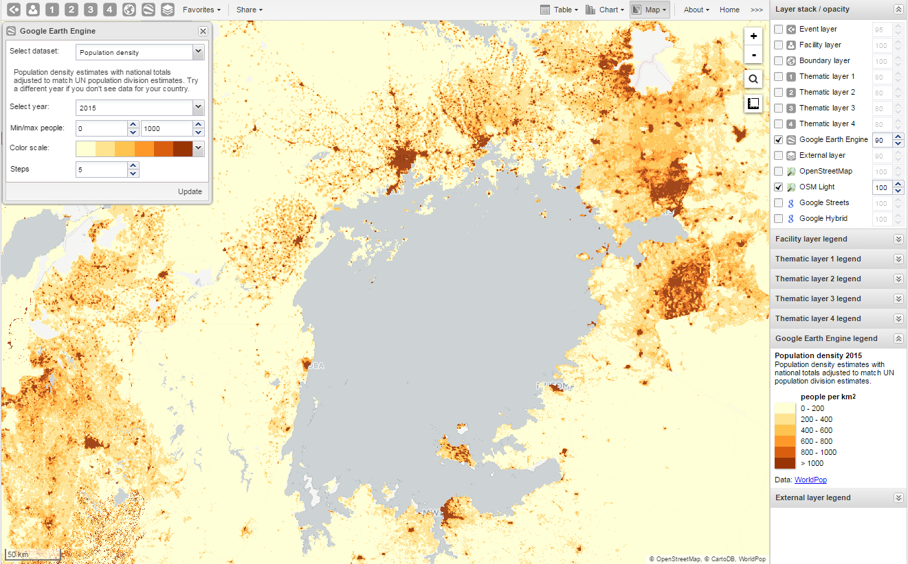

The Google Earth Engine layer lets you display satellite imagery and
geospatial datasets from Google's vast catalog. This layer is useful in
combination with thematic and event layers to enhance analysis. The
following layers are supported:

  - Elevation: Metres above sea level

  - Nighttime lights: Lights from cities, towns, and other sites with
    persistent lighting, including gas flares (from 2013)

  - Population density: Population in 100 x 100 m grid cells (from 2010)

  - Temperature, population and land cover at any location.

    Right-click on the layers to view more information, for example
    temperature and elevation.

\</listitem\> \</itemizedlist\>

### Create or modify an Earth Engine layer

1.  In the top menu, click the **Google Earth Engine** layer icon.

2.  Select a data set, for example "Elevation".

3.  Select **Min / max value**.

    The meaning of these values depend on which data set you've
    selected.

4.  Select a **Color scale**.

5.  Select the number of **Steps**.

    The number of steps means the number of distinct colors in the color
    scale.

6.  Click **Update**.

## Add external map layers { #using_gis_external_map_layers } 

1.  In the top menu, click the **External layer** icon.

2.  Click **Edit** to add a new layer.

3.  Select a layer from the list.

    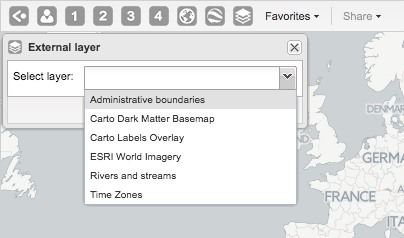

4.  Click **Update**.

    To remove a layer, click **Clear**.

    To hide a layer, go to the **Layer stack/opacity** menu pane and
    clear the **External layer** checkbox.

Here are some examples of external layers:

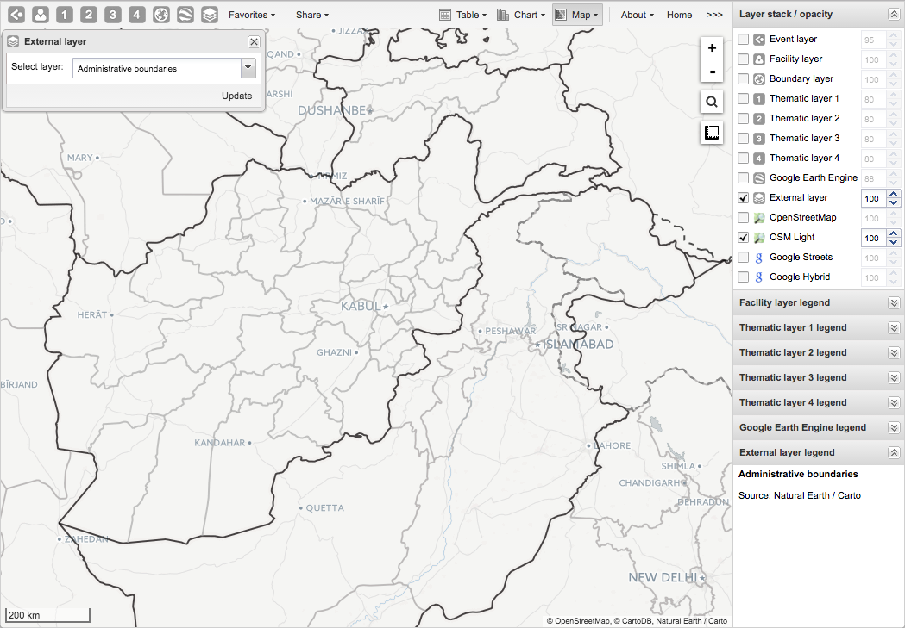

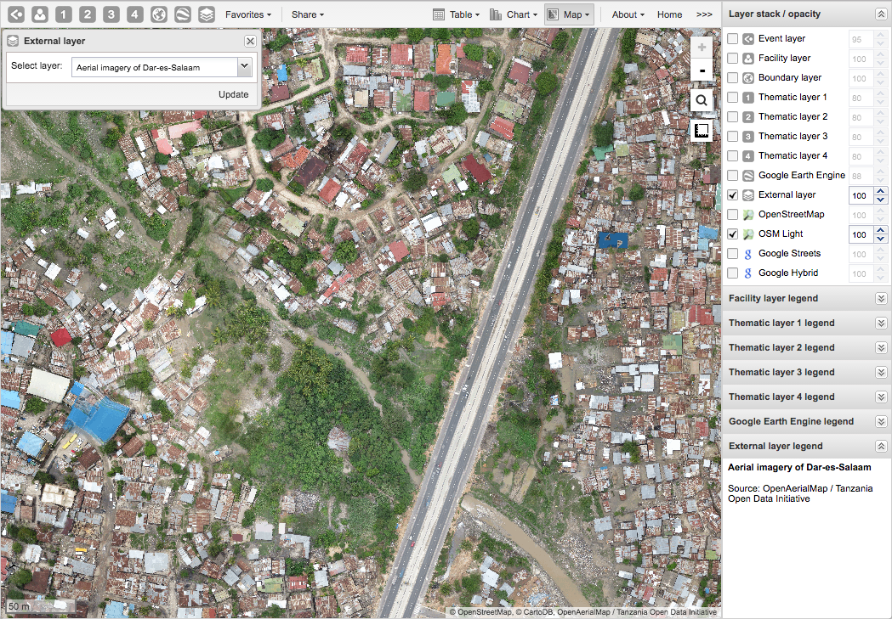

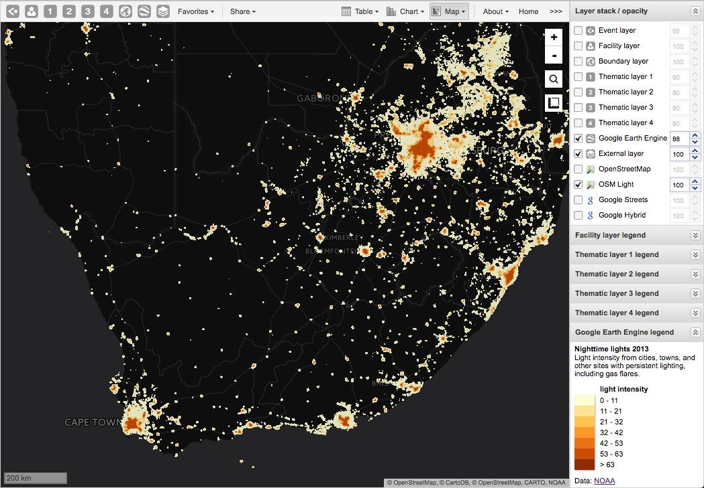

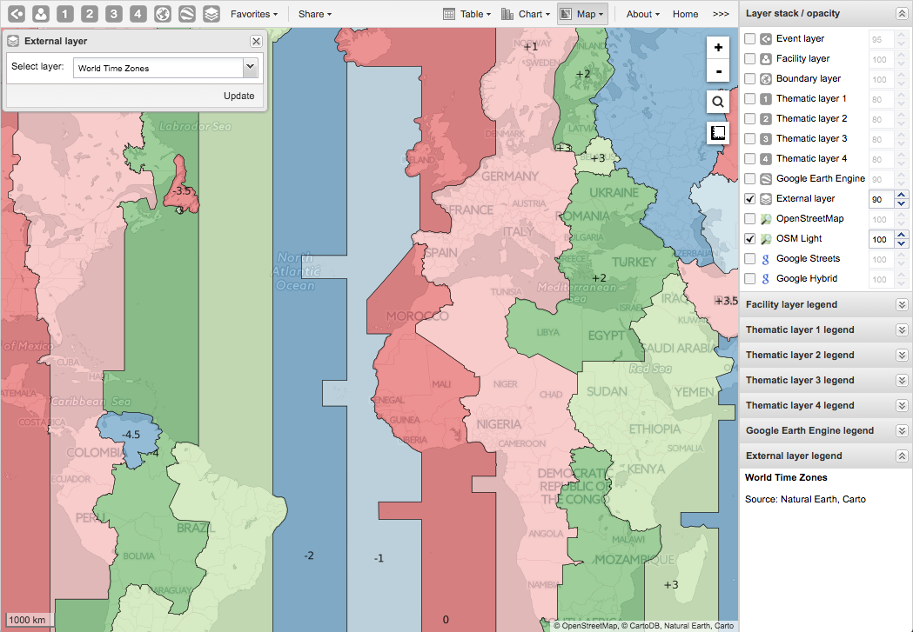

> **Note**
>
> To define external map layers, see the [Maintenance app
> documentation](https://dhis2.github.io/dhis2-docs/master/en/user/html/manage_ext_maplayer.html).

## Manage map favorites { #using_gis_favorites } 

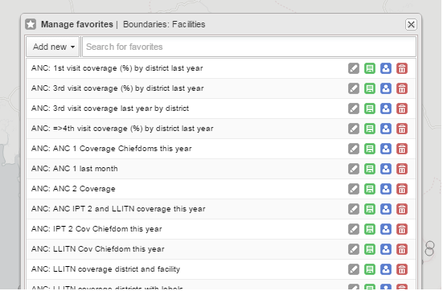

Saving your maps as favorites makes it easy to restore them later. It
also gives you the opportunity to share them with other users as an
interpretation or put it on the dashboard. You can save all types of
layers as a favorite. A favorite always opens with the default
background map.

### Save a map as a favorite

When you have created a map it is convenient to save it as a favorite:

1.  Click **Favorites**.

    The **Manage favorites** dialog box opens.

2.  Click **Add new**.

    The **Create new favorite** dialog box opens.

3.  In the text field, type the name you want to give your pivot table.

4.  Click **Create**.

    Your favorite is added to the list.

### Open a favorite

1.  Click **Favorites**.

    The **Manage favorites** dialog box opens.

2.  Find the favorite you want to open. You can either use **Prev** and
    **Next** or the search field to find a saved favorite. The list is
    filtered on every character that you enter.

3.  Click the name.

### Rename a favorite

1.  Click **Favorites**.

    The **Manage favorites** dialog box opens.

2.  Find the favorite you want to rename.

    You can either use **Prev** and **Next** or the search field to find
    a saved favorite.

3.  Click the grey rename icon next to the favorite's name.

    The **Rename favorite** dialog box favorite opens.

4.  Type the new name and click **Update**.

### Overwrite a favorite

To save the current map to an existing favorite (overwrite):

1.  Click **Favorites**.

    The **Manage favorites** dialog box opens.

2.  Find the favorite you want to overwrite.

    You can either use **Prev** and **Next** or the search field to find
    a saved favorite.

3.  Click the green overwrite icon next to the favorite's name.

4.  Click **OK** to confirm that you want to overwrite the favorite.

### Share a map interpretation { #gisInterpretation } 

For certain analysis-related resources in DHIS2, you can share a data
interpretation. An interpretation is a link to the relevant resource
together with a text expressing some insight about the data.

To create an interpretation of a map and share it with all users of the
system:

1.  Open or create a favorite map.

2.  Click **Share** \> **Write interpretation**.

    The **Write interpretation** dialog box opens.

3.  In the text field, type a comment, question or interpretation.

4.  Click **Share**.

    The dialog box closes automatically. You can see the interpretation
    on the **Dashboard**.

### Modify sharing settings for a favorite

After you have created a map and saved it as a favorite, you can share
the favorite with everyone or a user group. To modify the sharing
settings:

1.  Click **Favorites**.

2.  Find the favorite you want to share.

    You can either use **Prev** and **Next** or the search field to find
    a saved favorite.

3.  Click the blue share icon next to the favorite's name.

4.  In the text box, enter the name of the user group you want to share
    your favorite with and click the **+** icon.

    The chosen user group is added to the list of recipients.

    Repeat the step to add more user groups.

5.  If you want to allow external access, select the corresponding box.

6.  For each user group, choose an access setting. The options are:

      - None

      - Can view

      - Can edit and view

7.  Click **Save**.

### Delete a favorite

1.  Click **Favorites**.

    The **Manage favorites** dialog box opens.

2.  Find the favorite you want to delete.

    You can either use **Prev** and **Next** or the search field to find
    a saved favorite.

3.  Click the red delete icon next to the favorite's name.

4.  Click **OK** to confirm that you want to delete the favorite.

## Save a map as an image { #using_gis_image_export } 

1.  Take a screenshot of the map with the tool of your choice.

2.  Save the screenshot in desired format.

## Embed a map in an external web page { #using_gis_embed } 

Certain analysis-related resources in DHIS2, like pivot tables, charts
and maps, can be embedded in any web page by using a plug-in. You will
find more information about the plug-ins in the Web API chapter in the
*DHIS2 Developer Manual*.

To generate a HTML fragment that you can use to display the map in an
external web page:

1.  Click **Share** \> **Embed in web page**.

    The **Embed in web page** window opens.

2.  Click **Select** to highlight the HTML fragment.

## Search for a location { #using_gis_search } 

The place search function allows you to search for almost any location
or address. The place search is powered by the Mapzen mapping platform.
This function is useful in order to locate for example sites,
facilities, villages or towns on the map.

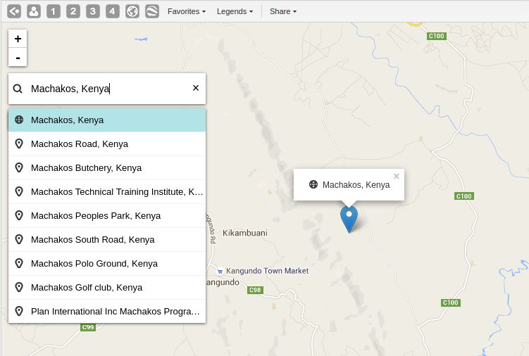

1.  On the left side of the GIS window, click the magnifier icon.

2.  Type the location you're looking.

    A list of matching locations appear as you type.

3.  From the list, select a location. A pin indicates the location on
    the map.

## Measure distances and areas in a map { #using_gis_measure_distance } 

1.  In the upper left part of the map, put the cursor on the **Measure
    distances and areas** icon and click **Create new measurement**.

2.  Add points to the map.

3.  Click **Finish measurement**.

## Get the latitude and longitude at any location { #using_gis_latitude_longitude } 

Right-click a map and select **Show longitude/latitude**. The values
display in a pop-up window.

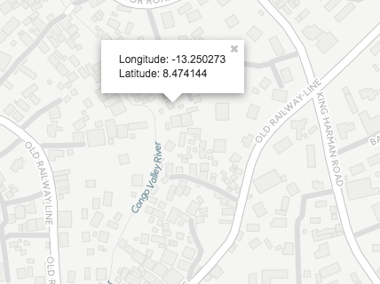

## View a map as a pivot table or chart { #using_gis_integration } 

When you have made a map you can switch between pivot table, chart and
map visualization of your data. The function is inactive if the data the
map is based on cannot render as a chart or table.

### Open a map as a chart

1.  Click **Chart** \> **Open this map as chart**.

    Your current map opens as a chart.

### Open a map as a pivot table

1.  Click **Chart** \> **Open this map as table**.

    Your current map opens as a pivot table.

## See also

  - [Manage
    legends](https://docs.dhis2.org/master/en/user/html/manage_legend.html)
