# Using the Maps app { #using_maps }

## About the Maps app { #about_maps }

The Maps App was introduced in release 2.29 and serves as a replacement
of the GIS App offering a more intuitive and user-friendly interface.
The mapping engine from version 2.34 is based on WebGL technology,
capable of showing thousands of features on a map simultaneously.

With the Maps app you can overlay multiple layers and choose among
different basemaps. You can create thematic maps of areas and points,
view facilities based on classifications, and visualize catchment areas
for each facility. You can add labels to areas and points, and search
and filter using various criteria. You can move points and set locations
on the fly. Maps can be saved as favorites and shared with other users
and groups, or downloaded as an image.

> **Note**
>
> To use predefined legends in the **Maps** app, you need to create them
> first in the **Maintenance** app.

- The **layer panel** on the left side of the workspace shows an
  overview of the layers for the current map:

  - As layers are added, using the **(+) Add layer** button, they
    are arranged and managed in this panel.

  - The **basemap** is always shown in the panel. The default
    basemap is OSM Light and is selected by default, unless a different
    basemap has been configured in the system settings. OpenStreetMap
    Detailed contains more map features and place names. There are 4
    basemaps from Bing Maps, replacing Google Maps provided in previous
    versions. Bing Road and Bing Dark shows roads, borders and places.
    Use the dark version if the colors on your map layers are bright.
    Bing Aerial and Bing Aerial Labels shos satellite and detailed aerial
    imagery. Switch between them by selecting the desired image.

  - The small arrow button to the right of the layer panel, at the
    top, allows the panel to be hidden or shown.

<!-- end list -->

- The **File** button near the top left allows you to open and save
  maps. See [using the maps file menu](#using_maps_file_menu) for more detailed information.

<!-- end list -->

- The **Download** button next to the File button allows you to download the current map as a PNG image.

<!-- end list -->

- The **Interpretations** button at top right opens an interpretations
  panel on the right side of the workspace. See [viewing interpretations](#mapsInterpretation) for more information.

<!-- end list -->

- The **+** and **-** buttons on the map allow you to zoom in and out
  of the map respectively. The mouse scroll wheel zoom is continuous,
  allowing us to fit the map perfectly to your content.

- The **rotate map** button (triangle arrows) allows you to
  rotate and tilt the map to enhance the view of your data. Press the button
  (or the Control key on your keyboard) while moving your mouse to change the
  map view. Click to button again to reset the view.

- **Fullscreen** (four arrows) allows you to view the map in fullscreen.
  To exit fullscreen click the button again or the escape key on your keyboard.

* **Zoom to content** (bounded magnifying glass symbol) automatically
  adjusts the zoom level and map center position to put the data on
  your map in focus.

* **Search** (magnifying glass symbol) allows searching for and
  jumping to a location on the map.

* The **ruler** button allows you to measure distances and areas on the map.

* Right-click on the map to display the longitude and latitude of that
  location.

**Basemaps**

Basemap layers are represented by layer _cards_ in the layer panel such
as:

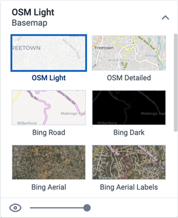

Along the top of the basemap card from left to right are:

- The title of the selected basemap

- An arrow symbol to collapse and expand the basemap card

In the middle of the basemap card is the list of available basemaps. The
current basemap is highlighted.

Along the bottom of the basemap card is:

- An eye symbol for toggling the visibility of the layer

- A slider for modifying the layer transparency

## Create a new map { #using_maps_create_map }

1.  In the **Apps** menu, click **Maps**. The **DHIS2 Maps** window
    opens.

2.  Click the (+) Add layer button in the top left. You are presented
    with the layer selection dialog:

    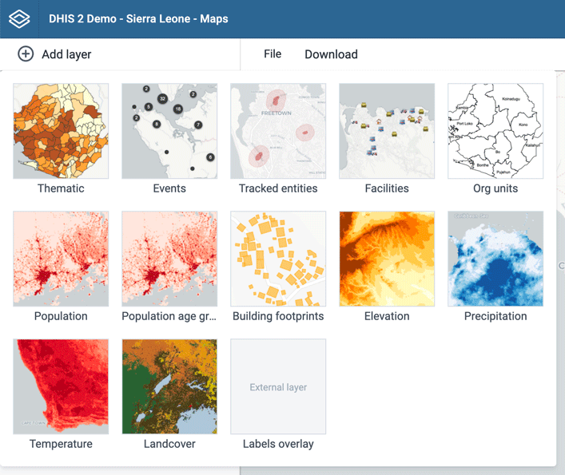

3.  Select a layer to add to the current map. Possible options are:

    - [Thematic](#using_maps_thematic_layer)

    - [Events](#using_maps_event_layer)

    - [Tracked entities](#using_maps_tracked_entity_layer)

    - [Facilities](#using_maps_facility_layer)

    - [Org units](#using_maps_org_unit_layer)

    In addition, there are several layers provided by Google Earth
    Engine and other services:

    - Population

    - Population age groups

    - Building footprints

    - Elevation

    - Precipitation

    - Temperature

    - Landcover

    _Labels overlay_ is an [external
    layer](#using_maps_external_map_layers) defined in the Maintenance app.

## Manage thematic layers { #using_maps_thematic_layer }

_Thematic maps_ represent spatial variation of geographic distributions.
Select your desired combination of indicator/data element, period and
organisation unit level. If your database has coordinates and aggregated
data values for these organisation units, they will appear on the map.

> **Note**
>
> You must generate the DHIS2 analytics tables to have aggregated data
> values available.

Thematic layers are represented by layer _cards_ in the layer panel such
as:

Along the top of the thematic card from left to right are:

- A grab field to allow dragging and re-ordering layers with the mouse

- The title and period associated with the layer

- An arrow symbol to collapse and expand the thematic card

In the middle of the thematic card is a legend indicating the value
ranges displayed on the layer.

Along the bottom of the thematic card from left to right are:

- An edit (pencil) button to open the layer configuration dialog

- An eye symbol for toggling the visibility of the layer

- A slider for modifying the layer transparency

- A more actions (three dots) button with additional options:

  - A **data table** toggle button to show or hide the data table
    associated with the layer

  - **Download data** allows you to download the data for this layer in GeoJSON format for use in other mapping software

  - **Edit layer** is the same as edit button above

  - **Remove layer** will remove this layer from the current map.

### Create a thematic layer

To create an event layer, choose **Thematic** on the **Add
layer** selection. This opens the Events layer configuration dialog.

1.  In the **DATA** tab:

    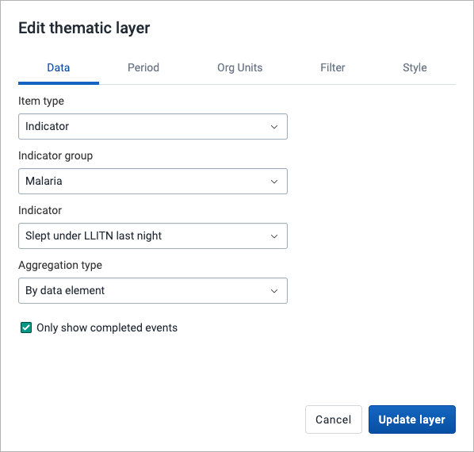

    - Select a data type and then select respectively the group and
      the target element. The available fields depend on the type of
      item selected.

    - Select a value from the **Aggregation type** field for the data
      values to be shown on the map. By default, "By data element" is
      selected. Alternative values are: Count; Average; Sum; Standard
      deviation; Variance; Min; Max. See also [Aggregation
      operators](https://dhis2.github.io/dhis2-docs/master/en/user/html/ch10s05.html#d0e8082).

    - **Only show completed events**: Includes only completed events in the aggregation process.
      This is useful when you want to exclude partial events in indicator calculations. Available
      for indicators, program indictors and event data items.

2.  In the **PERIOD** tab

    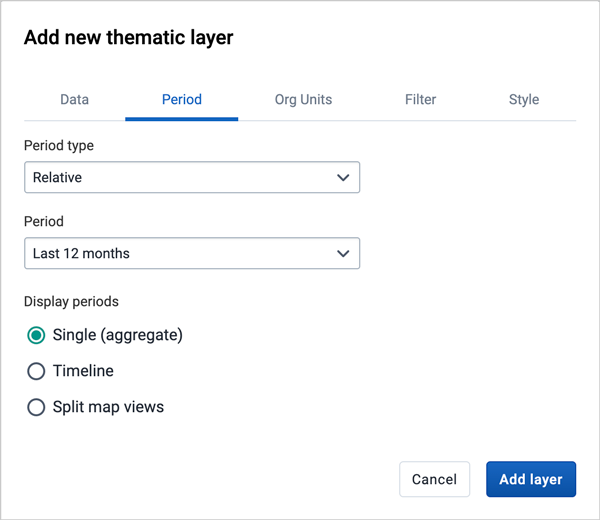

    - select the time span over which the thematic data is mapped.
      You can select either a relative or a fixed period.

      - Relative period

        In the **Period type** field select **Relative**, then
        select one of the relative periods, for example **Last year** or
        **Last 12 months**, in the **Period** field.

        A **default relative period for analysis** can be set in the **Systems Settings**
        app.

        If you select a relative period covering multiple years/months/weeks/days
        the layer can be displayed as

        - Single (aggregate)

          Show aggregate values for the relative period selected (default).

        - Timeline

          Includes a timeline allowing you to step through the periods.
          Only one timeline layer can be added to the same map.

        - Split map views

          Show multiple maps allowing you to compare different periods
          side by side. Supported for relative periods with 12 items
          or below. Can not be combined with other layer types.

      - Fixed period

        In the **Period type** field select period length, then
        select the target in the **Period** field.

      - Start/end dates

        In the **Period type** field select **Start/end dates**
        and fill in a start date and an end date.

3.  In the **ORG UNITS** tab:

    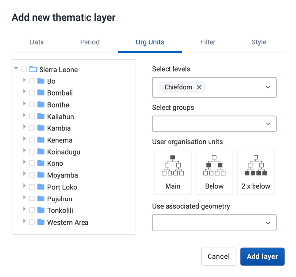

    - Select the organisation units you want to include in the layer.
      It is possible to select either

      - One or more specific organisation units, organisation unit levels in
        the hierarchy, organisation unit groups, or

      - A relative level in the organisation unit hierarchy, with
        respect to the user. By selecting a **User organisation
        unit** the map data will appear differently for users at
        different levels in the organisation unit hierarchy.

    - **Use associated geometry**: This dropdown will only show if there
      are any additional geometry available for your organisation units.
      This is typically used to show facility catchment areas.

4.  In the **FILTER** tab:

    

    - Click ADD FILTER and select an available data item to add a new
      filter to the data set.

      - Select a data dimension from the dropdown box. You can
        reduce the number of dimensions shown by using the search field.
        Click on the name to select a dimension.

      - When a dimension is selected you get a second dropdown with
        dimension items. Check the items you want to include in the
        filter.

      Multiple filters may be added. Click the trash button on the right of
      the filter to remove it.

5.  In the **STYLE** tab:

    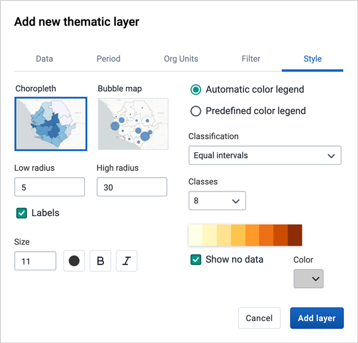

    - Select either **Choropleth** or **Bubble maps**.

      - Choropleth will assign a color to each org unit shape according to the
        data value. This is the recommended technique if the data is normalised
        (per capita).

      - Bubble map will show data values as proportional circles. Use this
        technique if the data is not normalised (absolute numbers). The circles are
        placed in the center of each org unit.

    - Set the **Low radius** and **High radius** for the proportional circles or the
      point facilities. The circles will be scaled between low and high radius according
      to the data value. The radius needs to be between 0 and 50 px.

    - **Show labels**: Allows org unit names and values to be shown on the layer.
      Select between "Name", "Name and value" and "Value" only. Font size, weight, style and color can also be modified.

    - **Show no data**: By default org units with missing data values will not show on the map.
      Check this box if you want to show them with a color. Click the color to change it.

    - Select the legend type:

      - **Automatic color legend**: the application will create a legend for you based on
        what classification method, number of classes and the color scale you select. Set
        **Classification** to either:

        - Equal intervals

          the range of each interval will be (highest data value - lowest data value / number of classes)

        - Equal counts

          the legend creator will try to distribute the organisation units evenly.

      - **Predefined color legend**: Select between the predefined legends.

      - **Single color legend**: Select the color of the bubbles or circles. Only available
        for bubble maps.

6.  Click **ADD LAYER**.

### Modify a thematic layer

1.  In the layer panel, click the edit (pencil) icon on the thematic
    layer card.

2.  Modify the setting on any of the tabs as desired.

3.  Click **UPDATE LAYER**.

### Filter values in a thematic layer

Thematic layers have a **data table** option that can be toggled on or
off from the thematic layer card.

The data table displays the data forming the thematic layer.

- clicking on a title will sort the table based on that column;
  toggling between ascending and descending.

- entering text or expressions into the filter fields below the titles
  will apply those filters to the data, and the display will adjust
  according to the filter. The filters are applied as follows:

  - NAME

    filter by name containing the given text

  - VALUE

    filter values by given numbers and/or ranges, for example:
    2,\>3&\<8

  - LEGEND

    filter by legend containing the given text

  - RANGE

    filter by ranges containing the given text

  - LEVEL

    filter level by numbers and/or ranges, for example: 2,\>3&\<8

  - PARENT

    filter by parent names containing the given text

  - ID

    filter by IDs containing the given text

  - TYPE

    filter by GIS display types containing the given text

  - COLOR

    filter by color names containing the given text

> **Note**
>
> Data table filters are temporary and are not saved with the map layers
> as part of the favourite.

### Search for an organisation unit

The NAME filter field in the data table provides an effective way of
searching for individual organisation units.

### Open organisation unit profile

You can open the [organisation unit profile](#using_maps_org_unit_profile) in three ways:

1. Click on any of the organisasjon units shown on the map, and click
   the **View profile** button in the popup.

2. Right-click one of the organisation units on the map, and select **View profile**
   from the menu.

3. Click on an organisation unit row in the **data table**.

### Navigate between organisation hierarchies

When there are visible organisation units on the map, you can easily
navigate up and down in the hierarchy without using the level/parent
user interface.

1.  Right-click one of the organisation units.

2.  Select **Drill up one level** or **Drill down one level**.

    The drill down option is disabled if you are on the lowest level or
    if there are no coordinates available on the level below. Likewise
    the drill up option is disabled from the highest level.

### Remove thematic layer

To clear all data in a thematic layer:

1.  In the layer card to the left, click the _more actions_ (three dots) icon
    and then on **Remove layer**.

    The layer is removed from the current map.

## Manage event layers { #using_maps_event_layer }

The event layer displays the geographical location of events registered
in the DHIS2 tracker. Provided that events have associated point or polygon
coordinates, you can use this layer to drill down from the aggregated
data displayed in the thematic layers to the underlying individual
events or cases.

You can also display aggregated events for facilities or organisation
units. You do this through a thematic layer using event data
items. This is useful when you only have the coordinates for the Org
Unit under which the events are recorded.

Event layers are represented by layer _cards_ in the layer panel such
as:

Along the top of the event card from left to right are:

- A grab field to allow dragging and re-ordering layers with the mouse

- The title and period associated with the layer

- An arrow symbol to collapse and expand the event card

In the middle of the event card is a legend indicating the styling of
the layer.

Along the bottom of the event card from left to right are:

- An edit (pencil) button to open the layer configuration dialog

- An eye symbol for toggling the visibility of the layer

- A slider for modifying the layer transparency

- A more actions (three dots) button with additional options:

  - A **data table** toggle button to show or hide the data table associated with the layer

  - **Download data** allows you to download the data for this layer in GeoJSON format for use in other mapping software

  - **Edit layer** is the same as edit button above

  - **Remove layer** will remove this layer from the current map.

### Create an event layer { #maps_create_event_layer }

To create an event layer, choose **Events** on the **Add
layer** selection. This opens the Events layer configuration dialog.

1.  In the **DATA** tab:

    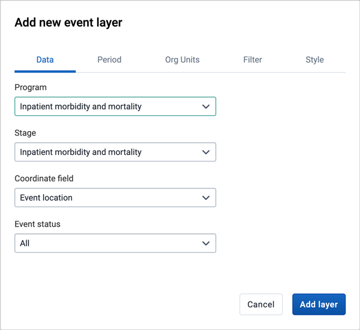

    - Select a program and then select a program stage. The **Stage**
      field is only shown once a program is selected.

      If there is only one stage available for the selected program,
      the stage is automatically selected.

    - Select a value from the **Coordinate field** for the positions
      shown on the map. By default, "Event location" is selected.
      Depending on the data elements or attributes that belong to a
      program, other coordinates such as "Household position" are
      available.

    - By default all events with coordinates are shown on the map.
      Use the **Event status** field to only show events having one
      status: Active, Completed, Schedule, Overdue or Skipped.

2.  In the **PERIOD** tab

    

    - select the time span for when the events took place. You can
      select either a fixed period or a relative period.

      - Relative period

        In the **Period** field, select one of the relative periods,
        for example **This month** or **Last year**.

        A **default relative period for analysis** can be set in the
        **Systems Settings** app.

      - Fixed period

        In the **Period** field, select **Start/end dates** and fill
        in a start date and an end date.

3.  In the **ORG UNITS** tab:

    

    - Select the organisation units you want to include in the layer.
      It is possible to select either

      - One or more specific organisation units, or

      - A relative level in the organisation unit hierarchy, with
        respect to the user. By selecting a **User organisation
        unit** the map data will appear differently for users at
        different levels in the organisation unit hierarchy.

4.  In the **FILTER** tab:

    

    - Click ADD FILTER and select an available data item to add a new
      filter to the data set.

      - For data item of type _option set_, you can select any of
        the options from the dropdown box by using the down-wards
        arrow or by start typing directly in the box to filter for
        options.

      - For data item of type _number_, you can select operators like
        equal, not equal, greater than or less than.

      - For data item of type _boolean_ (yes/no), you can check the box
        if the condition should be valid or true.

      - For data item of type _text_ you will get two choices:
        **Contains** implies that the query will match all values
        which contains your search value, and **Is exact** implies
        that only values which is completely identical to your
        search query will be returned.

      Multiple filters may be added. Click the trash button on the right of
      the filter to remove it.

5.  In the **STYLE** tab:

    

    - Select **Group events** to group nearby events (cluster), or
      **View all events** to display events individually.

    - Select a **color** for the event or cluster points.

    - Select the **radius** (between 1 and 20) for the events.

    - Select **Show buffer** to display visual buffer around each
      event. The radius of the buffer can be modified here. This
      option is only available if you select **View all events**
      above.

    - Select a **Style by data element** to colorise the events
      according to a data value. If you also select to group events,
      the culsters will be displayed as small donut charts showing
      the distribution of the data values. The options varies for
      different data types:

      - **Option sets**: Select a color for each option in an option
        set. You can set default colors for an option in the
        Maintenance app.

      - **Numbers**: You can style a numeric data element in [the same
        way as thematic layers](#using_maps_thematic_layer_style) using
        automatic or predefined legends.

      - **Booleans**: Select a color for true/yes and another for
        false/no.

6.  Click **ADD LAYER**.

### Modify an event layer

1.  In the layer panel, click the edit (pencil) icon on the event layer
    card.

2.  Modify the setting on the DATA, PERIOD, FILTER, ORG UNIT and STYLE
    tabs as desired.

3.  Click **UPDATE LAYER**.

### Listing and filtering events

Event layers have a **data table** option that can be toggled on or
off from the event layer card.

The data table displays the data forming the event layer.

- clicking on a title will sort the table based on that column;
  toggling between ascending and descending.

- entering text or expressions into the filter fields below the titles
  will apply those filters to the data, and the display will adjust
  according to the filter. The filters are applied as follows:

  - ID

    filter by event IDs containing the given text

  - ORG UNIT

    filter by org unit name containing the given text

  - EVENT TIME

    filter by event time containing the given text

  - TYPE

    filter by GIS display types containing the given text

  - **Style by data element**: If events are styled by a data element
    (e.g. gender) both the data value and the color can be filtered.

  - **Display in reports**: Data elements checked to display in reports will
    be shown in separate columns (see below how to add them).

  - Numeric data values can be filtered by given numbers, and/or ranges,
    for example: 2,\>3&\<8

> **Note**
>
> Data table filters are temporary and are not saved with the map layers
> as part of the favourite.

### Modify information in event data table and popups

You can modify the information displayed in the event pop-up window.

1.  Open the **Maintenance** app.

2.  Select **Program**.

3.  Click the program you want to modify and select **2 Assign data elements**.

4.  For every data element you want to display in the pop-up window,
    select corresponding **Display in reports**.

5.  Click **Save**.

### Download raw event layer data

The raw data for event layers can be downloaded in GeoJSON format for more advanced geo-analytics and processing in desktop GIS software such as [QGIS](https://www.qgis.org/). The downloaded data includes all individual events as GeoJSON features, including attributes for each data element selected for **Display in reports**.

- In the layer card to the left, click the _more actions_ (three dots) icon and then on **Download data**

- Select the **ID format** to use as the key for Data Element values in the downloaded GeoJSON file. There are three options available:

  - **ID** - Use the unique ID of the data element
  - **Name** - Use the human-friendly name of the data element (translated)
  - **Code** - Use the code of the data element

- Select whether or not to **Use human-readable keys** for other Event attributes, such as Program Stage, Latitude, Longitude, Event Data, and Organization Unit ID, Name, and Code. When this option is **not** selected these values will be the computer-friendly ID instead of the human-readable (and translated) name.

- Click the **DOWNLOAD** button to generate and download a GeoJSON file. The data will be requested from the DHIS2 server and processed by the maps application. This operation may take several minutes to complete.

- Once the GeoJSON file has been downloaded it can be imported into most standard GIS software applications.

> Note that the downloaded data does not include style information as it is not natively supported by the GeoJSON format. Styles can optionally be recreated in external GIS applications using the attributes of each feature.

### Clear event layer

To clear all event layer data in a map:

1.  In the layer card to the left, click the _more actions_ (three dots) icon
    and then on **Remove layer**.

    The layer is removed from the current map.

## Manage tracked entity layers { #using_maps_tracked_entity_layer }

The tracked entity layer displays the geographical location of tracked
entities registered in the DHIS2. Provided that tracked entities have
associated point or polygon coordinates, you can explore these on a map.

Tracked entity layers are represented by layer cards in the layer panel
such as:

Along the top of the tracked entity card from left to right are:

- A grab field to allow dragging and re-ordering layers with the
  mouse.

- The title and period associated with the layer.

- An arrow symbol to collapse and expand the tracked entity card.

In the middle of the tracked entity card is a legend indicating the
styling of the layer.

Along the bottom of the tracked entity card from left to right are:

- An edit (pencil) button to open the layer configuration dialog

- An eye symbol for toggling the visibility of the layer

- A slider for modifying the layer transparency

- A more actions (three dots) button with additional options:

  - **Edit layer** is the same as edit button above

  - **Remove layer** will remove this layer from the current map.

### Create a tracked entity layer { #maps_create_tracked_enity_layer }

To create an tracked entity layer, choose **Tracked entities** on the
**Add layer** selection. This opens the Tracked entity layer
configuration dialog.

1.  In the **DATA** tab:

    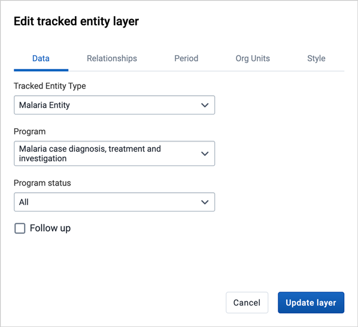

    - Select the **Tracked Entity Type** you want to show on the map.

    - Select a **Program** where the tracked entities belong.

    - Use the **Program status** field to select the enrollment status of tracked entities
      to include: All, Active, Completed or Cancelled.

    - Set the **Follow up** status of the tracked entity for the given
      program.

2.  In the **Relationships** tab

    

    > **Caution**
    >
    > Displaying tracked entity relationships in Maps is an experimental feature

    - If a Tracked Entity Type with has been selected, you can select the **Display Tracked Entity relationships** checkbox

    - Once checked, you can select the type of relationship to display on the map from the dropdown list. Only relationships FROM the selected Tracked Entity type are available.

3.  In the **PERIOD** tab

    

    - If no program is selected, you can set start and end dates when
      the tracked entities were last updated.

    - If a program is selected, you can set the period when tracked entities were last
      updated or when they were registered or enrolled in the program.

4.  In the **ORG UNITS** tab:

    

    - Select the organisation units you want to include in the layer.
      You have 3 selection modes:

      - **Selected only**: Include tracked entities belonging to
        selected org units only.

      - **Selected and below**: Included tracked entities in and
        right below selected org units.

      - **Selected and all below**: Included tracked entities in and
        all below selected org units.

5.  In the **STYLE** tab:

    

    - Select a **color** for the tracked entities points and polygons.

    - Select the **point size** (radius between 1 and 20) for the
      points.

    - Select **Show buffer** to display visual buffer around each
      tracked entity. The buffer distance in meters can be modified
      here.

    - If a relationship type has been selected on the relationships tab you can select **color**, **point size**, and **line color** for relationships and related tracked entities instances

6.  Click **ADD/UPDATE LAYER**.

### Modify a tracked entity layer

1.  In the layer panel, click the edit (pencil) icon on the tracked
    entity layer card.

2.  Modify the setting on the DATA, PERIOD, ORG UNIT and STYLE tabs as
    desired.

3.  Click **UPDATE LAYER**.

### Clear a tracked entity layer

To clear a tracked entity layer from a map:

1.  In the layer card to the left, click the _more actions_ (three dots) icon
    and then on **Remove layer**.

    The layer is removed from the current map.

## Manage facility layers { #using_maps_facility_layer }

The facility layer displays icons that represent types of facilities.
Polygons do not show up on the map, so make sure that you select an
organisation unit level that has facilities.

_A polygon is an enclosed area on a map representing a country, a
district or a park._

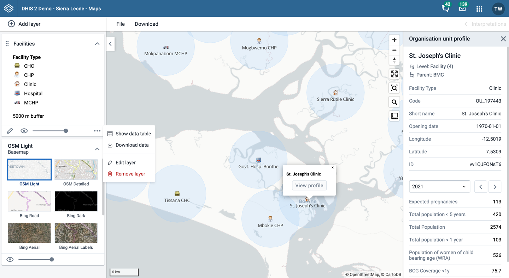

Facility layers are represented by layer _cards_ in the layer panel such
as:

Along the top of the facilities card from left to right are:

- A grab field to allow dragging and re-ordering layers with the mouse

- The **Facilities** title

- An eye symbol for toggling the visibility of the layer

- An arrow symbol to collapse and expand the facilities card

In the middle of the facilities card is a legend indicating the group
set representation.

Along the bottom of the facilities card from left to right are:

- An edit (pencil) button to open the layer configuration dialog

- A slider for modifying the layer transparency

- A more actions (three dots) button with additional options:

  - A **data table** toggle button to show or hide the data table
    associated with the layer

  - **Download data** allows you to download the data for this layer in GeoJSON format for use in other mapping software

  - **Edit layer** is the same as edit button above

  - **Remove layer** will remove this layer from the current map.

### Create a facility layer

To create facility layer, choose **Facilities** on the **Add
layer**selection. This opens the Facility layer configuration dialog.

1.  In the **ORGANISATION UNITS** tab

    

    - Select the organisation unit level(s) and/or group(s) from the
      selection fields on the right hand side.

    - Select the organisation units you want to include in the layer.
      It is possible to select either

      - One or more specific organisation units, or

      - A relative level in the organisation unit hierarchy, with
        respect to the user. By selecting a **User organisation
        unit** the map data will appear differently for users at
        different levels in the organisation unit hierarchy.

    - The system administrator can set the default organsation unit
      level containing facilities in the **System Settings** app.

    - **Use associated geometry**: This dropdown will only show if there
      are any additional geometry available for your organisation units.
      This is typically used to show facility catchment areas.

2.  In the **STYLE** tab:

    

    - Select any styling you wish to apply to the facilities.

      - Show labels

        Allows labels to be shown on the layer. Font size, weight
        and color can be modified here.

      - Show buffer

        Allows a visual buffer to be displayed on the layer around
        each facility. The radius of the buffer can be modified
        here. Buffer option is not available if asscoiated geometry is used.

    - Facilities can be styled an **organisation unit group set** using
      different icons. Select a group set from the list of organisation
      unit group sets defined for your DHIS2 instance.
      The system administrator can set the default organsation unit
      group set in the **System Settings** app.

    - If no group set is selected, the facilities will be shown as filled
      circles. The color and the circle radius can be changed.

3.  Click **ADD LAYER**.

### Create or modify a facility layer

1.  In the layer panel, click the edit (pencil) icon on the facility
    layer card.

2.  Modify the setting on the GROUP SET, ORGANISATION UNITS and STYLE
    tabs as desired.

3.  Click **UPDATE LAYER**.

### Filter values in a facility layer

Facility layers have a **data table** option that can be toggled on or
off from the facility layer card.

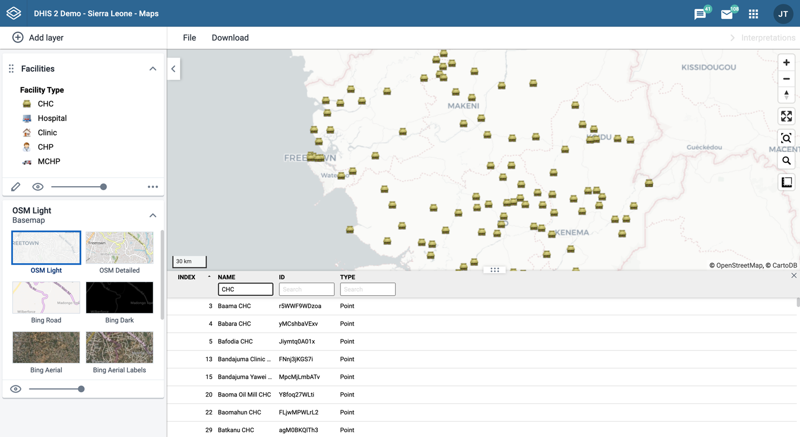

The data table displays the data forming the facility layer.

- clicking on a title will sort the table based on that column;
  toggling between ascending and descending.

- entering text or expressions into the filter fields below the titles
  will apply those filters to the data, and the display will adjust
  according to the filter. The filters are applied as follows:

  - NAME

    filter by name containing the given text

  - ID

    filter by IDs containing the given text

  - TYPE

    filter by GIS display types containing the given text

> **Note**
>
> Data table filters are temporary and are not saved with the map layers
> as part of the favourite.

### Search for a facility

The NAME filter field in the data table provides an effective way of
searching for individual facilities.

### Open organisation unit profile

You can open the [organisation unit profile](#using_maps_org_unit_profile) in three ways:

1. Click on any of the organisasjon units shown on the map, and click
   the **View profile** button in the popup.

2. Right-click one of the organisation units on the map, and select **View profile**
   from the menu.

3. Click on an organisation unit row in the **data table**.

### Remove facility layer

To clear all data in a facility layer:

1.  In the layer card to the left, click the _more actions_ (three dots) icon
    and then on **Remove layer**.

    The layer is removed from the current map.

## Manage org unit layers { #using_maps_org_unit_layer }

The org unit layer displays the borders and locations of your
organisation units. This layer is particularly useful if you are offline
and don't have access to background maps.

Org unit layers are represented by layer _cards_ in the layer panel such
as:

Along the top of the org unit card from left to right are:

- A grab field to allow dragging and re-ordering layers with the mouse

- The **Organisation unit** title

- An arrow symbol to collapse and expand the org unit card

Along the bottom of the org unit card from left to right are:

- An edit (pencil) button to open the layer configuration dialog

- An eye symbol for toggling the visibility of the layer

- A slider for modifying the layer transparency

- A more actions (three dots) button with additional options:

  - A **data table** toggle button to show or hide the data table
    associated with the layer

  - **Download data** allows you to download the data for this layer in GeoJSON format for use in other mapping software

  - **Edit layer** is the same as edit button above

  - **Remove layer** will remove this layer from the current map.

### Create an org unit layer

To create an org unit layer, choose **Org units** on the **Add
layer** selection. This opens the org unit layer configuration dialog.

1.  In the **ORGANISATION UNITS** tab

    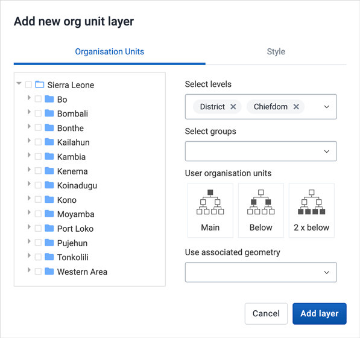

    - select the organisation unit level(s) and/or group(s) from the
      selection fields on the right hand side.

    - Select the organisation units you want to include in the layer.
      It is possible to select either

      - One or more specific organisation units, or

      - A relative level in the organisation unit hierarchy, with
        respect to the user. By selecting a **User organisation
        unit** the map data will appear differently for users at
        different levels in the organisation unit hierarchy.

    - **Use associated geometry**: This dropdown will only show if there
      are any additional geometry available for your organisation units.
      This is typically used to show facility catchment areas.

2.  In the **STYLE** tab:

    

    - select any styling you wish to apply to the org unitss.

      - Labels

        Allows labels to be shown on the layer. Font style can be
        modified here.

      - Boundary color

        Allows the boundary or outline color of the organisation units
        to be changed.

      - Point radius

        Sets the base radius when point type elements, such as
        facilities, are presented on the org unit layer.

    - Organisation units can be styled an **organisation unit group set**
      using different colors. Select a group set from the list of organisation
      unit group sets defined for your DHIS2 instance.

3.  Click **ADD LAYER**.

### Modify an org unit layer

1.  In the layer panel, click the edit (pencil) icon on the org unit
    layer card.

2.  Modify the setting on the ORGANISATION UNITS and STYLE tabs as
    desired.

3.  Click **UPDATE LAYER**.

### Filter values in an org unit layer

Org unit layers have a **data table** option that can be toggled on or
off from the org unit layer card.

The data table displays the data forming the org unit layer.

- clicking on a title will sort the table based on that column;
  toggling between ascending and descending.

- entering text or expressions into the filter fields below the titles
  will apply those filters to the data, and the display will adjust
  according to the filter. The filters are applied as follows:

  - NAME

    filter by name containing the given text

  - LEVEL

    filter level by numbers and/or ranges, for example: 2,\>3&\<8

  - PARENT

    filter by parent names containing the given text

  - ID

    filter by IDs containing the given text

  - TYPE

    filter by GIS display types containing the given text

> **Note**
>
> Data table filters are temporary and are not saved with the map layers
> as part of the favourite.

### Search for an organisational unit

The NAME filter field in the data table provides an effective way of
searching for individual organisational units displayed in the org unit
layer.

### Open organisation unit profile

You can open the [organisation unit profile](#using_maps_org_unit_profile) in three ways:

1. Click on any of the organisasjon units shown on the map, and click
   the **View profile** button in the popup.

2. Right-click one of the organisation units on the map, and select **View profile**
   from the menu.

3. Click on an organisation unit row in the **data table**.

### Navigate between organisation hierarchies

You can modify the target of the org unit layer in the hierarchy without
using the level/parent user interface.

1.  Right-click one of the organisation units.

2.  Select **Drill up one level** or **Drill down one level**.

    The drill down option is disabled if you are on the lowest level.
    Likewise the drill up option is disabled from the highest level.

### Remove org unit layer

To clear all data in an org unit layer:

1.  In the layer card to the left, click the _more actions_ (three dots) icon
    and then on **Remove layer**.

    The layer is removed from the current map.

## Manage Earth Engine layer { #using_maps_gee }

The layers from Google Earth Engine let you display and aggregate external
data to your organisation units. Use the population layer to calculate the
number of people living in a district, or within a distance from a health
facility. The elevation layer allows you to find the lowest, highest and
mean elevation. Use the landcover layer to see the forest cover, croplands
or urban areas, and calculate the percentage for each organisation unit.

The following layers are supported:

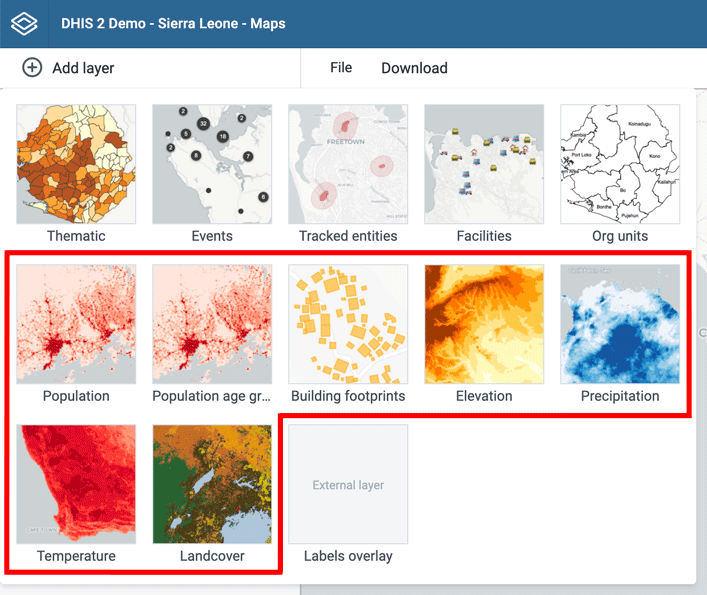

- **Population**: Detailed population data from WorldPop showing the estimated
  number of poeple living in an area. Available for yearly periods from 2000 and
  onwards.

- **Population age groups**: Estimated number of people living in an area, grouped
  by age and gender.

- **Building footprints**: The outlines of buildings derived from high-resolution
  satellite imagery. Only for the continent of Africa.

- **Elevation**: Elevation above sea level.

- **Precipitation**: The values are in millimeters within 5 days periods. Updated
  monthly, during the 3rd week of the following month. Collected from satellite and weather stations on the ground.

- **Temperature**: Land surface temperatures collected from satellite.
  Blank spots will appear in areas with a persistent cloud cover.

- **Land cover**: 17 distinct landcover types collected from satellites by NASA.

### Create an Earth Engine layer

To create an Earth Engine layer, choose the desired layer from the **Add
layer** selection. This opens the layer configuration dialog.

1.  In the **DATA** tab:

    

    - For "population age groups" you can select the age/gender **groups**
      you would like to include when aggregating the data.

    - Select the **aggregation methods** you would like to use when calculating
      values for the selected organisation units.

      - **Sum**: Calculates the total number within each organisation unit.
        Recommended to use for the population layers.

      - **Min**: Returns the minimum value in the layer unit displayed below the
        selection. For population layers it will be the minimum _people per
        hectar_. For elevation layer it will return the lowest elevation (meters
        above sea level).

      - **Max**: Returns the maximum value in the layer unit. For population
        layers it will be the minimum _people per hectar_. For elevation layer it
        will return the highest elevation for each organisation unit.

      - **Mean**: Returns the mean value in the layer unit. For population layers
        it will be the mean _people per hectar_. For precipitation layer it will
        be the mean rainfall in millimeters across the organisation unit.

      - **Median**: Returns the mean value in the layer unit. For population layers
        it will be the median _people per hectar_. For temperature layer it will
        be the median °C during daytime for the organisation unit.

      - **Standard deviation**: Returns the standard deviation value in the layer
        unit.

      - **Variance**: Returns the variance value in the layer unit.

2.  In the **PERIOD** tab

    

    - Select the period for the data source. The available periods are set by
      data provider. There is only one period for the "population age groups" layer,
      while the "population" layer has yearly data available from 2000 and onwards.
      Precipitation data is available in 5 days periods, and temperature data for
      8 days periods.

3.  In the **ORG UNITS** tab:

    

    - Select the organisation units you where you want to see aggregated data values.
      It is possible to select either

      - One or more specific organisation units, organisation unit levels in
        the hierarchy, organisation unit groups, or

      - A relative level in the organisation unit hierarchy, with
        respect to the user. By selecting a **User organisation
        unit** the map data will appear differently for users at
        different levels in the organisation unit hierarchy.

    - **Use associated geometry**: This dropdown will only show if there
      are any additional geometry available for your organisation units.
      This is typically used to calculate values for facility catchment areas.

    - **Building footprints**: Building counts are only available for smaller
      organisation unit areas.

4.  In the **STYLE** tab

    

    - Modify the parameters specific to the layer type.

    - Adjust the legend range, steps and colors, as desired.

    - If you select organisation units having a single point coordinate
      (facilities) you can set a radius buffer to calculate the
      data value within. A radius of 5000 meters will aggregate all
      values available within a 5 km distance from a facility. Buffer
      option is not available if associated geometry is used.

5.  Click **ADD LAYER**.

Click on the map regions or facilities to see the aggregation result for that
organisation unit.

### Listing of data values

Earth Engine layers have a **data table** option that can be toggled on or
off from the layer card.

The data table displays all the aggregated values for the organisation units selected.

- clicking on a title will sort the table based on that column;
  toggling between ascending and descending.

- entering text or expressions into the filter fields below the titles
  will apply those filters to the data, and the display will adjust
  according to the filter. The filters are applied as follows:

- NAME

  filter by org unit name containing the given text

- ID

  filter by event IDs containing the given text

- TYPE

  filter by GIS display types containing the given text

- AGGREGATION VALUES

  there is one column for each of the aggregation types selected

  numeric data values can be filtered by given numbers, and/or ranges,
  for example: 2,\>3&\<8

> **Note**
>
> Data table filters are temporary and are not saved with the map layers.

## Add external map layers { #using_maps_external_map_layers }

External map layers are represented as either:

- Basemaps

  These are available in the **basemap** card in the layers panel and
  are selected as any other basemap.

- Overlays

  These are available in the **Add layer** selection. Unlike basemaps,
  overlays can be placed above or below any other overlay layers.

Overlay layers are represented by additional layer _cards_ in the layer
panel such as:

Along the top of the overlay card from left to right are:

- A grab field to allow dragging and re-ordering layers with the mouse

- The title of the external map layer

- An arrow symbol to collapse and expand the overlay card

In the middle of the card is a legend if the layer has one.

Along the bottom of the overlay card from left to right are:

- A slider for modifying the layer transparency

- A delete (trash can) icon to remove the layer from the current
  thematic map.

## Organisation unit profile { #using_maps_org_unit_profile }

The organisation unit profile shows detailed information about
each organisation unit. You can open the profile from org unit, facility
and thematic layers.

You can open the organisation unit profile in three ways:

1. Click on any of the organisasjon units shown on the map, and click
   the **View profile** button in the popup.

2. Right-click one of the organisation units on the map, and select **View profile**
   from the menu.

3. Click on an organisation unit row in the **data table**.

The profile will show on the right side of the map. The profile contents is
set by the system administrator.

## File menu { #using_maps_file_menu }

Use the **File menu** to manage your maps. Several menu items will be
disabled until you open or save a map.

Saving your maps makes it easy to restore them later. It also gives you
the opportunity to share them with other users as an interpretation or
put it on the dashboard. You can save all types of layer configurations
as a favorite.

### Create a new map

Click **File** \> **New**.

NB\! This will clear the current map layers you have without saving.

### Open a new map

1.  Click **File** \> **Open**. A dialog box opens with a list of maps.

2.  Find the favorite you want to open. You can either use \< and \> or
    the search field to find a saved map. The list is filtered on every
    character that you enter. You can filter the list by selecting
    **Show all**, **Created by me** or **Created by others**.

3.  Click the name of the map you want to open.

### Save a map

When you have created a map it is convenient to save it for later use:

1.  Click **File** \> **Save**.

2.  Enter a **Name** (required) and a **Description** (optional) the
    first time you save a map.

3.  Click **SAVE**.

### Save a copy of a map

1.  Click **File** \> **Save as...**

2.  Enter a **Name** (required) and a **Description** (optional) for the
    map.

3.  Click **SAVE**.

### Rename a map

1.  Click **File** \> **Rename**.

2.  Enter a new **Name** and/or **Description** for your map.

3.  Click **RENAME**. The map is updated.

### Translate a map

1.  Click **File** \> **Translate**.

2.  Select the **Locale** (language) your translation.

3.  Enter a translated **Name** and **Description**. The original text
    will show below the field.

4.  Click **SAVE**.

### Modify sharing settings for a map

After you have created a map and saved it, you can share the map with
everyone or a user group. To modify the sharing settings:

1.  Click **File** \> **Share**. The sharing settings dialog opens.

2.  **Give access to a user or group**: In the text box, search for the name of the
    user or group you want to share your favorite with and select it.

    Select the access level and click on **Give access**.

    Repeat the step to add more users or groups.

3.  **Users and groups that currently have access**: For each user or group, choose the
    access level. The options are:

    - No access: The public won't have access to the map. This setting is only applicable to All users.

    - View only

    - View and edit

    - Remove access: Remove the access for groups or individuals.

4.  Click **Close** to close the dialog.

### Get the link to a map

1.  Click **File** \> **Get link**. A link dialog opens.

2.  Copy the link.

### Delete a map

1.  Click **File** \> **Delete**. A confirmation dialog is displayed.

2.  Click **DELETE** to confirm that you want to delete the favorite.
    Your map is deleted and the layers are cleared from the view.

## Map interpretations { #mapsInterpretation }

An interpretation is a description of a map at a given period. This
information is visible in the **Dashboard app**. Click
**Interpretations** in the top right of the workspace to open the
interpretations panel. The button is only clickable if the map is saved.

### View interpretations based on relative periods

To view interpretations for relative periods, such as a year ago:

1.  Open a favorite with interpretations.

2.  Click **Interpretations** in the top right of the workspace to open
    the interpretations panel.

3.  Click on **See interpretation**. Your map displays the data and the date
    based on when the interpretation was created. To view other
    interpretations, click them.

### Write interpretation for a map

To create an interpretation, you first need to create a map and save it.
If you've shared your map with other people, the interpretation you
write is visible to those people.

1.  Open a saved map.

2.  Click **Interpretations** in the top right of the workspace to open
    the interpretations panel.

3.  A text field will appear with a placeholder "Write an interpretation" for users
    that have read access to the favorite.

4.  In the text field, type a comment, question or interpretation. You
    can also mention other users with '@username'. Start by typing '@'
    plus the first letters of the username or real name and a mentioning
    bar will display the available users. Mentioned users will receive
    an internal DHIS2 message with the interpretation or comment. You
    can see the interpretation in the **Dashboard app**.

5.  Click **Post interpretation** to save the interpretation.

### Change sharing settings for an interpretation

1.  Click an interpretation (see how to view an interpretation above).

2.  Click the share icon below the interpretation. The sharing settings
    dialog opens.

3.  Search for and add a users and user groups that you want to share
    your map with, and set the access level. Click on **Give access**.

4.  Change the access level for the users you want to modify:

    - **View and edit**: Everyone can view and edit the object.

    - **View only**: Everyone can view the object.

    - **No access**: The public won't have access to the object. This
      setting is only applicable to All users.

    - **Remove access**: Remove the access for groups or individuals.

5.  Click **CLOSE** when sharing settings are updated.

## Save a map as an image { #using_maps_image_export }

You can download your map as an image by clicking on the Download button in the top menu

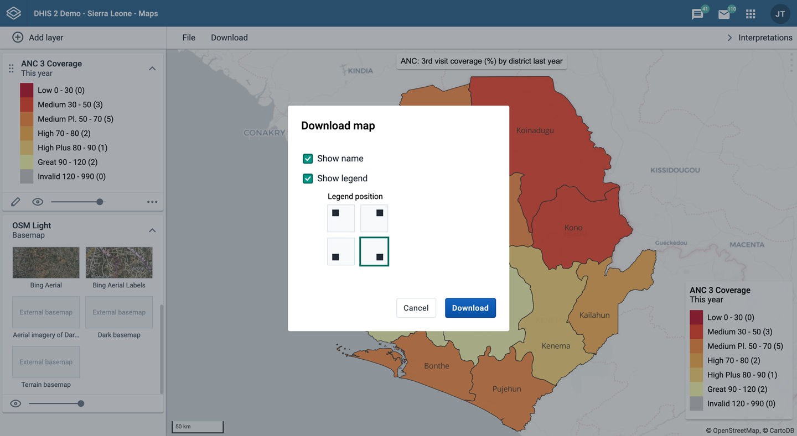

You will enter a "download mode" where you can adjust the map layout before you download the image. The left column gives you the following options:

- **Show map name**: Select if you want to include the map name or not. This option
  is only available if the map is saved. To change the name, exit download mode and select _File_ > _Rename_.
- **Show map description**: Select if you want to include the map description or not.
  This option is only available if a map description was added when the map was saved. To change the map description, exit download mode and select _File_ > _Rename_.
- **Show legend**: Select if you want to include the map legend. If the map includes
  more than one layer, you can select the visibility for each legend.
- **Show overview map**: Select if you want to include an overview map (often named
  inset map). This option will be disabled if there is not enough room for it in the right column.
- **Show north arrow**: Select to include a north arrow on the map. The default
  position is the lower right corner of the map, but you can change it to another corner.
- Click **Download** to download your map.

Resize your browser window to change the map dimensions. You can also reposition both the main map and the overview map.

Map download is not supported in Internet Explorer or Safari, we recommend to
use Google Chrome or Firefox.

## Search for a location { #using_maps_search }

The place search function allows you to search for almost any location
or address. This function is useful in order to locate for example
sites, facilities, villages or towns on the map.

1.  On the right side of the Maps window, click the magnifier icon.

2.  Type the location you're looking.

    A list of matching locations appear as you type.

3.  From the list, select a location. A pin indicates the location on
    the map.

## Measure distances and areas in a map { #using_maps_measure_distance }

1.  In the upper left part of the map, put the cursor on the **Measure
    distances and areas** (ruler) icon and click **Create new
    measurement**.

2.  Add points to the map.

3.  Click **Finish measurement**.

## Get the latitude and longitude at any location { #using_maps_latitude_longitude }

Right-click a point on the map and select **Show longitude/latitude**.
The values display in a pop-up window.

## See also

- [Manage
  legends](https://docs.dhis2.org/master/en/user/html/manage_legend.html)
