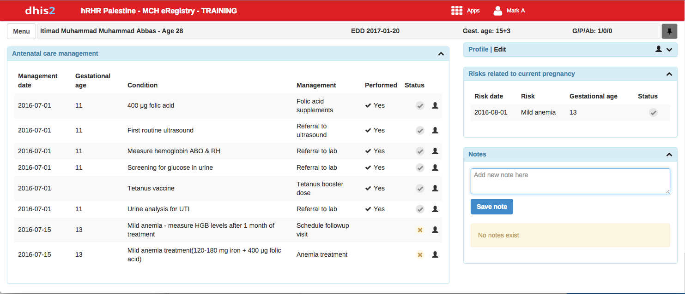

# DHIS2 tracker e-Registry in Palestine

<!--DHIS2-SECTION-ID:user_story_palestine_tracker-->

**Developed from WHO’s guidelines for Reproductive, Maternal, Newborn
and Child Health (RMNCH), the DHIS2 Tracker e-Registry collects,
analyzes and tracks case-based data for maternal and child health. The
module is currently being rolled out in three of the 10 regions in the
West Bank. The remaining regions will be covered over the upcoming
months.**

## <!-- {-} -->

**How did the Tracker come about?** Primary health care is at a
particularly low level for expectant women due to the volatile context
within Palestine. The DHIS2 Tracker e-Registry was introduced in an
attempt to improve the delivery of quality healthcare. The e-Registry
captures essential health data through simple processes and a series of
outcome indicators covering domains of quality of care. It also serves
the dual purpose of patient management and public health monitoring. The
project is being led by the Norwegian Institute of Public Health, with
the involvement of the Palestinian National Institute of Public Health
and the Ministry of Health in Palestine.

## <!-- {-} -->

**What was *not* in place before that is available now with Tracker?**
Tracker has provided national guidelines and support for clinicians when
following individual cases. For example, if a clinician enters a lab
result for a pregnant woman, let’s say the hemoglobin value, which
indicates anemia, the clinician is alerted to the patient’s degree of
anemia and will be prompted to take action accordingly. This information
is powered by a powerful rule engine, and is based on WHO guidance about
what actions to take in certain health situations.

## <!-- {-} -->

**What exactly is the DHIS2 Tracker e-Registry?** The Tracker user
interface is a checklist, which also provides decision support tools.
The clinician goes through the dynamic data entry form while seeing the
patient. Each section and question represents a point in the checklist
that needs to be completed during the visit. The Tracker also focuses on
task consistency and completeness. Furthermore, aggregate data is used
for public health decision making at the national
level.

## <!-- {-} -->

**How successful has the program been?** We’ve a few hundred cases
registered so far with Tracker in the West Bank roll out, so it’s still
in its early stages. However, we’ve identified a series of
recommendations that may be useful for future DHIS2 Tracker
implementations.

## <!-- {-} -->

**What is the general feedback and what are the highlights of this
program?** It’s been positive on the whole so far. Using a rule-based
workflow that is modifiable to match treatment guidelines helped no end.
Also, achieving consensus on national standard treatment guidelines and
developing proper governance are areas we recommend focusing on. We also
believe that designing the system with the users and making the UI
customizable are of great value. We recommend reviewing any existing
systems and making efforts to integrate with and support them as this
might bring long-term benefits.

