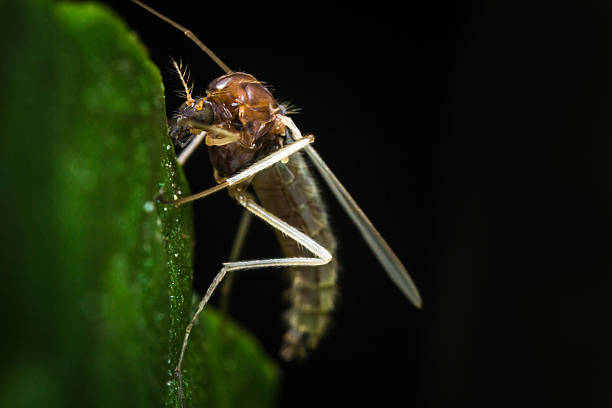
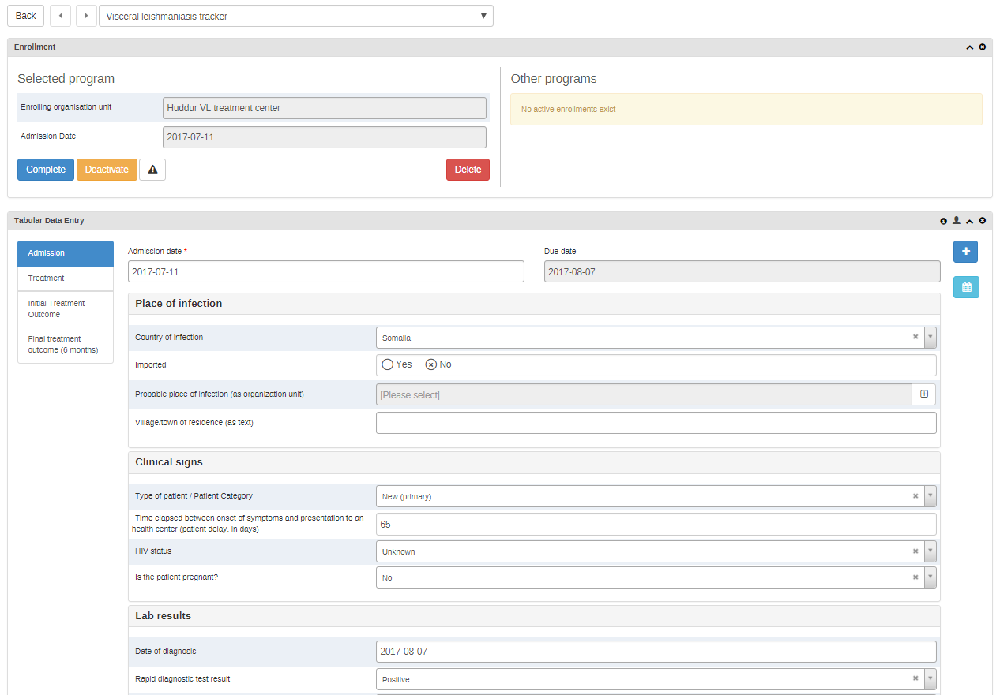
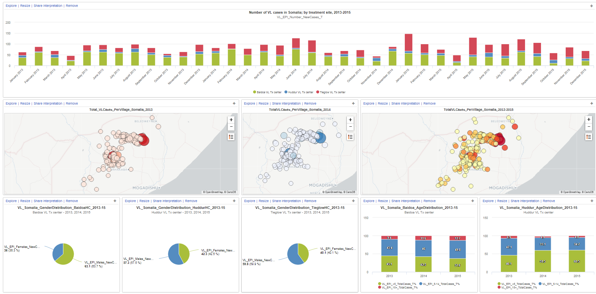
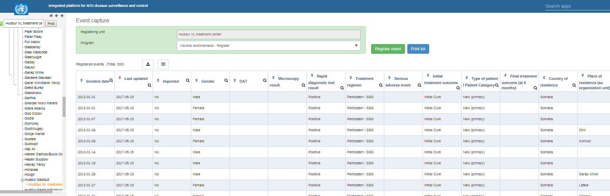

# DHIS2 Tracker improving surveillance of Visceral Leishmaniasis (VL) in Somalia - DRAFT

<!--DHIS2-SECTION-ID:user_story_vl_who-->

## Leishmaniasis – what is it?

Leishmaniasis is a disease caused by what is known as “protozoan
parasites”. [Protozoa](https://www.cdc.gov/parasites/about.html) are
microscopic, one-celled organisms that are able to multiply in humans,
causing serious infections. Leishmansis is transmitted to humans by the
bite of infected female sandflies.

The worst form of the disease is called **Visceral Leishmaniasis (VL)**,
and it is endemic in more than 80 countries. People usually suffer from
irregular bouts of fever, weight loss, enlargement of the spleen and
liver, and anaemia.

## Who is affected by Visceral Leishmaniasis (VL)?

This disease affects some of the poorest people on earth. It is
associated with malnutrition, population displacement, poor housing, a
weak immune system and lack of financial resources. The most cases are
found on the Indian subcontinent and in East Africa, where an estimated
200, 000 – 400, 000 new cases occur each year. Some 90% of all new cases
are reported from Brazil, Ethiopia, India, Somalia, South Sudan and
Sudan. Left untreated, VL will kill a person within two years of the
onset of the disease in more than 95% of all cases. *Source: [Neglected
tropical diseases](http://www.who.int/neglected_diseases/diseases/en/),
WHO, 2017 ©*

## Tackling VL in Somalia

Diagnosis and treatment of VL is not easy. In endemic countries, only
few health facilities have well-trained health workers and the equipment
to perform proper diagnosis and case management. To be able to
accurately map the distribution of VL cases and calculate incidence and
population at risk, several factors come into play:

  - Identifying health facilities where the resources will be targeted
    (training, equipment, drugs, diagnostic tests),

  - Allocating cases to the probable place of infection (or at least
    place of residence), and not to the place where the person is being
    treated.

## Ongoing WHO-supported training and surveillance programs

In view of the country’s difficult context, Somalia is doing very well
in terms of VL surveillance. Since 2013, the Ministry of Health, with
the support of the WHO and SOS Somalia, have trained health workers from
three health facilities in VL diagnosis, case management, and data
collection.

Individual data was collected for each VL case in an Excel spreadsheet
and shared with the central level of the Ministry of Health. Basic
descriptive analysis of the data was performed. However, the following
limitations affected the quality of the data:

  - No central database to store, clean and compile the data.

  - No standardization of the locations where cases were detected.

  - No skills at the Ministry of Health to map the cases at village
    level.

## Improving VL surveillance with DHIS2 Tracker and Event Capture

In 2016, the WHO Global Leishmaniasis programme developed a generic “VL
patient form” using DHIS2 Tracker, and a generic “VL patient register”
using DHIS2 Event Capture. The objectives are to support the Somali MoH
in using these generic modules to strengthen VL surveillance and control
in Somalia.

## Importing retrospective surveillance data into DHIS2 Event Capture

The WHO team developed an “Excel importer” app, based on an existing
DHIS2 app from HISP Vietnam. VL event data from 2013 to 2015 was
imported, and data was then available for analysis of Neglected Tropical
Diseases (NTDs) surveillance and control.

A DHIS2 dashboard was implemented for Somalia, with main indicators, and
a map representing VL cases from villages of residence as a proxy of the
village of infection.

## Using DHIS2 for prospective data collection

In February 2017, 24 health workers in Entebbe, Somalia received
training on how to enter data in the WHO-VL modules. The training,
performed by WHO and in collaboration with HISP Uganda, lasted for
5-days. Health workers learned about areas such as identifying the
minimum data to be collected for each VL patient; DHIS2 tools and
features for surveillance (individual and aggregated data entry, data
validation, data analysis and working with dashboards); and practical
sessions for data entry in Tracker Capture. At the end of the training,
participants were expected to know how to:

  - Connect to the platform,

  - Enter individual and aggregated data,

  - Validate their data using the data validation tools,

  - Analyze the data through the interpretation of dashboards showing
    indicators required by the Leishmaniasis Programme.

## Several planned phases for gathering VL data

Since this training, data entry is collected centrally in Mogadishu.
This is a first phase, which aims at testing the usability of the
Tracker “VL patient form”. The second phase is to invite the peripheral
level to Mogadishu on a monthly basis to enter data in the “VL patient
form”. The third phase is to test the possibility of entering data at
the peripheral level.

## An intermediary solution for now

Although initially three phases were planned for the VL control program
in Somalia, due to logistic constraints, the peripheral level is
continuing with the Excel solution, and the central level is tasked with
uploading the data to DHIS2. The deployment of the “VL patient form” or
the “VL register” is planned for a later stage, after further analysis
of the technical requirements at the peripheral level.

This intermediary solution represents a substantive improvement for the
Somali VL control programme. Indeed, it will enable better data quality,
centralization of all the data in a single database, safeguarding of the
data, easy sharing with main partners, improved data usage and improved
feedback to the peripheral level.

