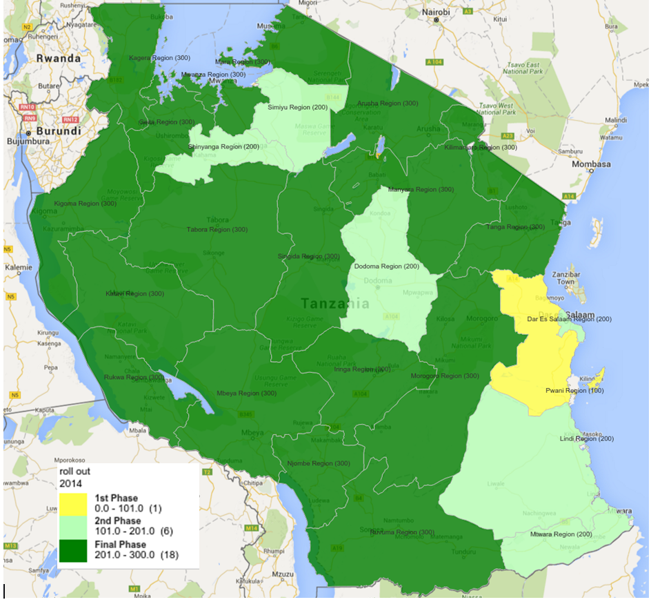
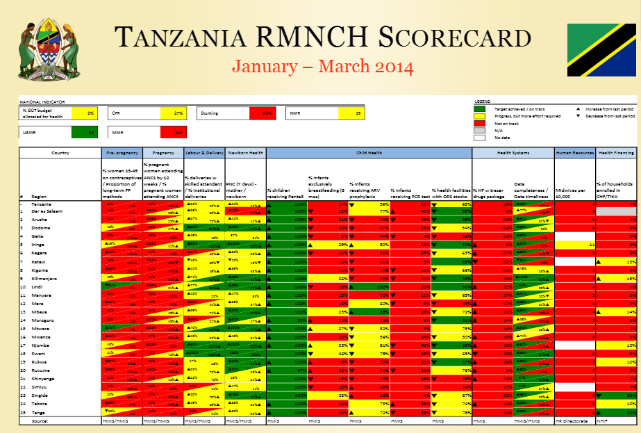
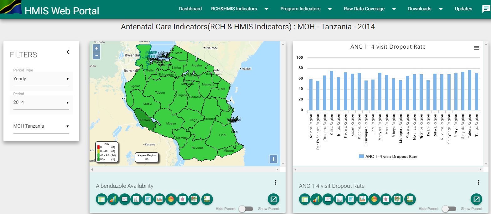

# Tanzania: Integrated Health Information Architecture

<!--DHIS2-SECTION-ID:user_story_udsm-->

## About this use case

**In this use case, we'll be looking at the different stages of how
multiple teams collaborated with the University of Dar es Salaam (UDSM),
the Ministry of Health and Social Welfare (MoHSW), and the University of
Oslo (UiO) to implement integrated Health Information Systems (HIS) in
Tanzania Mainland. The key lessons learned were the importance of
implementing a HIS gradually to provide a sustainable framework;
streamlining resources and promoting collaboration; ensuring systems
were flexible; promoting data ownership and data sharing; building
capacity at all levels; involving major programs very early; and
dedicating time and resources building up a community of stakeholders.**

## Tanzania country profile

The United Republic of Tanzania is the largest country in the East
African region with a population of 45 million people. It's composed of
two countries: the semi-autonomous island of Zanzibar and Tanganyika, or
Tanzania Mainland. Tanzania Mainland is divided into 25 administrative
regions that are subdivided into 167 district councils. Each district
council is subdivided into divisions, wards, villages/streets. There's
approximatively one health facility per 8.000 people, according to SARA
(2012).

Owing to a huge disparity between regions and districts in terms of
geography, history, population, and infrastructure, some areas of
Tanzania have no reliable roads, electricity, or access to the Internet.

## Moving from multiple tools to a unified system

### Before DHIS2

Tanzania Mainland's first HIS began in the 90s as a paper-based system
used at health facilities and district offices. Information was
collected and processed with a Microsoft Access database. Without the
intervention of external consultants hired by funding agencies, there
weren't any strategies to sustain the system with upgrades or refresher
training.

With a surge in demand for a HIS, the MoHSW was being put under strain.
Lack of coordination led to fragmented vertical projects running side by
side. This caused an unsustainable situation in which efforts were being
duplicated as results weren’t being converged.

Around 2007, a plan called the Monitoring and Evaluation Strengthening
Initiative was made by the MoSWH, UDSM, UiO and other partners. Its goal
was to build a new, integrated HIS to provide reliable data for the
ministry and other stakeholders. A new paper-based system combined with
DHIS2 was introduced. <http://www.dhis2.org>

### Introducing an integrated HIS in Tanzania

In 2010, the adaptation and implementation of a totally revised HIS
began. This process was enabled by a flexible, standard solution and
participatory approaches operating across all levels of the national
health system. It was important to find a solution that would meet the
demands of health managers, implementers, designers and decision-makers.

### A gradual, national HIS rollout

In 2011, the coastal region of Pwani was used as a testbed for
paper-based data collection tools and DHIS2. Over the next two years,
revised systems were rolled out to the remaining 24 regions and
associated districts and health facilities of Tanzania Mainland. On
completion of this rollout, efforts were directed towards the
integration of all major vertical programs such as malaria, TB/leprosy,
RCH, HIV/AIDS into DHIS2. Along with the implementation process,
training programs were held for implementing partners, district and
regional hospital staff, and the MoHSW staff.

Tanzania Mainland DHIS2 rollout phases for 2014

### Building a robust HIS

Here are some of the key areas we dedicated time and resources to:

#### Open-source philosophy

The choice to apply open-source tools rather than going through a
closed, commercial product ensured that the software remained
collaborative with a more diverse and flexible scope of design.
Furthermore, the involvement of the many health sector stakeholders and
an open source community of developers implied that the system would be
geared towards long-term sustainability rather than a short-term
lifecycle, dependent on a company’s paid maintenance services.

#### Incremental, flexible, and scalable design

DHIS2 was implemented in an incremental way, rather than in one go. Like
that, issues could be tackled directly during the rollout process, and
implemented in direct response to user feedback. The most glaring flaws
were thus easily spotted and a more stable and efficient system was
built.

#### Standards for data collection

We used a set of common data collection standards that covered data
collection, reporting, analysis, and quality procedures and tools. All
informal tools were removed and the recording of duplicate entries of
data declined.

#### Participatory design

A community of users such as managers from the HIS, supporting partners
and implementers exchanged emails, spoke on forums, and at workshops
about how to make the software more user-friendly. This helped
implementers fine-tuned their programs and ensure that DHIS2 was being
used optimally.

#### Action-led research

Students enrolled on PhD and MSc degree programs at UiO and UDSM
conducted “action-led research” that enabled them to participate in the
roll-out of DHIS2 while doing research. By doing so, they learned and
documented best practices about system customization, user support,
training, and data analysis.

#### Local capacity building

People learned to troubleshoot DHIS2 software, and users were encouraged
to assist each other across many different organization levels and
roles. By instilling a sense of ownership and self-sufficiency, the gap
between implementers and users was thus reduced. Training focused on
software usage, data analysis and basic and advanced features of DHIS2
for health and data managers.

#### Using information guidelines and standards

To drive decision-making and to reach national health goals, annual
planned targets, and Millennium Development Goals (MDGs), teams created
processes on how to generate and use data efficiently.

#### Interoperability of DHIS2 with other systems

Since 2014, DHIS2 has been integrated with other software systems,
enabling health workers to cross-cut, analyze and share data across
organizations. Here are some examples of systems integrated or made
interoperable with DHIS2:

##### eIDSR (electronic Integrated Disease Surveillance and Response)

eIDSR was developed from scratch using USSD technology and linked with
DHIS2 for the immediate reporting of data on infectious diseases. The
tool is designed to improve detection and response time to diseases and
is used within all health facilities in Tanzania.

##### HRHIS (Human Resources for Health Information Systems)

HRHIS was developed to report health data information from within all
Tanzanian health facilities. It has helped to assess HR problems, manage
the distribution of HR, and plan and evaluate HR interventions.

##### MFL (Master Facility List)

MFL is a health facility register to keep records about health facility
profiles.

##### eLMIS (Logistics Management Information Systems)

eLMIS is a supply chain system for distributing and stocking of drugs
and other commodities.

#### Data use and awareness solutions

Solutions to raise awareness about best practices for data use, data
analysis and data dissemination have been embedded within DHIS2. These
solutions are:

##### Scorecards

Scorecards are used to communicate the status of progress toward key
global, regional and national commitments for specific indicators. The
representation of visual indicators has the role of stimulating actors
to respond to situations rapidly through effective policies and
investments.

##### HMIS web portal

The HMIS web portal is hosted by the MoHSW and used by health
stakeholders. It’s also accessible to the general public.
<https://hmisportal.moh.go.tz/>

##### P4P (Pay for Performance)/ RBF (Result Based Finance)

Rewards the delivery of one or more outputs or outcomes by one or more
incentives that can be financial or otherwise. The P4P/RBFprogram is
integrated within DHIS 2 to enable health service providers to monitor
their performance and payments.

##### DHP/RHP (District and Region Health Profile)

Provides planning and progress guidance to the district health
management team. For example, it offers a summary of district health
conditions through priority health indicators that reflect the district
health status of the population, status of the health systems and the
status of the health services delivery.

## Challenges

As with any big project being implemented on such large scale and with a
complex health care setting, a number of challenges arose.

### Unforeseen changes to the administrative structure

District and regional administrative boundaries are frequently updated.
The foundation of a new region generates a new representation of local
population data. This disruption has an impact on the comparative
analysis of HIS data such as the performance of health indicators.

### Reducing standalone programs

Reducing the amount of existing standalone programs was often achieved
through demonstrating the limitations of individual programs, and
highlighting the potential of DHIS2. Due to some reservations however,
some vertical programs are still running in parallel with DHIS2.

### Lack of trained personnel and geographical coverage

The lack of people with adequate HIS skills has at times weighed heavily
on implementing and scaling up DHIS2 from a pilot region to the entire
country. Tanzania has over 7000 health facilities across 168 district
councils.

## The outcome

Now an endorsed and standard system of choice throughout Tanzania, DHIS2
is recognized as follows:

  - An integrated e-health architecture that has strengthened health
    data collection, improved the analysis, use and harmonization of
    data and stakeholders.

  - Over 1.5 million data entries are being collected and added to the
    national data warehouse on a monthly basis, using modems, broadband
    LAN and VSAT.

  - Multiple, reliable, integrated tools to assist in improved
    evidence-based decision making (such as scorecards, dashboards,
    P4P).

  - Open access initiative (HMIS web portal) initiated by the community
    of stakeholders.

  - Improved data validation and quality checks for better monitoring
    and evaluation of health programs.

## What are the lessons learned?

Here are some key lessons to take away from the experience of rolling
out DHIS2 in a sustainable way.

### Apply a gradual incremental process

The systems must be flexible and adaptable to meet emerging needs. By
learning from previous iterations it has been possible to extend the
system to other regions.

### Develop and endorse a comprehensive national plan

To save on resources and prevent running the risk of duplicating
efforts, before deploying DHIS2, streamline all resources and HIS
activities of all stakeholders and use the MoHSW as a lead organization.

### Establish a trustworthy relationship

Promote system and data ownership within the MoHSW. Encourage data
sharing amongst the health programs and stakeholders to help develop a
sense of trust in the routine HIS and the resources and capacity that
can support it.

### Build capacity at national, regional, and local levels

A reliable system is maintained by well trained and knowledgeable
people. Capacity building needs to be a continuous strategy. Capacity is
needed for system development, maintenance, and information use to make
sure the system is up and running every day, and information generated
is used for health management, planning and decision making.

### Get other health programs involved

The major health programs are HIV/AIDS, Maternal Child Health (MCH),
malaria and TB. Getting such big programs as these involved in a HMIS at
an early stage is a means to spark the interest of other programs and
associated stakeholders.

### Dedicate the right amount of time and resources to your program

Lots of time and effort was spent integrating the vertical programs into
the HIS/DHIS2 platform and gradually rolling out the HIS. Today we’ve
established a large community of stakeholders who share a common
interest in building a sustainable HIS/DHIS2 platform for future
generations to use and build upon.

