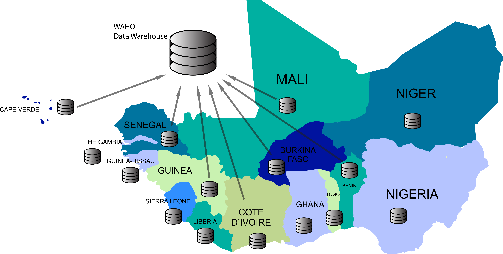

# West Africa Regional Systems and DHIS2

<!--DHIS2-SECTION-ID:user_story_waho-->

**The West African Health Organization (WAHO) uses a regional data
warehouse powered by DHIS2 to consolidate aggregate health data from the
15 ECOWAS (Economic Community of West African States) member states.**

## <!-- {-} -->

**UiO and WAHO: An ongoing HIS-strengthening collaboration since 2011**
UiO has assisted WAHO in building HIS capacity within the organization
and in its member states. In 2013, an online regional data warehouse was
set up using DHIS2.

At WAHO, the focus is on aligning data, disease and epidemiological
surveillance technology, quality control and improved data standards.

## <!-- {-} -->

**Tackling how to better align our data.**The disparity in the size of
our member countries is a challenge. Take Nigeria and Gambia as examples
of a huge country and a tiny country using DHIS2. Now imagine the
challenge WAHO teams face when setting up a system to map data levels
correctly between such hugely different structures, and consequently in
the number and the size of the administrative levels.

## <!-- {-} -->

**Flexible Integrated Architecture.**To address this situation, WAHO has
developed a system called “Flexible Integrated Architecture” which
groups data across three levels: one national level, and two
sub-national administrative levels. The aim is to let each country
decide which administrative levels in their country correspond to each
of these levels in the regional data warehouse. This approach allows for
comparison of data between countries of different size and with
different organizational structures.

## <!-- {-} -->

**“What is WAHO looking to do with the data?”**This is a question we’re
often asked. For a start, we’re collecting data to provide countries
with better visibility about outbreaks of epidemics. When you hear that
there’s been an outbreak of say cholera in a country, you’ve no time to
lose. With WAHO-DHIS2, we have a better chance of making decisions fast
as we can read data, measure, and assess data, and act accordingly. When
there’s an outbreak in a border area, there’s a high risk that
infections will spread into the neighboring country. This is where the
WAHO-DHIS2 technology can be used to share preventive information across
several countries.

## <!-- {-} -->

**Quality missions to get reliable data.**WAHO is actively working with
countries to find the right indicators for their specific context. There
are currently about 80 essential indicators in the regional data
warehouse. They cover many areas such as demographics, disease burden,
health service utilization, health financing, human resources and
epidemic diseases. At the moment it is the epidemiological indicators
that are being reported by countries, but the plan is to expand with the
rest in 2016. There is indeed no one size to fit all and that is why
WAHO is taking things on a case-by-case basis; working out which
countries would benefit the most from certain sets of indicators more
than other countries would. In the long run, if we can identify the
right data measuring tools for each country, the data we will then
collect will be of higher quality, which will drive better decision
making.

The WAHO data warehouse is still in its early days. However, the
organization is on the right track to building a solution that will, we
all hope, bring unity and cohesion to how data is shared in the ECOWAS
region.

