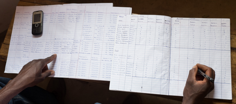
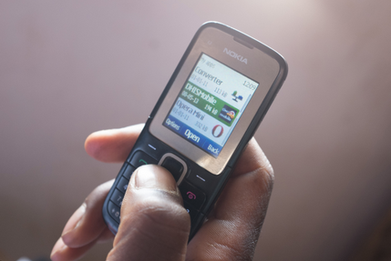
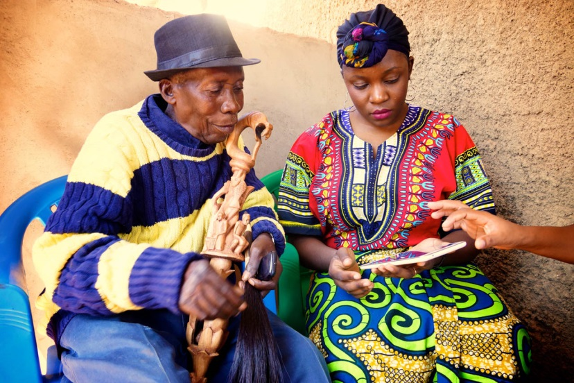
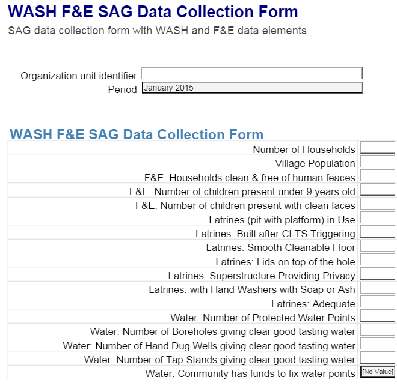
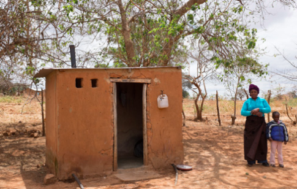

# Zambia WASH: Mobile surveillance using DHIS2

<!--DHIS2-SECTION-ID:user_story_akros-->

**The government of Zambia is actively working towards an end to open
defecation—a huge challenge for many governments. Akros is supporting
the government in this goal through water, sanitation, and hygiene
programs that use mobile surveillance technology at the community level.
The community level data collection and feedback system, which relies on
DHIS2, has demonstrated that over 2.5 million Zambians have gained
access to adequate latrines in rural areas since 2014.**

## Zambia in a few words

Zambia is a landlocked, primarily-rural country in sub-Saharan Africa.
Of its ten provinces, eight are rural. The population relies on a
mixture of construction, agriculture, manufacturing, mining, and other
sectors for economic prosperity. However, in spite of recent economic
growth, as of the 2013-2014 Demographic Health Survey more than half of
the population did not have access to improved sanitation facilities.

## What is WASH?

Water, Sanitation and Hygiene, also called WASH, comprises several
interrelated public health concerns such as access to safe water,
adequate sanitation, and proper hygiene education. Carefully structured
WASH programs can help increase life-expectancy and economic
productivity.

### Tackling Open Defecation

Open defecation is a huge environmental health issue in developing
countries such as Zambia. Defecating in the open, where flies can fly
freely between food and feces, increases the risk of diarrhoeal
diseases.

In an effort to eliminate open defecation, Akros has supported the
Government of Zambia, UNICEF and other development partners to extend a
DHIS2-based WASH data collection platform to more than 20,000 villages.
This system enables government officials and local chiefs to monitor
progress towards the elimination of open defecation in their wards and
chiefdoms in real-time. Village-level WASH data has given local chiefs
and government officials the ability to follow-up with specific villages
that lag behind in the uptake of latrine construction and use—which, for
the first time, has led to multiple open defecation free (ODF) districts
in Zambia.

## What is Akros?

Akros is an NGO that is experienced in the design and implementation of
surveillance systems. Akros supports the implementation of WASH programs
in Zambia through low-cost feature phones and innovative feedback
mechanisms. Akros supports community-level tracking of latrine
construction and uptake across nine of Zambia’s 10 districts.
[www.akros.com](http://www.akros.com).

## Before DHIS2

In 2012 UNICEF began making massive investments in Zambia with its
Community-led Total Sanitation (CLTS) program, a methodology for
mobilizing communities to completely eliminate open defecation (OD).
This program, however, depended on paper records to be collected and
physically delivered to the district level from the villages. This
process could take 6 months or longer and left UNICEF, partners, and the
Ministry of Local Government and Housing with stale and unusable data.

## Utilizing DHIS2 for WASH

When a Zambian-based consultant introduced the Akros country director to
DHIS2, things took a swing in a different direction. DHIS2, or “District
Health Information Software”, is a flexible, open source software
platform used in more than 40 countries. With the help of dashboards,
charts, pivot tables and maps, DHIS2 makes data aggregation and data
visualization very easy to create, understand and share.
<http://www.dhis2.org/>

### Scaling up DHIS2-WASH from 2013 to 2016

In 2013, Akros implemented its first DHIS2 pilot for the WASH project.
Thereafter, the electronic WASH surveillance system was scaled to
additional districts with a vision of eliminating OD countrywide.
Currently the CLTS project has been implemented in 70 districts using
the DHIS2 platform.

#### Stage 1: Champions at the grass roots level

Local stakeholders have played a key role in community level
sensitization campaigns that highlight the dangers of OD. With guidance
from the Government of Zambia and other partners supporting CLTS, at the
village level, volunteers form Sanitation Action Groups (SAGs). These
volunteers are equipped with CLTS data collection sheets and collect
data on household sanitation, trachoma monitoring, and available access
to clean water. Typical survey questions cover areas such as the
existence of a latrine in a household and if that latrine is equipped
with a lid; access to hand washing and water, soap, or ash; access to
bathing shelters; the availability and cleanliness of drinking water,
and so forth. SAGs work closely with selected individuals called
Community Champions (CCs), who collect data from the SAGs and aggregate
and submit the data through their mobile phones to DHIS2.

#### Stage 2: Reporting

The collected paper-based data is checked by the Community Champions.
The data is then submitted via a hand-held device, usually a low-end
feature phone that runs a DHIS-J2ME platform, to the next level in the
process; the Environmental Health Technicians (EHTs). Thanks to Java
technology, the cost of sending data via the DHIS-J2ME platform works
out to be ten times cheaper than using standard text messages.

#### Stage 3: Troubleshooting and verifying data

Once a Community Champion submits aggregated data through their mobile
phones, this data is made available to all key stakeholders who receive
automated HTML performance reports on a given village. The data is then
reported to the next level, the village chief, via an Android DHIS2 app.

#### Stage 4: Data through the Chief’s eyes

With the help of a Data Viewing Widget on a tablet, referred to as the
“Chief App”, the village chief is able to look at the data that his
advisors have gathered and make decisions based on what he sees. The
chief holds his headmen accountable for any irregularities that could
reduce his influence or impinge his reputation. The chief may at times
carry out sanctions against underperforming headsmen, or on the
contrary, give incentives, typically in the form of mobile phone credit,
to high performers.

#### Stage 5: District monitoring

At the district-level the CLTS Focal Point Person (FPP), logs on to
DHIS2 on a monthly basis to monitor ward and village propagation of
improved latrines and progression towards ODF status. This person also
shares relevant information with the District Commissioner and Town
Planner.

#### Stage 6: Quarterly ward meetings and ODF status

Each ward has a quarterly CLTS meeting to allow representatives from all
the villages in the ward to discuss challenges and share successes
towards latrine propagation and progress towards achieving ODF status.
The event serves to engage the SAGs to continue community sensitization
towards achieving ODF status.

On a monthly basis, CCs and EHTs track ODF status of villages in their
wards through their mobile phones, and district officials track ODF
status of villages through their DHIS2 dashboard. The CC, EHT or
district official can select a particular village from a drop-down list,
and can see a bar from 0% to 100% indicating the status of that village
in working towards 100% ODF.

Once a village achieves ODF and is verified, the District CLTS FPP logs
on to DHIS2 and selects “ODF Verified” next to the village’s name, which
changes the color of the village name to green.

### Working in a tribal context

Zambia is a hierarchical society with strict codes about status. There
are roughly 150 chiefdoms. The traditional village chiefs are in charge
of all the decisions in the village and very little can be achieved
without their approval. They are the custodians of the villagers;
ensuring their health and social-economic well-being. Communicating
about DHIS2 and obtaining meaningful results required bringing onboard
the chiefs within each village. Introducing technology through the means
of a tablet was, in some cases, a huge yet surmountable change for
certain chiefs.

### Maintaining an active interest

As the WASH project got underway, a spirit of competition started to
emerge amongst village chiefs. Vying for the best results, the chiefs
soon became actively involved in overseeing the implementation and
follow up of WASH-related activities within their communities. Thanks to
automated DHIS2 data feedback loops such as SMS messages, customized
dashboards, PDF reports and the Chief’s data visualization widget that
could be interpreted extremely easily, even illiterate participants
could access the trends and progress of their community’s efforts.

### Choice of phone technology

One of the first challenges that came up was to get participants up to
speed using mobile phone technology. Initially, participants were given
Galaxy smartphones to work with, but this soon proved to be a bad
choice. The design of the menus and complexity of certain applications
was completely baffling to some. Even typing with a touchscreen was
challenging for certain participants, who had never used a touchscreen
phone. Also, due to the sensitivity of the touchscreens, participants
would inadvertently change the phone settings, such as the keyboard
layout to a different language, and not know how to revert the
situation. Applications running in the background would also consume too
much of the phone’s resources. In sum, due to their limited
battery-life, fragile screens, interface complexity and highly coveted
appearance, smartphones had to be replaced. Low-tech yet robust feature
phones that could run DHIS2 Java-based applications were introduced.
Reporting soon rocketed as a result of this turnaround and the progress
of the WASH program instantly improved.

## Rollout and Adaptation

### Clear, simple processes

Keeping the DHIS2-WASH system simple to use and clear to understand at
all levels was the key to its successful implementation. Data collection
forms, such as the one in the example below, can be completed very
easily by community volunteers who retrieve information in each village.

By keeping data collection sheets simple, by using clear data
indicators, this meant that the data entered in to the system was also
clear and only critical information was retained. As a result, analyzing
and interpreting the data was much more straightforward. Another benefit
of using very basic indicators was that any errors that slipped into the
data could be spotted and rectified fairly simply.

### Defining Roles

Akros has created three detailed end-user capacity assessments: the
Stakeholder Role Rubric, the CLTS Surveillance Protocol and the CLTS
Events Protocol. These documents serve the purpose of defining what each
person does within a program so as to avoid ambiguity about
responsibilities. Furthermore, the documents help to improve, monitor
and assess the implementation of CLTS programs at the different roll out
stages.

#### Stakeholder Role Rubric

This document can enable a Community Health Worker to understand the
full scope of his or her role. For example, they would know that they
would be in charge of decision making in areas covering disease
diagnosis, treatment administration, patient referrals, and commodity
resupply checks. They would also know about the reporting requirements
to follow such as the frequency and method to use.

#### CLTS Surveillance Protocol

The Surveillance Protocol is a document that is used to assign
monitoring methodologies for each event. It is a detailed analysis of
surveillance techniques against each critical event in CLTS deployment.
Responsible parties, periodicity, the role of automated functions and
manual (surveillance officer) functions are all identified.

#### CLTS Events Protocol

The CLTS Events Protocol is a document with a more detailed description
of the critical events to be monitored. Responsible parties,
periodicity, purpose and expected outcomes are identified, along with a
brief narrative for context.

### Promote a sense of responsibility

Promoting a sense of data ownership amongst participants has a great
influence in helping to build up sustainable programs. It is therefore
important to develop standard operating roles, by outlining the tasks
and duties of every person interacting with the system.

Thus by making participants feel responsible for the data they’re in
charge of and by promoting how their role is connected to the successful
outcome of a CLTS project, this helps to maintain the flow of
communication between all of the levels involved, whether it be at
village, ward, constituency, district, province, national or
organizational level.

### Lessons learned

#### Backwards compatibility

Everything has to be backwards compatible to make upgrades into a
smoother process. For example, in 2013, DHIS2 version 2.1.4 was unable
to handle the growing volume of users as more and more districts started
to use WASH. The system had to be upgraded, due to the number of legacy
issues and bugs that were encountered. However, this was not a
straightforward task and meant re-installing applications on all
devices.

#### Using clones of tried and tested WASH programs

Akros learned that it was beneficial to use clones of production
instances as a means to ensure stable implementations of WASH. Upgrades
were performed on the cloned instances and then upgrades were applied to
the production instances. By proceeding in this anticipatory manner,
costs were kept down and troubleshooting was reduced.

#### Use data to drive decision making

Using DHIS2-WASH is one thing; in fact it’s the easiest part. Getting
people to use the data in order to drive decision making is the real
challenge. To achieve this, Akros made it clear that all participants in
a program should understand their role, responsibility and their
intrinsic value within the program. Creating a sense of data ownership
and a sense of accountability was therefore crucial. For example, by
generating DHIS2 reports, district officers had the possibility to make
comments about areas of improvement within their district. This
information was then forwarded to a provincial coordinator who took
action at his or her level.

Lastly, by ensuring that communication channels remained active and were
maintained, Akros was able to see how their CLTS program took on more
importance and credibility, which in turn generated positive results and
recognition in many areas.

