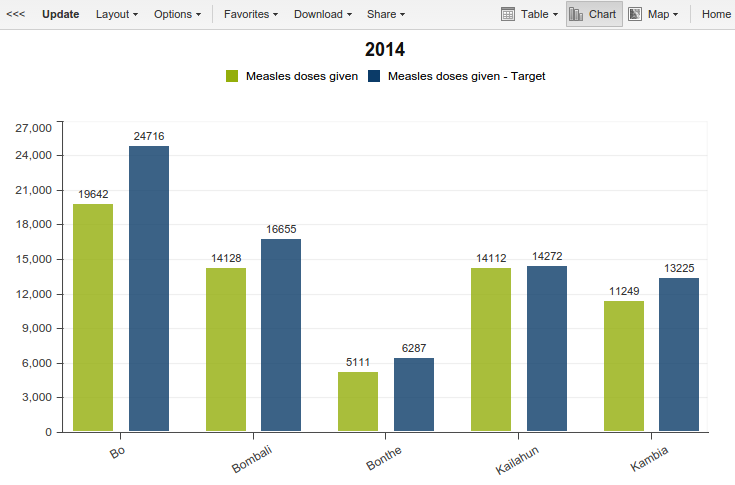

# Setting up targets

**Defining targets is a central activity in many M&E systems. This tutorial explains how you can set up targets in DHIS 2 using regular data elements.**

A question that frequently comes up is how to define targets in DHIS 2. DHIS 2 does not have a specific mechanism for targets. Instead, a viable approach is to utilize regular data elements to capture targets. When you think of it, targets are very similar to data elements in nature - you would typically like to capture them for a time period, a data element and an organisational unit.

Also, by entering raw numbers as opposed to percentages, you will be able to further aggregate the targets in the time or space dimensions, allowing you to do dynamic analysis. As a result, creating a "target" data element for each data element you need to measure and perhaps organizing them in a separate data set make sense.

Note that the target data set could have a different collection frequency than the normal data element. For instance, the normal data could be collected monthly, whereas the target data set could be collected yearly. You could also collect the target data set at a higher level in the hierarchy compared to the normal data set.

The huge benefit of using regular data elements for capturing targets is that it becomes immediately available in all of the data analysis apps. You can easily create for example charts and pivot tables where you can visually compare the achieved numbers to the target numbers. You can in other words use the target data in the exact same way you use regular data, creating column, line and area charts.

Lets look at an example: Let's say you capture a data element "Measles doses given". Now you want to enter target numbers into the system.

- Start by creating a data element "Measles doses given - Target", and similarly for other elements you need.
- Include the data elements into a data set. The data set could if desired be collected yearly and at a higher level in the organisation unit hierarchy.
- Enter target numbers through the data entry module, or use the import module or Web API to import your data.
- Update analytics tables and go to the Data Visualizer app.
- Now create a column chart for the last year where you set the normal and target data elements as series and compare organisation units as categories.

Happy customization!
