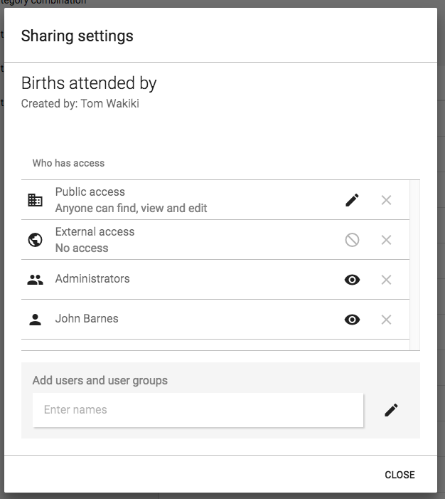

# About sharing of objects

<!--DHIS2-SECTION-ID:sharing-->

This chapter discusses the sharing of entities feature in DHIS2.

## Sharing of objects

Many objects in DHIS2, like reports, charts, maps and indicators, can be
shared. DHIS2 supports sharing of metadata or sharing of data. Sharing of
metadata means making an object, like a report, available for reading or
modification to a group of users or to everyone. Sharing of data means
making the actual data captured available to others, and controlling who
can capture that kind of data. For instance for reports, the sharing
dialog can be opened by clicking on the "Sharing settings" button next
to each report in the list. Implementers can use this feature to allow
access to certain objects to only certain user groups. Users can use the
feature to decide who they would like to share objects (such as pivot
tables, charts, dashboards, etc) with.

If sharing is supported for a particular class of objects, a dialog will
be available called "Sharing settings", usually available by clicking on
the name of the object or in the analytics tools, through an icon (Share
with other people). Once you have accessed the sharing settings for the
object you wish to share, a dialog similar to the one below will be
shown.

You can share your report with everyone or with a number of user groups.
"External access" can be enabled to allow this resource to be shared
with everyone, including users which cannot logon to DHIS2. This is
useful for sharing public resources with external systems. Note, that if
objects are shared externally, then they are visible to anyone who has
access to the URL which provides the resource without any login
credentials.

Next to "Public access" you can choose your public access option under
"METADATA": "No access", "Can view only" or "Can edit and view", and
under "DATA": "No access", "Can view data", "Can capture data". Public
access refers to users which are logged into the system. Edit also
implies deleting the report.

To share with a group, simply start typing the name of the group and the
"Search for user groups" input field and select your desired group.
Click on the "+" icon next to the input field to share with that group.
For each group you can set an access option, similar to public access.

Sharing with a user group implies that all users in that group will get
access to the shared object. To create a user group you can go to the
dashboard module and click on "Groups". This will lead you to the list
of groups where you can click "Add new" in the top right corner.
Creating user groups is open for everyone from the dashboard module.

## Metadata sharing and access control

The objects which support metadata sharing are indicator, indicator
group, indicator group set, data dictionary, data set, program, standard
report, resource, report table, chart, map and user group. Out of those
objects, report table, chart, map and user group are open for everyone
to create privately. Private means that the objects are available only
to yourself or potentially to a number of user groups if you choose to
share the object. These objects are referred to as "open" objects and
can be created by all users. The remaining objects require that your
user account has the authority to create them. These objects are
referred to as "non-open" objects.

A user can be granted the authority to create publicly accessible
objects or privately accessible objects. In order to create a publicly
accessible object (available for viewing or editing by anyone) your user
account must have the authority to do so. As an example, to create a
publicly accessible chart, your user must have the "Create public chart"
authority granted. The authority to create private objects applies only
to non-open objects. For example, to allow a user to create indicators
which will only be accessible to that user and not to everyone, the user
can be issued with the "Create private indicator" authority.

Sharing a non-open object with another person and let her edit the
object requires that the person's user account has the authority for
updating that type of objects granted. For instance, if you want to let
another person edit your indicator, that person's user account must have
the "Update indicator" authority granted. This does not apply for open
objects.

When you create a new object it will automatically become viewable for
everyone if your user account has the authority to create public
objects. As an example, if you create a standard report and you have the
"Create public standard report" authority granted, the report will
become viewable for everyone. If you do not have that authority granted
the report will be viewable only to yourself. After you have created an
object, you may navigate to the "Sharing settings" dialog and set your
desired access control level.

If you need a user account which is able to view absolutely all objects
you can create a user role with the "ALL" authority and assign a user to
that role. If you need to switch between a "complete" view of objects
and a "personal" view of objects it is recommended to create two user
accounts, one assigned with the "ALL" authority and one without.

## Metadata sharing applied

The metadata sharing functionality is useful in several scenarios. One
use-case is setting up a DHIS2 instance for a global organisation with
operations in multiple countries. Typically the organisation has a set
of global data sets, indicators and reports which should apply to all
countries, while all countries will have the need for country-specific
data sets, indicators and reports. In this scenario the following
approach could work:

  - Set up one user group for global personnel.

  - Set up a user group for personnel in each country.

  - Create global data sets and reports, make them viewable for everyone
    and editable for the global user group only.

  - Create country-specific data sets and reports, make them viewable
    and editable for the country user group and the global user group
    only.

This way, the global indicators and reports could be viewed and analysed
by everyone, but maintained by the global user group only. The
country-specific data sets, indicators and reports could be viewed and
maintained by the country and global personnel, without being visible or
impacting the system for other countries in the organisation.

A similar approach could work for a scenario with a donor, multiple
funding agencies and implementing partners in a country, where user
groups could be set up for each of those entities. That way each
implementing partner could create and share their reports within their
organisation without affecting or allowing access to others. Reports
could also be shared with supervisors and funding agencies at the end of
reporting periods.

Another use-case is a country department of health with multiple health
programs. Typically there is a need for having general reports and
charts for the department while allowing the health programs to develop
specific reports and charts for internal use. This can be achieved by
creating user groups for each health program. Later, when developing
reports and charts, these can be made viewable and editable to the
program user group only. This way the reports will not be visible to
other programs and users. This is beneficial because the reports are
kept internal to the program and because the visible list of reports of
other users are kept shorter and more relevant.

## Data sharing and access control

The objects which support data sharing are data set, tracked entity
type, program and program stage. The purpose of data sharing is to
control which users can capture data, and which users can see the data
captured.

### Data sharing for event based programs

Applies to the object types of tracked entity type, program and program
stage. When working with single event programs in event capture, a user
will have to possess the "DATA:Can view data" sharing level to see the
program and its data. Without this sharing level, the program and its
data will not be visible to the user. When working with tracker programs
in tracker capture, the user will need to have "DATA:Can view data" to
both the tracked entity type and program. In case of a tracker program,
the user will also need "DATA:Can view data" on each program stage
individually to be able to see the data within the program. To capture
data the user needs the "DATA:Can capture data" sharing level.

> **Note**
>
> To see and capture data for a program, a data capture user also needs
> to report for an organisation unit to where the program has been
> assigned.

<table>
<caption>Data sharing for tracker programs</caption>
<colgroup>
<col style="width: 15%" />
<col style="width: 30%" />
<col style="width: 30%" />
<col style="width: 23%" />
</colgroup>
<thead>
<tr class="header">
<th>Object type</th>
<th>Can view data</th>
<th>Can capture data</th>
<th>Comment</th>
</tr>
</thead>
<tbody>
<tr class="odd">
<td>
<strong>Tracked entity type</strong>
</td>
<td><ul>
<li>
Search for tracked entities with this tracked entity type.
</li>
<li>
See tracked entity type attribute values for this tracked entity type.
</li>
</ul></td>
<td><ul>
<li>
Edit visible tracked entity attributes for tracked entity instances of this type.
</li>
<li>
Register/create new tracked entity instances of this type.
</li>
<li>
Delete tracked entity instances of this type.
</li>
<li>
Deactivate/reactivate tracked entity instances of this type.
</li>
</ul></td>
<td></td>
</tr>
<tr class="even">
<td>
<strong>Program</strong>
</td>
<td><ul>
<li>
Search for tracked entities within this program.
</li>
<li>
See tracked entity attributes specific to this program.
</li>
<li>
See enrollment details for the program.
</li>
<li>
See notes for the enrollment.
</li>
</ul></td>
<td><ul>
<li>
Enroll into the program.
</li>
<li>
Edit enrollment details for the program.
</li>
<li>
Complete/reopen enrollments into the program.
</li>
<li>
Add notes for the program.
</li>
<li>
Edit relationships for the program.
</li>
<li>
Send message to tracked entity instance.
</li>
<li>
Delete enrollments in the program.
</li>
</ul></td>
<td>
Both &quot;Can view data&quot; and &quot;Can capture data&quot; also requires the user to have &quot;Can view data&quot; for the tracked entity type.
</td>
</tr>
<tr class="odd">
<td>
<strong>Program stage</strong>
</td>
<td><ul>
<li>
See the program stage and its events and data within an enrollment.
</li>
<li>
See the program stage notes.
</li>
</ul></td>
<td><ul>
<li>
Add/schedule/refer a new event within the program stage.
</li>
<li>
Complete/reopen the events within the program stage.
</li>
<li>
Edit tracked entity data values within events in the program stage.
</li>
<li>
Add notes for events in the program stage.
</li>
<li>
Delete events in the program stage.
</li>
</ul></td>
<td>
Both &quot;Can view data&quot; and &quot;Can capture data&quot; also requires the user to have &quot;Can view data&quot; for the program and the tracked entity type.
</td>
</tr>
</tbody>
</table>

<table>
<caption>Data sharing for single event programs</caption>
<colgroup>
<col style="width: 15%" />
<col style="width: 30%" />
<col style="width: 30%" />
<col style="width: 23%" />
</colgroup>
<thead>
<tr class="header">
<th>Object type</th>
<th>Can view data</th>
<th>Can capture data</th>
<th>Comment</th>
</tr>
</thead>
<tbody>
<tr class="odd">
<td>
<strong>Program</strong>
</td>
<td><ul>
<li>
See list of events within the program.
</li>
<li>
See tracked entity data values for events in the program.
</li>
</ul></td>
<td><ul>
<li>
Add new events into the program.
</li>
<li>
Edit data for events in the program.
</li>
<li>
Delete events in the program.
</li>
</ul></td>
<td></td>
</tr>
</tbody>
</table>

### Data sharing for data sets

Applies to the object types of data set and category option . When
working in Data Entry app, the user will need to have "DATA:Can capture
data" to both see and capture data in the data set. To save data for an
entry field in Data Set users need:

1.  Authority: F\_DATAVALUE\_ADD ( Can add data value )

2.  Data Set is shared with "Data: Can capture data"

3.  Data Element is shared with "Metadata: Can View"

4.  All Category Options used by selected Data Set are shared with
    "Data: Can capture data"

> **Note**
>
> To see and capture data for a data set, a data capture user also needs
> to report for an organisation unit to where the data set has been
> assigned.

<table>
<caption>Data sharing for data sets</caption>
<colgroup>
<col style="width: 15%" />
<col style="width: 30%" />
<col style="width: 30%" />
<col style="width: 23%" />
</colgroup>
<thead>
<tr class="header">
<th>Object type</th>
<th>Can view data</th>
<th>Can capture data</th>
<th>Comment</th>
</tr>
</thead>
<tbody>
<tr class="odd">
<td>
<strong>Data set</strong>
</td>
<td><ul>
<li>
View Data Set's data in Analytics
</li>
</ul></td>
<td><ul>
<li>
Can see DataSet in Data Entry app
</li>
<li>
Can save data for Data Set using API
</li>
</ul></td>
<td>
For saving data value in Data Entry app, users also need &quot;Can capture data&quot; for Category Options within selected Data Set.
</td>
</tr>
<tr class="even">
<td><strong>CategoryOption</strong></td>
<td><ul>
<li>
Can view data values belong to shared Category Option in analytics
</li>
</ul></td>
<td><ul>
<li>
Can save data value for input fields in Data Entry app which belongs to shared Category Options.
</li>
</ul></td>
<td>For CategoryOptionCombo and AttributeOptionCombo to be writeable, all belongs CategoryOptions must be shared with &quot;Can capture data&quot;.</td>
</tr>
</tbody>
</table>
