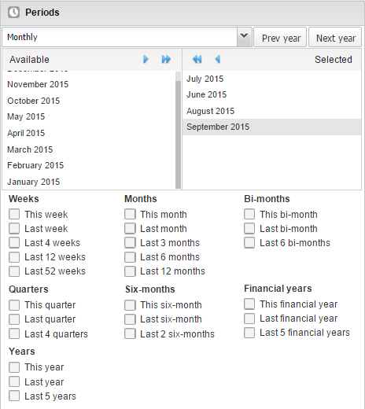
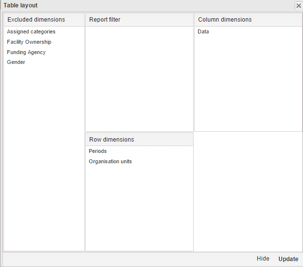
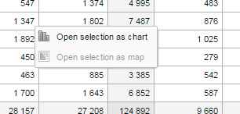

# Analyze data in pivot tables

<!--DHIS2-SECTION-ID:pivot-->

## About the Pivot Table app

<!--DHIS2-SECTION-ID:pivot_about-->

With the **Pivot Table** app, you can create pivot tables based on all
available data dimensions in DHIS2. A pivot table is a dynamic tool for
data analysis which lets you summarize and arrange data according to its
dimensions. Examples of data dimensions in DHIS2 are:

  - data dimension itself (for example data elements, indicators and
    events)

  - periods (representing the time period for the data)

  - organisation hierarchy (representing the geographical location of
    the data)

From these dimensions you can freely select *dimension items* to include
in the pivot table. You can create additional dimensions in DHIS2 with
the group set functionality. This allows for different aggregation
pathways, such as aggregation by "Partner" or facility type.

A pivot table can arrange data dimensions on *columns*, *rows*, and as
*filters*. When you place a data dimension on columns, the pivot table
will display one column per dimension item. If you place multiple data
dimensions on columns, the pivot table displays one column for all
combinations of the items in the selected dimensions. When you place a
data dimension on rows, the pivot table displays one row per dimension
item in a similar fashion. The dimensions you select as filters will not
be included in the pivot table, but will aggregate and filter the table
data based on the selected filter items.

> **Tip**
>
>   - You must select at least one dimension on columns or rows.
>
>   - You must include at least one period.
>
>   - Data element group sets and reporting rates can't appear in the
>     same pivot table.
>
>   - A pivot table can't contain more than the maximum number of
>     analytic records which have been specified in the system settings.
>     The maximum number of records could also be constrained by the
>     maximum RAM which is available to your browser. You will be
>     prompted with a warning if your requested table exceeds a
>     particular size. From this prompt, you can either cancel the
>     request or continue building the table. Consider making smaller
>     tables instead of one table which displays all of your data
>     elements and indicators together.
>
>   - The **Pivot Table** app supports drill-down and up for periods and
>     organisation unit. This means that you can for example drill down
>     from yearly periods to quarters, months and weeks inside a pivot
>     table. You can also drill down from the global organisation unit
>     to countries, provinces and facilities.

## Create a pivot table

<!--DHIS2-SECTION-ID:pivot_create-->

1.  Open the **Pivot Table** app.

2.  In the menu to the left, select the dimension items you want to
    analyse, for example data elements or indicators.

3.  Click **Layout** and arrange the data dimensions as columns, rows
    and filters.

    You can keep the default selection if you want.

4.  Click **Update**.

In this example, indicators are listed as columns and periods as rows.

### Select dimension items

The left menu lists sections for all available data dimensions. From
each section you can select any number of dimension items. As an
example, you can open the section for data elements and select any
number of data elements from the available list. You can select an item
by marking it and clicking on the arrow in the section header or simply
double-clicking on the item. Before you can use a data dimension in your
pivot table you must at least select one dimension item. If you arrange
a dimension as columns or rows but do not select any dimension items,
the dimension is ignored.

You must choose at least one data dimension type to create a pivot
table. The available types are described in this table:

Table: Data dimension types

| Data dimension type | Definition | Examples |
|---|---|---|
| Indicators | An indicator is a calculated formula based on data elements. | Coverage of immunization across a specific district. |
| Data elements | Represents the phenomenon for which data has been captured. | Number of malaria cases; number of BCG doses given. |
| Data sets | A collection of data elements grouped for data collection. You can select :   * **Reporting rates**: the percentage of actual reports compared to the expected number of reports  * **Reporting rates on time**: the reporting rates based on timely form submissions. A timely submission must happen within a number of days after the reporting period.  * **Actual reports**: the actual number of reports  * **Actual reports on time**: the actual number of reports based on timely form submissions. A timely submission must happen within a number of days after the reporting period.  * **Expected reports**: the number of expected reports based on organisation units where the data set and the reporting frequency has been assigned. | Reporting rates for immunization and morbidity forms. |
| Event data items | A data element that is part of a program representing events that have been captured. | Average weight and height for children in a nutrition program. |
| Program indicators | A calculated formula based on data elements in a program representing events. | Average BMI score for children in a nutrition program. |

You can combine these dimensions to display for example aggregate data
with reporting rates, or event data items together with program
indicators, all in the same pivot tables. For the "data element" data
dimension, you are also able to select "Totals" and "Details", which
will allow you to view different category combination options together
on the same pivot table.

For the period dimension you can choose between using fixed periods or
relative periods. An example of a fixed period is "January 2012". To
select fixed periods start by selecting a period type from the period
type list. You can then select periods from the list of available
periods.

Relative periods are periods relative to the current date. Examples of
relative periods are "Last month", "Last 12 months", "Last 5 years".
Relative periods can be selected by ticking the check-boxes next to each
period. The main advantage of using relative periods is that when you
save a pivot table favorite, it will stay updated with the latest data
as time goes by without the need for constantly updating it.

For the organisation unit dimension you can select any number of
organisation units from the hierarchy. To select all organisation units
below a specific parent organisation unit, right click and click "Select
all children". To manually select multiple organisation units, click and
hold the **Ctrl** key while clicking on organisation units. You can tick
"User org unit", "User sub-units" or "User sub-x2-units" in order to
dynamically insert the organisation unit or units associated with your
user account. This is useful when you save a pivot table favorite and
want to share it with other users, as the organisation units linked with
the other user's account will be used when viewing the favorite.

Dynamic dimensions can consist of organisation unit group sets, data
element group sets, or category option group sets which have been
configured with the type of "Disaggregation". Once the group sets have
been configured, they will be come available in the pivot tables, and
can be used as additional analysis dimensions, for instance to analyse
aggregate data by Type of organisation unit or Implementing partner.
Dynamic dimensions work the same as fixed dimensions.

> **Tip**
>
> Some dynamic dimensions may contain many items. This can cause issues
> with certain browsers due to the length of the URL when many dimension
> members are selected. A special "All" check box is available for
> dynamic dimensions, which allows you to include all available
> dimensions implicitly in your pivot table, without specifying each and
> every dimension member.

### Modify pivot table layout

After selecting data dimensions it is time to arrange your pivot table.
Click "Layout" in the top menu to open the layout screen. In this screen
you can position your data dimensions as table columns, rows or filters
by clicking and dragging the dimensions from the dimensions list to the
respective column, row and filter lists. You can set any number of
dimensions in any of the lists. For instance, you can click on
"Organisation units" and drag it to the row list in order to position
the organisation unit dimension as table rows. Note that indicators,
data elements and data set reporting rates are part of the common "Data"
dimension and will be displayed together in the pivot table. For
instance, after selecting indicators and data elements in the left menu,
you can drag "Organisation Unit" from the available dimensions list to
the row dimension list in order to arrange them as rows in the pivot
table.

After you have set up your pivot table you can click "Update" to render
your pivot table, or click "Hide" to hide the layout screen without any
changes taking effect. Since we in our example have selected both the
period and organisation unit dimension as rows, the pivot table will
generate all combinations of the items in these dimensions and produce a
table like this:

## Change the display of your pivot table

<!--DHIS2-SECTION-ID:pivot_change_display-->

1.  Open the **Pivot Table** app.

2.  Create a new pivot table or open a favorite.

3.  Click **Options**.

4.  Set the options as required.

    Table: Pivot table options

    || Option | Description |
    |---|---|---|
    | **Data** | **Show column totals**       **Show row totals** | Displays total values in the table for each row and column, as well as a total for all values in the table. |
    || **Show column sub-totals**       **Show row sub-totals** | Displays subtotals in the table for each dimension.       If you only select one dimension, subtotals will be hidden for those columns or rows. This is because the values will be equal to the subtotals. |
    || **Show dimension labels** | Shows the dimension names as part of the pivot tables. |
    || **Hide empty rows** | Hides empty rows from the table. This is useful when you look at large tables where a big part of the dimension items don't have data in order to keep the table more readable. |
    || **Hide empty columns** | Hides empty columns from the table. This is useful when you look at large tables where a big part of the dimension items don't have data in order to keep the table more readable. |
    || **Skip rounding** | Skips the rounding of data values, offering the full precision of data values. Can be useful for finance data where the full dollar amount is required. |
    || **Aggregation type** | The default aggregation operator can be over-ridden here, by selecting a different aggregation operator. Some of the aggregation types are **Count**, **Min** and **Max**. |
    || **Number type** | Sets the type of value you want to display in the pivot table: **Value**, **Percentage of row** or **Percentage of column**.       The options **Percentage of row** and**Percentage of column** mean that you'll display values as percentages of row total or percentage of column total instead of the aggregated value. This is useful when you want to see the contribution of data elements, categories or organisation units to the total value. |
    || **Measure criteria** | Allows for the data to be filtered on the server side.       You can instruct the system to return only records where the aggregated data value is equal, greater than, greater or equal, less than or less or equal to certain values.       If both parts of the filter are used, it's possible to filter out a range of data records. |
    | **Events** | **Include only completed events** | Includes only completed events in the aggregation process. This is useful for example to exclude partial events in indicator calculations. |
    | **Organisation units** | **Show hierarchy** | Shows the name of all ancestors for organisation units, for example "Sierra Leone / Bombali / Tamabaka / Sanya CHP" for Sanya CHP.       The organisation units are then sorted alphabetically which will order the organisation units according to the hierarchy.       When you download a pivot table with organisation units as rows and you've selected **Show hierarchy**, each organisation unit level is rendered as a separate column. This is useful for example when you create Excel pivot tables on a local computer. |
    | **Legend** | **Apply legend** | Applies a legend to the values. This mean that you can apply a colour to the values.       Select **By data item** to color the table cells individually according to each data element or indicator.       You configure legends in the **Maintenance** app. |
    || **Style** | Colors the text or background of cells in pivot tables based on the selected legend.       You can use this option for scorecards to identify high and low values at a glance. |
    | **Style** | **Display density** | Controls the size of the cells in the table. You can set it to **Comfortable**, **Normal** or **Compact**.       **Compact** is useful when you want to fit large tables into the browser screen. |
    || **Font size** | Controls the size of the table text font. You can set it to **Large**, **Normal** or **Small**. |
    || **Digit group separator** | Controls which character to separate groups of digits or "thousands". You can set it to **Comma**, **Space** or **None**. |
    | **General** | **Table title** | Type a title here to display it above the table. |
    | **Parameters (for standard reports only)** |     **Note**      You create standard reports in the **Reports** app.      In the **Pivot Table** app you set which parameters the system should prompt the user for. ||
    || **Reporting period** | Controls whether to ask user to enter a report period. |
    || **Organisation unit** | Controls whether to ask user to enter an organisation unit. |
    || **Parent organisation unit** | Controls whether to ask user to enter a parent organisation unit. |
    || **Include regression** | Includes a column with regression values to the pivot table. |
    || **Include cumulative** | Includes a column with cumulative values to the pivot table. |
    || **Sort order** | Controls the sort order of the values. |
    || **Top limit** | Controls the maximum number of rows to include in the pivot table. |

5.  Click **Update**.

## Manage favorites

Saving your charts or pivot tables as favorites makes it easy to find
them later. You can also choose to share them with other users as an
interpretation or display them on the dashboard.

You view the details and interpretations of your favorites in the
**Pivot Table**, **Data Visualizer**, **Event Visualizer**, **Event
Reports** apps. Use the **Favorites** menu to manage your favorites.

### Open a favorite

1.  Click **Favorites** \> **Open**.

2.  Enter the name of a favorite in the search field, or click **Prev**
    and **Next** to display favorites.

3.  Click the name of the favorite you want to open.

### Save a favorite

1.  Click **Favorites** \> **Save as**.

2.  Enter a **Name** and a **Description** for your favorite. The description field supports a rich text format, see the interpretations section for more details.

3.  Click **Save**.

### Rename a favorite

1.  Click **Favorites** \> **Rename**.

2.  Enter the new name for your favorite.

3.  Click **Update**.

### Write an interpretation for a favorite

An interpretation is a link to a resource with a description of the data
at a given period. This information is visible in the **Dashboard** app.
To create an interpretation, you first need to create a favorite. If
you've shared your favorite with other people, the interpretation you
write is visible to those people.

1.  Click **Favorites** \> **Write interpretation**.

2.  In the text field, type a comment, question or interpretation. You
    can also mention other users with '@username'. Start by typing '@'
    plus the first letters of the username or real name and a mentioning
    bar will display the available users. Mentioned users will receive
    an internal DHIS2 message with the interpretation or comment. You
    can see the interpretation in the **Dashboard** app.

    It is possible to format the text with **bold**, *italic* by using the
    Markdown style markers \* and \_ for **bold** and *italic* respectively.
    Keyboard shortcuts are also available: Ctrl/Cmd + B and Ctrl/Cmd + I. A
    limited set of smilies is supported and can be used by typing one of the
    following character combinations: :) :-) :( :-( :+1 :-1. URLs are
    automatically detected and converted into a clickable link.

3.  Search for a user group that you want to share your favorite with,
    then click the **+** icon.

4.  Change sharing settings for the user groups you want to modify.

      - **Can edit and view**: Everyone can view and edit the object.

      - **Can view only**: Everyone can view the object.

      - **None**: The public won't have access to the object. This
        setting is only applicable to **Public access**.

5.  Click **Share**.

### Subscribe to a favorite

When you are subscribed to a favorite, you receive internal messages
whenever another user likes/creates/updates an interpretation or
creates/update an interpretation comment of this favorite.

1.  Open a favorite.

2.  Click **\>\>\>** in the top right of the workspace.

3.  Click on the upper-right bell icon to subscribe to this favorite.

### Create a link to a favorite

1.  Click **Favorites** \> **Get link**.

2.  Select one of the following:

      - **Open in this app**: You get a URL for the favorite which you
        can share with other users by email or chat.

      - **Open in web api**: You get a URL of the API resource. By
        default this is an HTML resource, but you can change the file
        extension to ".json" or ".csv".

### Delete a favorite

1.  Click **Favorites** \> **Delete**.

2.  Click **OK**.

### View interpretations based on relative periods

To view interpretations for relative periods, such as a year ago:

1.  Open a favorite with interpretations.

2.  Click **\>\>\>** in the top right of the workspace.

3.  Click an interpretation. Your chart displays the data and the date
    based on when the interpretation was created.To view other
    interpretations, click them.

## Download data from a pivot table

<!--DHIS2-SECTION-ID:pivot_download_data-->

### Download table layout data format

To download the data in the current pivot table:

1.  Click **Download**.

2.  Under **Table layout**, click the format you want to download:
    Microsoft Excel, CSV or HTML.

    The data table will have one column per dimension and contain names
    of the dimension items.

    > **Tip**
    >
    > When you download a pivot table with organisation units as rows
    > and you've selected **Show hierarchy** in **Table options**, each
    > organisation unit level is rendered as a separate column. This is
    > useful for example when you create Excel pivot tables on a local
    > computer.

> **Tip**
>
> You can create a pivot table in Microsoft Excel from the downloaded
> Excel file.

### Download plain data source format

You can download data in the current pivot table in JSON, XML, Excel,
and CSV as plain data formats with different identification schemes (ID,
Code, and Name). The data document uses identifiers of the dimension
items and opens in a new browser window to display the URL of the
request to the Web API in the address bar. This is useful for developers
of apps and other client modules based on the DHIS2 Web API or for those
who require a plan data source, for instance for import into statistical
packages.

To download plain data source formats:

1.  Click **Download**.

2.  Under **Plain data source**, click the format you want to download.

    Table: Available formats

    | Format | Action | Description |
    |---|---|---|
    | JSON | Click **JSON** | Downloads JSON format based on ID property.       You can also download JSON format based on **Code** or **Name** property. |
    | XML | Click **XML** | Downloads XML format based on ID property.       You can also download XML format based on **Code** or **Name** property. |
    | Microsoft Excel | Click **Microsoft Excel** | Downloads XML format based on ID property.       You can also download Microsoft Excel format based on **Code** or **Name** property. |
    | CSV | Click **CSV** | Downloads CSV format based on ID property.       You can also download CSV format based on **Code** or **Name** property. |
    | JRXML | Put the cursor on **Advanced** and click **JRXML** | Produces a template of a Jasper Report which can be further customized based on your exact needs and used as the basis for a standard report in DHIS2. |
    | Raw data SQL | Put the cursor on **Advanced** and click **Raw data SQL** | Provides the actual SQL statement used to generate the pivot table. You can use it as a data source in a Jasper report, or as the basis for an SQL view. |

### Download a CSV format without rendering data in the web browser

You can download data in CSV format directly without rendering the data
in the web browser. This helps to reduce any constraints in the system
settings that has been set with regards to the maximum number of
analytic records. This lets you download much larger batches of data
that you can use for later offline analysis.

To download data in CSV format without first rendering data in the web
browser:

1.  Click the arrow beside **Update**.

    

2.  Click **CSV** to download the format based on ID property.

    The file downloads to your computer.

    > **Tip**
    >
    > You can also download CSV format based on **Code** or **Name**
    > property.

## Embed a pivot table in an external web page

<!--DHIS2-SECTION-ID:pivot_embed-->

Certain analysis-related resources in DHIS2, like pivot tables, charts
and maps, can be embedded in any web page by using a plug-in. You will
find more information about the plug-ins in the Web API chapter in the
*DHIS2 Developer Manual*.

To generate a HTML fragment that you can use to display the pivot table
in an external web page:

1.  Click **Embed**.

2.  Click **Select** to highlight the HTML fragment.

## Visualize pivot table data as a chart or a map

<!--DHIS2-SECTION-ID:pivot_integration-->

When you have made a pivot table you can switch between pivot table,
chart and map visualization of your data.

### Open a pivot table as a chart

1.  Click **Chart** \> **Open this table as chart**.

    Your current pivot table opens as a chart.

### Open a pivot table selection as a chart

If you want to visualize a small part of your pivot table as a chart you
can click directly on a value in the table instead opening the whole
table.

1.  In the pivot table, click a value.

    

2.  To verify the selection, hold the cursor over **Open selection as
    chart**. The highlighted dimension headers in the table indicate
    what data will be visualized as a chart.

3.  Click **Open selection as chart**.

### Open a pivot table as a map

1.  Click **Chart** \> **Open this table as map**

    Your current pivot table opens as a map.

### Open a pivot table selection as a map

1.  In the pivot table, click a value.

    A menu displays.

2.  Click **Open selection as map**.

    Your selection opens as a map.
