# Configure report functionality

<!--DHIS2-SECTION-ID:setting_up_reporting-->

## Data sources for reporting

<!--DHIS2-SECTION-ID:reporting_data_sources-->

### Types of data and aggregation

In the bigger picture of HIS terminology all data in DHIS2 are usually
called aggregated as they are aggregates (e.g. monthly summaries) of
medical records or some kind of service registers reported from the
health facilities. Aggregation inside DHIS2 however, which is the topic
here, is concerned with how the raw data captured in DHIS2 (through data
entry or import)are further aggregated over time (e.g. from monthly to
quarterly values) or up the organisational hierarchy (e.g. from facility
to district values).

#### Terminology

  - *Raw data* refers to data that is registered into the DHIS2 either
    through data entry or data import, and has not been manipulated by
    the DHIS2 aggregation process. All these data are stored in the
    table (or Java object if you prefer) called DataValue.

  - *Aggregated data* refers to data that has been aggregated by the
    DHIS2, meaning it is no longer raw data, but some kind of aggregate
    of the raw data.

  - *Indicator values* can also be understood as aggregated data, but
    these are special in the way that they are calculated based on user
    defined formulas (factor \* numerator/denominator). Indicator values
    are therefore processed data and not raw data, and are located in
    the aggregatedindicatorvalue table/object. Indicators are calculated
    at any level of the organisational hierarchy and these calculations
    are then based on the aggregated data values available at each
    level. A level attribute in the aggregateddatavalue table refers to
    the organisational level of the orgunit the value has been
    calculated for.

  - *Period and Period type* are used to specify the time dimension of
    the raw or aggregated values, and data can be aggregated from one
    period type to another, e.g. from monthly to quarterly, or daily to
    monthly. Each data value has one period and that period has one
    period type. E.g. data values for the periods Jan, Feb, and Mar
    2009, all of the monthly period type can be aggregated together to
    an aggregated data value with the period Q1 2009 and period type
    Quarterly.

#### Basic rules of aggregation

##### What is added together

Data (raw) can be registered at any organisational level, e.g. at
national hospital at level 2, a health facility at level 5, or at a
bigger PHC at level 4. This varies form country to country, but DHIS2 is
flexible in allowing data entry or data import to take place at any
level. This means that orgunits that themselves have children can
register data, sometimes the same data elements as their children units.
The basic rule of aggregation in DHIS2 is that *all raw data is
aggregated together*, meaning data registered at a facility on level 5
is added to the data registered for a PHC at level 4.

It is up to the user/system administrator/designer to make sure that no
duplication of data entry is taking place and that e.g. data entered at
level 4 are not about the same services/visits that are reported by
orgunit children at level 5. 

> **NOTE**
>
> In some cases you want to have
duplication of data in the system, but in a controlled manner. E.g. when
you have two different sources of data for population estimates, both
level 5 catchment population data and another population data source for
level 4 based on census data (because sum of level 5 catchments is not
always the same as level 4 census data). Then you can specify using
advanced aggregation settings (see further down) that the system should
e.g. not add level 5 population data to the level 4 population data, and
that level 3,2,1 population data aggregates are only based on level 4
data and does not include level 5 data.

##### How data gets added together

How data is aggregated depends on the dimension of aggregation (see
further down).

Along the orgunit level dimension data is always summed up; i.e. simply added
together. Note that raw data is never percentages, and therefore can be
summed together. Indicator values that can be percentages are treated
differently (re-calculated at each level, never summed up).

Along the time dimension there are several possibilities, the two most
common ways to aggregate are sum and average. The user can specify for
each data element which method to use by setting the aggregation
operator (see further down). Monthly service data are normally summed
together over time, e.g. the number of vaccines given in a year is the
sum of the vaccines given for each month of that year. For population,
equipment, staff and other kind of what is often called semi-permanent
data the average method is often the one to use, as, e.g. 'number of
nurses' working at a facility in a year would not be the sum of the two
numbers reported in the six-monthly staffing report, but rather the
average of the two numbers. More details further down under 'aggregation
operators'.

#### Dimensions of aggregation

##### Organisational units and levels

Organisational units are used to represent the 'where' dimension
associated with data values. In DHIS2, organisational units are arranged
in a hierarchy, which typically corresponds to the hierarchical nature
of the organisation or country. Organisational unit levels correspond to
the distinct levels within the hierarchy. For instance, a country may be
organized into provinces, then districts, then facilities, and then
sub-centres. This organisational hierarchy would have five levels.
Within each level, a number of organisational units would exist. During
the aggregation process, data is aggregated from the lower
organisational unit levels to higher levels. Depending on the
aggregation operator, data may be 'summed' or 'averaged' within a given
organisational unit level, to derive the aggregate total for all the
organisational units that are contained within a higher level
organisational unit level. For instance, if there are ten districts
contained in a province and the aggregation operator for a given data
element has been defined as 'SUM', the aggregate total for the province
would be calculated as the sum of the values of the individual ten
districts contained in that province.

##### Period

Periods are used to represent the 'when' dimension associated with data
values. Data can easily be aggregated from weeks to months, from months
to quarters, and from quarters to years. DHIS2 uses known rules of how
these different intervals are contained within other intervals (for
instance Quarter 1 2010 is known to contain January 2010, February 2010
an March 2010) in order to aggregate data from smaller time intervals,
e.g. weeks, into longer time intervals, e.g. months.

##### Data Elements and Categories

The data element dimension specifies 'what' is being recorded by a
particular data value. Data element categories are actually degenerated
dimensions of the data element dimension, and are used to disaggregate
the data element dimension into finer categories. Data element
categories, such as 'Age' and 'Gender', are used to record a particular
data element, typically for different population groups. These
categories can then be used to calculate the overall total for the
category and the total of all categories.

#### Aggregation operators, methods for aggregation

##### Sum

The 'sum' operator simply calculates the sum of all data values that are
contained within a particular aggregation matrix. For instance, if data
is recorded on a monthly basis at the district level and is aggregated
to provincial quarterly totals, all data contained in all districts for
a given province and all weeks for the given quarter will be added
together to obtain the aggregate total.

##### Average

When the average aggregation operator is selected, the unweighted
average of all data values within a given aggregation matrix are
calculated.

It is important to understand how DHIS2 treats null values in the
context of the average operator. It is fairly common for some
organisational units not to submit data for certain data elements. In
the context of the average operator, the average results from the number
of data elements that are actually present (therefore NOT NULL) within a
given aggregation matrix. If there are 12 districts within a given
province, but only 10 of these have submitted data, the average
aggregate will result from these ten values that are actually present in
the database, and will not take into account the missing values.

#### Advanced aggregation settings (aggregation levels)

##### Aggregation levels

The normal rule of the system is to aggregate all raw data together when
moving up the organisational hierarchy, and the system assumes that data
entry is not being duplicated by entering the same services provided to
the same clients at both facility level and also entering an
'aggregated' (sum of all facilities) number at a higher level. This is
to more easily facilitate aggregation when the same services are
provided but to different clients/catchment populations at facilities on
level 5 and a PHC (the parent of the same facilities) at level 4. In
this way a facility at level 5 and a PHC at level 4 can share the same
data elements and simply add together their numbers to provide the total
of services provided in the geographical area.

Sometimes such an aggregation is not desired, simply because it would
mean duplicating data about the same population. This is the case when
you have two different sources of data for two different orgunit levels.
E.g. catchment population for facilities can come from a different
source than district populations and therefore the sum of the facility
catchment populations do not match the district population provided by
e.g. census data. If this is the case we would actually want duplicated
data in the system so that each level can have as accurate numbers as
possible, but then we do NOT want to aggregate these data sources
together.

In the Data Element section you can edit data elements and for each of
them specify how aggregation is done for each level. In the case
described above we need to tell the system NOT to include facility data
on population in any of the aggregations above that level, as the level
above, in this case the districts have registered their population
directly as raw data. The district population data should then be used
at all levels above and including the district level, while facility
level should use its own data.

##### How to edit data element aggregation

This is controlled through something called aggregation levels and at
the end of the edit data element screen there is a tick-box called
Aggregation Levels. If you tick that one you will see a list of
aggregation levels, available and selected. Default is to have no
aggregation levels defined, then all raw data in the hierarchy will be
added together. To specify the rule described above, and given a
hierarchy of Country, Province, District, Facility: select Facility and
District as your aggregation levels. Basically you select where you have
data. Selecting Facility means that Facilities will use data from
facilities (given since this is the lowest level). Selecting District
means that the District level raw data will be used when aggregating
data for District level (hence no aggregation will take place at that
level), and the facility data will not be part of the aggregated
District values. When aggregating data at Province level the District
level raw data will be used since this is the highest available
aggregation level selected. Also for Country level aggregates the
District raw data will be used. Just to repeat, if we had not specified
that District level was an aggregation level, then the facility data and
district data would have been added together and caused duplicate
(double) population data for districts and all levels above.

### Resource tables

Resource tables provide additional information about the dimensions of
the data in a format that is well suited for external tools to combine
with the data value table. By joining the data value table with these
resource tables one can easily aggregate along the data element category
dimension or data element/indicator/organisation unit groups dimensions.
E.g. by tagging all the data values with the category option male or
female and provide this in a separate column 'gender' one can get
subtotals of male and female based on data values that are collected for
category option combinations like (male, \<5) and (male,\>5). See the
Pivot Tables section for more examples of how these can be used.
orgunitstructure is another important table in the database that helps
to provide the hierarchy of orgunits together with the data. By joining
the orgunitstructure table with the data values table you can get rows
of data values with the full hierarchy, e.g. on the form: OU1, OU2, OU3,
OU4, DataElement, Period, Value (Sierra Leone, Bo, Badija, Ngelehun CHC,
BCG \<1, Jan-10, 32) This format makes it much easier for e.g. pivot
tables or other OLAP tools to aggregate data up the hierarchy.

### Report tables

<!--DHIS2-SECTION-ID:reportTable-->

Report tables are defined, cross-tabulated reports which can be used as
the basis of further reports, such as Excel Pivot Tables or simply
downloaded as an Excel sheet. Report tables are intended to provide a
specific view of data which is required, such as "Monthly National ANC
Indicators". This report table might provide all ANC indicators for a
country, aggregated by month for the entire country. This data could of
course be retrieved from the main datamart, but report tables generally
perform faster and present well defined views of data to users.

## How to create report tables

<!--DHIS2-SECTION-ID:reporting_creating_tables-->

To create a new report table, go to the Report tables section of the
Reports module (Reports -\> Report Table). Above the list of standard
reports, use the "Add report table" or "Add Dataelement Dimension Table"
buttons. A regular report table can be used to hold data on data
elements, indicators or dataset completeness, while Dataelement
dimension tables are used to include data element categories in report
tables. Creating the tables are done in the same way, however, the only
exception being when choosing data.

To create a report table, you start by making some general choices for
the table, the most important of which is the crosstab dimension. Then,
you choose which data elements, indicators, datasets or data element
dimensions you want to include. Finally you select which organisation
units and time periods to use in the report table. Each of these steps
are described in detail below.

### General options

<!--DHIS2-SECTION-ID:reporting_general_options-->


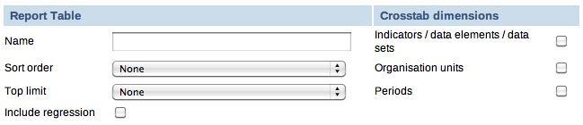

**Cross tab dimensions**

You can cross-tab one or more of the following dimensions: data
element/indicator, orgunit, and period, which means that columns will be
created based on the values of the dimensions chosen, e.g. if indicators
is selected you will get column names in the table reflecting the names
of the selected indicators.

For example, if you cross-tab on indicators and periods, the column
headers will say "\<indicator title\> \<period\>". The organisation
units will be listed as rows. See screenshot for clarification:

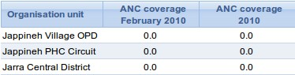

If you cross-tab on indicators and organisation units, the column
headers of the table will say "\<indicator title\> \<organisation
unit\>". Now the periods will be listed as rows. See screenshot for
clarification:

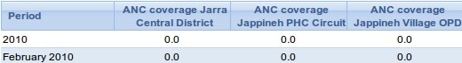

Note that the options made here regarding crosstab dimensions may have
consequences for what options are available when using the report table
as a data source later, for example for standard reports.

**Sort order**

Affects the rightmost column in the table, allows you to choose to sort
it low to high or high to low.

**Top limit**

Top limit allow you to set a maximum number of rows you want to include
in the report table.

**Include regression**

This adds additional columns with regression values that can be included
in the report design, e.g. in line charts.

### Selecting data

<!--DHIS2-SECTION-ID:reporting_selecting_data-->


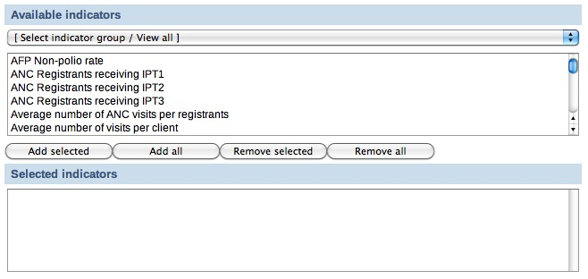

**Indicators/Data elements**

Here you select the data elements/indicators that you want to include in
the report. Use the group filter to more easily find what you are
looking for and double click on the items you want to include, or use
the buttons to add/remove elements. You can have both data elements and
indicators in the same report.

**Data sets**

Here you select the data sets that you want to include in the report.
Including a data set will give you data on the data completeness of the
given set, not data on its data elements. Double click on the items you
want to include, or use the buttons.

### Selecting report parameters

<!--DHIS2-SECTION-ID:selecting_reporting_params-->


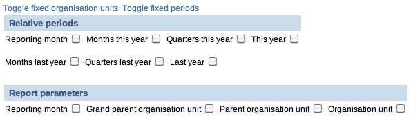

There are two ways to select both what organisation units to include in
a report, and what time periods should be included: relative, or fixed.
Fixed organisation units and/or periods means that you select the
units/periods to include in the report table when you create the report
table. Using relative periods, you can select the time and/or units as
parameters when the report table is populated, for example when running
a standard report or creating a chart. A combination is also possible,
for example to add some organisation units in the report permanently
while letting the users choose additional. Report parameters is
discussed below. In general, using fixed organisation units and/or time
periods are an unnecessary restriction.

**Fixed Organisation Units**

To add fixed organisation units, click "Toggle fixed organisation
units". A panel will appear where you can choose orgunits to always
include in the report. If you leave it blank, the users select orgunits
when running the report through the use of report parameters. Use the
drop down menu to filter organisation units by level, double click or
use the buttons to add/remove.

**Fixed Periods**

To add fixed periods, click "Toggle fixed organisation units". A panel
will appear where you can choose periods to always include in the
report. If you leave it blank, the users select periods when running the
report through the use of report parameters. Use the drop down menu to
choose period type (week, month, etc), the Prev and Next button to
choose year, and double click or use the buttons to add/remove.

**Relative periods**

Instead of using fixed/static periods like 'Jan-2010' or 'Q1-2010', more
generic periods can be used to create reusable report tables, e.g. for
monthly reports the period 'Reporting month' will simply pick the
current reporting month selected by the user when running the report.
Note that all relative periods are relative to a "reporting month". The
reporting month is either selected by the users, otherwise the current
month is used. Here is a description of the possible relative periods:

  - *Reporting month:*

    Use this for monthly reports. The month selected in the reporting
    month parameter will be used in the report.

  - *Months/Quarters this year*:

    This will provide one value per month or quarter in the year. This
    is well suited for standard monthly or quarterly reports where all
    month/quarters need to be listed. Periods that still have no data
    will be empty, but will always keep the same column name.

  - *This year:*

    This is the cumulative so far in the year, aggregating the periods
    from the beginning of the year up to and including the selected
    reporting month.

  - *Months/Quarters last year*:

    This will provide one value per month or quarter last year, relative
    to the reporting month. This is well suited for standard monthly or
    quarterly reports where all month/quarters need to be listed.
    Periods that still have no data will be empty, but will always keep
    the same column name.

  - *Last year:*

    This is the cumulative last year, relative to the reporting month,
    aggregating all the periods from last year.

**Example - relative periods**

Let's say we have chosen three indicators: A, B and C, and we have also
chosen to use the relative periods 'Reporting month' and 'This year'
when we created the report table. If the reporting month (selected
automatically or by the user) is for example May 2010, the report table
will calculate the values for the three selected indicators for May 2010
(= the 'Reporting month') and the accumulated values for the three
selected indicators so far in 2010 (= so far 'This year').

Thus, we will end up with six values for each of the organisation units:
"Indicator A May 2010", "Indicator B May 2010" "Indicator C May 2010",
"Indicator A so far in 2010", "Indicator B so far in 2010" and
"Indicator C so far in 2010".

**Report parameters**

Report parameters make the reports more generic and reusable over time
and for different organisation units. These parameters will pop up when
generating the report table or running a report based on the report
table. The users will select what they want to see in the report. There
are four possible report parameters, and you can select none, all, or
any combination.

  - *Reporting month:*

    This decides which month will be used when the system is choosing
    the relative periods. If the box it not checked, the user will not
    be asked for the reporting month when the report is generated - the
    current month will then be used.

  - *Grand parent organisation unit:*

    Select the grand parent of all the orgunit children and grand
    children you want listed in the report. E.g. a selected region will
    trigger the use of the region itself, all its district, and all
    their sub-districts.

  - *Parent organisation unit:*

    Select the parent of all the orgunit children you want listed in the
    report. E.g. a selected district will trigger the use of the
    district itself and all its children/sub-districts.

  - *Organisation unit:*

    This triggers the use of this orgunit in the report. No children are
    listed.

**Example - report parameters**

Continuing with the example on relative periods just above, let's say
that in addition to 'Reporting month', we have chosen 'Parent
organisation unit' as a report parameter when we created the report
table. When we're running the report table, we will be asked to select
an organisation unit. Now, let's say we choose "Region R" as the
organisation unit. "Region R" has the children "District X" and
"District Y".

When the report is run, the system will aggregate data for both
"District X" and "District Y". The data will be aggregated from the
lowest level where they have been collected. The values for the
districts will be aggregated further to give an aggregated value for
"Region R".

Thus, the report table will generate the six values presented in the
previous example, for "District X", "District Y" and "Region R".

### Data element dimension tables

<!--DHIS2-SECTION-ID:reporting_de_dimension_tables-->

These tables enable the use of data element categories in report tables.
There are two differences from regular report tables. The first is that
it is not possible to select crosstab dimensions, as the columns will
always be the disaggregations from the category combinations. The other
is the actual choice of data. Only one category combination can be added
per report, and only data elements from the same category combo can be
selected.

Subtotals and the total will also be included in the table, e.g. a
gender (male, female) + EPI age(\<1, \>1) category combo would give the
following columns: male+\<1, male+\>1, Female+\<1, female+\>1, male,
female,\<1, \>1, total.

**Selecting data**


Use the drop down menu to choose category combinations. The data
elements using this category combination will be listed. Double click to
add to the report, or use the buttons.

### Report table - best practices

<!--DHIS2-SECTION-ID:reporting_best_practices-->

To make the report tables reusable over time and across orgunits they
can have parameters. Four types of parameters are allowed; orgunit,
parent orgunit (for listing of orgunits in one area), grand parent
orgunit and reporting month. As a side note it can be mentioned that we
are looking into expanding this to include reporting quarter and year,
or to make that period parameter more generic with regard to period type
somehow. The ability to use period as a parameter makes the report table
reusable over time and as such fits nicely with report needs such as
monthly, quarterly or annual reports. When a report is run by the user
in DHIS2, the user must specify the values for the report tables that
are linked to the report. First the report table is re-generated
(deleted and re-created with updated data), and then the report is run
(in the background, in Jasper report engine).

Report tables can consist of values related to data elements, indicators
or data completeness, which is related to completeness of reporting
across orgunits for a given month. Completeness reports will be covered
in a separate section.

There are three dimensions in a report table that identify the data;
indicators or data elements, orgunits and periods. For each of these
dimensions the user can select which metadata values to include in the
report. The user must select one or more data elements or indicators to
appear in the report. The orgunit selection can be substituted with a
parameter, either one specific orgunit or an orgunit parent (making
itself and all its children appear in the report). If one or more
orgunits are selected and no orgunit parameter is used, then the report
is static with regard to which orgunits to include, which in most cases
is an unnecessary restriction to a report.

**Using relative periods**

The period selection is more advanced as it can in addition to specific
periods like Jan-09, Q1-08, 2007 also contain what is called relative
periods. As report usually is run routinely over time a specific period
like Jan-09 is not very useful in a report. Instead, if you want to
design a monthly report, you should use the relative period called
Reporting Month. Then you must also include Reporting Month as one of
your report parameters to let the system know what exactly is the
Reporting Month on the time of report generation. There are many other
relative periods available, and they all relate to the report parameter
Reporting Month. E.g. the relative period called So far this year refers
to the accumulative value for the year incl. the Reporting Month. If you
want a trend report with multiple periods in stead of one aggregated
period, you can select e.g. 'Months this year', which would give you
values for each month so far in the year. You can do a similar report
with quarters. The idea is to support as many generic report types as
possible using relative periods, so if you have other report needs,
please suggest new relative periods on the mailing list, and they might
be added to the report table options.

**Cross-tabbing dimensions**

Cross tabbing is a very powerful functionality in report design, as the
typical DHIS2 data table with references to period, data
element/indicator and orgunit makes more advanced report design very
difficult, as you cannot put e.g. specific indicators, periods or
orgunits on specific columns. E.g. by cross-tabbing on the indicator
dimension in an indicator report table you will get the indicator names
on the column headers in your report, in addition to a column
referencing orgunit, and another column referencing period. With such a
table design you could drag and drop indicator names to specific columns
or chart positions in the iReport software. Similarly you can cross tab
on orgunits or periods to make their names specifically available to
report design. E.g. by cross-tabbing on periods and selecting the two
relative periods 'Reporting month' and 'This year', you can design
reports with both the last month and the accumulative annual value for
given month as they will be available as column headers in your report
table. It is also possible to combine two dimensions in cross-tabbing,
e.g. period and indicator, which makes it possible to e.g. look at three
selected indicators for two specific relative periods. This would e.g.
make it possible to make a table or chart based report with BCG, DPT3
and Measles coverage, both for the last month and the accumulative
coverage so far in the year.

All in all, by combining the functionality of cross tabbing, relative
periods and report table parameters you should have a tool to support
most report scenarios. If not, we would be very happy to receive
suggestions to further improvements to report tables. As already
mentioned, we have started to look at more fine-grained parameters for
the period dimension as the 'Reporting month' does not cover enough, or
at least is not intuitive enough, when it comes to e.g. quarterly
reports.

## Report table outcome

<!--DHIS2-SECTION-ID:reporting_table_outcomes-->

When the report table is run, the system will calculate values for
specified indicators/data elements/data sets, orgunits and periods. The
data will be presented in DHIS2 in a table layout. The column headers
will correspond to the cross-tab dimension you have selected. An example
report table showing ANC coverage for a district in The Gambia, is shown
below. Here the indicator and the periods are cross-tabbed, as can be
seen from the column headers.


Above the table there are six buttons; five download buttons and one
Back button. Clicking the Back button will simply take you back to the
previous screen. The function of the five download buttons, are
presented below the screenshot:

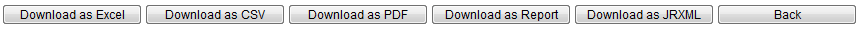

**The five download buttons**

  - *Download as Excel:*

    Downloads a generated Excel file you can open in Excel.

  - *Download as CSV:*

    Downloads a generated .csv file. CSV stands for **C**omma
    **S**eparated **V**alues. It's a text file with the file ending
    .csv. Each line in the file corresponds to a row in the table, while
    the columns are separated with semi colons (;). The file can be
    opened in a text editor as well as in a spread sheet program (such
    as Excel).

  - *Download as PDF:*

    Downloads a generated PDF file. The data will be presented in a
    similar layout as the generated table you are already viewing in
    DHIS2.

  - *Download as Report:*

    Downloads a "styled" PDF file. In addition to present the data in a
    table layout, this file also presents a chart, showing the
    aggregated data from all the chosen periods and the parent
    organisation unit chosen for the report table. The report is
    generated using the Jasper report engine.

  - *Download as JRXML:*

    Downloads the design file for the generated Report described in the
    previous bullet. The design file (with the file ending .jrxml) can
    be opened in the Jasper iReport Designer software. If you plan to
    design standard reports, this is the starting point.

## Standard reports

<!--DHIS2-SECTION-ID:reporting_standard_reports-->

### What is a standard report?

A standard report is a manually designed report that presents data in a
manually specified layout. Standard reports can be based either on
report tables or SQL queries. Both approaches are described in the
following sections. The main advantage of using report tables is that of
simplicity - no special development skills are required. In cases where
you have special requirements or need to utilize additional parts of the
DHIS2 database you might want to use a SQL based standard report. In any
case you will be able to utilize report parameters in order to create
dynamic reports. The following guide will use the report table approach,
while the SQL approach is covered towards the end.

### Designing Standard reports in iReport

Jasper iReport Designer is a tool for creating reports that can be used
as Standard Reports in DHIS2. The tool allows for the creation of
standard report templates that can easily be exported from DHIS2 with up
to date data. The process of creating reports involves four major steps:

1.  A report table must be created in DHIS2 with the indicators/data
    elements/datasets to be used in the report.

2.  You have to run the report table and download the design file (Click
    the "Download as JRXML" button).

3.  Open the downloaded .jrxml file using the free software Jasper
    iReport Designer to edit the layout of the report.

4.  The edited report can then be uploaded to DHIS2 to be used as a
    standard report.

If you want to preview your report during the design in iReport, you
actually have to upload your file to DHIS2 to see how it looks.

These four steps will be describe in detail in the coming sections. In
general, when you are making standard reports you should have a clear
idea of how it should look before you even make the report table, as how
the report table is designed has implications for how the report can be
formatted in iReport. For example, what crosstab dimensions are selected
in the report table has consequences for what crosstabs are available
for the standard report, and it has consequences for what types of
charts you can make.

#### Download and open the design file

> **NOTE**
>
> If you have not created a report table yet, you have to do so.
> See section "How to create report tables" to do so.*

Locate your desired report table and run it by clicking the green circle
with a white arrow inside. When the report is shown, click the "Download
as JRXML" button to download the design file. Then open that file in the
Jasper iReport Designer software.

#### Editing the report

You are now ready to edit the layout of the report. The main iReport
window consists of a "Report Inspector" to the left, the report document
in the middle, a "Palette" area on the upper right hand side and a
"Properties" area on the lower right hand side. The "Report Inspector"
are used for selecting and examining the various properties of the
report, and when selecting an item in the inspector, the "Properties"
panel changes to display properties relating to the selection. The
"Palette" is used for adding various elements, e.g. text boxes, images
and charts to the
document.


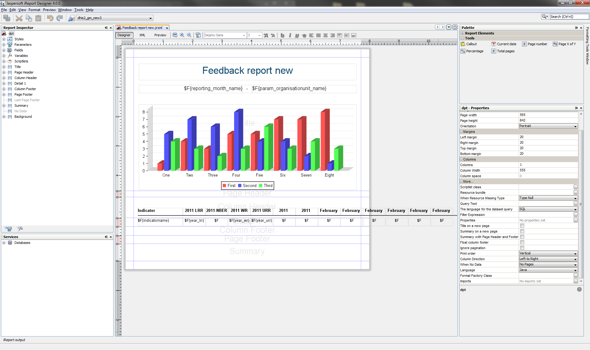

> **NOTE**
>
> If you cannot see the Palette or Properties sidebar, you can
> enable them from the menu item called "Window" on the menu bar.

The iReport document is divided into seven main bands, divided by layout
separators (the blue lines). These lines are used to decide how big each
of the areas should be on the report.

The areas all have different purposes:

  - Title - area for the title of the report

  - Page header - area for the page header

  - Column header - area for column headers (for the table)

  - Detail 1 - area where the actual report data will be placed

  - Column footer - area to make footer of the table

  - Page footer - area for the page footer

  - Summary - elements in this area will be placed at the end of the
    report

By default you will see that only the Title, Column Header and the
Detail 1 bands have data. For most reports this is OK. The Title band is
suitable for a title and e.g. a chart. Data fields entered into the
Detail 1 area will be iterated over to create a table. For example, if a
field called "dataelementname" is placed in the Detail 1 band, all data
elements in the report table will be listed here. We'll come back to
data fields management just a little below.

The unused bands in the report are contracted to add more space for your
report data. You can however increase/decrease the band height as you
like. There are two ways to do that. The first way is simply to drag the
blue band-line as shown below.

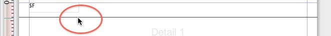

The other way to adjust the band height is to select a band in the
"Report Inspector", and then adjust the "Band height" value in the
"Detail 1 - properties" area in the lower right corner.

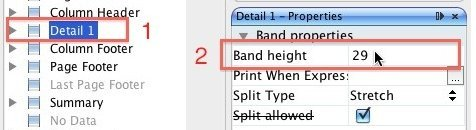

As the fields are already present on the report, you probably don't want
to do anything than just fix the layout and drag fields around. You can
also resize the fields by dragging the side, top or bottom lines. If you
want to change the text in the column headers, you simply double click
the field and change the text.

To add the a field to the table, we simply drag it to the Detail 1 band
from the "Report Inspector". The column header will be added
automatically.

By double clicking the box, the text can be edited. The format of the
text, such as size, font and alignment, can be adjusted with the tools
above the document.

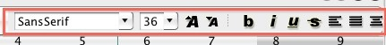

> **NOTE**
>
> Fields starting with "$F" present values that are
> retrieved from the database every time the report is run. The values
> here will vary, so do not change these fields unless you want a static
> value here!

#### Text

There are two types of text in iReport: «Text labels» and «Text fields»
(data fields). They work in different ways, and should be used for
different purposes. The main point is that text fields are just
placeholders that will be filled with the correct text from the report
table when the report is run, while text labels will stay the way they
are when the report is run.

##### Static text

Static text are text plain text labels that can be edited normally.
There are two ways to edit text labels:

  - By double clicking in the text box

  - By using the Static text properties in the Properties
panel


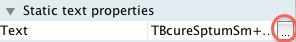

##### Text fields

Text fields are formulas that will be filled from the report table when
the report is run. Unlike static text, these can not be edited in a
normal way. However, they can be manipulated in various ways to ensure
that the desired output will be produced. There are three ways to edit
the text fields:

  - By right clicking on the text box and selecting Edit expression

  - By double clicking the text field (not recommended, as this will not
    bring up the expression editor)

  - By using the Text field properties in the Properties
panel


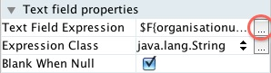

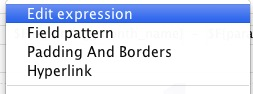

Text fields can represent either numbers or text, so that they can be
used both for showing for example names of district or for numeric
values. It is therefore important the Expression class, seen in the Text
field properties matches the Text field expression. For the default text
fields in the .jrxml file downloaded from DHIS2 this is not a problem,
but it is important when making new text fields. The two most important
Expression classes are java.lang.Double for numbers and java.lang.String
for text.

###### Example

For example, let us say you have a quarterly report where you would like
to add a new column with the yearly total. You therefore add a new
Static text field to the column header band, and a Text field to the
details band in. By default, new Text fields are set to java.lang.String
(text). However, the yearly total column will be filled with numbers. We
therefore have to change the Expression class for the new text field to
java.lang.Double:

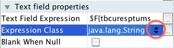

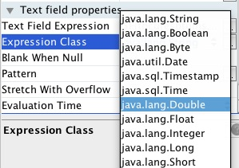

When we edit the text field expression, we see the Expression editor
window with all the available columns from the report table. We can see
here that each of these are marked with what type they are - text or
number. What we need to make sure of is therefore that the expression
class we choose for the text field matches the actual
expression.

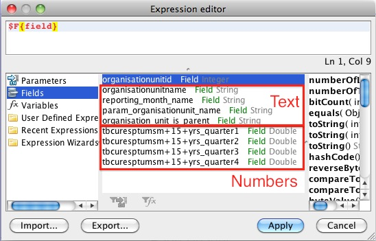

### Filtering the table rows

In the default table exported from DHIS2, there are some rows that it
might be better to leave out of the table, and some that it would be
preferable to have at the end. For example, when making a table based on
a report table with the «parent organisation unit» parameter, the
default table might have a row with the national level somewhere in
between all the regions. In iReport, this can be changed so that the
«parent organisation unit» appears at the bottom of the table. This
involves two steps that will be explained below. Note that this will not
work where there is only one organisation units, and it is therefore
most useful when using the «parent organisation unit» or «grand parent
organisation unit» parameters in the report table.

#### Hiding the «parameter organisation unit» from the table

We exclude the "parameter organisation unit" from the table by using a
property in the Details band called "Print when expression". To set a
Print when expression, start by selecting the Detail band in the Report
inspector, then edit the Print when expression in the properties
panel.


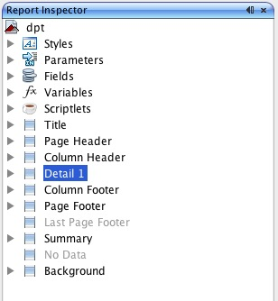

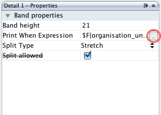

The Expression editor window should now appear. What we must do is to
create an expression that checks if the row being generated is the row
with the organisation unit given as a parameter. The report table
contains a column that we can use for this called
organisation\_unit\_is\_parent. To exclude the row with the parameter
organisation unit, double click on organisation\_unit\_is\_parent in the
list to copy it to the expression area, then add `.equals("No")` at the
end so that the code is:

```
$F{organisation_unit_is_parent}.equals("No")
```

This tells the report engine to only print table rows where the
organisation unit is not the parent organisation
unit.

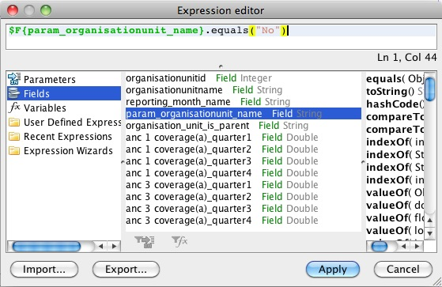

#### Putting the "param organisation unit" at the bottom of the table

Instead of removing the "param organisation unit" from the table
entirely, it is also possible to put it at the bottom (or top) of the
table. This is done by using the sort functionality explained in the
next section, and choosing to sort first by
"organisation\_unit\_is\_parent". Other sorting options can be added in
addition to this, for example to make a list where the param
organisation unit is at the bottom of the table, with the other
organisation units listed alphabetically above it.

#### Hiding other rows

Using the expression editor it is also possible to exclude other rows
from the table, in addition to the parent organisation unit as was
explained above. In Ghana, for example, all regions have a «fake
district» which is the name of the region in square brackets. This can
also be excluded from the table using the Print when expression that was
introduced above. To to this, follow the instructions above to bring up
the Expression editor window. Then, we use Java expressions to test
whether or not the row should be hidden.

##### Example - removing rows with organisation units starting with \[

Example - removing rows with organisation units starting with \[

```
($F{organisationunitname}.charAt( 0 ) != '[')
```

This makes the report skip any rows where the first character of the
organisation unit name is \[.

It is also possible to combine several of these expressions. To do this
we put the expressions in a parenthesis with the two characters && in
between. For example, to make a table that leaves both organisation
units whose name starts with \[ and the parent organisation unit, we can
use the following expression:

```
($F{organisationunitname}.charAt( 0 ) != '[')&&$F{organisation_unit_is_parent}.equals("No")
```


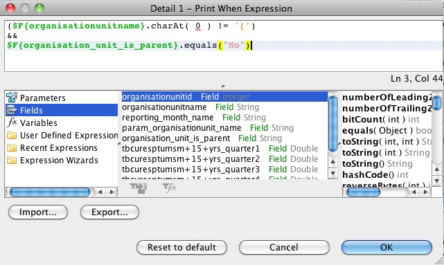

### Sorting

Often you will be making reports where the first column is organisation
unit names. However, it can be a problem that the list of organisation
units are not sorted alphabetically. This can be fixed in iReport
through a few simple steps.

In the report inspector, right click on the name of the report (by
default this is dpt) and select Edit
query.


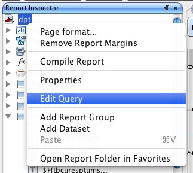

A Report query window will appear. Click on the Sort options
button.

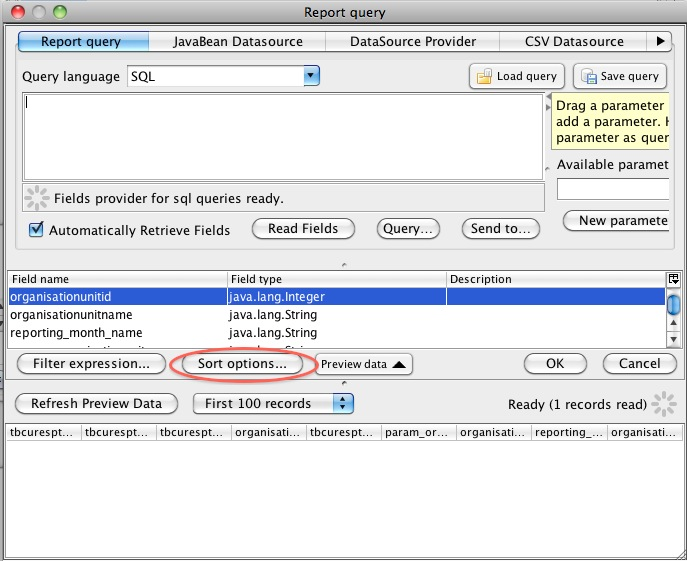

A Sorting window as show below will appear. Here, we can add our sorting
options. Click the Add field button. Another small window will show up,
with a drop down menu where you can choose Sort by organisationunitname
to have the table sorted alphabetically by
name.

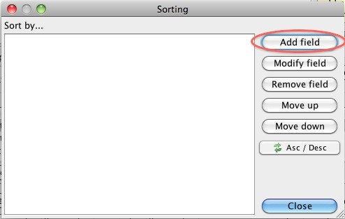

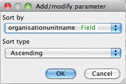

Click OK - Close - OK to close the three windows. The table should now
be sorted.

### Changing indicator/data element names

By default, the reports from DHIS2 uses the short names for indicators
and data elements in reports and charts. In some cases these are not
always very meaningful for third parties, but with some work they can be
given custom names through iReport. This is useful for example if you
are making a report with indicators as rows and periods as column, or
for charts with
indicators.


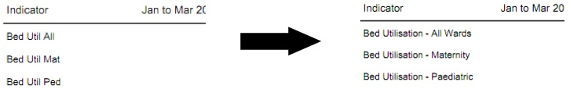

To change the names of an indicator or data element, we have to edit its
«expression» or formula, for example by right clicking the text box and
choosing Edit expression to bring up the Expression
editor.

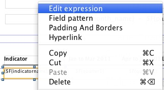

Next, we have to insert some Java code. In the following example, we
will be replacing the shortname of three indicators with their proper
names. The code searches for the shortname, and then replaces it with a
proper name.

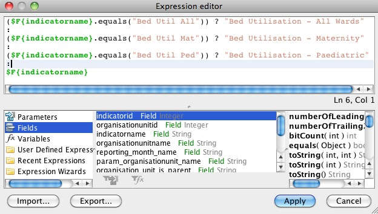

```
($F{indicatorname}.equals("Bed Util All")) ? "Bed Utilisation - All Wards"
:
($F{indicatorname}.equals("Bed Util Mat")) ? "Bed Utilisation - Maternity"
:
($F{indicatorname}.equals("Bed Util Ped")) ? "Bed Utilisation - Paediatric"
:
$F{indicatorname}
```

From this, we can see a pattern that is reusable for more general cases.

  - For each indicator or data element we want to change the name for,
    we need one line

  - Each line is separated by a colon :

  - We finish the expression with a «regular» line

Each line has the same format, where the red text is the shortname, the
blue text is what we want to insert
instead.

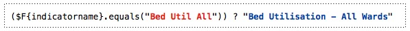

The same expressions can be used for example when having indicator names
along the category axis of a chart.

### Adding horizontal totals

By using the expression editor, it is possible to add a column to the
table with totals for each row. In the following example, we will make a
table with three months as columns as well as a column with the totals
for the three months.

We start by dragging a text label into the table header and changing its
text to "Total", and dragging a text field into the details row.

As was discussed in the section on "Text field", we have to change the
properties of the new text field so that it can display numbers. To do
this, change the "Expressions Class" in the properties panel to
"java.lang.Double".

Right click the text field and choose "Edit Expression". This will bring
up the "Expressions editor". As the expression, we want to sum up all
the columns. In this case we have three value expressions we want to sum
up: "September", "October 2010", "November 2010". The name of these
fields will vary depending on the crosstab dimension you have chosen in
the report table. In our case, the expression we make is
```
$f{September}+$f{October 2010}+$f{November 2010}
``` 
Each row of the table will have a totals column to the right.

### Groups of tables

There are cases when it can be useful to have several tables in one
report. This can be done using Report groups. Using this functionality,
one can for example create a report one table for each indicator, or one
table of each organisation unit. In the following, we will go through
the steps needed to make a report with three indicators, each
represented in one table. It is important that the report table does not
crosstab on indicators when we want to make groups of tables based on
indicators.

In our example, the .jrxml file downloaded from DHIS2 will by default
have one column for organisation unit and on for indicators (assuming we
have chosen periods as the only crosstab dimension). We start by
removing the indicator column, since this in not needed in our case, and
realign the other fields to fit the
report.


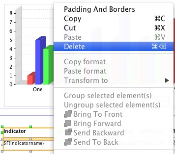

Next, we create out Report group. Go to the report inspector, right
click on the report name (dpt is the default) and choose Add Report
Group.

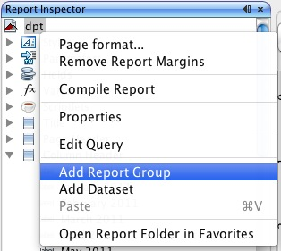

A window will appear, with a report group wizard. Select a name for the
group, in this case we choose «Indicator». In the drop down menu, we can
select what columns in the report table we want the groups to be based
on. So, if we wanted one table for each organisation unit, we would
choose organisation unit name as the report object to group according
to. However, since we are grouping by indicators in this example, we
choose indicatorname. Then click
next.

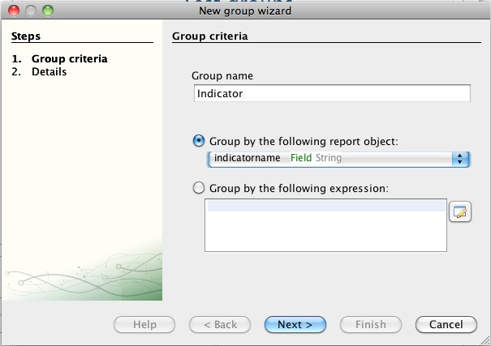

The next step is to select whether or not we want a separate Group
header and Group footer band for each report group. In this case, we
choose to include both. Click Finish, and the group bands should appear
in the
report.

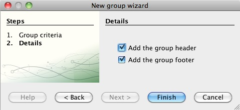

If you upload and run the report, it will now create one table for each
indicator. However, it will not look very good as there will be no
header row over each table - only one header at the top of each page.
Also, there is no indication as to which table is showing which
indicator. In the following, we will fix this.

Instead of having the title row in the column header, we can instead
move it to the Group header. This will make the heading show up above
each individual table. Furthermore, we can add a heading to each table
with the name of the indicator.

Move the column headers from the Column header band to the Indicator
group header
band.

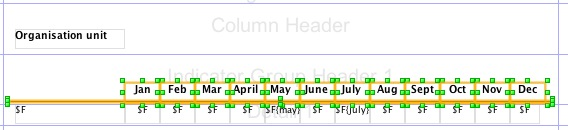

Next, add a text field to the Indicator group heading band, and edit
it’s expression to display the indicator
name.

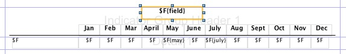

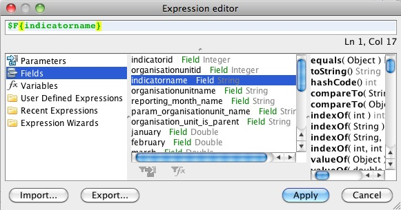

The report should now have three tables, one for each indicator. Each
table will have a heading with the name of the indicator, and also a
table header
row.

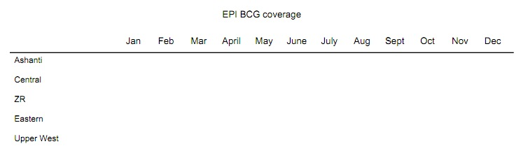

#### Sorting and grouping

When using grouping, some precautions must be taken with regards to
sorting. Notably, when adding sorting parameters, whatever parameter is
used as basis for the grouping must come first. Thus if you are grouping
the report by indicator, and want sort the organisation units
alphabetically, you have to choose to sort first by indicator, then by
organisation unit name as shown below. For instructions on how to add
sorting, see the sorting section
above.

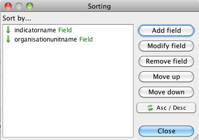

## Charts

By default, a 3D bar chart is included in the .jrxml file that is
downloaded from DHIS 2. This is set up so that only data from the
«parameter organisation unit» (often the parent or grand parent) is
used. Usually, this is a good solution. Since it is the default, we will
start by looking at bar charts, before looking at line
charts.

### Bar charts


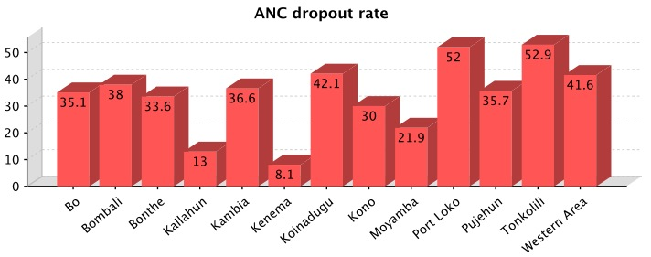

Bar charts are the default chart type in DHIS2. In this section, we will
look at how to make a bar charts like the one above, comparing the value
of one indicator in several districts. To edit the default chart in
iReport, right click on it and choose Chart
data.

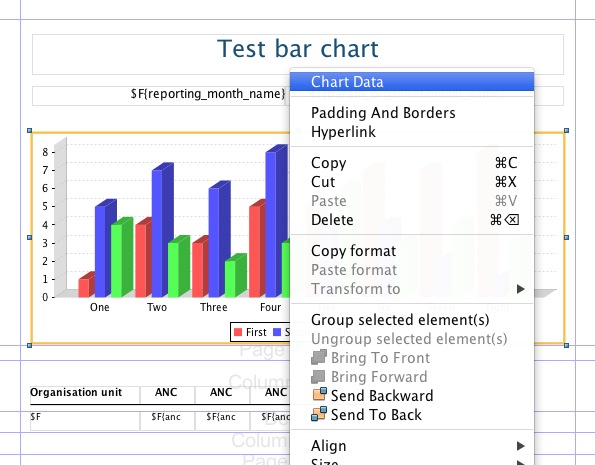

A window will appear. By default, the Filter expression is filled in so
that only data for the parent organisation unit will be displayed. If
for some reason you do not want this, simply delete the text in the text
box. In this case we do NOT want the filter, as we are making a chart
showing a comparison across districts. To continue, click the details
tab.

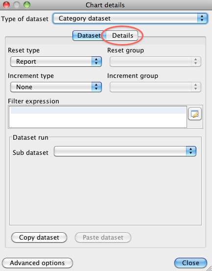

Under details, you see the list of series for the chart. By default, one
series is created per crosstab column. In this case, we are looking at
data for one indicator for the whole of 2010, for a number of districts.
The indicator is along the crosstab
dimension.

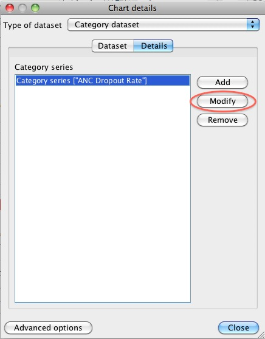

To make changes to a series, select it and click modify. Another window
will appear where there are four areas that can be edit. The three first
are required, but it is sufficient to add an empty quote («») in one of
the first
two.

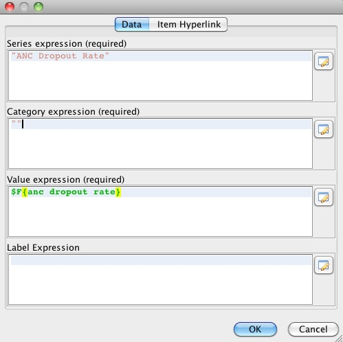

The first box is a text field where the name of the series can be
inserted or edited. This is the field that will be used to fill the text
in the legend box (shown
below).

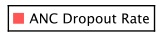

However, if you want to have the name of each bar along the x-axis of
the chart instead of using the legend, this can be done by adding
whatever text you want to present in the Category expression field, or
by inserting an expression to have it filled automatically when the
report is run. In this case, we want to have one bar for each
organisation unit. We therefore edit the category expression by clicking
on the button to the
right.

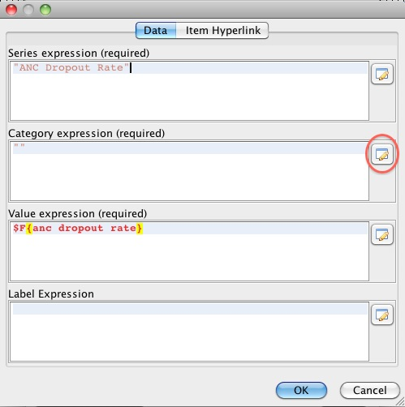

As the expression, we chose organisationunitname, as shown
below.

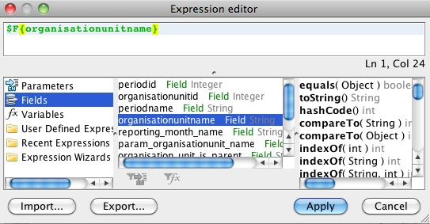

When we are finished, the series editor should look like below. Click
OK, then Close to close the Chart Details
window.

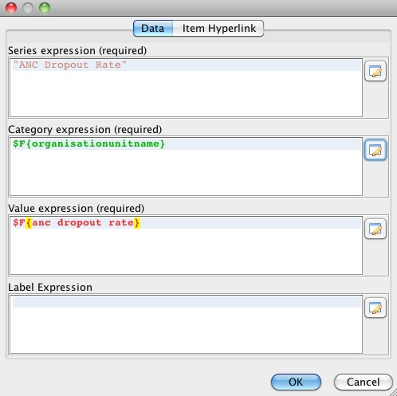

If you add a good description in the Category expression area, you can
leave out the legend box. This is done in the Report properties panel of
iReport, where you can also edit many other details of the
chart.

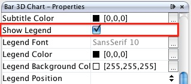

We can also add a title to the chart, for example the name of the
indicator. This is also done in the Chart properties panel, under Title
expression.

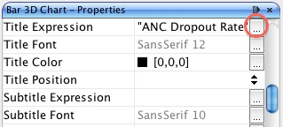

The Expression editor window will appear, where you can enter the title.
Note that the title must be in quotes, as shown
below.

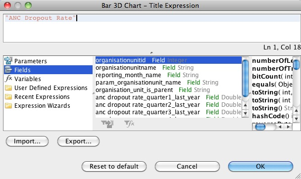

The chart is now ready.

### Line charts

Line charts can be useful in many circumstances. However, to make line
charts the report data (report table) must be suited for it. Thus if you
want to make a line chart, it is important that the report table does
not have periods in the crosstab dimension. Examples where this is
useful is if you are making a report for a single organisation unit with
one or more indicators, or if you are making a report with one indicator
and one or more organisation units.

Below, we will go though the steps needed to make a report with a line
chart showing the development of three indicators over one year, for one
organisation unit. We start by making a report table with the choices
shown
below:


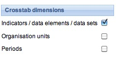


When we open the resulting .jrxml-file in iReport, the default line
chart is included. Since we want to make a line chart, we delete this
chart and drag a new chart element into the report from the Palette
panel.


As soon as we drag the Chart element into the report, a window will
appear. We choose the Line chart, as shown
below.


A chart wizard will appear. Click next in the first step, then Finish in
the next - we will add the data
later.


Next, adjust the size and position of the chart in your report. Then, we
will add one data series for each of our three indicators. Right-click
on the chart and choose Chart data. If you are making a chart with one
indicator and several organisation units, you probably want to make a
filter expression so that only data from the parameter/parent
organisation unit is used in the chart. To do this, add this line to the
Filter expression area:

`$F{organisation_unit_is_parent}.equals("Yes")`

In our example, we only have on organisation unit, so this is not
necessary. Next, click the details tab to see a list of the series in
the chart. For now, this list is empty, but we will add one series for
each of our three indicators. To add a series, click the Add
button.


In the window that appears, enter the name of the first of the
indicators in the Series expression window. Remember to put the name in
quotes. In the category expression (along the x-axis) we want the
months, so we use the button next to the field to open the Expression
editor and add
periodname.


In the value expression, we add the actual data values for our first
indicator. Use the Expression editor again to do this. When we are
finished, the window should look like the one below, only with different
names according to the
indicator.


You can then Click OK to close the window. Follow the same steps to add
a series for the other
indicators.


Close the window, and the data for the line chart should be ready.
However, some additional adjustments might be needed - most of these can
be found in the Line chart properties panel. For example, when making a
month by month chart as we have in example, there is often not enough
space for the month names along the category axis. This can be fixed by
rotating the labels by for example -40 degrees, by using the property
Category Axis Tick Label
Rotation.


Many other options are available to give the chart the desired
look.


## Adding the Report to DHIS2

We can now switch to DHIS2 and import our report. Go to the Report
Module in DHIS2, and select "Standard Report". In the "Standard Report"
screen, click "Add new", or edit an existing one.

In the following screen, there are several actions we need to take.
First, enter a name for the new "Standard Report". Second, for design,
click "Choose File" and find the .jrxml-file you have edited in iReport.
Then we select the report table that we used as a basis for the report
in iReport. Click add, and it should move to the "Selected report
tables" area. Finally, click
save.


The report is now available as a "Standard Report" in DHIS2:


## Some final guidelines

  - Use the same version of iReport and DHIS2's version of Jasper
    reports. See the About page in DHIS2 for the Jasper version in use.

  - Use report tables with cross tab dimensions as your data source for
    your report designs. This will make it a lot easier to design
    reports where you need to put specific indicators, periods, or
    orgunits on columns.

  - Learn from others, there are many DHIS2 report designs for Jasper on
    launchpad, see
    http://bazaar.launchpad.net/~DHIS2-devs-core/DHIS2/trunk/files/head:/resources/


## Designing SQL based standard reports

A standard report might be based on SQL queries. This is useful when you
need to access multiple tables in the DHIS2 database and do custom
selects and joins.

\- This step is optional, but handy when you need to debug your reports
and when you have direct access to the database you want to use. Click
on the "report datasources" button, "New", "Database JDBC connection"
and click "next". In this window you can give you connection a name and
select the JDBC driver. PostgreSQL and MySQL should come included in
your iReport. Then enter the JDBC connection URL, username and password.
The last three refers to your database and can be retrieved from your
DHIS2 configuration file (hibernate.properties). Click "save". You have
now connected iReport to your database.

\- Go to standard reports and click "add new", then "get report
template". Open this template in iReport. This template contains a
series of report parameters which can be used to create dynamic SQL
statements. These parameters will be substituted based on the report
parameters which we will later select and include in the standard
report. The parameters are:

  - periods - string of comma-separated identifiers of the relative
    periods

  - period\_name - name of the reporting period

  - organisationunits - identifier of the selected organisation units

  - organisationunit\_name - name of the reporting organisation unit

  - organisationunit\_level - level of the reporting organisation unit

  - organisationunit\_level\_column - name of the corresponding column
    in the \_orgunitstructure resource table

These parameters can be included in SQL statements using the
`$P\!{periods}` syntax, where "periods" represents the parameter.

\- To create a SQL query in iReport, click on the "report query" button.
Write or paste your query into the textarea. An example SQL query using
parameters which will create a report displaying raw data values at the
fourth level in the org unit hierarchy is:
```
    select district.name as district, chiefdom.name as chiefdom, ou.name as facility,
    bcg.value as bcg, yellowfever.value as yellowfever, measles.value as  measles
    from organisationunit ou
    left outer join _orgunitstructure ous
      on (ou.organisationunitid=ous.organisationunitid)
    left outer join organisationunit district
      on (ous.idlevel2=district.organisationunitid)
    left outer join organisationunit chiefdom
      on (ous.idlevel3=chiefdom.organisationunitid)
    left outer join (
      select sourceid, sum(cast(value as double precision)) as value
      from datavalue
      where dataelementid=359706
      and periodid=$P!{periods}
      group by sourceid) as bcg on bcg.sourceid=ou.organisationunitid
    left outer join (
      select sourceid, sum(cast(value as double precision)) as value
      from datavalue
      where dataelementid=35
      and periodid=$P!{periods}
      group by sourceid) as yellowfever on yellowfever.sourceid=ou.organisationunitid
    where ous.level=4
    and ous.$P!{organisationunit_level_column}=$P!{organisationunits}
    order by district.name, chiefdom.name, ou.name;
```
Notice how all parameters are used in the query, along with SQL joins of
resource tables in the DHIS2 database.

\- Finally, back in the add new report screen, we click on "Use JDBC
data source". This enables you to select any relative period and report
parameters for your report. Relative periods are relative to today's
date. Report parameters will cause a prompt during report creation and
makes it possible to dynamically select organisation units and periods
to use for your report during runtime. For the example above, we must
select "reporting month" under relative periods and both "reporting
month" and "organisation unit" under report parameters. Click save. This
will redirect you to the list of reports, where you can click the green
"create" icon next to your report to render it.

## Designing HTML based standard reports

A standard report can be designed using purely HTML and JavaScript. This
requires a little bit of development experience in the mentioned
subjects. The benefit of HTML based standard reports is that it allows
for maximum flexibility. Using HTML you can design exactly the report
you want, positioning tables, logos and values on the page according to
your design needs. You can write and save your standard report design in
a regular text file. To upload your HTML based standard report to DHIS2
do the following:

  - Navigate to standard reports and click "Add new".

  - Give the report a name.

  - Select "HTML report" as type.

  - If you want to you can download a report template by clicking on
    "Get HTML report template".

  - Select desired relative periods - these will be available in
    JavaScript in your report.

  - Select report parameters - these will be available in JavaScript in
    your report.

The report template, which you can download after selecting report type,
is a useful starting point for developing HTML based standard reports.
It gives you the basic structure and suggests how you can use JavaScript
and CSS in the report. JavaScript and CSS can easily be included using
standard script and style tags.

If you selected relative periods when creating the standard report you
can access these in JavaScript like this:

    var periods = dhis2.report.periods; // An array with period identifiers
    var period = periods[0];

If you selected the organisation unit report parameter when creating the
standard report you can access the selected organisation unit in
JavaScript like this:

    var orgUnit = dhis2.report.organisationUnit; // An object
    var id = orgUnit.id; 
    var name = orgUnit.name;
    var code = orgUnit.code;

When designing these reports you can utilize the analytics Web API
resource in order to retrieve aggregated data in JavaScript. Have a look
in the Web API chapter in this guide for a closer description. As a
complete, minimal example you can retrieve analytics data after the
report has been loaded and use that data to set the inner text of an
HTML element like this:

    <script type="text/javascript">
    $( document ).ready( function() {
        $.get( "../api/analytics?dimension=dx:FnYCr2EAzWS;eTDtyyaSA7f&dimension=pe:THIS_YEAR&filter=ou:ImspTQPwCqd", function( json ) {
            $( "#bcg" ).html( json.rows[0][2] );
            $( "#fic" ).html( json.rows[1][2] );
        } );
    } );
    </script>

    <div>BGG coverage: <span id="bcg"></span></div>
    <div>FIC coverage: <span id="fic"></span></div>

A few other tips: To include graphics you can convert an image to SVG
and embed that SVG content directly in the report - DHIS2 is based on
HTML 5 where SVG tags are valid markup. To include charts and maps in
your report you can use the charts and maps resources in the Web API.
You can use the full capability of the Web API from JavaScript in your
report - it may be useful to read through the Web API chapter to get an
overview of all available resources.
