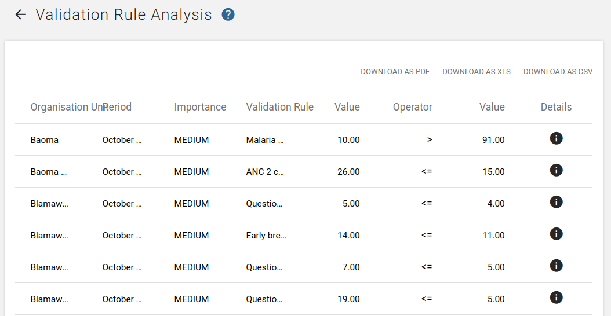
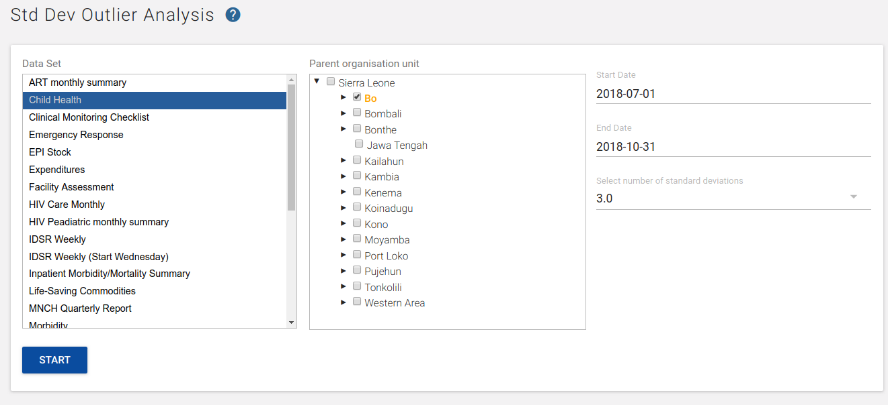
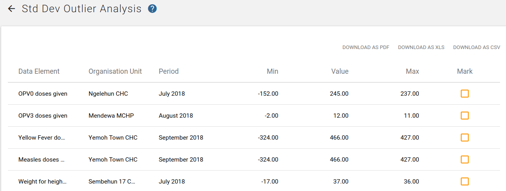
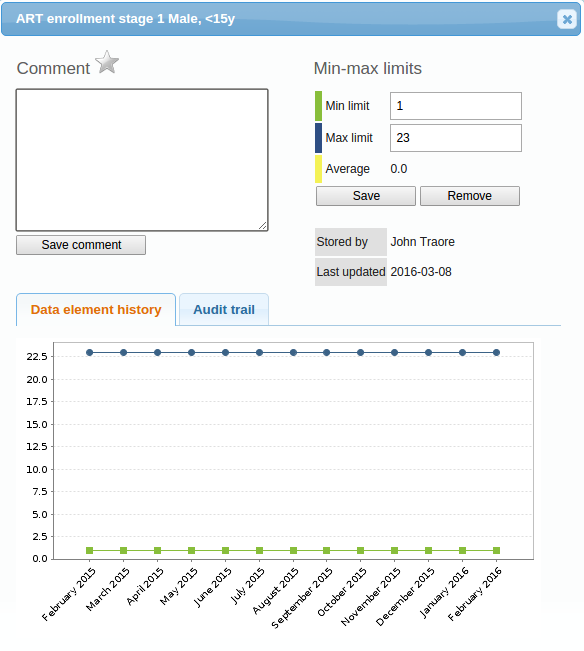
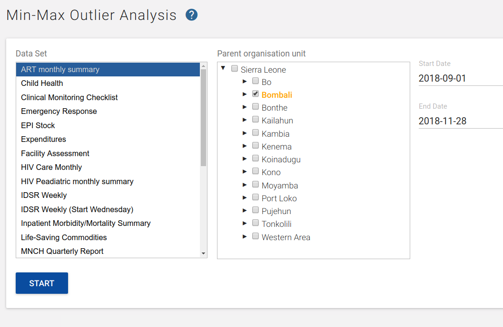
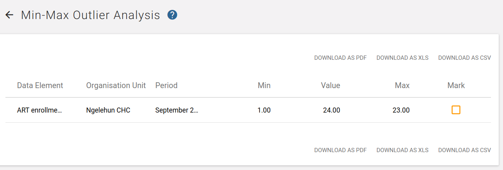

# Control data quality

<!--DHIS2-SECTION-ID:control_data_quality-->

## About data quality checks

<!--DHIS2-SECTION-ID:about_data_quality-->

The **Data Quality** app contains tools to validate the accuracy and
reliability of the data in the system. You can assess different dimensions of 
data quality as outlined in the table below: 

| Dimension | Description |
|---|---|
| Correctness | Data should be within the normal range for data collected at that facility. There should be no gross discrepancies when compared with data from related data elements. |
| Completeness | Data for all data elements for all reporting organisation units should have been submitted. |
| Consistency | Data should be consistent with data entered during earlier months and years while allowing for changes with reorganization, increased work load, etc. and consistent with other similar facilities. |
| Timeliness | All data from all reporting organisation units should be submitted at the appointed time. |

You can verify data quality in different ways, for example:

  - At point of data entry, DHIS 2 can check the data entered to see if
    it falls within the minimum maximum value ranges of that data
    element (based on all previous data registered).

  - By defining validation rules, which can be run once the user has
    finished data entry. The user can also check the entered data for a
    particular period and organization unit(s) against the validation
    rules, and display the violations for these validation rules.

  - By analysing data sets, that is, examine gaps in the data.

  - By data triangulation, that is, comparing the same data or indicator
    from different sources.

## Validation rule analysis

<!--DHIS2-SECTION-ID:validation_rule_analysis-->

### About validation rule analysis

A validation rule is based on an expression which defines a numeric relationship
between data element values. The expression forms a condition which
should assert that certain logical criteria are met.

The expression consist of:

  - a left side

  - a right side

  - an operator

A validation rule could assert that "Suspected malaria cases tested" \>=
"Confirmed malaria cases".

The left and right sides must return numeric values.

The validation rule analysis tests validation rules against the data
registered in the system. Validation violations are reported when the
condition defined in the validation rule expression is not met, which
means when the condition is false.

You can configure a validation rule analysis to automatically send out
information about validation violations to selected user groups. These
messages are called *validation notifications* and you create them in
the **Maintenance** app. Validation notifications are sent via the
internal DHIS 2 messaging system.

### Workflow

1.  In the **Maintenance** app, create validation rules and validation
    rule groups.

2.  (Optional) In the **Maintenance** app, create validation
    notifications.

3.  Run the validation rule analysis, either automatically or manually.

      - In the **Scheduler** app, you schedule the validation
        rule analysis to run automatically for all validation rules
        included in one or several validation rule groups. After the
        system has run the analysis, you'll see the validation
        violations (if any) in the validation notifications sent via the
        internal DHIS 2 messaging system.

      - In the **Data Quality** app, you run the validation rule
        analysis manually for selected validation rules. After the
        analysis process has finished, you'll see a list of validation
        violations (if any).

### Schedule a validation rule analysis to run automatically

> **Note**
>
> Only validation rules that are included in one or several validation
> notifications will be a part of the validation rule analysis. If
> there is no corresponding validation notification for a validation
> rule, no notification will be sent.

> **Note**
>
> While running validation rule analysis automatically, any results not
> already persisted, will be persisted during this run. Persisted
> results can currently only be accessed trough the API. Consult
> the developers guide for more information about how persisted
> validation rule violations can be accessed.

1.  Verify that you have created all the validation rules, validation
    rule groups and validation notifications you need.

2.  Open the **Scheduler** app and click the add button in the bottom right corner.

3.  Choose a suitable Name for the new job.

4. Select the **Monitoring** Job type using the drop-down menu. 

5. Select a running frequency for the job, i.e. when and how often the job should run.

6. Fill in the **Parameters** section, including the Validation rule groups.

7. Press the **Add job** button to confirm the job creation. For more information on adding jobs, see [Scheduling](data-administration.html#scheduling).

### Run a validation rule analysis manually

1.  Verify that you have created all the validation rules, validation
    rule groups and validation notifications you need.

2.  Open the **Data Quality** app and click **Validation rule
    analysis**.

3.  Select **Start date** and **End date**.

4.  Select which **Validation rule group** you want to include in the
    analysis.

    You can select all validation rules or all validation rules from a
    single validation rule group.

5.  (Optional) Select **Send notifications** to trigger validation
    notifications.

    > **Note**
    >
    > If you want to send out validation notifications, you must first
    > create them in the **Maintenance** app.

6.  (Optional) Select *Persist new results* to persist any non-persisted
    results found during the analysis

7.  Select a **Parent organisation unit**.

8.  Click **Validate**.

    The analysis process duration depends on the amount of data that is
    being analysed. If there are no violations of the validation rules,
    you'll see a message saying *Validation passed successfully*. If
    there are validation violations, they will be presented in a
    list.

    

9.  (Optional) Click the show details icon to get more information about
    a validation violation. In the pop-up window you'll find information
    about the data elements included in the validation rules and their
    corresponding data values. You can use this information to identify
    the source of the validation rule violation.

10. (Optional) Click **Download as PDF**, **Download as Excel** or
    **Download as CSV** to download the validation violations list in
    PDF, Excel or CSV formats.

### See also

  - [Manage validation
    rules](https://docs.dhis2.org/master/en/user/html/manage_validation_rule.html)

  - [Data Administration
    app](https://docs.dhis2.org/master/en/user/html/data_admin.html)

## Standard deviation outlier analysis

<!--DHIS2-SECTION-ID:standard_deviation_analysis-->

### About standard deviation outlier analysis

The standard deviation outlier analysis identifies values that are
numerically distant from the rest of the data, potentially indicating that they are outliers.
The analysis is based on the standard normal distribution. DHIS 2 calculates the mean of
all values for an organisation unit, data element, category option
combination and attribute option combination. Outliers can occur by
chance of course, but can potentially indicate a measurement or data entry error.

> **Note**
>
>  As indicated above, this data quality analysis is only appropriate for 
>  data which is actually normally distributed. Data which has large seasonal
>  variation, or which may be distributed according to other statistical models
>  (e.g. logistical ) may lead values being flagged which actually should be considered valid. 
>  It is therefore recommended to confirm first, whether the data actually is normally 
>  distributed before running a standard deviation outlier analysis.

### Run a standard deviation outlier analysis

1.  Open the **Data Quality** app and click **Outlier Detection**.

2.  Select data set(s).

3.  Select **Organisation units**.

    Multiple organisation units can be selected. The analysis is made on raw data for all organisation units in the sub-hierarchy of the selected units, not on aggregated data.

4.  Select **From date** and **To date**.

5.  Set **Algorithm** to **Z-score**

6.  Select a **Threshold**.

    This refers to the number of standard deviations the data is allowed
    to deviate from the mean before it is classified as an outlier.

7.  Select **Max results**

    This refers to the maximum number of outliers listed in the results.

8.  (Optional) Select a **Data start date** and **Data end date**

    These fields can be used to perform outlier detection analysis on a subset of the data within the provided date range. When left blank, the natural start and end date of the dataset will be used _(In advanced section)_.

9.  (Optional) Select a measure to **Sort by** 

    The outliers can be sorted by **Z-score** or by **Absolute deviation from Mean** _(In advanced section)_.

10.  Click **Start**
    The analysis process duration depends on the amount of data that is    being analysed. If there are standard deviations outliers, they will be presented in a list.
    
    For each outlier, you will see the data element, period, organisation unit, value, z-score, deviation, standard deviation, mean, min, and max. The minimum and maximum values refer to the border values derived from the number of standard deviations selected for the analysis.

11.  (Optional) Click **Download as CSV** to download the list in CSV format.

> **Tip**
>
> Click the checkbox to mark an outlier value for further follow-up.

## Minimum maximum outlier analysis

<!--DHIS2-SECTION-ID:min_max_analysis-->

### About minimum maximum value based outlier analysis

You can verify the data quality at the point of data entry by setting a
minimun/maximum value range for each data value. You can define the value
ranges manually or generate them automatically.

The auto-generated minimum maximum value range is suitable only for
normally distributed data. DHIS2 will determine the arithmetic mean and
standard deviation of all values for a given data element, category
option, organisation unit and attribute combination. Then the system
will calculate the minimum maximum value range based on the **Data
analysis std dev factor** specified in the **System Settings** app.

For data which is highly-skewed or zero inflated (as is often the case
with aggregate data), the values which DHIS2 auto-generates may not
provide an accurate minimum maximum value range. This can lead to
excessive false violations, for example if you analyse values related to
seasonal diseases.

> **Note**
>
> Minimum maximum value ranges are calculated across all attribute
> combination options for a given data element, category option and
> organisation unit combination.

### Workflow

1.  Create a minimum maximum value range, either automatically or
    manually.

      - In the **Data Administration** app, you generate value ranges
        automatically.

      - In the **Data Entry** app, you may set value ranges manually. 

2.  In the **Data Quality** app, run the **Min-max outlier analysis**.

### Configure a minimum maximum outlier analysis

#### Create minimum maximum value range automatically

> **Note**
>
> Auto-generated minimum maximum value ranges can be useful for many
> situations, but it's recommended to verify that the data is actually
> normally distributed prior to using this function.

You generate minimum maximum value ranges calculated by data set in the
**Data Administration** app. The new value ranges override any value
ranges that the system has calculated previously.

1.  Set the **Data analysis standard deviation (std dev) factor**:

    1.  Open the **System Settings** app, and click **General**.

    2.  In the **Data analysis std dev factor** field, enter a value.

        This sets the number of standard deviations to use in the
        outlier analysis. The default value is 2. Higher values
        indicate a broader distribution, which may lead to outliers
        not being flagged correctly by the analysis. 

2.  Open the **Data Administration** app and click **Min-max value generation**.

3.  Select data set(s).

4.  Select an **Organisation unit**.

5.  Click **Generate**.

    New minimum maximum value ranges for all data elements in the
    selected data sets for all organisation units (including
    descendants) of the selected organisation units are generated.

#### Create minimum/maximum value range manually

1.  In the **Data Entry** app, open a data entry form.

2.  Double-click the field for which you want to set the minimum/maximum value range.

3.  Enter **Min limit** and **Max limit** in the dialog that appears.

4.  Click **Save**.

    If values don't fall within the new value range the next time you
    enter data, the data entry cell will appear with an orange
    background.

5.  (Optional) Type a comment to explain the reason for the discrepancy,
    for example an event at a facility which may have generated a large
    number of clients.

6.  (Optional) Click **Save comment**.

> **Tip**
>
> Click the star icon to mark the value for further follow-up.

#### Delete minimum maximum value range

You can permanently delete all minimum maximum value ranges for selected
data sets and organisation units in the **Data Administration** app.

1.  Open the **Data Administration** app and click **Min-max value generation**.

2.  Select data set(s).

3.  Select an **Organisation unit**. Note, that the selection cascades to 
    descendant organisation units!

4.  Click **Remove**.

### Run a minimum maximum outlier analysis

1.  Verify that you've created minimum maximum value ranges.

2.  Open the **Data Quality** app and click **Outlier Detection**.

3.  Select data set(s).

4.  Select **Parent organisation unit**.

    Multiple organisation units can be selected. The analysis is made on raw data for all organisation units in the sub-hierarchy of the selected units, not on aggregated data.

5.  Select **From date** and **To date**.

6.  Set **Algorithm** to **Min-max values**.

7.  Select **Max results**

    This refers to the maximum number of outliers listed in the results.

8.  Click **Start**

    The analysis process duration depends on the amount of data that is
    being analysed. If there are standard deviations outliers, they will
    be presented in a list.

    

    For each outlier, you will see the data element, period, organisation unit,
    value, deviation, min, and max.

9.  (Optional) Click **Download as CSV** to download the list in CSV format.

> **Tip**
>
> Click the checkbox to mark the value for further follow-up.

## Follow-up analysis

<!--DHIS2-SECTION-ID:follow_up_analysis-->

### About follow-up analysis

The follow-up analysis creates a list of all data values marked for
follow-up. You can mark a data value for follow-up in the **Data Entry**
app and in the result list you get from a standard deviation outlier or
minimum maximum outlier analysis.

### Create list of data values marked for follow-up

1.  Open the **Data Quality** app and click **Follow-up analysis**.

2.  Select a data set or multiple data sets.

3.  Select **Organisation units**.

    Multiple organisation units can be selected. The analysis is made on raw data “under” the organisation unit, not on aggregated data.

4. Select a **Start Date** and **End Date** which defines the periods which you are interested in looking for values which have been marked for follow up. 

4. Press **Follow up** to generate a list of values which have been marked for follow up. 

5.  (Optional) Click **Download as PDF**, **Download as Excel** or **Download as CSV** to download the validation violations list in PDF, Excel or CSV formats.

> **Tip**
>
> Click the star icon to remove the follow-up tag from the data value.
> You can also enter a comment in the field to indicate any additional 
> information regarding the value. 
