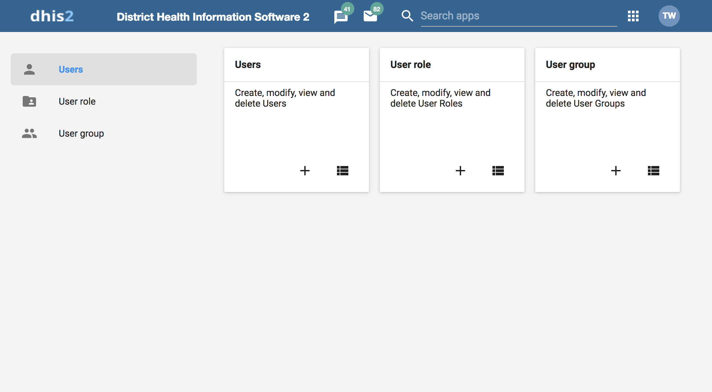
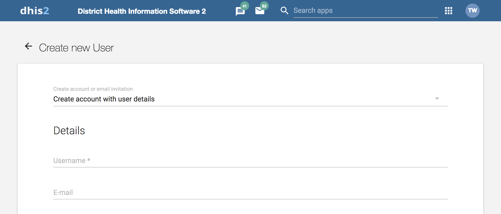
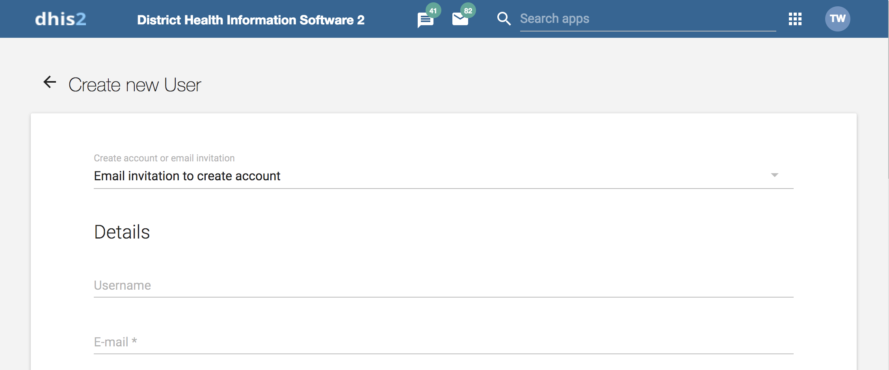
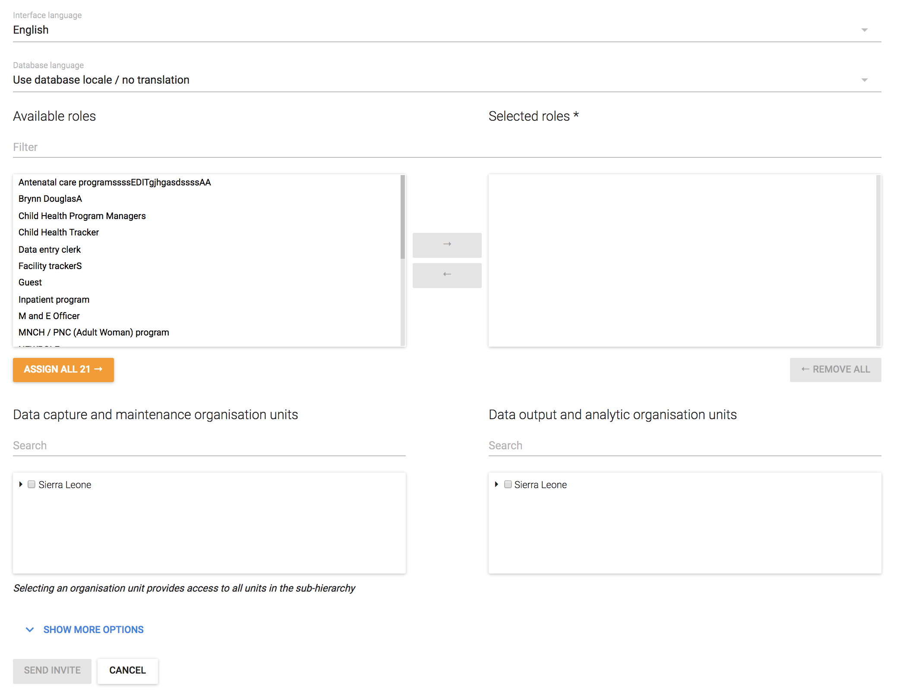
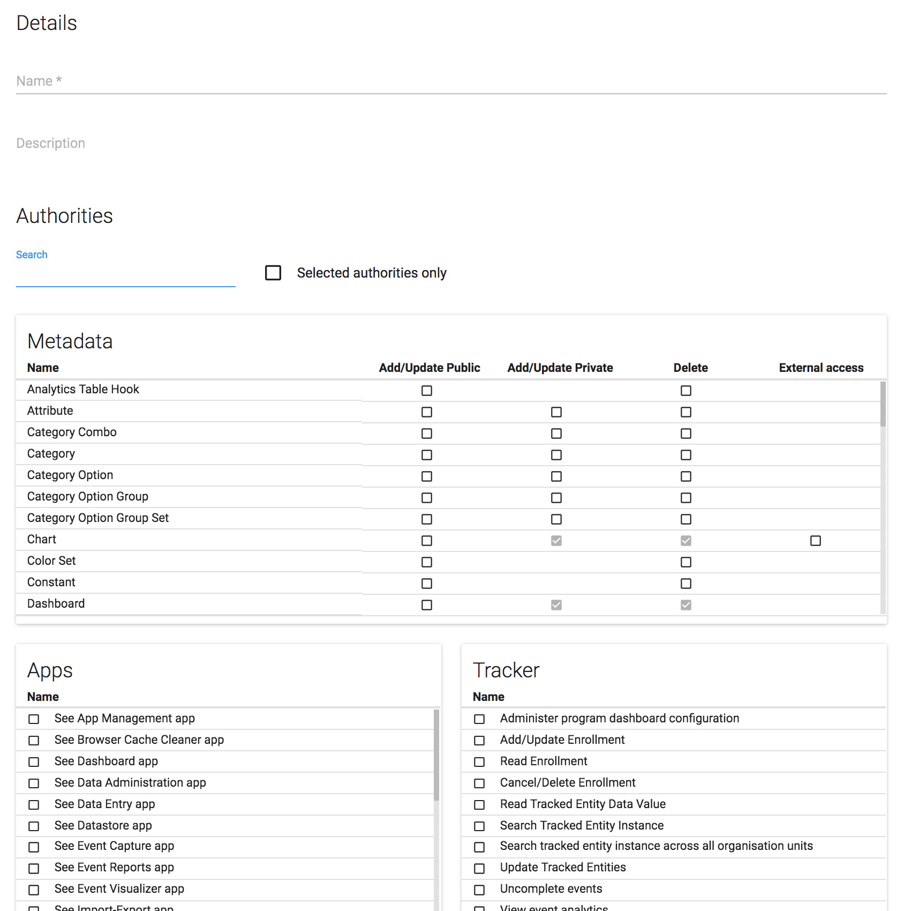

# Manage users, user roles and user groups

<!--DHIS2-SECTION-ID:manage_user_role_group-->

## About user management

<!--DHIS2-SECTION-ID:about_user_userrole-->

Multiple users can access DHIS2 simultaneously and each user can have
different authorities. You can fine-tune these authorities so that
certain users can only enter data, while others can only generate
reports.

  - You can create as many users, user roles and user groups as you
    need.

  - You can assign specific authorities to user groups or individual
    users via user roles.

  - You can create multiple user roles each with their own authorities.

  - You can assign user roles to users to grant the users the
    corresponding authorities.

  - You can assign each user to organisation units. Then the user can
    enter data for the assigned organisation units.

<table>
<caption>User management terms and definitions</caption>
<colgroup>
<col style="width: 20%" />
<col style="width: 40%" />
<col style="width: 40%" />
</colgroup>
<thead>
<tr class="header">
<th>
Term
</th>
<th>
Definition
</th>
<th>
Example
</th>
</tr>
</thead>
<tbody>
<tr class="odd">
<td>
Authority
</td>
<td>
A permission to perform one or several specific tasks
</td>
<td>
Create a new data element

Update an organisation unit

View a report
</td>
</tr>
<tr class="even">
<td>
User
</td>
<td>
A person's DHIS2 user account
</td>
<td>
admin

traore

guest
</td>
</tr>
<tr class="odd">
<td>
User role
</td>
<td>
A group of authorities
</td>
<td>
Data entry clerk

System administrator

Antenatal care program access
</td>
</tr>
<tr class="even">
<td>
User group
</td>
<td>
A group of users
</td>
<td>
Kenya staff

Feedback message recipients

HIV program coordinators
</td>
</tr>
</tbody>
</table>

You manager users, user roles and user groups in the **Users** app.

<table>
<caption>Objects in the Users app</caption>
<colgroup>
<col style="width: 20%" />
<col style="width: 80%" />
</colgroup>
<thead>
<tr class="header">
<th>
Object type
</th>
<th>
Available functions
</th>
</tr>
</thead>
<tbody>
<tr class="odd">
<td>
User
</td>
<td>
Create, edit, invite, clone, disable, display by organisation unit, delete and show details
</td>
</tr>
<tr class="even">
<td>
User role
</td>
<td>
Create, edit, share, delete and show details
</td>
</tr>
<tr class="odd">
<td>
User group
</td>
<td>
Create, edit, join, leave, share, delete and show details
</td>
</tr>
</tbody>
</table>

### About users

Each user in DHIS2 must have a user account which is identified by a
user name. You should register a first and last name for each user as
well as contact information, for example an email address and a phone
number.

It is important that you register the correct contact information. DHIS2
uses this information to contact users directly, for example sending
emails to notify users about important events. You can also use the
contact information to share for example dashboards and pivot tables.

A user in DHIS2 is associated with an organisation unit. You should
assign the organisation unit where the user works.

When you create a user account for a district record officer, you should
assign the district where he/she works as the organisation unit.

The assigned organisation unit affects how the user can use DHIS2:

  - In the **Data Entry** app, a user can only enter data for the
    organisation unit she is associated with and the organisation units
    below that in the hierarchy. For instance, a district records
    officer will be able to register data for her district and the
    facilities below that district only.

  - In the **Users** app, a user can only create new users for the
    organisation unit she is associated with in addition to the
    organisation units below that in the hierarchy.

  - In the **Reports** app, a user can only view reports for her
    organisation unit and those below. (This is something we consider to
    open up to allow for comparison reports.)

An important part of user management is to control which users are
allowed to create new users with which authorities. In DHIS2, you can
control which users are allowed to perform this task. The key principle
is that a user can only grant authorities and access to data sets that
the user itself has access to. The number of users at national, province
and district level are often relatively few and can be created and
managed by the system administrators. If a large proportion of the
facilities are entering data directly into the system, the number of
users might become unwieldy. It is recommended to delegate and
decentralize this task to the district officers, it will make the
process more efficient and support the facility users better.

### About user roles

A user role in DHIS2 is a group of authorities. An authority means the
permission to perform one or more specific tasks.

A user role can contain authorities to create a new data element, update
an organisation unit or view a report.

A user can have multiple user roles. If so, the user's authorities will
be the sum of all authorities and data sets in the user roles. This
means that you can mix and match user roles for special purposes instead
of only creating new ones.

A user role is associated with a collection of data sets. This affects
the **Data Entry** app: a user can only enter data for the data sets
registered for his/her user role. This can be useful when, for example,
you want to allow officers from health programs to enter data only for
their relevant data entry forms.

Recommendations:

  - Create one user role for each position within the organisation.

  - Create the user roles in parallel with defining which user is doing
    which tasks in the system.

  - Only give the user roles the exact authorities they need to perform
    their job, not more. Only those who are supposed to perform a task
    should have the authorities to perform it.

### About user groups

A user group is a group of users. You use user groups when you set up
sharing of objects or notifications, for example push reports or program
notifications.

See also:

[Sharing](https://ci.dhis2.org/docs/master/en/user/html/sharing.html)

[Manage program
notifications](https://docs.dhis2.org/master/en/user/html/configure_tracker_program_in_Maintenance_app.html#create-a-program-stage-notification)

[Mange push
reports](https://docs.dhis2.org/master/en/user/html/manage_push_report.html)

## Workflow

<!--DHIS2-SECTION-ID:user_mgt_workflow-->

1.  Define the positions you need for your project and identify which
    tasks the different positions will perform.

2.  Create roughly one user role for each position.

3.  Create users.

4.  Assign user roles to the users.

5.  Assign the users to organisation units.

6.  (Optional) Group users in user groups.

7.  Share datasets with users or user-groups via the Sharing Dialog in
    Data set management section of the Maintenance app

> **Tip**
>
> For users to be able to enter data, you must add them to an
> organisational unit level and share a dataset with them.

## Manage users

<!--DHIS2-SECTION-ID:mgt_user-->

### Create a user

<!--DHIS2-SECTION-ID:create_user-->

1.  Open the **Users** app and click on the **+** in the **Users** card.

2.  Select whether you want to fill in all the personal user
    information, or invite the user by email to complete the rest of the
    user information:
 - **Create account with user details**

Choose this option if you would like to enter all the login details of
the new user such as username, password, etc. Under these conditions, the fields username, password, surname, first
name, and roles are mandatory.  
After you've created the user, the account is ready for the user to use
with the user name and password that you provide.  
 - **Email invitation to create account**

Choose this option if you want to send an invitation by email to the
user. Then she/he must return to DHIS2 and finish setting up their user
account. The account that the user finishes setting up will be limited
according to how you configure the account.

> **Note**
>
> In order to use this feature the system should have a valid email 
> configuration in SystemSettings -\> Email

Enter the email address to which the invitation should be sent. If you
want to, you may also enter the user name that the account will have. If
you leave the user name empty, then the user may choose their own user
name when they respond to the invitation (as long as it is not taken
already for another user.)  
After you've created the user, the system sends an email to the address
you provided. It contains a unique web link by which the user can return
to the system and activate their account by entering the rest of their
user information. The user must finish setting up the account within 4
days, after that the invitation becomes invalid.

3. (Optional) Provide values for the fields **OIDC mapping claim, LDAP identifier, Mobile phone number, WhatsApp, Facebook messenger, Skype, Telegram and Twitter**.

4. Select an **Interface language**.  
You can select a language into which fixed elements of the DHIS2 user interface have been translated. 

5. Select a **Database language**.  
You can select a language into which implementation-supplied
items have been translated in the database, for example data element
names or organisation unit level names.

6. In the **Available roles** section, double-click the user roles you want to assign to the user.

7. Select **Data capture and maintenance organisation units**. 
  
The data capture and maintenance organisation units control for which organisation units the user can do data entry. You must assign at least one data capture and maintenance organisation unit to each user.  
Users will have access to all sub-organisation units of the assigned
organisation units. For example, if you've assigned a user to a district
which has several facilities contained in the district, the user would
have access to the district's data, as well as all of the facilities
contained within the district.

8. (Optional) Select **Data output and analysis organisation units**.  
The data output and analysis organisation units controls for 
which organisation units the user can view aggregated data in the 
analytics apps, for example the **Pivot Table** and **GIS** apps. You 
can assign any number of data output and analysis organisation units to 
a user.  
Users will have access to all sub-organisation units of the
assigned organisation units. You shouldn't select the descendants of an
organisation unit which you have already selected. For example, if
you've assigned the user to a district, you shouldn't select the
facilities within that district.  

> **Note**
> 
>Assigning data output and analysis organisation units organisation units is optional. If you don't specify
>any organisation unit, the user will have access to the full
>organisation unit hierarchy for viewing aggregated data. As with the
>data capture organisation units, *you should not select descendant
>organisation units of a unit which you have already selected*.  
>In several places in the analytics apps, you can select "user organisation
>unit" for the organisation unit dimension. This mechanism will first
>attempt to use the data view organisation units linked to the current
>user. If not found, it will use the data capture and maintenance
>organisation units. If the user has been assigned to multiple
>organisation units, the use of "user organisation unit" may result in
>unpredictable behaviour.  

9. Click **Show more options** and an additional
three fields will show. (Optional)   

10. In the **Search organisation units** 
select the organisation units you want the user to be able to search in.  

11. (Optional) In the **Available user groups** section, double-click the
user groups you want to assign to the user.  

12. (Optional) In the **Available dimension restrictions for data analytics** section,
double-click the dimensions you want to assign to the user.   
You can restrict the values the user sees in data analytics apps by selecting
dimensions that will restrict the user's view.

> **Example**
>
> Let's say you have defined *Implementing Partner* as a category option group set, and you have shared with this user only one or more specific implementing partners (category option groups). If you want to make sure that the user does not see totals in analytics that include values from other groups, assign *Implementing Partner* to the user.  
This insures that any data visible to the user through the analytics apps will be filtered to select only the Implementing Partner category option group(s) which are visible to the user.  

13. Click **Save**. 

### Edit user objects

1.  Open the **Users** app and find the type of user object you want to
    edit.

2.  In the object list, directly click the relevant object, or click the
    menu icon and select **Edit**.

3.  Modify the options you want.

4.  Click **Save**.

### Disable users

<!--DHIS2-SECTION-ID:disable_user-->

You can disable a user. This means that the user's account is not
deleted, but the user can't log in or use DHIS2.

1.  Open the **Users** app and click **User**.

2.  In the list, click the menu icon of relevant user record and select
    **Disable**.

3.  Click **OK** to confirm.

> **Warning** 
> 
> If you are using the [Android Capture App](https://www.dhis2.org/android) disabling a user will cause the application to delete the local data stored on the phone next time the user attemps an on-line login. Please make sure that when you use the *disable user* function all the data has been synced with the server. Or that you are using this funcionality to ensure data deletion in case of a device being lost.

### Display a user's profile

1.  Open the **Users** app and click **User**.

2.  In the list, click the menu icon of the relevant user and select
    **Profile**.

### Filter users by organisation unit

You can view all users that have been assigned to a particular
organisation unit.

1.  Open the **Users** app and click **Users**.

2.  Above the user list, click on the **Organisation Unit** filter
    input.

3.  A pop-up will appear in which you can select the organisation units
    you would like to filter by.

The list of users will be filtered to only include users which have been
assigned to the selected organisation units.

### Clone users

<!--DHIS2-SECTION-ID:clone_user-->

1.  Open the **Users** app and click **User**.

2.  In the object list, click the menu icon of the relevant user and
    select **Replicate**.

3.  Enter a new user name and password for the cloned user account.

4.  Click **Replicate**.

5.  In the object list, click the user you just created and click
    **Edit**.

6.  Modify the options you want.

7.  Click **Save**.

### Change user password

<!--DHIS2-SECTION-ID:user_manage_password-->

To change a user's password:

1.  Open the **Users** app and click **User**.

2.  In the object list, click the menu icon of the relevant user and
    select **Edit**.

3.  Enter a new password and retype it.

4.  Click **Save**.

#### Password requirements

The following rules apply when you create a new password. The password must:

  - Contain at least 8 characters. Note that this number is configurable through the system setting "Minium characters in password", which can be up to 14 characters. 
  
  - Not contain more than 40 characters.

  - Contain at least one special character (non-alphanumeric character).

  - Contain at least one upper-case character.
  
  - Contain at least one lower-case character.

  - Contain at least one digit (number).

  - Not contain the username or email address of the user account.

  - Not contain generic words such as *system*, *admin*, *user*, *login*, and *manager*.

  - Not be one of the previous 24 passwords the user has used. This does not apply in case when a super user resets the password for another user.

### Delete user objects

1.  Open the **Users** app and find the type of user object you want to
    delete.

2.  In the object list, click the menu icon of the relevant object and
    select **Remove**.

3.  Click **OK** to confirm.

### Display details of user objects

1.  Open the **Users** app and find the type of user object you want to
    view.

2.  In the object list, click the menu icon of the relevant object and
    select **Show details**.

### Disable Two Factor Authentication for a user

If a user has enabled Two Factor Authentication and then loses access to
his/her authentication device (e.g. smartphone gets lost or broken),
this user will not be able to log into the system any more. To solve this
issue, a user manager can disable Two Factor Authentication for the
affected user, so that the user is able to access the system again using
just a password.

1.  Open the **Users** app and click **Users**.

2.  In the object list, click the menu icon of the relevant user and
    select **Disable Two Factor Authentication**.

3.  Click **OK** to confirm

> **Note**
>
> The option to disable Two Factor Authentication will only be available
> for users that have set up Two Factor Authentication via the
> user-profile-app.

## Manage user roles

<!--DHIS2-SECTION-ID:mgt_userrole-->

### Create a user role

<!--DHIS2-SECTION-ID:create_userrole-->

1.  Open the **Users** app and click **User role**.

2.  Click **Add new**.

3.  Enter a **Name**, for example "Super user" or "Admin user".

4.  Enter a **Description**.

5.  In the **Authorities** section, select the authorities you want to
    give to the user role. You can also use the filter inputs above the
    authority section to search for a specific authority.

6.  Click **Add**.

### Edit user objects

1.  Open the **Users** app and find the type of user object you want to
    edit.

2.  In the object list, directly click the relevant object, or click the
    menu icon and select **Edit**.

3.  Modify the options you want.

4.  Click **Save**.

### Delete user objects

1.  Open the **Users** app and find the type of user object you want to
    delete.

2.  In the object list, click the menu icon of the relevant object and
    select **Remove**.

3.  Click **OK** to confirm.

### Display details of user objects

1.  Open the **Users** app and find the type of user object you want to
    view.

2.  In the object list, click the menu icon of the relevant object and
    select **Show details**.

### Change sharing settings for user objects

1.  Open the **Users** app and find the type of user object you want to
    modify.

2.  In the object list, click the relevant object and select **Sharing
    settings**.

3.  (Optional) Search for a user group and select it, then click the
    plus icon. The user group is added to the list.

4.  (Optional) Select **External access (without login)**.

5.  Change the settings for the user groups you want to modify.
 - **None**
 - **Can view**: Everyone in the user group can view the object
 - **Can edit and view**: Everyone in the user group can view and edit the object

6.  Click **Save**.

## Manage user groups

<!--DHIS2-SECTION-ID:mgt_usergroup-->

### Create a user group

<!--DHIS2-SECTION-ID:create_usergroup-->

1.  Open the **Users** app and click **User group**.

2.  Click **Add new**.

3.  In the **Name** field, type the name of the user group.

4.  In the **Available users** section, double-click the users you want
    to add to the user group.

5.  In the **Available user groups** section, double-click the user
    groups you want to add to the user group.

6.  Click **Add**.

### Join user groups

<!--DHIS2-SECTION-ID:join_usergroup-->

1.  Open the **Users** app and click **User group**.

2.  In the list, click the relevant user group and select **Join
    group**.

### Leave user groups

<!--DHIS2-SECTION-ID:leave_usergroup-->

1.  Open the **Users** app and click **User group**.

2.  In the list, click the relevant user group and select **Leave
    group**.

### Edit user objects

1.  Open the **Users** app and find the type of user object you want to
    edit.

2.  In the object list, directly click the relevant object, or click the
    menu icon and select **Edit**.

3.  Modify the options you want.

4.  Click **Save**.

### Delete user objects

1.  Open the **Users** app and find the type of user object you want to
    delete.

2.  In the object list, click the menu icon of the relevant object and
    select **Remove**.

3.  Click **OK** to confirm.

### Display details of user objects

1.  Open the **Users** app and find the type of user object you want to
    view.

2.  In the object list, click the menu icon of the relevant object and
    select **Show details**.

### Change sharing settings for user objects

1.  Open the **Users** app and find the type of user object you want to
    modify.

2.  In the object list, click the relevant object and select **Sharing
    settings**.

3.  (Optional) Search for a user group and select it, then click the
    plus icon. The user group is added to the list.

4.  (Optional) Select **External access (without login)**.

5.  Change the settings for the user groups you want to modify.
 - **None**
 - **Can view**: Everyone in the user group can view the object
 - **Can edit and view**: Everyone in the user group can view and edit the object

6.  Click **Save**.

## Decentralize user management

DHIS2 supports a concept for user management referred to as *managed
users* which allows to explicitly define which users should be allowed
to manage or modify which users. To "manage a user" implies that you can
see and modify that user. The basic concept for user management is that
you can see and modify users which you have been granted all of the
authorities; in other words you can modify users which have a subset of
your own authorities. The managed users concept gives you greater
control over this.

The managed users concept allows you to define which users should be
able to manage which users. This is configured through user groups and
memberships within such groups. A user group can be configured to be
allowed to manage other user groups from the standard add and update
user interface. The effect is that a specific user can manage all users
which are members of user groups which can be managed by a user group
that the user is member of. In other words, users can be managed by all
members of user groups which are managing user groups they are member
of.

To enable this concept you should grant users the authority to
"Add/update users within managed groups", and *not* grant access to the
standard "Add/update users" authority. An implication of the managed
users concept is that when creating a user with the "Add/update users
within managed groups" only, the user must be made a member of at least
one user group that the current user can manage. If not, the current
user would lose access to the user being created immediately. This is
validated by the system.

When granted the "Add/update users within managed groups" authority, the
system lets a user add members to user groups for which she has
read-only access to. The purpose of this is to allow for decentralized
user management. You may define a range of user groups where other users
may add or remove members, but not remove or change the name of the
group.

## Example: user management in a health system

<!--DHIS2-SECTION-ID:user_mgt_example-->

In a health system, users are logically grouped with respect to the task
they perform and the position they occupy.

1.  Define which users should have the role as system administrators.
    They are often part of the national HIS division and should have
    full authority in the system.

2.  Create roughly one user role for each position.

Examples of common positions are:

<table>
<colgroup>
<col style="width: 27%" />
<col style="width: 21%" />
<col style="width: 25%" />
<col style="width: 25%" />
</colgroup>
<thead>
<tr class="header">
<th>
Position
</th>
<th>
Typical tasks
</th>
<th>
Recommended authorities
</th>
<th>
Comment
</th>
</tr>
</thead>
<tbody>
<tr class="odd">
<td>
System administrators
</td>
<td>
Set up the basic structure (metadata) of the system.
</td>
<td>
Add, update and delete the core elements of the system, for example data elements, indicators and data sets.
</td>
<td>Only system administrators should modify metadata.

If you allow users outside the system administrators team to modify the metadata, it might lead to problems with coordination.

Updates to the system should only be performed by the administrators of the system.
</td>
</tr>
<tr class="even">
<td>
National health managers

Province health managers
</td>
<td>
Monitor and analyse data
</td>
<td>
Access to the reports module, the <strong>GIS</strong>, <strong>Data Quality</strong> apps and the dashboard.
</td>
<td>
Don't need access to enter data, modify data elements or data sets.
</td>
</tr>
<tr class="odd">
<td>
National health information system division officers (HISO)

District health records and information officers (DHRIO)

Facility health records and information officers (HRIO)
</td>
<td>
Enter data that comes from facilities which are not able to do so directly

Monitor, evaluate and analyse data
</td>
<td>
Access to all the analysis and validation apps

Access to the <strong>Data Entry</strong> app.
</td>
<td>
-
</td>
</tr>
<tr class="even">
<td>
Data entry clerks
</td>
<td>
-
</td>
<td>
-
</td>
<td>
-
</td>
</tr>
</tbody>
</table>
