# Managing dashboards

<!--DHIS2-SECTION-ID:dashboard-->

## About dashboards

Dashboards are intended to provide quick access to different analytical
objects (maps, charts, reports, tables, etc) to an individual user.
Dashboards can be shared with user groups. Dashboards can also be printed.

A user or administrator could create a dashboard called "Antenatal care"
which might contain all relevant information on antenatal care. This
dashboard could then be shared with the user group called "ANC control",
which might consist of all users of the ANC control program. All users
within this group would then be able to view the same dashboard.

## Dashboard and control bar

<!--DHIS2-SECTION-ID:dashboards_setup-->

Dashboards have a title, description, and any number of dashboard items.
The dashboard items can be of many different types, including charts,
maps, reports, tables, resources, messages, and text items. Above the
dashboard is the control bar, which shows all your available dashboards,
including a dashboard search field, and a **+** button for creating a
new dashboard.

The dashboard has two modes: view and edit/create. When you first log in
to DHIS2, your most recently used dashboard will be displayed in view
mode, if you are on the same computer as you were previously. If you are
using a different computer, then the first starred dashboard will be
displayed. If there are no starred dashboards, then the first dashboard (alphabetically)
will be displayed. Starred dashboards always show first in the dashboard
list.

The screenshot below shows a dashboard called "Antenatal Care", which
has been populated with charts and maps.

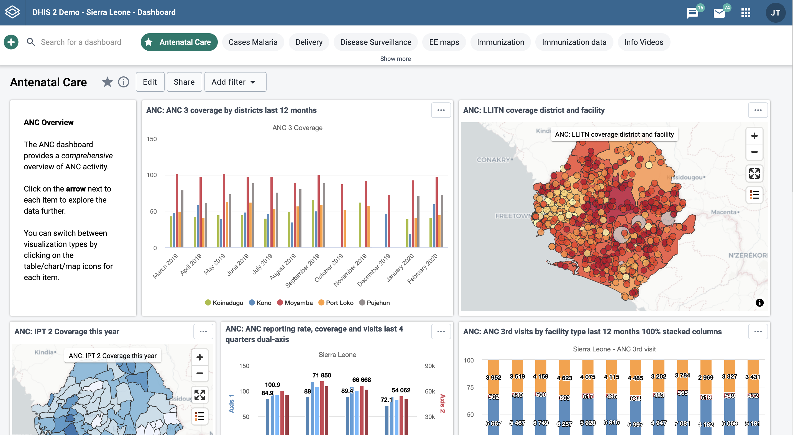

### Searching in the list of dashboards

You can search for a specific dashboard using the search field in the
upper left of the control bar entitled “Search for a dashboard”. The
search is case insensitive, and as you type, the list of dashboards will
filter down to those that match your search text.

### Customizing the height of the control bar

You can set a specific height for the dashboards control bar by
down-clicking and dragging the bottom edge of the control bar. When you
finish dragging, the new height will be set. Clicking on **Show more**
will expand the control bar to its maximum height (10 "rows"). Clicking
on **Show less** will reset the height to your customized height.

## Creating a dashboard

To create a new dashboard, click the green **+** button in the left
corner of the control bar to go into create mode. Add a title in the
title field, and optionally a description in the description field. If you do not add a title, the dashboard will automatically be titled "Untitled dashboard".

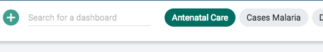

**Create mode:**

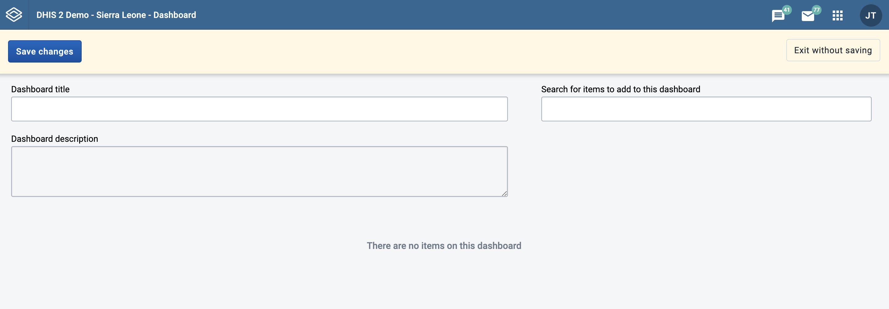

### Adding items to the dashboard

Add items to the dashboard by searching from the item selector in the
upper right part of the dashboard area. Available items include:

- Visualizations

- Maps

- Event reports

- Event charts

- Report

- Resources

- Apps

- Email

- Text boxes

- Spacer

The list of items in the drop-down initially displays 10 visualizations (charts and tables), and 5 from each of the other categories, based on the search text you enter. Email, text boxes and spacer items are also found in the drop-down. To view more
items, click on **Show more**, and the list for that type will be
extended to 25 items. If you still do not find the item you want, try
typing a more specific search text.

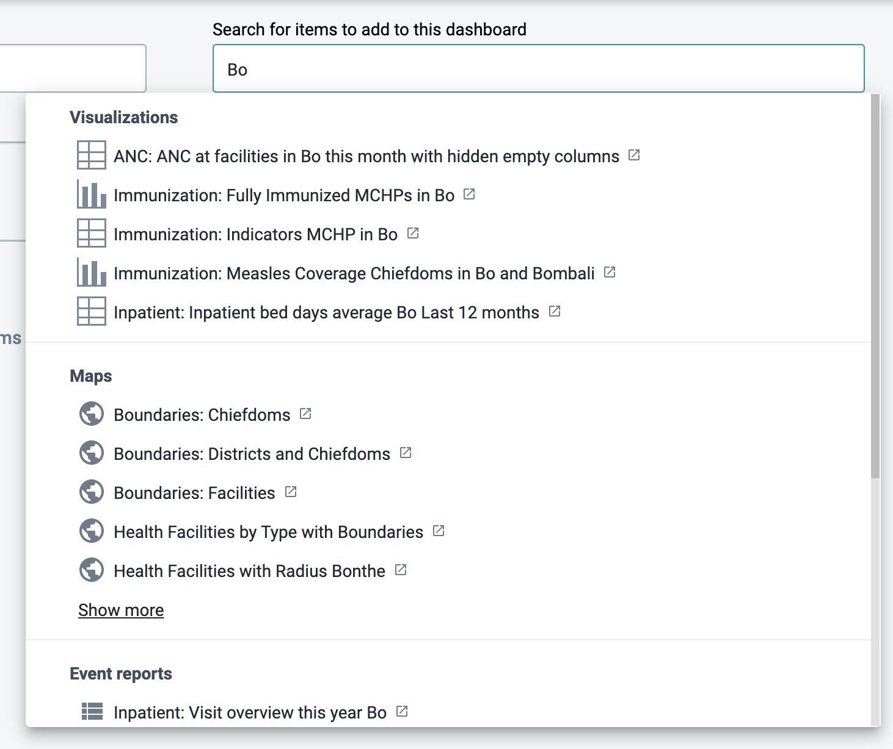

Once you select an item, it will be added to the top left position of
the dashboard. The added items can be moved using the mouse by
down-clicking on the item and dragging it to the desired position. It
can also be resized with the mouse by down-clicking on the drag handle
in the lower right corner of the item and dragging to the desired size.

#### Spacer items

The dashboard is configured with the "anti-gravity" setting for
positioning items. This means that items will "rise" upwards until they
run into another item. In order to force empty vertical space between
items (like an empty row), you can add spacer items to the dashboard.
They are only visible in edit/create mode. In view mode, they are not
displayed, but take up the defined space.

Spacer in **edit/create mode**:

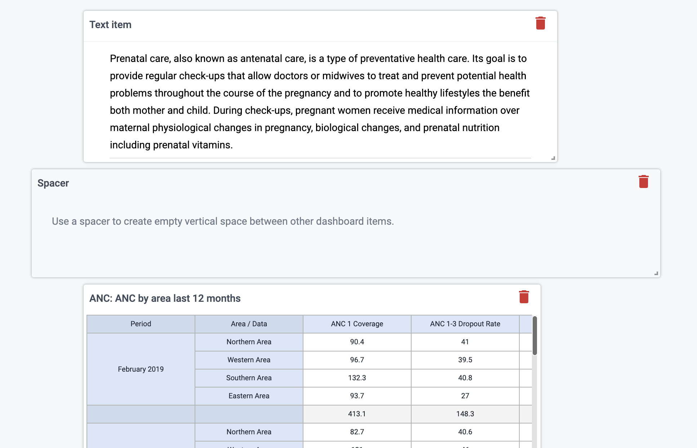

Spacer in **view mode**:

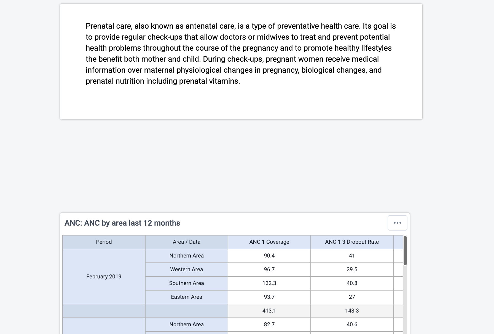

### Removing items

Remove items by clicking on the red trash can at the upper right of the
item. Be aware that because of the "anti-gravity" setting in the
dashboard, when you remove an item, the items that are positioned below
the removed item will "rise" upwards.

### Print preview

Click on the **Print preview** button to view how the dashboard would look in dashboard layout print.

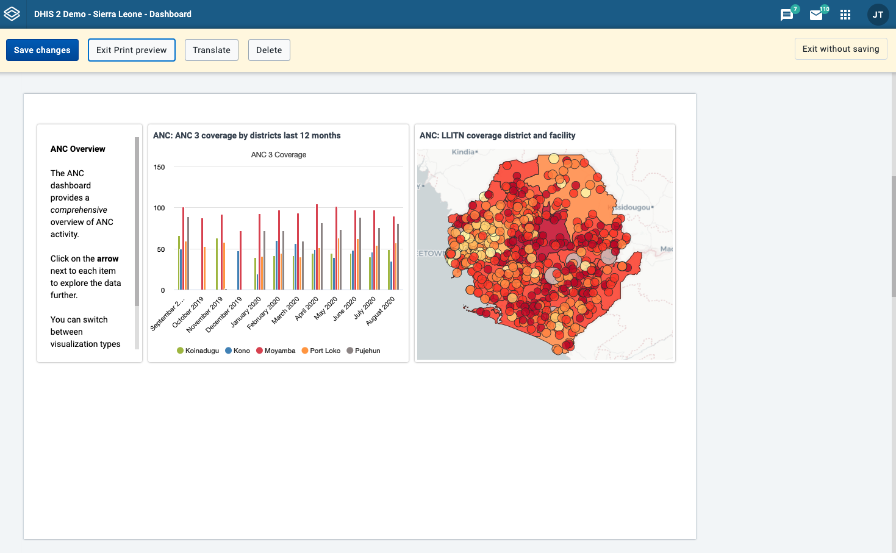

Click on **Exit Print preview** to return to editing the dashboard.

Note that some items may be moved down in order to avoid page breaks. Items may also be shortened to fit on one page. Items that are shortened show an info icon in the upper right corner in preview. This icon is removed in the actual print.

### Saving the dashboard

When creating or editing a dashboard, changes are only saved when you
click **Save changes** button in the dashboard edit bar at the top of
the page. If you don't want to save your changes, click the **Exit without saving** button to the upper right. You will then be returned to
view mode with the dashboard you were previously viewing.

## Editing an existing dashboard

If you have access rights to edit the currently active dashboard, there
will be an **Edit** button to the right of the dashboard title in view
mode. Click on this button to enter edit mode.

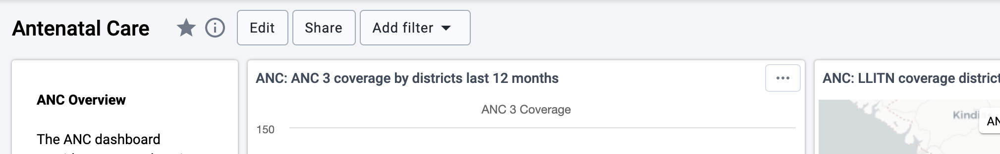

Refer to the above section about creating dashboards for information on
adding and removing items to the dashboard.

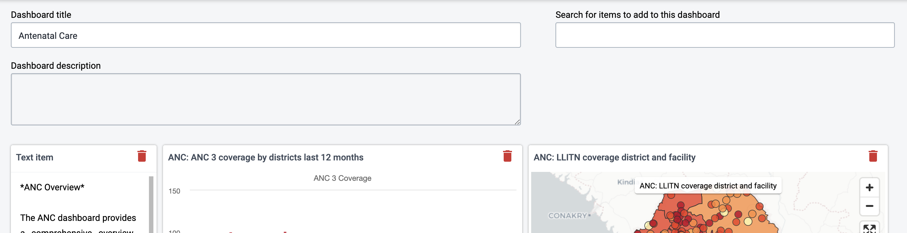

### Translating dashboard title and description

You can add translations for dashboard title and description while in
edit mode. The dialog provides a list of languages to translate to, and
shows the original dashboard title underneath the name input field.

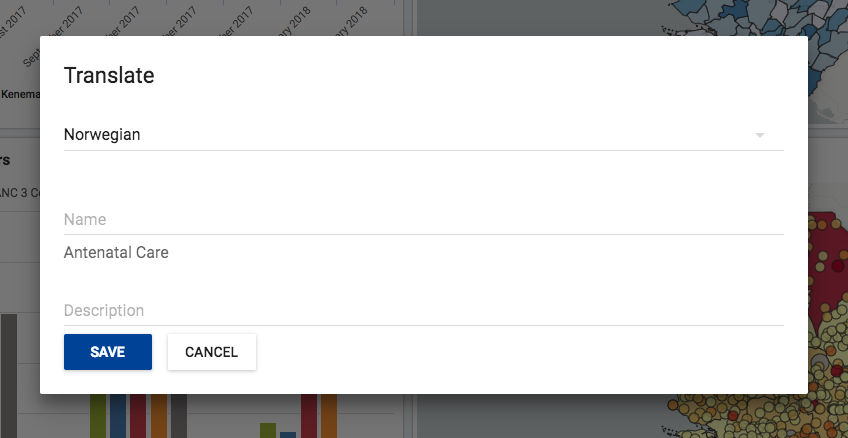

1.  Click on the **TRANSLATE** button located above the dashboard

2.  Select the language you wish to add a translation for.

3.  Add the title and/or description, and click **SAVE**

## Deleting a dashboard

If you have access to delete the dashboard, then there will be a
**Delete** button located above the dashboard, when in edit mode. A
confirmation dialog will first be displayed to confirm that you want to
delete the dashboard.

## Viewing a dashboard

From view mode, you can toggle showing the description, star a dashboard, apply filters, print the dashboard, and share the dashboard with other users and groups.

### Show description

To toggle the description, click on the **...More** button and choose **Show description** (or **Hide description**). This setting will be remembered for all dashboards that you open. This setting applies to you, not other users.

### Starred dashboards

Your starred dashboards are listed first in the list of dashboards. To
star a dashboard, click on the star button to the right of the title. You can also toggle the star from the **...More** menu.
When the star is “filled”, that means the dashboard is starred. Starring
a dashboard only applies to you, not other users.

### Filtering a dashboard

Multiple filters can be applied to a dashboard for changing the data
displayed in the various dashboard items.
The filters are applied to each dashboard item in the same way:
each added filter overrides the original value for that dimension in
the original chart, table or map (visualization).
It is possible to filter on Organisation Units, Periods and other
dynamic dimensions depending on the DHIS2 instance.

To add a filter, click on the **Add Filter** button and choose the
dimension:

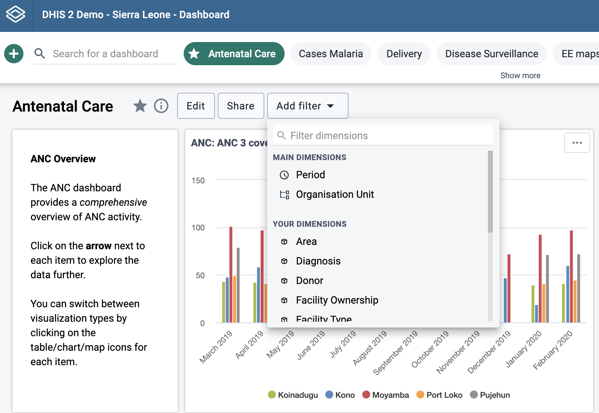

A dialog opens where the filter selection can be made.

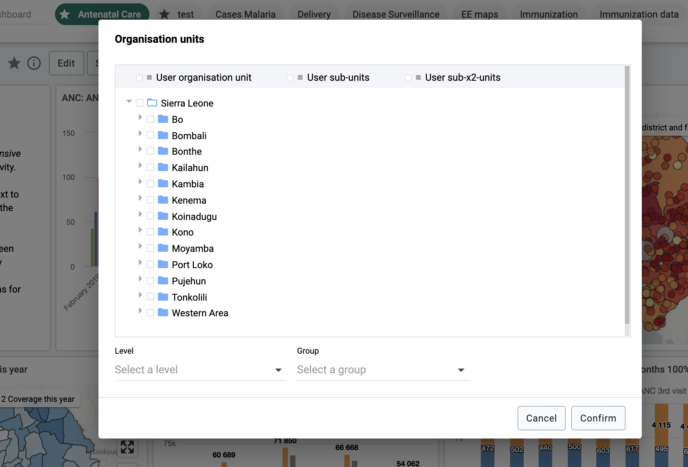

Click on **Confirm** in the dialog to apply the filter to the
current dashboard.

Filters are not stored, so when switching to a different dashboard they
are lost.
Filter badges appear above the dashboard items to
indicate that what is shown in the dashboard items is not the original
visualization, but a manipulated one where the filters override
the stored dimensions' values.

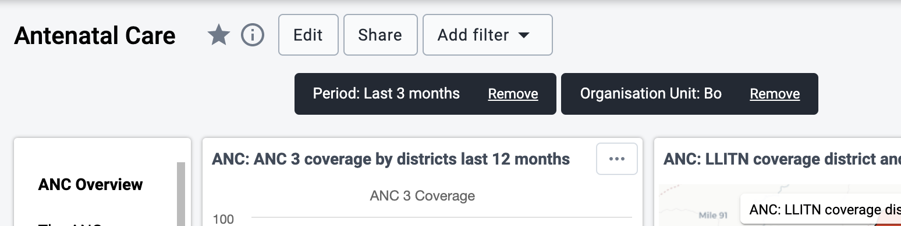

Filter badges can be clicked for opening the filter selection dialogs
thus allowing for filter editing.
A filter can be removed by clicking on the **Remove** button in the badge.
Whenever a filter is added, edited or removed, the dashboard items
reload to show the updated data.
Filter badges are always visible at the top of the page when
scrolling the dashboard content.

### Printing a dashboard

From the **...More** menu you can print the active dashboard. There are two styles of dashboard print: dashboard layout and one item per page. For both styles, a title page is added that shows the dashboard title, description (if the Show description setting is on), and any applied dashboard filters.

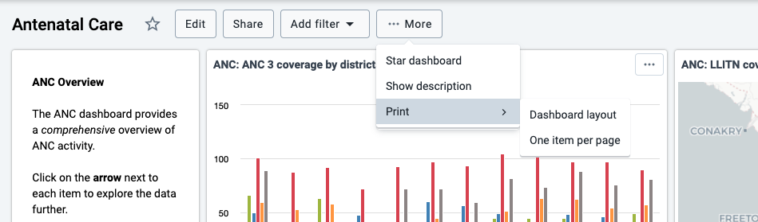

For best print results:

- use Chrome or Edge
- wait until all dashboard items have loaded before printing
- use A4 landscape setting with default margins set

#### Print dashboard layout

Dashboard layout print will approximate the dashboard layout as it is shown in the browser. Note that some adjustments may need to be made to the layout in order to avoid page breaks: the position of some items may be adjusted downwards, and items that are taller than one page are shortened.

Click on the **Print** button in the upper right to trigger the browser print functionality.

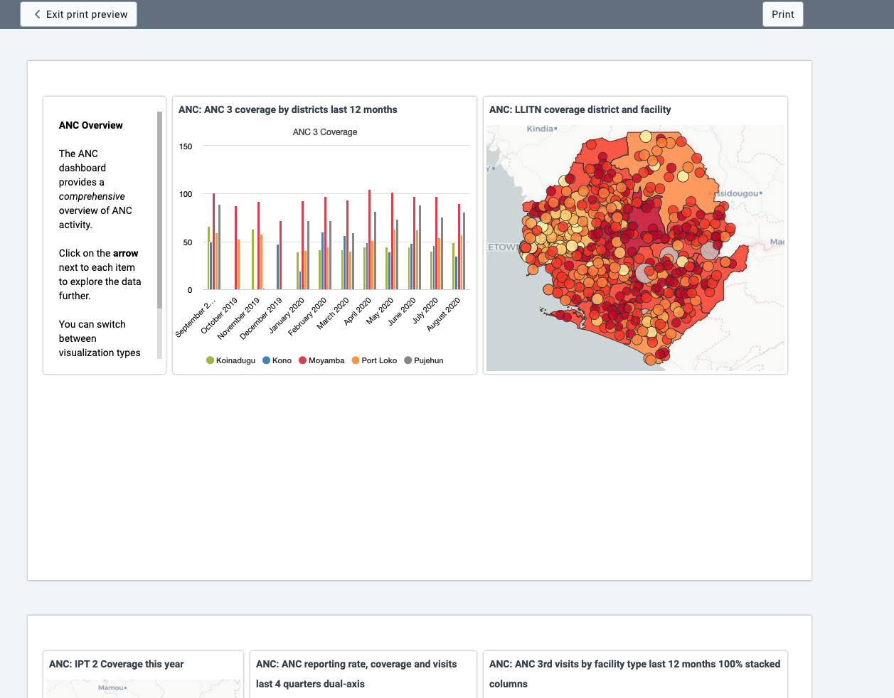

#### Print one item per page

This style of print will print each dashboard item on a separate page, maximizing the use of the paper.

Click on the **Print** button in the upper right to trigger the browser print functionality.

## Dashboard items with charts, pivot tables and maps

### Switching between visualizations

Dashboard items showing charts, pivot tables and maps can be toggled
between these visualizations. Click on the item menu button in the upper right corner of the item and choose the desired view:

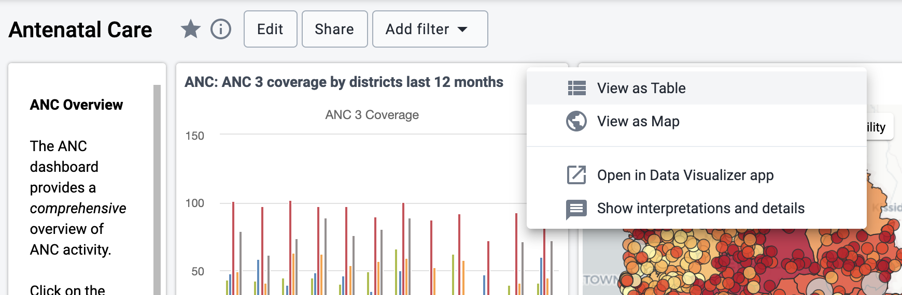

## Interpretations

You can write interpretations for the chart, pivot table, map, event
report, and event chart items. From the dashboard item menu, click on **Show interpretations and details**:

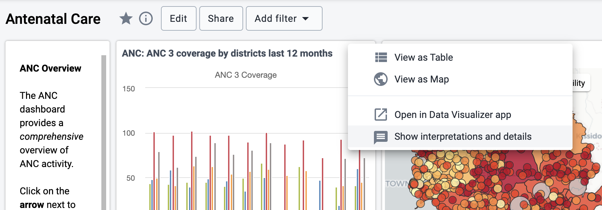

and the item will be expanded vertically underneath to show the description,
interpretations and replies. You can like an interpretation, reply to an
interpretation, and add your own interpretation. You can edit, share or delete
your own interpretations and replies, and if you have moderator access,
you can delete others’ interpretations.

It is possible to format the description field, and interpretations
with **bold**, _italic_ by using the Markdown style markers \* and \_
for **bold** and _italic_ respectively. The text field for writing new
interpretations has a toolbar for adding rich text. Keyboard shortcuts
are also available: Ctrl/Cmd + B and Ctrl/Cmd + I. A limited set of
smilies is supported and can be used by typing one of the following
character combinations: :) :-) :( :-( :+1 :-1. URLs are automatically
detected and converted into a clickable link.

Interpretations are sorted in descending order by date, with the most recent shown on top.
Interpretation replies are sorted in ascending order by date, with the oldest shown on top.

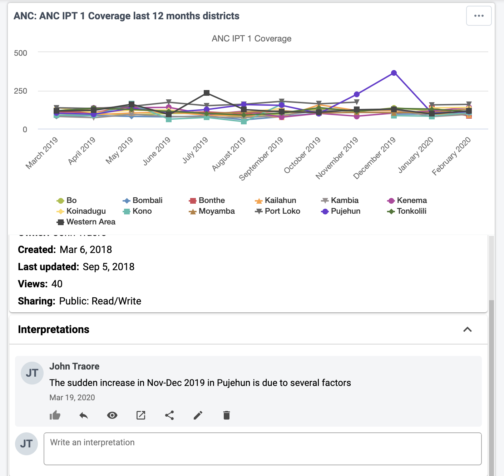

## Sharing a dashboard

<!--DHIS2-SECTION-ID:dashboard_sharing-->

In order to share a dashboard with user groups, click on the **SHARE**
button to the right of the dashboard title to display the dashboard
sharing settings options. To share the dashboard with specific users or
user groups, type in the name in the input field to add them to the
dashboard sharing settings

All dashboards have two sharing groups set by default.

- External access (without login)

  This option, when selected, provides access to the dashboard as an
  external resource through the API. This is useful for when you are creating an
  external web portal but would like to call information from a
  dashboard you have made internally within DHIS2. By default, this
  option is not selected. For more information, see [Viewing analytical resource representations](https://docs.dhis2.org/master/en/developer/html/webapi_viewing_analytical_resource_representations.html#) in the developer guide.

- Public access (with login)

  This option allows the selected dashboard to be pushed to all users
  within your DHIS2 instance. This can also be hidden from public view
  by selecting the "None" option, which is the default option for new
  dashboards.

User groups that have been added manually can be assigned two types of
permissions within the dashboard

- Can view

  Provides the user group with view only rights to the dashboard.

- Can edit and view

  Allows the user groups to edit the dashboard in addition to viewing
  it. Editing allows for altering the layout, resizing and removing
  items, renaming/deleting the dashboard etc.

You can provide users with the url of the dashboard, allowing them to
navigate directly to the dashboard. To get the dashboard url, just
access the dashboard in view mode, and copy the browser url. For
example, the url to the Antenatal Care dashboard in play.dhis2.org/demo
is:

https://play.dhis2.org/demo/dhis-web-dashboard/\#/nghVC4wtyzi
