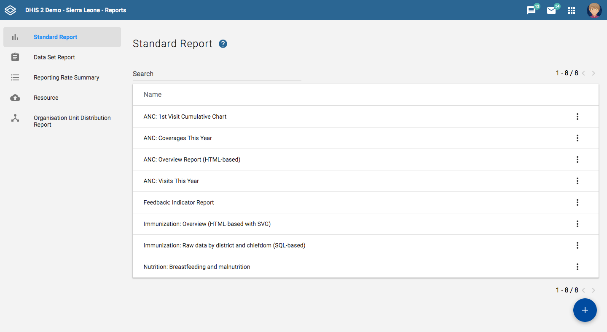
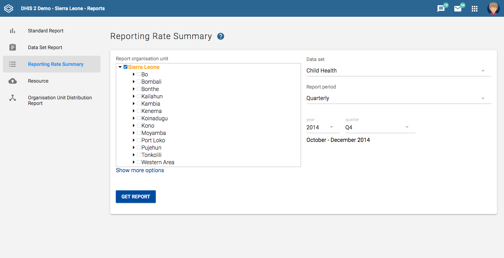
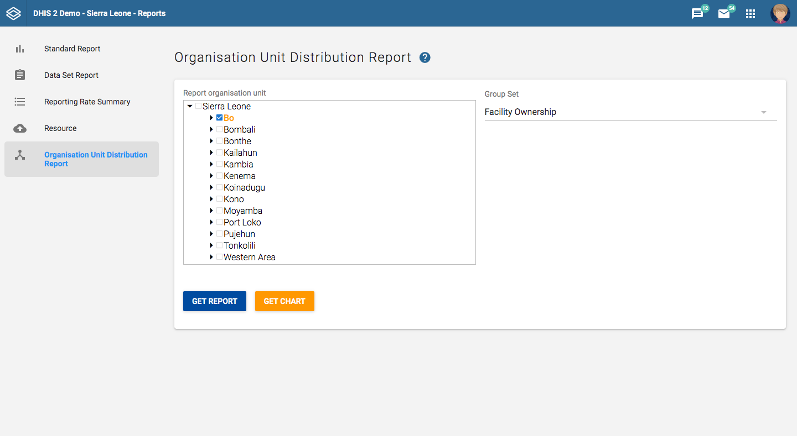

# Reporting functionality in the reports app

<!--DHIS2-SECTION-ID:using_the_reports_app-->

The reports app allows for canned, standard reports, data set reports, resources and org unit distribution reports.

## Using standard reports

<!--DHIS2-SECTION-ID:standard_reports_in_the_beta_reports_app-->

You access the available reports by navigating to Apps-\>Reports (Beta). In the
report menu in the left bar, click Standard Report. A list of all
pre-defined reports will appear in the main window.

You run/view a report by clicking on the triple-dot icon of the report and then
selecting "Create" from the contextual menu. If there are any
pre-defined parameters, you will see a report parameter window where you
must fill in the values needed for orgunit and/or reporting month,
depending on what has been defined in the underlying report table(s).
Click on "Generate Report" when you are ready. The report will either appear
directly in your browser or be available as a PDF file for download,
depending on your browser settings for handling PDF files. You can save
the file and keep it locally on your computer for later use.

## Using dataset reports

<!--DHIS2-SECTION-ID:dataset_reports_in_the_beta_reports_app-->

Dataset reports are printer friendly views of the data entry screen
filled with either raw or aggregated data. These are only available for
data sets that have custom data entry forms and not for default or
section forms.

You can access data set reports from Apps-\>Reports (Beta).

A Criteria window will appear where you fill in the details for your
report:

**Dataset:** The data set you want to display.

**Report period:** The actual period you want data for. This can be
aggregated as well as raw periods. This means that you can ask for a
quarterly or annual report even though the data set is collected
monthly. A data set's period type (collection frequency) is defined in
data set maintenance. First select the period type (Monthly, Quarterly,
Yearly etc.) in the drop down next to Prev and Next buttons, and then
select one of the available periods from the dropdown list below. Use
Prev and Next to jump one year back or forward.

**Use data for selected unit only:** Use this option if you want a
report for an orgunit that has children, but only want the data
collected directly for this unit and not the data collected by its
children. If you want a typical aggregated report for an orgunit you do
not want to tick this option.

**Report Organisation unit:** Here you select the orgunit you want
the report for. This can be at any level in the hierarchy as the data
will be aggregated up to this level automatically (if you do not tick
the option above).

When you are done filling in the report criteria you click on
"Generate". The report will appear as HTML in a printer-friendly format.
Use the print and save as functions in the browser to print or save (as
HTML) the report.You can also export the data set report in Excel and
PDF formats.

## Using reporting rate summary

<!--DHIS2-SECTION-ID:reporting_rate_summary_in_the_beta_reports_app-->

Access the reporting rate summary from the Apps-\>Reports (Beta) menu.
Reporting rate summaries will show how many datasets (forms) that have
been submitted by organisation unit and period.

The reporting rate is calculation is based on complete data set registrations. 
A complete data set registration refers to a user marking a data entry form as 
complete, typically by clicking the complete button in the data entry screen,
hereby indicating to the system that she considers the form to be
complete. This is i.e. a subjective approach to calculating
completeness.

The reporting rate summary will for each row show a range of measures:

  - Actual reports: Indicates the number of data entry complete
    registrations for the relevant data set.

  - Expected reports: Indicates how many data entry complete
    registrations are expected. This number is based on the number of
    organisation units the relevant data set has been assigned to
    (enabled for data entry).

  - Reporting rate: The percentage of reports registered as complete based on
    the number expected.

  - Reports on time: Same as actual reports, only reports registered as
    complete within the maximum number of days after the end of the
    reporting period. This number of days after reporting period can be
    defined per data set in the data set management.

  - Reporting rate on time: Same as percentage, only reports registered as
    complete on time used as numerator.

To run the report you can follow these steps:

  - Select an orgunit from the tree.
    
  - Select a data set.

  - Select a period type and a period from the list of available periods
    for that period type.

  - The report will then be rendered. Change any of the parameters above
    and click "Get report" again see the corresponding results.

## Using resources

<!--DHIS2-SECTION-ID:resources_in_the_beta_reports_app-->

The resource tool allows you to upload both files from your local
computer to the DHIS server and to add links to other resources on the
Internet through URLs. If cloud storage is configured for your system,
resources will be saved there.

To create a new resource:

1.  Open the **Reports (Beta)** app and click **Resource**.

2.  Click **Add new**.

3.  Enter a **Name**.

4.  Select a **Type**: **Upload file** or **External URL**.

5.  Click **Save**.

## Using organisation unit distribution reports

<!--DHIS2-SECTION-ID:orgunit_distribution_reports_in_the_beta_reports_app-->

You can access the Orgunit Distribution reports from the left side menu
in the Apps-\>Reports (Beta).

Orgunit distribution reports are reports that show how the orgunits are
distributed on various properties like type and ownership, and by
geographical areas.

The result can be presented in a table-based report or in a chart.

**Running a report:**

To run a report first select an orgunit in the upper left side orgunit
tree. The report will be based on orgunits located under the selected
orgunit. The select the orgunit group set that you want to use,
typically these are Type, Ownership, Rural/Urban, but can be any
user-defined orgunit group set. The you can click on either Get Report
to get the table-based presentation or Get chart to get the same result
in a chart. You can also download the table-based report as Excel or
CSV.

