# Using the Capture app

<!--DHIS2-SECTION-ID:capture_app-->

## About the Capture app

<!--DHIS2-SECTION-ID:about_capture_app-->

The Capture app serves as a replacement for the Event Capture app. In the future, the intention is to incorporate the Tracker Capture app and the Data Entry app into the Capture app.

In the Capture app you register events that occurred at a particular time and place. An event can happen at any given point in time. This stands in contrast to routine data, which can be captured for predefined, regular intervals. Events are sometimes called cases or records. In DHIS2, events are linked to a program. The Capture app lets you select the organisation unit and program and specify a date when a event happened, before entering information for the event.

## Implementer / administrator info

<!--DHIS2-SECTION-ID:implementer_info-->

### Metadata caching

<!--DHIS2-SECTION-ID:metadata_caching-->

For performance reasons the Capture app caches metadata in the client browser. When metadata is updated on the server the changes needs to be propagated to the clients that have already cached the metadata. Depending on the change, this is done in one of three ways:

1. If the change is bound to a program you will need to increase the program version for that particular program. For example, if you change the data elements in a program or a program rule, the version for the bound program needs be increased.

2. If the change is NOT bound to a program you will need to increase ANY program version for the change to be propagated to the clients. Examples here are changes to constants, organisation unit levels or organisation unit groups.

3. The exception to the two rules above is option sets. Option sets have their own version property, i.e. increasing the option set version should ensure the option set metadata are propagated to the clients.

## Register an event

<!--DHIS2-SECTION-ID:capture_register_event-->

1. Open the **Capture** app.

2. Select an organisation unit.

3. Select a program.

    You'll only see programs associated with the selected organisation
    unit and programs you've access to, and that is shared with your user group through data level sharing.

4. If the program has a category combination set the category option will have to be selected.

5. Click **New**.

      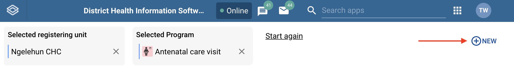

6. Fill in the required information.
    If the programs program stage is configured to capture a location:

    - If the field is a coordinate field you can either enter the coordinates
    directly or you can click the **map** icon to the left of the coordinate field.
    The latter one will open a map where you can search for a location or set on
    directly by clicking on the map.

    - If the field is a polygon field you can click the **map** icon to the left of
    the field. This will open a map where you can search for a location and capture
    a polygon (button in the upper rigth corner of the map).

7. If desired you can add a comment by clicking the **Write comment** button at the bottom of the form.

8. If desired you can add a relationship by clicking the **Add relationship** button at the bottom of the form.
   See the section about **Adding a relationship** for more information.

9. Click **Save and exit** or click the arrow next to the button to select **Save and add another**.
    - **Save and add another** will save the current event and clear the form.
    All the events that you have captured will be diplayed in a list at the bottom of the page.
    When you want to finish capturing events you can, if the form is blank,
    click the finish button or if your form contains data click the arrow
    next to **Save and add another** and select **Save and exit**.

> Note 1: Some data elements in an event might be mandatory (marked with a red star next to the data element lable).
> What this means is that all mandatory data elements must be filled in before the user is allowed to complete the event.
> The exception to this is if the user has the authority called __"Ignore validation of required fields in Tracker and Event Capture".__
> If the user has this authority, the mandatory data elements will not be required to be filled in before saving and
> the red star will not be displayed next to the data element lable. Note that super user that have the __"ALL"__ authority automatically
> have this authority.

> Note 2: The data entry form can also be diaplayed in **row view**. In this mode the data elements are arranged horizontally. This can be
> achived by clicking the **Switch to row view** button on the top right of the data entry form. If you are currently in **row view** you
> can switch to the default form view by clicking the **Switch to form view** button on the top right of the data entry form.

## Adding a relationship

<!--DHIS2-SECTION-ID:capture_add_relationship-->

Relationships can be added either during registration, editing or viewing of an event.
Currently the **Capture App** only supports *Event to Tracked Entity Instance* relationships. 

1. While in an event, click **Add relationship**.

2. Select the relationship type you want to create.

- You now have two options: **Link to an existing Tracked Entity Instance** or **Create new Tracked Entity Instance**.

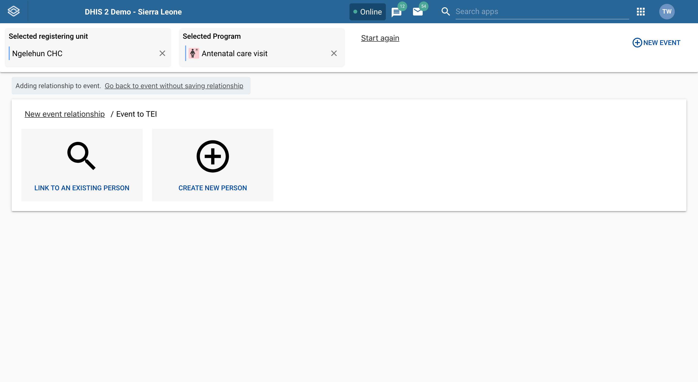

### Link to an existing Tracked Entity Instance

3. Click **Link to an existing Tracked Entity Instance**.

- You should now be presented with some options for searching for a **Tracked Entity Instance**.
  You have the option to select a **program**. If a **program** is selected the attributes are derived from the selected **program**.
  If no **program** is selected, only the attributes that belong to the **Tracked Entity Instance** will be visible.

    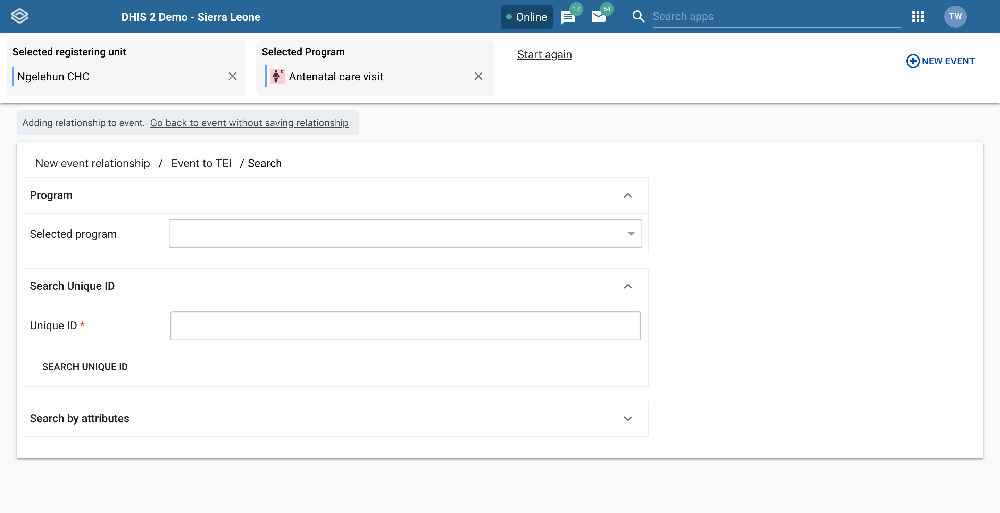

    - If the **Tracked Entity Instance** or **program** is configured with a unique attribute, this attribute can be
      used for finding a specific **Tracked Entity Instance** or **program**. This attribute should be presented alone.
      When the unique attribute field has been filled out, click the **Search** button located right below
      the unique attribute field.

    - If the **Tracked Entity Instance** or **program** has attibutes these can be used for searching by expanding the **Search by attributes** box.
      When all desired attribute fields have been filled out, click the **Search by attributes** button located at the bottom. You can also limit the search by setting the **Organisation unit scope**. If set to *All accessible* you will search for the **Tracked Entity Instance** in all organisation units you have access to. If you select *Selected*, you will be asked to select which organisation units to search within.

4. After a successful search you will be presented with a list of **Tracked Entity Instances** matching the search criteria.
   To create a relationship click the **Link** button on the **Tracked Entity Instance** you would like to create a relationship to.
   
- If you did not find the **Tracked Entity Instance** you were looking for, you can either click the **New search** or **Edit search** buttons.
  **New search** will take you to new blank search while **Edit search** will take you back to the search you just performed keeping the search criteria.

### Create new Tracked Entity Instance

3. Click **Create new Tracked Entity Instance**.

- You are now presented with a form for registering a new **Tracked Entity Instance**. You can choose to either register with or without a program.
  If a program is selected, the new **Tracked Entity Instance** will be enrolled in said program. You can also change the **Organisation unit** by removing the one that is automatically set and selecting a new one.

  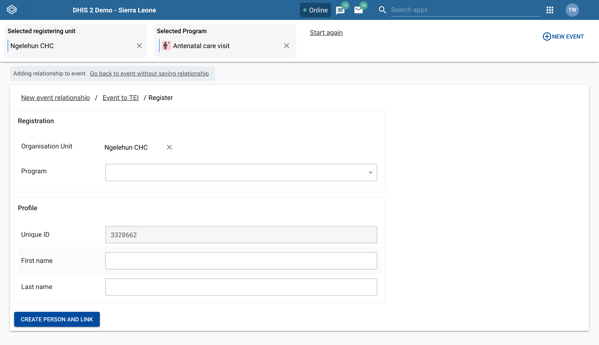

4. Fill in the desired (and possibly mandatory) attributes and enrollment details.

5. Click **Create Tracked Entity Instance and Link**.

> Note: When filling in data you might face a warning telling you that a possible duplicate has been found. You can click the warning to see these 
> duplicates and if the duplicate is a match you can choose to link that **Tracked Entity Instance** by clicking the **Link** button.
> If the warning is still present when you are done filling in data, you will not see the **Create Tracked Entity Instance and Link** button.
> Instead you will be pressented with a button called **Review duplicates**. When you click this button a list of possible duplicates will be displayed.
> If any of these duplicates matches the **Tracked Entity Instance** you are trying to create you can click the **Link** button, if not you can click
> the **Save as new person** button to register a new **Tracked Entity Instance**.

## Edit an event

<!--DHIS2-SECTION-ID:capture_edit_event-->

1. Open the **Capture** app.

2. Select an organisation unit.

3. Select a program.

    All events registered to the selected program show up in a list.

4. Click the event you want to modify.

5. Click the **Edit event** button.

6. Modify the event details and click **Save**.

## Delete an event

<!--DHIS2-SECTION-ID:capture_delete_event-->

1. Open the **Capture** app.

2. Select an organisation unit.

3. Select a program.

    All events registered to the selected program show up in a list.

4. Click the **triple dot** icon on the event you want to delete.

5. In the menu that is displayed click **Delete event**.

    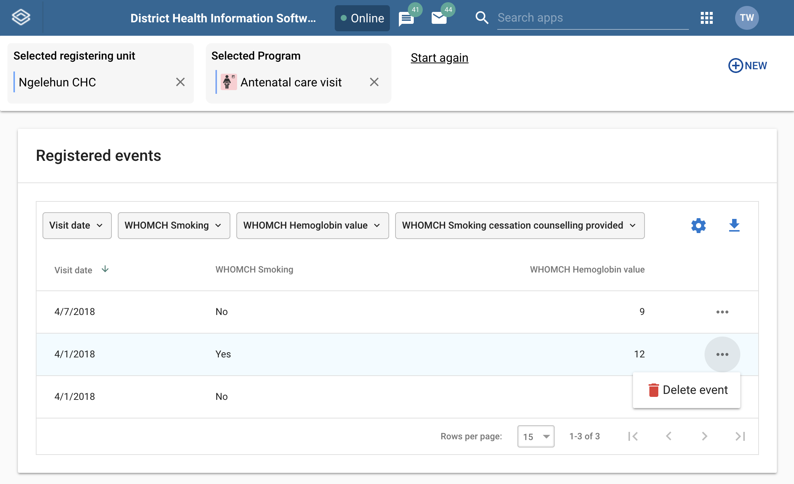

## Modify an event list layout

<!--DHIS2-SECTION-ID:capture_modify_event_list_layout-->

You can select which columns to show or hide in an event list. This can
be useful for example when you have a long list of data elements
assigned to a program stage.

1. Open the **Capture** app.

2. Select an organisation unit.

3. Select a program.

    All events registered to the selected program show up in a list.

4. Click the **gear** icon on the top right of the event list.

5. Select the columns you want to display and click **Save**.

    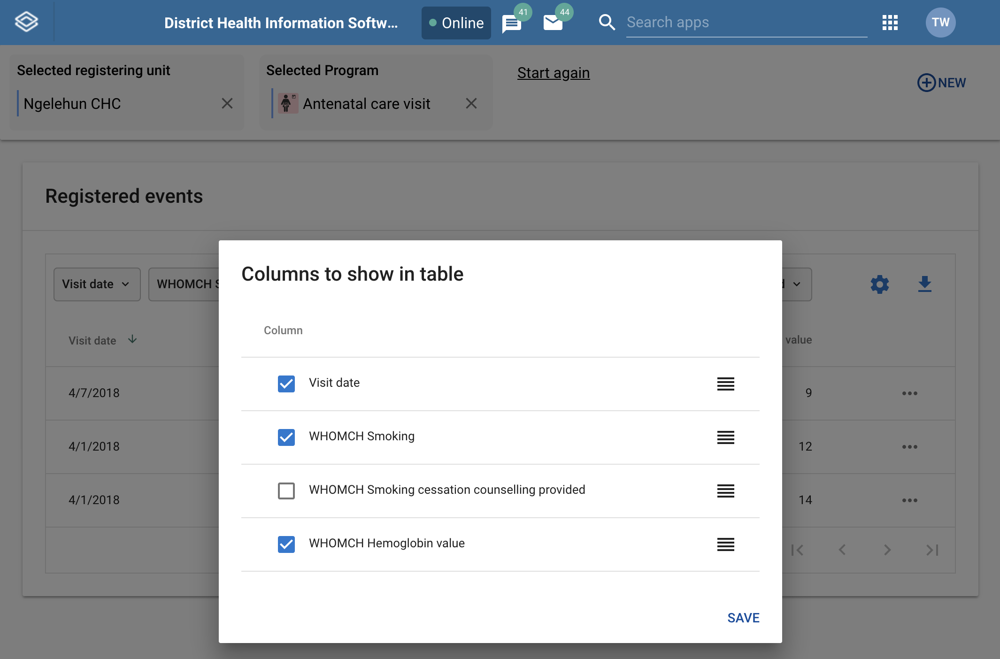

> Note: You can reorganize the order of the data elements by draging and dropping them in the list.

## Filter an event list

<!--DHIS2-SECTION-ID:capture_filter_event_list-->

1. Open the **Capture** app.

2. Select an organisation unit.

3. Select a program.

    All events registered to the selected program show up in a list.

    Along the top of the event list are button with the same names as the column headers in the list.

4. Use the buttons on the top of the list to filter based on a report date or a specific data element.

    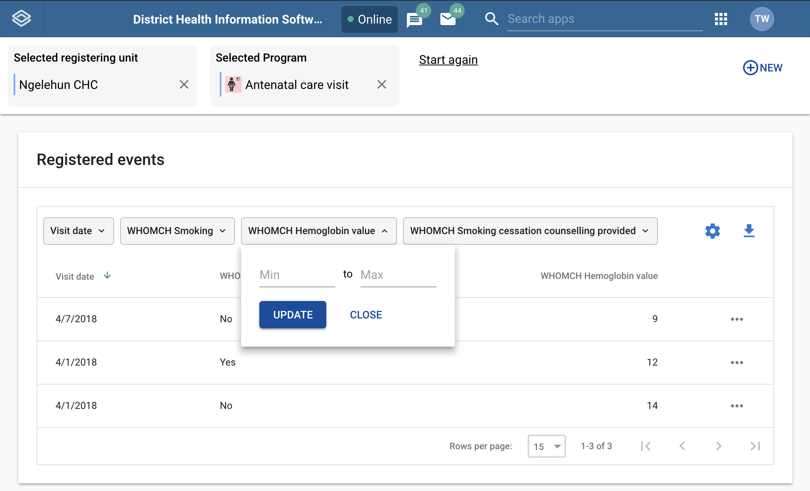

> Note: Data elements will have slightly diffrent way that they are filtered. A **Number** data element will for instance show a rang to filter on while a **Text** data element will ask you to enter a search query to filter on.

## Sort an event list

<!--DHIS2-SECTION-ID:capture_sort_event_list-->

1. Open the **Capture** app.

2. Select an organisation unit.

3. Select a program.
    All events registered to the selected program show up in a list.

4. Click one of the column headers to sort the list on that data element in ascending order.

    A small upward arrow is displayed next to the column to show that the list is sorted in ascending order.

5. Click the column header again to sort the list on that data element in descending order.

     A small downward arrow is displayed next to the column to show that the list is sorted in descending order.

    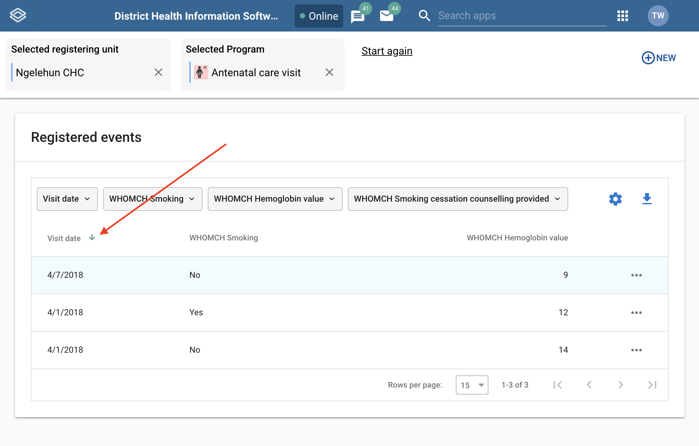

## Download an event list

<!--DHIS2-SECTION-ID:capture_download_event_list-->

1. Open the **Capture** app.

2. Select an organisation unit.

3. Select a program.
    All events registered to the selected program show up in a list.

4. Click the **downward arrow** icon on the top right of the event list.

5. Select the format you want to download.

    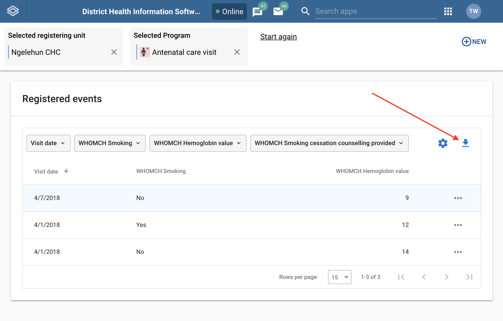

> Note: You can download an event list in JSON, XML or CSV formats.

## Predefined list views

<!--DHIS2-SECTION-ID:capture_views-->

You can set up your own views and save them for later use. The views can also be shared with others. A view consists of filters, column order and event sort order.

### Saving a new view

<!--DHIS2-SECTION-ID:capture_view_save-->

1. Select an organisation unit and a program.

2. Set filters using the filter buttons above the event list (described in detail [here](#capture_filter_event_list)).

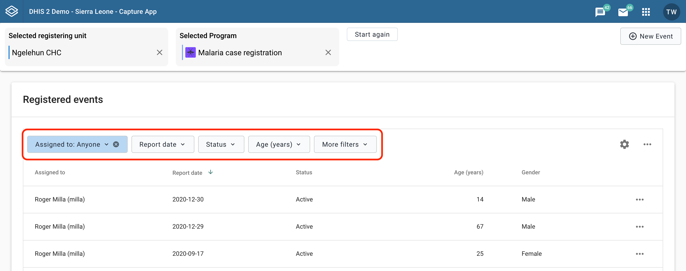

3. Set the column order by clicking the cog icon and then, in the popover, specify the layout according to your preference (how to modify the layout is described in detail [here](#capture_modify_event_list_layout)).

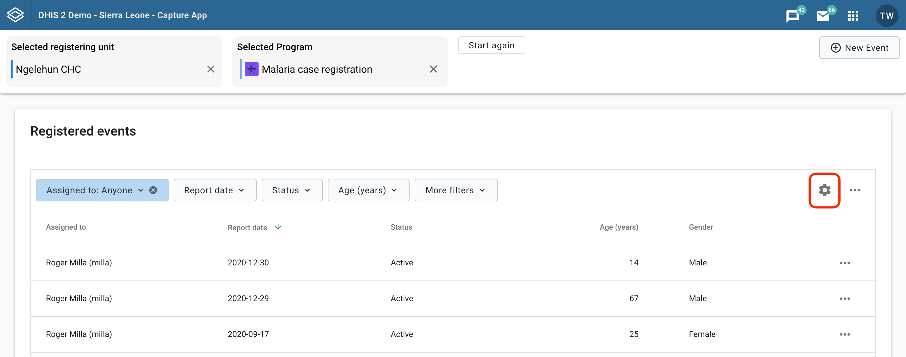

4. Sort the events by clicking on one of the column headers (described in detail [here](#capture_sort_event_list)).

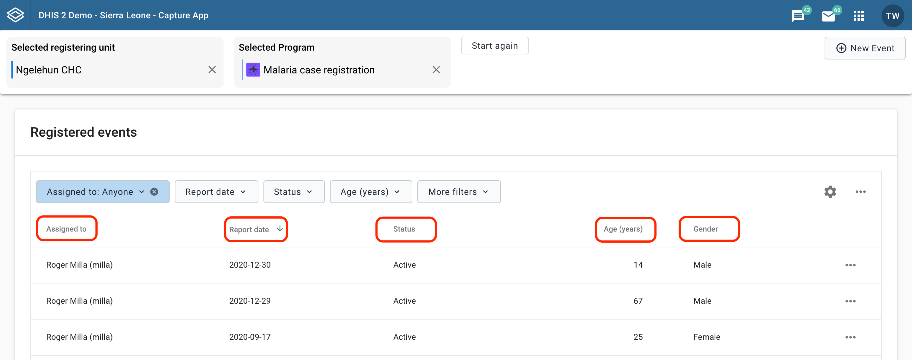

5. Open the more menu (three dots icon) to the right and then select "Save current view..."

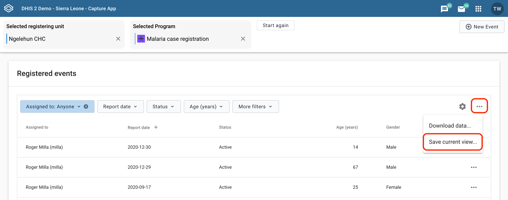

6. Fill in a name for the view and click save.
   
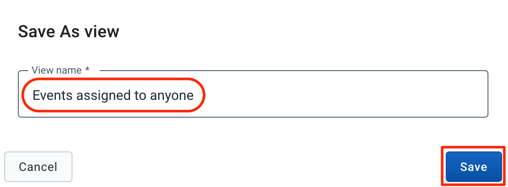

### Loading a view

<!--DHIS2-SECTION-ID:capture_view_load-->

1. Select an organisation unit and a program with a predefined view.

2. The views should be available above the event list itself. Click on a view to load it.

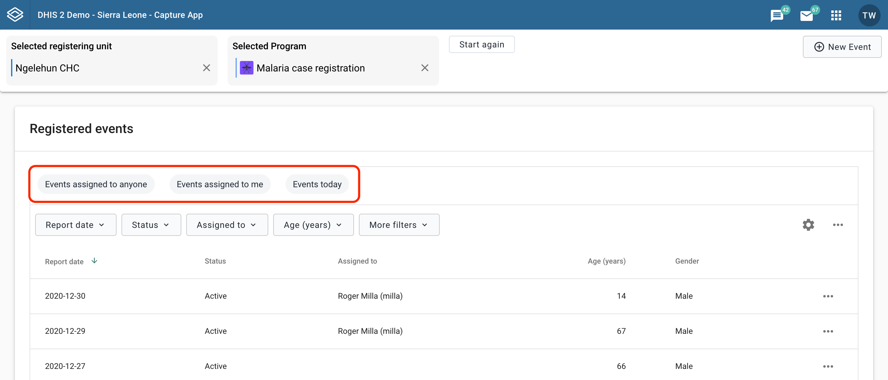

3. An example of a loaded view.

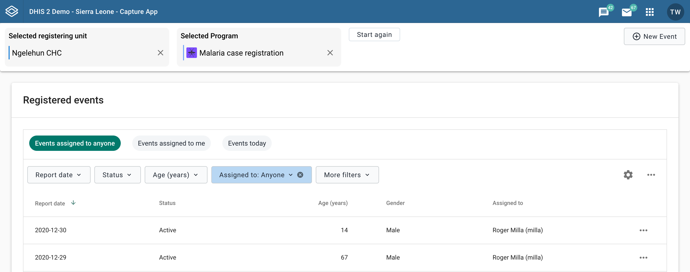

### Updating a view

<!--DHIS2-SECTION-ID:capture_view_update-->

1. Load the view you would like to update (see [loading a view](#capture_view_load)).

2. Make your changes to filters, column order and/or event sort order.

> **Note**
>
> An asterisk(*) is appended to the view name when the view has unsaved changes.

3. Open the more menu (three dots icon) to the right and then select "Update view".

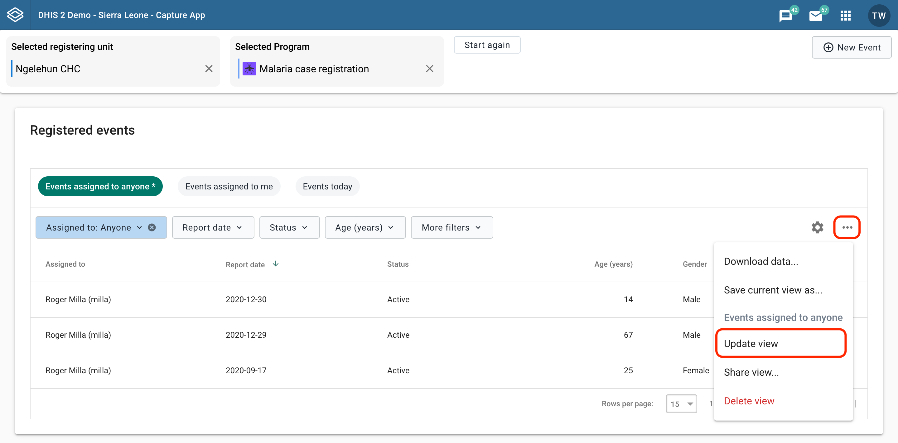

### Sharing a view

<!--DHIS2-SECTION-ID:capture_view_share-->

1. Load the view you would like to share (see [loading a view](#capture_view_load)).

2. Open the more menu (three dot icon) to the right and then select "Share view..."
   
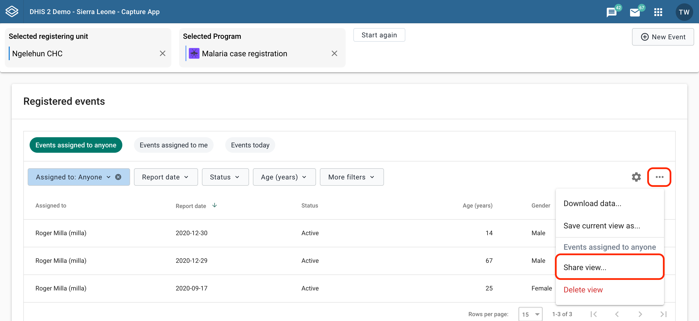

3. Make your changes. You would typically add users/groups (1) and/or change the access rights of users/groups added earlier (2).

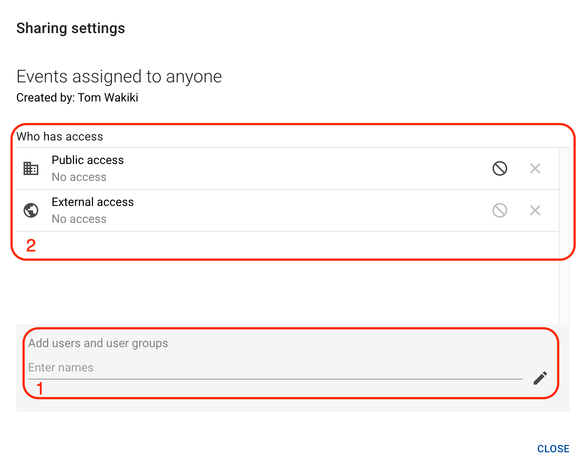

### Deleting a view

<!--DHIS2-SECTION-ID:capture_view_delete-->

1. Load the view you would like to delete (see [loading a view](#capture_view_load)).

2. Open the more menu (three dots icon) to the right and then select "Delete view".
   
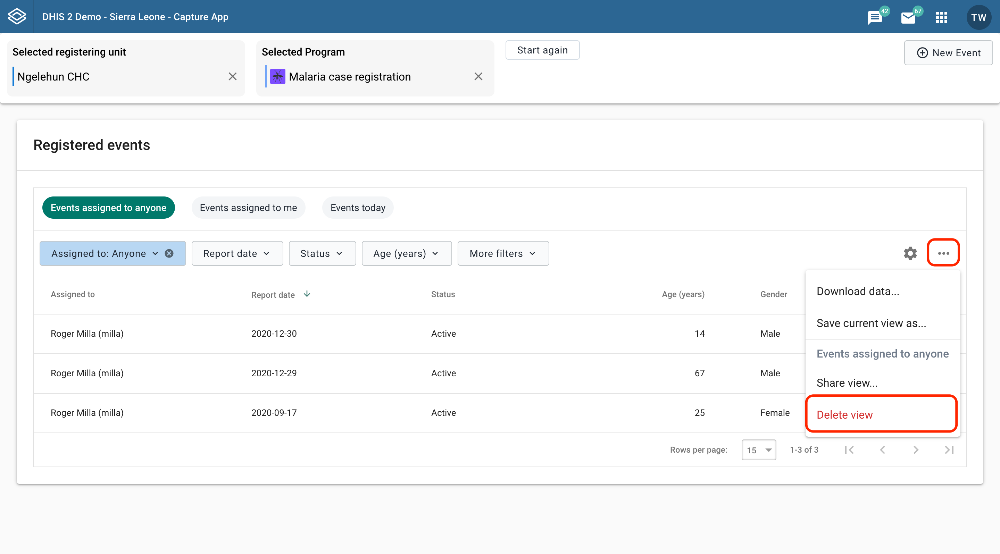

## User assignment

<!--DHIS2-SECTION-ID:capture_user_assignment-->

Events can be assigned to users. This feature must be enabled per program.

### Assigning new events

<!--DHIS2-SECTION-ID:capture_user_assignment_new-->

1. Select an organisation unit and a program with user assignment enabled.

2. Click **New Event** in the upper right corner.

3. You will find the assignee section near the bottom of the data entry page. Search for and select the user you would like to assign the event to. The assignee will be preserved when you save the event.

    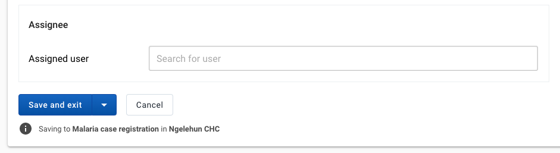

    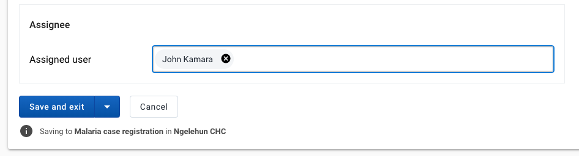

### Change assignee

<!--DHIS2-SECTION-ID:capture_user_assignment_edit-->

1. Select an organisation unit and a program with user assignment enabled.

2. Click an event in the list

3. In the right column you will find the assignee section.

    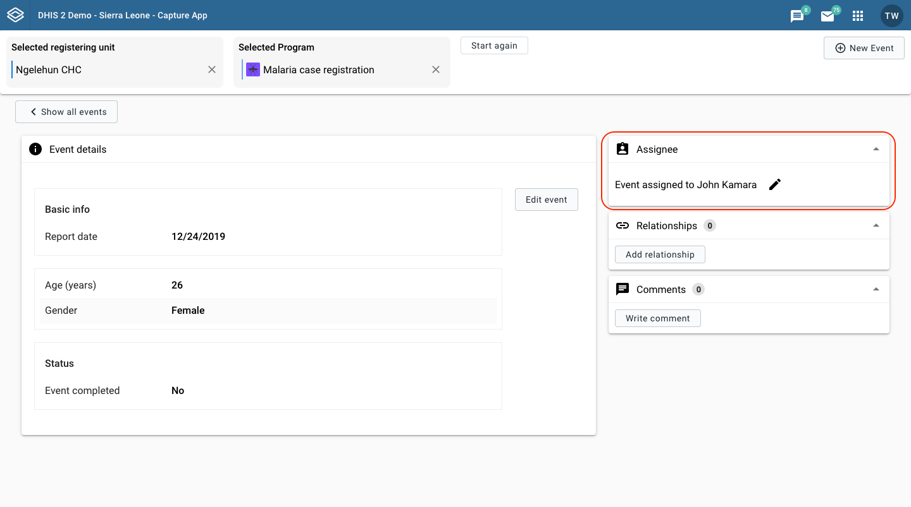

4. Click the edit button, or the **Assign** button if the event is not currently assigned to anyone.

    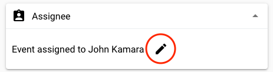

    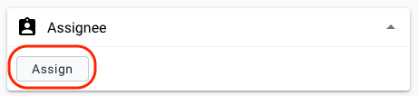

5. Search for and select the user you would like to reassign the event to. The assignment is saved immediately.

### Assignee in the event list

<!--DHIS2-SECTION-ID:capture_user_assignment_event_list-->

In the event list you will be able to view the assignee per event. Moreover, you can sort and filter the list by the assignee.

#### Filter by assignee

1. Click the **Assigned to** filter.

    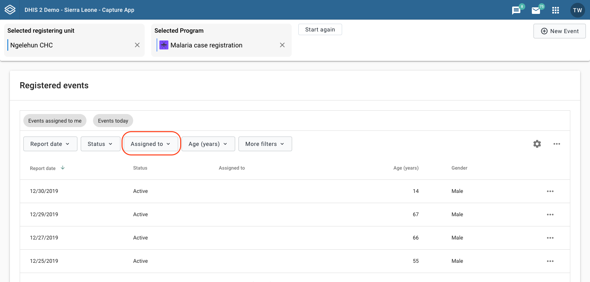

2. Select your preferred assignee filter and then click update.

    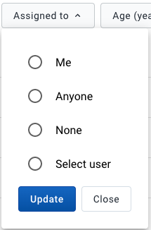

## Tracker programs

<!--DHIS2-SECTION-ID:capture_tracker_programs-->

The Capture app doesn't support tracker programs yet, but the tracker programs are still listed. If you select a tracker program, the app will lead you to the Tracker Capture app as shown below.

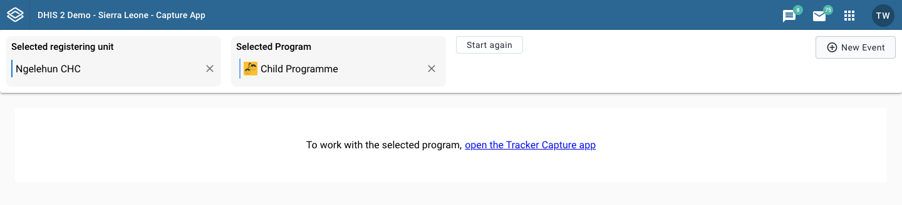
