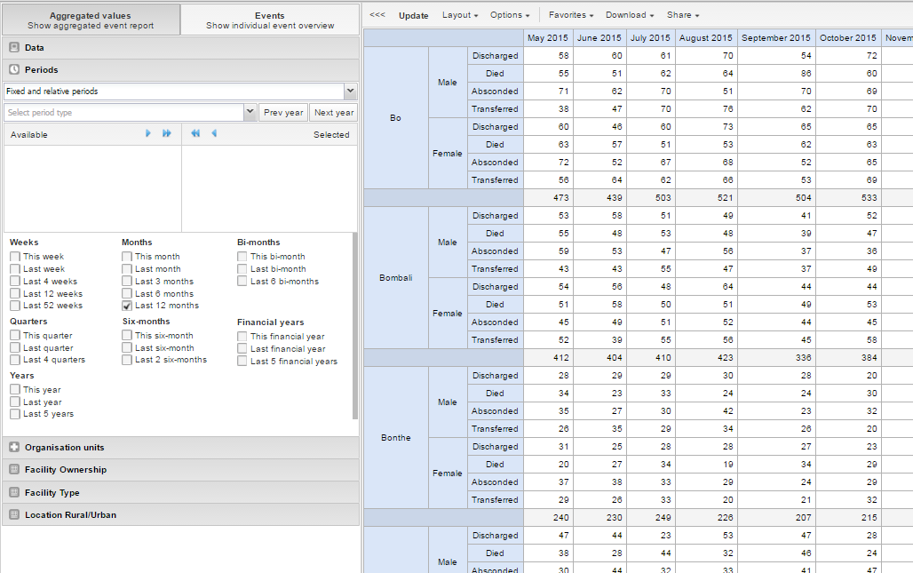

# Using the Event Reports app

<!--DHIS2-SECTION-ID:event_reports_app-->

## About the Event Reports app

<!--DHIS2-SECTION-ID:event_reports_about-->

With the **Event Report**s app you can analyse events in two types of
reports:

  - Aggregated event reports: Pivot table-style analysis with aggregated
    numbers of events
    
    By selecting **Aggregated values** from the top-left menu you can
    use the **Event Reports** app to create pivot tables with aggregated
    numbers of events. An event report is always based on a program. You
    can do analysis based on a range of dimensions. Each dimension can
    have a corresponding filter. Dimensions can be selected from the
    left-side menu. Similar to the pivot tables app, aggregated event
    reports may be limited by the amount of RAM accessible by the
    browser. If your requested table exceeds a set size, you will
    recieve a warning prompt asking whether or not you want to continue.

  - Individual event reports: Lists of events
    
    By selecting **Events** from the top-left menu you can use the
    **Event Reports** app to make searches or queries for events based
    on a flexible set of criteria. The report will be displayed as a
    table with one row per event. Each dimension can be used as a column
    in the table or as a filter. Each dimension can have a criteria
    (filter). Data elements of type option set allows for "in" criteria,
    where multiple options can be selected. Numeric values can be
    compared to filter values using greater than, equal or less than
    operators.

## Create an event report

<!--DHIS2-SECTION-ID:event_reports_create-->

1.  Open the **Event Reports** app.

2.  Select **Aggregated values** or **Events**.

3.  In the menu to the left, select the meta data you want to analyse.

4.  Click **Layout** and arrange the dimensions.
    
    You can keep the default selection if you want.

5.  Click **Update**.

## Select dimension items

<!--DHIS2-SECTION-ID:event_reports_select_dimensions-->

An event report is always based on a program and you can do analysis
based on a range of dimensions. For programs with category combinations,
you can use program categories and category option group sets as
dimensions for tables and charts. Each dimension item can have a
corresponding filter.

1.  Select data elements:
    
    1.  Click **Data**.
    
    2.  Select a program and a program stage.
        
        The data elements associated with the selected program are
        listed under **Available**. Each data element acts as a
        dimension.
    
    3.  Select the data elements you need by double-clicking their
        names.
        
        Data elements can be filtered by type (Data elements, Program
        attributes, Program indicators) and are prefixed to make them
        easily recognizable.
        
        After selecting a data element, it is visible under **Selected
        data items**.
    
    4.  (Optional) For each data element, specify a filter with
        operators such as "greater than", "in" or "equal" together with
        a filter value.

2.  Select periods.
    
    1.  Click **Periods**.
    
    2.  Select one or several periods.
        
        You have three period options: relative periods, fixed periods
        and start/end dates. You can combine fixed periods and relative
        periods in the same chart. You cannot combine fixed periods and
        relative periods with start/end dates in the same chart.
        Overlapping periods are filtered so that they only appear once.
        
          - Fixed periods: In the **Select period type** box, select a
            period type. You can select any number of fixed periods from
            any period type. Fixed periods can for example be "January
            2014".
        
          - Relative periods: In the lower part of the **Periods**
            section, select as many relative periods as you like. The
            names are relative to the current date. This means that if
            the current month is March and you select **Last month**,
            the month of February is included in the chart. Relative
            periods has the advantage that it keeps the data in the
            report up to date as time goes.
        
          - Start/end dates: In the list under the **Periods** tab,
            select **Start/end dates**. This period type lets you
            specify flexible dates for the time span in the report.

3.  Select organisation units.
    
    1.  Click **Organisation units**.
    
    2.  Click the gearbox icon.
    
    3.  Select a **Selection mode** and an organisation unit.
        
        There are three different selection modes:
        
        <table>
        <caption>Selection modes</caption>
        <colgroup>
        <col style="width: 38%" />
        <col style="width: 61%" />
        </colgroup>
        <thead>
        <tr class="header">
        <th>
Selection mode
</th>
        <th>
Description
</th>
        </tr>
        </thead>
        <tbody>
        <tr class="odd">
        <td>
<strong>Select organisation units</strong>
</td>
        <td>
Lets you select the organisation units you want to appear in the chart from the organization tree.

        
Select <strong>User org unit</strong> to disable the organisation unit tree and only select the organisation unit that is related to your profile.

        
Select <strong>User sub-units</strong> to disable the organisation unit tree and only select the sub-units of the organisation unit that is related to your profile.

        
Select <strong>User sub-x2-units</strong> to disable the organisation unit tree and only select organisation units two levels down from the organisation unit that is related to your profile.

        
This functionality is useful for administrators to create a meaningful &quot;system&quot; favorite. With this option checked all users find their respective organisation unit when they open the favorite.
</td>
        </tr>
        <tr class="even">
        <td>
<strong>Select levels</strong>
</td>
        <td>
Lets you select all organisation units at one or more levels, for example national or district level.

        
You can also select the parent organisation unit in the tree, which makes it easy to select for example, all facilities inside one or more districts.
</td>
        </tr>
        <tr class="odd">
        <td>
<strong>Select groups</strong>
</td>
        <td>
Lets you select all organisation units inside one or several groups and parent organisation units at the same time, for example hospitals or chiefdoms.
</td>
        </tr>
        </tbody>
        </table>

4.  Click **Update**.

## Select series, category and filter

<!--DHIS2-SECTION-ID:event_reports_select_series_category_filter-->

You can define which data dimension you want to appear as columns, rows
and filters in the pivot table. Each data element appears as individual
dimensions and can be placed on any of the axes.

> **Note**
> 
> Data elements of continuous value types (real numbers/decimal numbers)
> can only be used as filters, and will automatically be positioned as
> filters in the layout dialog. The reason for this is that continuous
> number cannot be grouped into sensible ranges and used on columns and
> rows.

1.  Click **Layout**.

2.  Drag and drop the dimensions to the appropriate space.

3.  Click **Update**.

## Change the display of your table

<!--DHIS2-SECTION-ID:event_reports_change_display-->

You can customize the display of an event report.

1.  Click **Options**.

2.  Set the options as required. Available options are different between
    aggregated event reports and individual event reports.
    
    <table style="width:100%;">
    <caption>Event reports options</caption>
    <colgroup>
    <col style="width: 22%" />
    <col style="width: 22%" />
    <col style="width: 33%" />
    <col style="width: 22%" />
    </colgroup>
    <thead>
    <tr class="header">
    <th>
Option
</th>
    <th>
Description
</th>
    <th>
Available for report type
</th>
    </tr>
    </thead>
    <tbody>
    <tr class="odd">
    <td>
<strong>Data</strong>
</td>
    <td>
<strong>Show column totals</strong>
</td>
    <td>
Displays totals at the end of each column in the pivot table.
</td>
    <td>
Aggregated event report
</td>
    </tr>
    <tr class="even">
    <td></td>
    <td>
<strong>Show column sub-totals</strong>
</td>
    <td>
Displays sub-totals for each column in the pivot table.
</td>
    <td>
Aggregated event report
</td>
    </tr>
    <tr class="odd">
    <td></td>
    <td>
<strong>Show row totals</strong>
</td>
    <td>
Displays totals at the end of each row in the pivot table.
</td>
    <td>
Aggregated event report
</td>
    </tr>
    <tr class="even">
    <td></td>
    <td>
<strong>Show row sub-totals</strong>
</td>
    <td>
Displays sub-totals for each row in the pivot table.
</td>
    <td>
Aggregated event report
</td>
    </tr>
    <tr class="odd">
    <td></td>
    <td>
<strong>Show dimension labels</strong>
</td>
    <td>Displays labels for dimensions.</td>
    <td>
Aggregated event report
</td>
    </tr>
    <tr class="even">
    <td></td>
    <td>
<strong>Hide empty rows</strong>
</td>
    <td>
Hides empty rows in the pivot table.
</td>
    <td>
Aggregated event report
</td>
    </tr>
    <tr class="odd">
    <td></td>
    <td>
<strong>Hide n/a data</strong>
</td>
    <td>
Hides data tagged as N/A from the chart.
</td>
    <td>
Aggregated event report
</td>
    </tr>
    <tr class="even">
    <td></td>
    <td>
<strong>Include only completed events</strong>
</td>
    <td>
Includes only completed events in the aggregation process. This is useful when you want for example to exclude partial events in indicator calculations.
</td>
    <td>
Aggregated event report

    
Individual event report
</td>
    </tr>
    <tr class="odd">
    <td></td>
    <td>
<strong>Limit</strong>
</td>
    <td>
Sets a limit of the maximum number of rows that you can display in the table, combined with a setting for showing top or bottom values.
</td>
    <td>
Aggregated event report
</td>
    </tr>
    <tr class="even">
    <td></td>
    <td>
<strong>Output type</strong>
</td>
    <td>
Defines the output type. The output types are <strong>Event</strong>, <strong>Enrollment</strong> and<strong>Tracked entity instance</strong>.
</td>
    <td>
Aggregated event report
</td>
    </tr>
    <tr class="odd">
    <td></td>
    <td>
<strong>Program status</strong>
</td>
    <td>
Filters data based on the program status: <strong>All</strong>, <strong>Active</strong>, <strong>Completed</strong> or <strong>Cancelled</strong>.
</td>
    <td>
Aggregated event report
</td>
    </tr>
    <tr class="even">
    <td></td>
    <td>
<strong>Event status</strong>
</td>
    <td>
Filters data based on the event status: <strong>All</strong>, <strong>Active</strong>, <strong>Completed</strong>, <strong>Scheduled</strong>, <strong>Overdue</strong> or <strong>Skipped</strong>.
</td>
    <td>
Aggregated event report
</td>
    </tr>
    <tr class="odd">
    <td><strong>Organisation units</strong></td>
    <td>
<strong>Show hierarchy</strong>
</td>
    <td>
Includes the names of all parents of each organisation unit in labels.
</td>
    <td>
Aggregated event report
</td>
    </tr>
    <tr class="even">
    <td>
<strong>Style</strong>
</td>
    <td>
<strong>Display density</strong>
</td>
    <td>
Controls the size of the cells in the table. You can set it to <strong>Comfortable</strong>, <strong>Normal</strong> or <strong>Compact</strong>.

    
<strong>Compact</strong> is useful when you want to fit large tables into the browser screen.
</td>
    <td>
Aggregated event report

    
Individual event report
</td>
    </tr>
    <tr class="odd">
    <td></td>
    <td>
<strong>Font size</strong>
</td>
    <td>
Controls the size of the table text font. You can set it to <strong>Large</strong>, <strong>Normal</strong> or <strong>Small</strong>.
</td>
    <td>
Aggregated event report

    
Individual event report
</td>
    </tr>
    <tr class="even">
    <td></td>
    <td>
<strong>Digit group separator</strong>
</td>
    <td>
Controls which character to separate groups of digits or &quot;thousands&quot;. You can set it to <strong>Comma</strong>, <strong>Space</strong> or <strong>None</strong>.
</td>
    <td>
Aggregated event report

    
Individual event report
</td>
    </tr>
    </tbody>
    </table>

3.  Click **Update**.

## Download chart data source

<!--DHIS2-SECTION-ID:event_reports_download_report-->

You can download the data source behind an event report in HTML, JSON,
XML, Microsoft Excel or CSV formats.

1.  Click **Download**.

2.  Under **Plain data source**, click the format you want to download.
    
    <table>
    <caption>Available formats</caption>
    <colgroup>
    <col style="width: 27%" />
    <col style="width: 72%" />
    </colgroup>
    <thead>
    <tr class="header">
    <th>
Format
</th>
    <th>
Description
</th>
    </tr>
    </thead>
    <tbody>
    <tr class="odd">
    <td>
HTML
</td>
    <td>
Creates HTML table based on selected meta data
</td>
    </tr>
    <tr class="even">
    <td>
JSON
</td>
    <td>
Downloads data values in JSON format based on selected meta data
</td>
    </tr>
    <tr class="odd">
    <td>
XML
</td>
    <td>
Downloads data values in XML format based on selected meta data
</td>
    </tr>
    <tr class="even">
    <td>
Microsoft Excel
</td>
    <td>
Downloads data values in Microsoft Excel format based on selected meta data
</td>
    </tr>
    <tr class="odd">
    <td>
CSV
</td>
    <td>
Downloads data values in CSV format based on selected meta data
</td>
    </tr>
    </tbody>
    </table>

## Manage favorites

Saving your charts or pivot tables as favorites makes it easy to find
them later. You can also choose to share them with other users as an
interpretation or display them on the dashboard.

You view the details and interpretations of your favorites in the
**Pivot Table**, **Data Visualizer**, **Event Visualizer**, **Event
Reports** apps. Use the **Favorites** menu to manage your favorites.

### Open a favorite

1.  Click **Favorites** \> **Open**.

2.  Enter the name of a favorite in the search field, or click **Prev**
    and **Next** to display favorites.

3.  Click the name of the favorite you want to open.

### Save a favorite

1.  Click **Favorites** \> **Save as**.

2.  Enter a **Name** and a **Description** for your favorite. The description field supports a rich text format, see the interpretations section for more details.

3.  Click **Save**.

### Rename a favorite

1.  Click **Favorites** \> **Rename**.

2.  Enter the new name for your favorite.

3.  Click **Update**.

### Write an interpretation for a favorite

An interpretation is a link to a resource with a description of the data
at a given period. This information is visible in the **Dashboard** app.
To create an interpretation, you first need to create a favorite. If
you've shared your favorite with other people, the interpretation you
write is visible to those people.

1.  Click **Favorites** \> **Write interpretation**.

2.  In the text field, type a comment, question or interpretation. You
    can also mention other users with '@username'. Start by typing '@'
    plus the first letters of the username or real name and a mentioning
    bar will display the available users. Mentioned users will receive
    an internal DHIS2 message with the interpretation or comment. You
    can see the interpretation in the **Dashboard** app.

    It is possible to format the text with **bold**, *italic* by using the
    Markdown style markers \* and \_ for **bold** and *italic* respectively.
    Keyboard shortcuts are also available: Ctrl/Cmd + B and Ctrl/Cmd + I. A
    limited set of smilies is supported and can be used by typing one of the
    following character combinations: :) :-) :( :-( :+1 :-1. URLs are
    automatically detected and converted into a clickable link.

3.  Search for a user group that you want to share your favorite with,
    then click the **+** icon.

4.  Change sharing settings for the user groups you want to modify.
    
      - **Can edit and view**: Everyone can view and edit the object.
    
      - **Can view only**: Everyone can view the object.
    
      - **None**: The public won't have access to the object. This
        setting is only applicable to **Public access**.

5.  Click **Share**.

### Subscribe to a favorite

When you are subscribed to a favorite, you receive internal messages
whenever another user likes/creates/updates an interpretation or
creates/update an interpretation comment of this favorite.

1.  Open a favorite.

2.  Click **\>\>\>** in the top right of the workspace.

3.  Click on the upper-right bell icon to subscribe to this favorite.

### Create a link to a favorite

1.  Click **Favorites** \> **Get link**.

2.  Select one of the following:
    
      - **Open in this app**: You get a URL for the favorite which you
        can share with other users by email or chat.
    
      - **Open in web api**: You get a URL of the API resource. By
        default this is an HTML resource, but you can change the file
        extension to ".json" or ".csv".

### Delete a favorite

1.  Click **Favorites** \> **Delete**.

2.  Click **OK**.

### View interpretations based on relative periods

To view interpretations for relative periods, such as a year ago:

1.  Open a favorite with interpretations.

2.  Click **\>\>\>** in the top right of the workspace.

3.  Click an interpretation. Your chart displays the data and the date
    based on when the interpretation was created.To view other
    interpretations, click them.

## Visualize an event report as a chart

<!--DHIS2-SECTION-ID:event_reports_open_as_chart-->

When you have made an event report you can open it as a chart:

Click **Chart** \> **Open this chart as table**.

